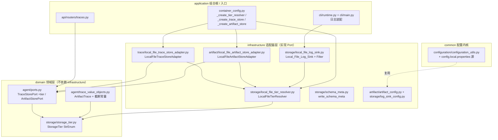
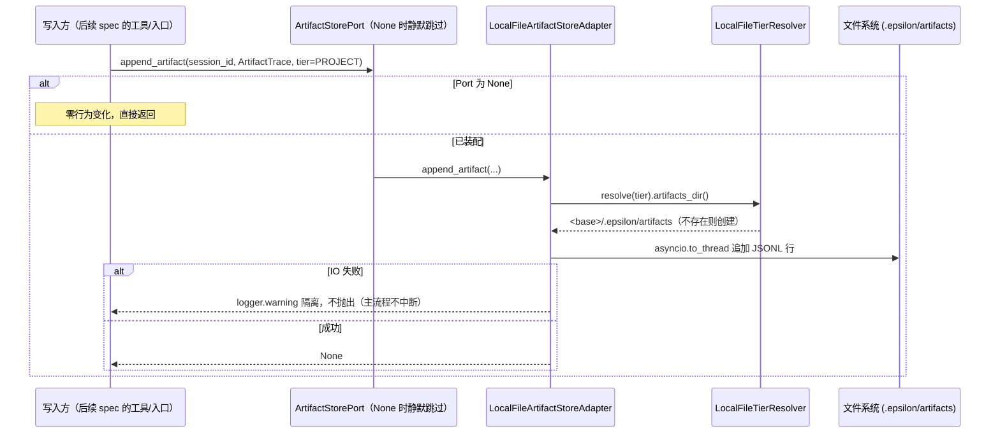

# 设计文档：统一运行产物与存储等级抽象（Local Trace & Artifacts / Storage Tier）

## 概述

本设计在 domain 层引入 `StorageTier` 存储等级枚举作为产物存储的唯一逻辑定位维度，令 `TraceStorePort`（复用现状）与新增 `ArtifactStorePort` 以 tier 为定位维度，物理路径映射下沉到 infrastructure 的 `LocalFileTierResolver`（PROJECT→`<workspace>/.epsilon/`、USER→`~/.epsilon/`）；同时补齐 `ArtifactTrace` 一等抽象、TUI/CLI 本地文件日志、`config.local.properties` 本地覆盖配置及 `Schema_Version` 元数据。设计严格遵循 steering `ddd-architecture.md`（domain 定义 Port/值对象、infrastructure 实现 Adapter、application 装配，禁止反向依赖）、`config-source.md`（`config.properties` 仍为主配置源）、`uv-package-manager.md`、`pydantic-model.md`、`python-typing-lint.md`、`code-documentation.md`、`srp-principle.md`、`change-discipline.md`（最小改动、复用不重造）、`adr.md`（本 spec 落 ADR-0002~0006 并回链）与 `doc-sync.md`。

本设计回链以下 ADR（均位于 `/workspace/docs/adr/`）：

- [ADR-0002](../../adr/0002-storage-tier-abstraction.md)：引入 StorageTier 抽象与本地文件 tier→目录映射（含 `LOCAL_PERSISTENCE_ROOT` 默认路径向 USER tier 迁移）。
- [ADR-0003](../../adr/0003-artifact-first-class-abstraction.md)：`ArtifactTrace` / `ArtifactStorePort` 与 `TraceStorePort` 的 tier 兼容策略。
- [ADR-0004](../../adr/0004-config-local-properties-precedence.md)：`config.local.properties` 优先级插入位置。
- [ADR-0005](../../adr/0005-tui-cli-file-logging-default.md)：TUI/CLI 本地文件日志默认开启策略。
- [ADR-0006](../../adr/0006-tenant-visibility-and-user-tier-persistence-boundary.md)：多租户可见性与 USER tier 默认路径安全边界。

#### 设计决策

| 决策点 | 选定方案 | 理由 |
|---|---|---|
| `StorageTier` 放置模块与取值 | 新增 domain 子包 `src/domain/storage/storage_tier.py`，`StrEnum` 取值 `USER`/`PROJECT`，预留 `TENANT` | tier 是跨领域的产物定位维度，属领域概念但不专属 agent 域；独立子包避免与 agent 值对象耦合。放 `common/` 会让公共内核承载业务语义（违反 ddd）。见 ADR-0002。 |
| `TraceStorePort` 签名兼容策略 | 三个方法追加 **keyword-only、默认 `StorageTier.PROJECT`** 的 `tier` 参数 | 既有调用点不传即取默认 PROJECT，行为与今日等价，满足需求 8「可选注入零行为变化」。见 ADR-0003。 |
| `ArtifactTrace` 放置 | 放入既有 `trace_value_objects.py`，独立于 `AgentStepTrace` 联合类型 | 与 trace 同构、复用截断范式；不并入 `AgentStepTrace` 以免污染既有 `_KIND_MAP` 与 trace 查询。见 ADR-0003。 |
| `config.local.properties` 实现方式 | 复用 `PropertiesFileSettingsSource`，传不同 `properties_path`；插入 env 与 config.properties 之间 | 避免重复源类（SRP/最小改动）；优先级满足需求 5.2。见 ADR-0004。 |
| TUI 文件日志默认 | **默认开启**（`EPSILON_LOG_TO_FILE=true`），落 **USER tier** `~/.epsilon/<project-hash>/logs/`，脱敏，轮转（决策 2b） | TUI 全屏渲染不宜把日志留终端；日志属运行时排障产物、随用户走，不污染项目工作区 git status 与文件工具扫描面，与会话主状态落点一致；可关闭。见 ADR-0005。 |
| 会话主状态 USER tier 默认迁移 | 未显式配 `LOCAL_PERSISTENCE_ROOT` 时默认 `~/.epsilon/persistence/<project-hash>/`；`<hash>`=PROJECT 基点规范化路径 sha256 前 16 位 | USER tier 语义=跨项目单用户；显式配置 / redis 尊重原值不迁移；保留既有安全禁令与启动校验。见 ADR-0006。 |
| PROJECT tier 基点 | `WORKSPACE_ROOT`（空则进程 CWD） | 本地默认 CWD==WORKSPACE_ROOT，使 PROJECT-traces 与既有 `.epsilon/traces` 等价（需求 1.6）。 |
| artifact 配置类 | 新增 `ArtifactConfig`（`env_prefix="ARTIFACT_"`，继承 `PropertiesBaseSettings`），`enabled: bool = True` | 与 `TraceConfig` 对称，配置驱动开关，`None` 时静默跳过。 |

## 架构

### 分层与依赖方向



依赖方向：`application → domain ← infrastructure`；`domain/storage` 与 `domain/agent` 只依赖标准库；`infrastructure` 依赖 `domain` 与 `common`；`config.local.properties` 源在 `common/configuration` 内闭环，不引入业务耦合。

### tier→目录映射（本地文件 adapter 内部约定，仅 resolver 知晓）

```
PROJECT 基点 = WORKSPACE_ROOT（空→CWD）
USER    基点 = Path.home()
project-hash = sha256(规范化 PROJECT 基点)[:16]   ← 全仓库唯一生成点 LocalFileTierResolver.project_hash()

<PROJECT 基点>/.epsilon/ ── sessions/  traces/  artifacts/  meta.json
                          （随项目、随 git 工作区；默认入 .gitignore）

<USER>/.epsilon/ ── <project-hash>/ ── logs/           ← TUI/CLI 本地文件日志（USER tier，2b）
               └ persistence/<project-hash>/         ← 会话主状态（USER tier 默认，仅当 LOCAL_PERSISTENCE_ROOT 未显式配置时）
```

`PROJECT` tier 的 `traces/` == `<CWD>/.epsilon/traces`（本地默认 CWD==WORKSPACE_ROOT），与既有 `TRACE_STORE_DIR` 等价（需求 1.6）。日志与会话主状态均落 USER tier 且共享同一 `project-hash` 分区键，不落项目工作区。

### 写入产物的序列（artifact 记录，与 trace 同构，可选注入）



## 组件与接口

### 1. `StorageTier`（domain，新增）

- 位置：`src/domain/storage/storage_tier.py`（新增 `domain/storage/__init__.py` 导出 `StorageTier`）。
- 职责：产物存储的逻辑定位维度枚举，无物理路径 / 后端字符串。

```python
"""存储等级（StorageTier）领域枚举模块。

定义产物存储的逻辑定位维度，供 TraceStorePort / ArtifactStorePort 及其
读写方使用。本模块仅依赖标准库，不含任何物理路径或后端实现细节。
"""

from __future__ import annotations

from enum import StrEnum


class StorageTier(StrEnum):
    """产物存储等级。

    作为产物（trace/artifact/会话主状态/日志）的逻辑定位维度，
    由基础设施层的解析器映射到具体后端/目录。领域层与写入方只依赖本枚举。

    取值：
        USER: 用户级，跨项目、单用户、强一致。
        PROJECT: 项目级，随工作区/仓库。
        TENANT: 租户级（云端多租户），本期仅预留，不实现对应后端与可见性策略。
    """

    USER = "user"
    PROJECT = "project"
    TENANT = "tenant"
```

### 2. `ArtifactTrace` 值对象与截断常量（domain，改动既有 `trace_value_objects.py`）

- 位置：`src/domain/agent/trace_value_objects.py`（在既有文件追加，不动既有类型）。
- 职责：记录任务产物元数据；大字段截断；不记录完整敏感内容。

```python
# 新增截断常量（与既有 ARGUMENTS_SUMMARY_MAX_LEN 等并列）
ARTIFACT_SUMMARY_MAX_LEN = 256
"""产物内容摘要最大长度。"""

ARTIFACT_LOGICAL_PATH_MAX_LEN = 512
"""产物逻辑路径最大长度。"""


@dataclass(frozen=True)
class ArtifactTrace:
    """任务产物追踪记录。

    记录任务产物、命令输出摘要或生成文件清单的元数据，由写入方在产物
    生成后追加到 Artifacts_Dir。不记录完整敏感文件内容，大字段须由写入方
    按截断常量截断。

    Attributes:
        session_id: 关联会话唯一标识符。
        logical_path: 产物逻辑路径（相对工作区），最长 ARTIFACT_LOGICAL_PATH_MAX_LEN。
        artifact_type: 产物类型（如 "file"/"command_output"/"file_list"）。
        size_bytes: 产物字节大小；无法确定时为 None。
        content_summary: 产物内容摘要，最长 ARTIFACT_SUMMARY_MAX_LEN；无摘要为 None。
        source_tool: 产生该产物的来源工具名称；无则为 None。
        timestamp_epoch: 记录时间（Unix epoch 秒）。
        kind: 判别字段，固定为 "artifact"。
    """

    session_id: str
    logical_path: str
    artifact_type: str
    timestamp_epoch: float
    size_bytes: int | None = None
    content_summary: str | None = None
    source_tool: str | None = None
    kind: Literal["artifact"] = field(default="artifact", init=False)
```

> `ArtifactTrace` 不并入 `AgentStepTrace` 联合类型，也不进入既有 `LocalFileTraceStoreAdapter._KIND_MAP`。

### 3. `TraceStorePort`（domain，改动既有）与 `ArtifactStorePort`（domain，新增）

- 位置：`src/domain/agent/ports.py`。
- `TraceStorePort` 三方法新增 keyword-only、默认 `StorageTier.PROJECT` 的 `tier` 参数（ADR-0003）。

```python
# ports.py 顶部 TYPE_CHECKING 块新增：
if TYPE_CHECKING:
    from domain.agent.trace_value_objects import (
        AgentStepTrace, SessionTrace, ArtifactTrace,
    )
    from domain.storage.storage_tier import StorageTier


class TraceStorePort(Protocol):
    """结构化 Agent 追踪存储端口（tier 为定位维度之一）。"""

    async def append_step(
        self,
        session_id: str,
        step: AgentStepTrace,
        *,
        tier: StorageTier = StorageTier.PROJECT,
    ) -> None:
        """追加一步到指定 session trace（默认 PROJECT tier，兼容既有调用点）。"""
        ...

    async def get_session_trace(
        self,
        session_id: str,
        *,
        tier: StorageTier = StorageTier.PROJECT,
    ) -> SessionTrace | None:
        """获取完整 session trace；不存在时返回 None。"""
        ...

    async def list_traces(
        self,
        limit: int = 20,
        *,
        tier: StorageTier = StorageTier.PROJECT,
    ) -> list[SessionTrace]:
        """按时间倒序列出最近 session trace 摘要。"""
        ...


class ArtifactStorePort(Protocol):
    """任务产物存储端口。

    定义 ArtifactTrace 的持久化与查询能力，tier 作为定位维度之一。
    由基础设施层提供本地文件后端与（未来）对象存储实现。
    """

    async def append_artifact(
        self,
        session_id: str,
        artifact: ArtifactTrace,
        *,
        tier: StorageTier = StorageTier.PROJECT,
    ) -> None:
        """追加一条产物记录到对应 tier 的 Artifacts_Dir。

        IO 失败时须隔离故障（记录 warning 而不中断主流程）。
        """
        ...

    async def list_artifacts(
        self,
        session_id: str,
        *,
        tier: StorageTier = StorageTier.PROJECT,
    ) -> list[ArtifactTrace]:
        """列出指定会话已记录的产物；不存在或读取失败时返回空列表。"""
        ...
```

### 4. `LocalFileTierResolver`（infrastructure，新增）

- 位置：`src/infrastructure/storage/local_file_tier_resolver.py`。
- 职责：把 `StorageTier` 映射到具体目录，统一「不存在时创建」策略；PROJECT tier 结果与既有 `.epsilon/traces` 等价。

```python
"""本地文件存储等级解析器模块。

把 StorageTier 映射到具体本地目录（PROJECT→<workspace>/.epsilon/、
USER→~/.epsilon/<project-hash>/），并对各子目录提供一致的"不存在时创建"
策略。属纯 infrastructure 实现细节，仅本模块知晓 .epsilon、~、WORKSPACE_ROOT。
project_hash() 为全仓库唯一的 project-hash 生成点，供会话主状态与 USER
tier 日志复用。
"""

from __future__ import annotations

import hashlib
from dataclasses import dataclass
from pathlib import Path

from domain.storage.storage_tier import StorageTier

_EPSILON_DIR_NAME = ".epsilon"
_SUBDIRS: tuple[str, ...] = ("sessions", "traces", "artifacts", "logs")


@dataclass(frozen=True)
class ResolvedTierLayout:
    """某个 tier 解析后的本地目录布局。"""

    home: Path

    def subdir(self, name: str, *, create: bool = True) -> Path:
        """返回指定子目录路径；create=True 时不存在则创建（含父级）。"""
        target = self.home / name
        if create:
            target.mkdir(parents=True, exist_ok=True)
        return target

    def sessions_dir(self, *, create: bool = True) -> Path:
        """会话摘要 / 恢复索引子目录。"""
        return self.subdir("sessions", create=create)

    def traces_dir(self, *, create: bool = True) -> Path:
        """结构化 trace 子目录（与既有 .epsilon/traces 等价）。"""
        return self.subdir("traces", create=create)

    def artifacts_dir(self, *, create: bool = True) -> Path:
        """任务产物子目录。"""
        return self.subdir("artifacts", create=create)

    def logs_dir(self, *, create: bool = True) -> Path:
        """TUI/CLI 本地文件日志子目录。"""
        return self.subdir("logs", create=create)


class LocalFileTierResolver:
    """StorageTier → 本地目录解析器。

    Args:
        project_base: PROJECT tier 基点（通常为 WORKSPACE_ROOT，空时由装配方
            传入进程 CWD）。必须为绝对路径。
        user_base: USER tier 基点，默认 Path.home()。
    """

    def __init__(self, project_base: Path, user_base: Path | None = None) -> None:
        self._project_base = project_base.resolve()
        self._user_base = (user_base or Path.home()).resolve()

    def resolve(self, tier: StorageTier) -> ResolvedTierLayout:
        """把 tier 映射为 ResolvedTierLayout（确定性）。

        PROJECT 直接落 <project_base>/.epsilon/；USER 落 ~/.epsilon/<project-hash>/，
        其运行产物子目录（logs 等）按 <project-hash> 分区以避免跨项目混淆
        （ADR-0005/0006）。

        Raises:
            ValueError: tier 为 TENANT（本期无本地实现）时抛出。
        """
        if tier == StorageTier.PROJECT:
            return ResolvedTierLayout(home=self._project_base / _EPSILON_DIR_NAME)
        if tier == StorageTier.USER:
            # USER tier 运行产物按 project-hash 分区：~/.epsilon/<project-hash>/
            return ResolvedTierLayout(
                home=self._user_base / _EPSILON_DIR_NAME / self.project_hash()
            )
        raise ValueError(f"本地文件后端不支持 tier={tier.value}（TENANT 由云端 adapter 负责）")

    def project_hash(self) -> str:
        """基于 PROJECT 基点规范化绝对路径生成确定性 project-hash（sha256 前 16 位）。

        **全仓库唯一的 project-hash 生成点**：会话主状态默认路径
        (`user_persistence_root`) 与 USER tier 运行产物（日志经
        `resolve(USER)`) 均复用本方法，保证二者落在同一分区键下。不含原始
        路径明文，避免泄露宿主目录结构（ADR-0005/0006）。
        """
        digest = hashlib.sha256(str(self._project_base).encode("utf-8")).hexdigest()
        return digest[:16]

    def user_persistence_root(self) -> Path:
        """返回 USER tier 会话主状态默认根：~/.epsilon/persistence/<project-hash>/。

        与 USER tier 运行产物（`resolve(USER).home` = ~/.epsilon/<project-hash>/）
        共享同一 `project_hash()` 分区键；两者父级布局不同
        （persistence/<hash>/ vs <hash>/）但 hash 一致，便于按项目统一定位与清理。
        """
        return self._user_base / _EPSILON_DIR_NAME / "persistence" / self.project_hash()
```

### 5. `LocalFileTraceStoreAdapter`（infrastructure，改动既有）

- 位置：`src/infrastructure/trace/local_file_trace_store_adapter.py`。
- 改动：构造从 `store_dir: str` 改为注入 `tier_resolver: LocalFileTierResolver`；三方法接受 `tier` 并经 resolver 解析 `traces_dir`。

```python
class LocalFileTraceStoreAdapter:
    """本地 JSONL 文件 trace 存储（经 LocalFileTierResolver 定位 traces 目录）。"""

    def __init__(self, tier_resolver: LocalFileTierResolver) -> None:
        self._resolver = tier_resolver

    async def append_step(
        self,
        session_id: str,
        step: AgentStepTrace,
        *,
        tier: StorageTier = StorageTier.PROJECT,
    ) -> None:
        """追加一步；解析 tier 的 traces_dir，写 {session_id}.jsonl。IO 失败隔离。"""
        try:
            store_dir = self._resolver.resolve(tier).traces_dir()
            line = json.dumps(self._step_to_dict(step), ensure_ascii=False)
            await asyncio.to_thread(self._append_line, store_dir, session_id, line)
        except Exception:
            logger.warning("trace append_step 失败，session_id=%s", session_id, exc_info=True)
    # get_session_trace / list_traces 同理：先 self._resolver.resolve(tier).traces_dir(create=...)
    # 内部 _append_line / _read_steps / _file_to_summary 接受 store_dir 参数
```

> 兼容说明：既有调用点（router、ReActAgentAdapter）不传 `tier`，默认 PROJECT，解析结果与今日 `.epsilon/traces` 等价。既有 `_KIND_MAP` / `_step_to_dict` / `_dict_to_step` 序列化逻辑不变。

### 6. `LocalFileArtifactStoreAdapter`（infrastructure，新增）

- 位置：`src/infrastructure/artifact/local_file_artifact_store_adapter.py`（新增 `infrastructure/artifact/__init__.py`）。
- 职责：实现 `ArtifactStorePort`，经 resolver 写 `artifacts/{session_id}.jsonl`，故障隔离、`to_thread` 包 IO，与 trace adapter 同构。

```python
"""本地 JSONL 文件任务产物存储适配器。

实现 ArtifactStorePort，将 ArtifactTrace 以 append-only JSONL 持久化到对应
tier 的 Artifacts_Dir。故障隔离、大字段截断语义与 LocalFileTraceStoreAdapter 一致。
"""

from __future__ import annotations

import asyncio
import json
import logging
from dataclasses import asdict
from pathlib import Path

from domain.agent.trace_value_objects import ArtifactTrace
from domain.storage.storage_tier import StorageTier
from infrastructure.storage.local_file_tier_resolver import LocalFileTierResolver

logger = logging.getLogger(__name__)


class LocalFileArtifactStoreAdapter:
    """本地 JSONL 文件产物存储。"""

    def __init__(self, tier_resolver: LocalFileTierResolver) -> None:
        self._resolver = tier_resolver

    async def append_artifact(
        self,
        session_id: str,
        artifact: ArtifactTrace,
        *,
        tier: StorageTier = StorageTier.PROJECT,
    ) -> None:
        """追加一条产物记录；IO 失败记录 warning 而不中断主流程。"""
        try:
            store_dir = self._resolver.resolve(tier).artifacts_dir()
            line = json.dumps(asdict(artifact), ensure_ascii=False)
            await asyncio.to_thread(self._append_line, store_dir, session_id, line)
        except Exception:
            logger.warning("artifact append 失败，session_id=%s", session_id, exc_info=True)

    async def list_artifacts(
        self,
        session_id: str,
        *,
        tier: StorageTier = StorageTier.PROJECT,
    ) -> list[ArtifactTrace]:
        """列出指定会话产物；不存在或读取失败时返回空列表。"""
        try:
            store_dir = self._resolver.resolve(tier).artifacts_dir(create=False)
            path = store_dir / f"{session_id}.jsonl"
            if not path.exists():
                return []
            return await asyncio.to_thread(self._read_artifacts, path)
        except Exception:
            logger.warning("artifact list 失败，session_id=%s", session_id, exc_info=True)
            return []

    def _append_line(self, store_dir: Path, session_id: str, line: str) -> None:
        with (store_dir / f"{session_id}.jsonl").open("a", encoding="utf-8") as f:
            f.write(line + "\n")

    def _read_artifacts(self, path: Path) -> list[ArtifactTrace]:
        items: list[ArtifactTrace] = []
        for raw in path.read_text(encoding="utf-8").splitlines():
            if not raw.strip():
                continue
            try:
                d = json.loads(raw)
                d.pop("kind", None)
                items.append(ArtifactTrace(**d))
            except Exception:
                logger.warning("artifact 行解析失败，跳过: %s", raw[:100])
        return items
```

### 7. `ArtifactConfig`（infrastructure，新增）

- 位置：`src/infrastructure/artifact/artifact_config.py`。

```python
"""任务产物存储配置模块，对应 ARTIFACT_ 前缀。"""

from __future__ import annotations

from pydantic_settings import SettingsConfigDict

from common.configuration import PropertiesBaseSettings, create_config


class ArtifactConfig(PropertiesBaseSettings):
    """任务产物存储配置。

    Attributes:
        enabled: 是否启用任务产物持久化；禁用时工厂返回 None，写入方静默跳过。
    """

    model_config = SettingsConfigDict(env_prefix="ARTIFACT_")

    enabled: bool = True


artifact_config = create_config(ArtifactConfig)
"""模块级全局配置实例。"""
```

### 8. `Local_File_Log_Sink` 与脱敏 Filter（infrastructure，新增；CLI 装配）

- 位置：`src/infrastructure/storage/local_file_log_sink.py` + `src/infrastructure/storage/log_sink_config.py`。
- 职责：把 TUI/CLI 日志经 resolver 解析 **USER tier** `logs/`（即 `~/.epsilon/<project-hash>/logs/`）写入轮转文件，脱敏后落盘（ADR-0005，决策 2b）。日志随用户走、不污染项目工作区 git status 与文件工具扫描面，与会话主状态落点一致。

```python
"""TUI/CLI 本地文件日志装配模块。

经 LocalFileTierResolver 解析 USER tier 的 logs 目录（~/.epsilon/<project-hash>/logs/），
装配带脱敏 Filter 的 RotatingFileHandler。禁止把凭证/密钥明文写入日志文件（需求 4.4）。
"""

from __future__ import annotations

import logging
import re
from logging.handlers import RotatingFileHandler

from infrastructure.storage.local_file_tier_resolver import LocalFileTierResolver
from infrastructure.storage.log_sink_config import LogSinkConfig
from domain.storage.storage_tier import StorageTier


class SensitiveRedactionFilter(logging.Filter):
    """在写盘前对日志消息做敏感字段脱敏。

    复用 RequestLoggingConfig 的敏感字段词表；对形如 key=value / "key": "value"
    的片段将 value 替换为 ****，避免 API Key / token / cookie 明文落盘。
    """

    def __init__(self, sensitive_keys: frozenset[str]) -> None:
        super().__init__()
        joined = "|".join(re.escape(k) for k in sensitive_keys)
        self._pattern = re.compile(
            rf'(?i)("?(?:{joined})"?\s*[:=]\s*)("?)([^"\s,&]+)(\2)'
        )

    def filter(self, record: logging.LogRecord) -> bool:
        """就地脱敏 record.msg / record.args，恒返回 True（不丢弃记录）。"""
        if isinstance(record.msg, str):
            record.msg = self._pattern.sub(r"\1\2****\4", record.msg)
        return True


def configure_local_file_logging(
    tier_resolver: LocalFileTierResolver,
    config: LogSinkConfig,
    sensitive_keys: frozenset[str],
    *,
    tier: StorageTier = StorageTier.USER,
) -> logging.Handler | None:
    """装配本地文件日志 handler；config.to_file=False 时返回 None（不装配）。

    Returns:
        已挂载到 root logger 的 RotatingFileHandler；未启用时 None。
    """
    if not config.to_file:
        return None
    logs_dir = tier_resolver.resolve(tier).logs_dir()
    handler = RotatingFileHandler(
        filename=str(logs_dir / "epsilon.log"),
        maxBytes=config.rotation_max_bytes,
        backupCount=config.rotation_backup_count,
        encoding="utf-8",
    )
    handler.setLevel(config.level)
    handler.addFilter(SensitiveRedactionFilter(sensitive_keys))
    handler.setFormatter(logging.Formatter("%(asctime)s %(levelname)s %(name)s %(message)s"))
    logging.getLogger().addHandler(handler)
    return handler
```

```python
# log_sink_config.py
class LogSinkConfig(PropertiesBaseSettings):
    """TUI/CLI 本地文件日志配置，对应 EPSILON_LOG_ 前缀。"""

    model_config = SettingsConfigDict(env_prefix="EPSILON_LOG_")

    to_file: bool = True
    level: str = "INFO"
    rotation_max_bytes: int = 10_485_760
    rotation_backup_count: int = 5
```

- 装配点：`src/application/cli/main.py` 的 `_run_tui` / `_run_exec` 在 `CliRuntime` 启动后调用 `configure_local_file_logging(...)`（tier resolver 由容器解析，默认 USER tier，敏感词表取自 `RequestLoggingConfig().get_sensitive_body_fields_set()`）。`serve` 路径不装配，既有 FastAPI 日志链路不受影响。

### 9. `write_schema_meta`（infrastructure，新增）

- 位置：`src/infrastructure/storage/schema_meta.py`。
- 职责：在解析 `Epsilon_Home` 时写入 `.epsilon/meta.json` 记录 `Schema_Version`，支持未来迁移（需求 6.3）。

```python
"""Epsilon_Home schema 版本元数据写入模块。"""

from __future__ import annotations

import json
import logging
from pathlib import Path

logger = logging.getLogger(__name__)

SCHEMA_VERSION = 1
"""当前产物 schema 版本；结构不兼容变更时递增。"""


def write_schema_meta(home: Path) -> None:
    """幂等写入 <home>/meta.json（含 schema_version）；已存在且版本一致时跳过。

    写入失败仅记录 warning，不中断主流程（故障隔离）。
    """
    try:
        home.mkdir(parents=True, exist_ok=True)
        meta_path = home / "meta.json"
        payload = {"schema_version": SCHEMA_VERSION}
        if meta_path.exists():
            existing = json.loads(meta_path.read_text(encoding="utf-8"))
            if existing.get("schema_version") == SCHEMA_VERSION:
                return
        meta_path.write_text(json.dumps(payload, ensure_ascii=False), encoding="utf-8")
    except Exception:
        logger.warning("写入 schema meta 失败：%s", home, exc_info=True)
```

- 调用时机：DI 装配 resolver 后，对本地文件后端（FILE session backend）就绪的 PROJECT tier `home` 调用一次 `write_schema_meta`。

### 10. `common/configuration/configuration_utils.py`（common，改动既有）

- 新增 `_LOCAL_PROPERTIES_FILE` 定位与源插入（ADR-0004）。

```python
def _find_local_properties_file() -> Path:
    """定位 config.local.properties：优先 <WORKSPACE_ROOT 或 CWD>/.epsilon/，再向上兜底。

    缺失文件由 _parse_properties_file 返回空 dict，不报错（需求 5.5）。
    """
    import os
    ws = os.environ.get("WORKSPACE_ROOT", "").strip()
    base = Path(ws) if ws else Path.cwd()
    candidate = base / ".epsilon" / "config.local.properties"
    if candidate.exists():
        return candidate
    return _find_file("config.local.properties")


_LOCAL_PROPERTIES_FILE = _find_local_properties_file()


# PropertiesBaseSettings.settings_customise_sources 返回值改为：
return (
    init_settings,
    env_settings,
    PropertiesFileSettingsSource(settings_cls, properties_path=_LOCAL_PROPERTIES_FILE),
    PropertiesFileSettingsSource(settings_cls),
    dotenv_settings,
    file_secret_settings,
)
```

- `ConfigProxy.__init__` 的 `source_files` 追加 `_LOCAL_PROPERTIES_FILE`（存在时纳入 mtime 热更新监听）。

### 11. DI 装配（application，改动 `container_config.py`）

```python
# 新增模块级单例
_tier_resolver: LocalFileTierResolver | None = None


def _create_tier_resolver() -> LocalFileTierResolver:
    """创建本地文件 tier 解析器（PROJECT 基点=WORKSPACE_ROOT，空则 CWD）。"""
    global _tier_resolver
    if _tier_resolver is not None:
        return _tier_resolver
    ws = (workspace_config.root or "").strip()
    project_base = Path(ws) if ws else Path.cwd()
    _tier_resolver = LocalFileTierResolver(project_base=project_base)
    return _tier_resolver


def _create_trace_store() -> "TraceStorePort | None":
    """创建 trace store（注入 tier resolver，替代旧 store_dir）。"""
    from infrastructure.trace.trace_config import trace_config
    if not trace_config.enabled:
        return None
    from infrastructure.trace.local_file_trace_store_adapter import LocalFileTraceStoreAdapter
    return LocalFileTraceStoreAdapter(tier_resolver=_create_tier_resolver())


def _create_artifact_store() -> "ArtifactStorePort | None":
    """创建 artifact store；禁用时返回 None（写入方静默跳过）。"""
    from infrastructure.artifact.artifact_config import artifact_config
    if not artifact_config.enabled:
        return None
    from infrastructure.artifact.local_file_artifact_store_adapter import (
        LocalFileArtifactStoreAdapter,
    )
    return LocalFileArtifactStoreAdapter(tier_resolver=_create_tier_resolver())
```

- 绑定：`container.register(ArtifactStorePort, _create_artifact_store, Scope.SINGLETON)`（与 `TraceStorePort` 并列，写读共享单例）。
- 会话主状态默认迁移：`_init_local_persistence` / `LocalPersistenceConfig.root` 默认值改为空标记，装配时若未显式配置则用 `_create_tier_resolver().user_persistence_root()`（详见「事务与并发边界」与「迁移与兼容」）。

## 数据模型

### JSONL 产物格式（同构 Isomorphic_Trace_Artifact_Schema）

`artifacts/{session_id}.jsonl` 每行一条 `ArtifactTrace` 的 `asdict`：

```json
{"session_id":"s-123","logical_path":"out/report.md","artifact_type":"file","timestamp_epoch":1751731200.5,"size_bytes":2048,"content_summary":"生成的报告摘要...","source_tool":"write_file","kind":"artifact"}
```

`traces/{session_id}.jsonl` 沿用既有 `AgentStepTrace` 序列化（不变）。

### `.epsilon/meta.json`

写入 PROJECT tier `home`（`<workspace>/.epsilon/meta.json`）；USER tier `home` 首次落地日志/会话产物时同样写入一份，二者结构一致：

```json
{"schema_version": 1}
```

### 目录布局与产物归属矩阵（需求 2.6）

| 子目录 | tier | 物理位置 | 写入方 | 读取方 | 保留/清理 |
|---|---|---|---|---|---|
| `sessions/` | PROJECT | `<workspace>/.epsilon/sessions/` | 会话摘要/恢复索引（后续 spec） | TUI 恢复 | 不承载会话主状态 |
| `traces/` | PROJECT | `<workspace>/.epsilon/traces/` | `ReActAgentAdapter`（经 `TraceStorePort`） | trace 查询 API | append-only，无 TTL |
| `artifacts/` | PROJECT | `<workspace>/.epsilon/artifacts/` | 后续 spec 工具/入口（经 `ArtifactStorePort`） | 后续 spec / 未来控制台 | append-only，无 TTL |
| `logs/` | **USER** | `~/.epsilon/<project-hash>/logs/` | TUI/CLI `Local_File_Log_Sink` | 运维排障 | RotatingFileHandler 轮转（10MB×5） |
| `persistence/<project-hash>/` | USER | `~/.epsilon/persistence/<project-hash>/` | 会话主状态（run/checkpoint/context/index） | 会话恢复 | 既有 tmp sweeper；无 TTL |

> 日志与会话主状态均落 USER tier，共享 `LocalFileTierResolver.project_hash()` 分区键；PROJECT tier 仅承载随工作区的 sessions/traces/artifacts，落在项目内并默认入 `.gitignore`。

### 配置键（写入 `config.properties`，遵循 config-source）

```properties
# 任务产物存储总开关
ARTIFACT_ENABLED=true
# TUI/CLI 本地文件日志（默认开启，落 USER tier ~/.epsilon/<project-hash>/logs/，ADR-0005 决策 2b）
EPSILON_LOG_TO_FILE=true
EPSILON_LOG_LEVEL=INFO
EPSILON_LOG_ROTATION_MAX_BYTES=10485760
EPSILON_LOG_ROTATION_BACKUP_COUNT=5
# 本地覆盖配置（不入库）：<workspace>/.epsilon/config.local.properties
# ── 会话主状态根目录（决策 1a）──
# 留空/注释即启用 USER tier 默认：~/.epsilon/persistence/<project-hash>/（ADR-0006）。
# 显式设置则尊重显式值、不迁移；SESSION_STORE_BACKEND=redis 时本项不生效。
# 安全警告：禁止指向 NFS / SMB / OSS FUSE；禁止多容器共享。
# LOCAL_PERSISTENCE_ROOT=
```

> 决策 1a：既有 `config.properties` 中显式的 `LOCAL_PERSISTENCE_ROOT=../.local_persistence/epsilon-boot` 一行改为上方注释形式（留空），启用默认迁移。

## 事务与并发边界

本特性写入均为**单文件 append-only JSONL 或轮转日志**，无关系型事务、无跨库/跨服务原子操作，因此不涉及事务传播/回滚规则。并发与一致性边界如下：

- **trace/artifact append**：沿用既有 trace adapter 的语义——`asyncio.to_thread` 包同步文件 `open("a")` 追加，无显式文件锁（append-only 单行写，容忍偶发交错但不损坏既有行）；故障隔离，失败不影响主流程。这是既有 trace 的既定并发模型，本特性保持一致、不引入新事务管理器。
- **会话主状态（USER tier 默认路径迁移）**：仍由既有 `LocalFileRunStoreAdapter` / checkpoint / context adapter 承担，**文件锁（`LockFactory`）+ fsync + tmp 原子写**语义完全不变——本特性只改变默认根目录的解析（`~/.epsilon/persistence/<project-hash>/`），不改并发/一致性实现。跨实例一致性边界由 ADR-0006 明确：本地默认路径仅单主机单实例，多实例走 redis。
- **schema meta / logs 目录创建**：`mkdir(parents=True, exist_ok=True)` 幂等，`write_schema_meta` 幂等且故障隔离。
- **配置热更新**：`ConfigProxy` 既有双重检查锁定不变，新增 `config.local.properties` 仅进入 mtime 监听列表。

跨事务/跨进程边界仅存在于会话主状态一处，且完全复用既有实现与 `_validate_local_persistence_root` 启动校验，本特性不新增跨边界写入。

## 正确性属性

### Property 1：tier→目录映射确定性
对同一 `LocalFileTierResolver` 实例，`resolve(PROJECT)`/`resolve(USER)` 对给定基点恒返回同一 `home` 路径；`TENANT` 恒抛 `ValueError`。
验证需求：1.1、1.4。

### Property 2：PROJECT-traces 与既有路径等价
当 PROJECT 基点 == 进程 CWD 时，`resolve(PROJECT).traces_dir()` 的路径与既有 `TRACE_STORE_DIR=.epsilon/traces` 指向同一目录，既有 trace 写入位置语义不变。
验证需求：1.6、8.1、8.5。

### Property 3：StorageTier 与 Port 无物理路径/后端字符串，无 infrastructure 依赖
`domain/storage` 与 `domain/agent/ports.py` 不出现 `.epsilon`/`~`/`WORKSPACE_ROOT`/`OSS`/`S3` 等字符串，不 import `src/infrastructure/*` 或 Web/持久化框架。
验证需求：1.2、3.3、6.1、8.3。

### Property 4：配置优先级全序（env > local > properties > .env）
同一键在多源同时存在时，取值顺序严格为 env > `config.local.properties` > `config.properties` > `.env`。
验证需求：5.2、5.3、5.4。

### Property 5：config.local 缺失不改变行为
`config.local.properties` 不存在时，配置解析结果与引入本特性前完全一致（缺失文件不报错）。
验证需求：5.5、8.5（部分）。

### Property 6：可选注入零行为变化
`ArtifactStorePort`/`TraceStorePort` 为 `None` 或 `tier` 不传时，写入方静默跳过 / 取默认 PROJECT，运行时行为与既有一致。
验证需求：3.5（部分）、8.2、8.5。

### Property 7：故障隔离不影响主流程
artifact/trace append、`write_schema_meta`、日志写盘的 IO 失败均被捕获记录 warning，调用方不感知异常。
验证需求：3.5、4.（脱敏落盘）。

### Property 8：LOCAL_PERSISTENCE_ROOT 显式配置优先于 tier 默认迁移
显式设置 `LOCAL_PERSISTENCE_ROOT` 或 `SESSION_STORE_BACKEND=redis` 时，会话主状态路径/后端不被 USER tier 默认迁移覆盖，且既有安全禁令与 `_validate_local_persistence_root` 校验不弱化。
验证需求：2A.1、2A.3、8.5、8.6。

### Property 9：日志脱敏且落 USER tier
`Local_File_Log_Sink` 经 `resolve(USER)` 落盘到 `~/.epsilon/<project-hash>/logs/`（不落项目工作区）；写盘内容中敏感字段（authorization/cookie/api_key/token/secret 等）的值被替换为 `****`。
验证需求：4.1、4.3、4.4。

### Property 10：project-hash 单一生成点、确定性且不含路径明文
`LocalFileTierResolver.project_hash()` 是全仓库唯一生成点，对同一基点恒定、长度 16 位十六进制、不包含原始路径子串；`resolve(USER).logs_dir()` 与 `user_persistence_root()` 共享同一 hash 分区键。
验证需求：2A.1（安全边界）、2.2。

## 错误处理

沿用仓库既有错误模型：故障隔离用 `logger.warning(..., exc_info=True)`（trace adapter 范式），启动期致命错误用既有 `ConfigurationError`（`common/configuration`），配置校验错误由 pydantic `ValidationError` 触发容器 fail-fast——**不引入任何新的错误返回风格**。

| 场景 | 处理策略 | 依据 |
|---|---|---|
| artifact/trace append IO 失败 | 捕获 → `logger.warning` → 不抛出，主流程继续 | 需求 3.5，复用 trace adapter 范式 |
| `resolve(TENANT)` | 抛 `ValueError`（本期无本地实现）；本地写入方不会传 TENANT，属防御 | 需求 1、Out of Scope 2 |
| `logs/` 目录创建失败 | `configure_local_file_logging` 内 mkdir 失败被上层 try 捕获，跳过文件日志装配（TUI 仍可运行） | 需求 4，故障隔离 |
| `~` / HOME 解析失败 | `Path.home()` 抛 `RuntimeError` 时，USER tier 装配失败——会话主状态属启动关键路径，翻译为 `ConfigurationError` fail-fast；日志/artifact 属非关键路径，捕获并降级为跳过 | 需求 2A、8 |
| `config.local.properties` 解析失败 | `_parse_properties_file` 已 `except OSError: pass`；解析异常返回空 dict，退化为不覆盖 | 需求 5.5 |
| `write_schema_meta` 失败 | `logger.warning`，不中断 | 需求 6.3 |
| 显式 `LOCAL_PERSISTENCE_ROOT` 与 WORKSPACE_ROOT 相互包含 | 既有 `_validate_local_persistence_root` 抛 `ConfigurationError` fail-fast（不弱化） | 需求 2A.3、8.6 |

## 测试策略

测试框架为 `pytest`，运行方式 `PYTHONPATH=src uv run --frozen pytest`；新增测试放 `epsilon-boot/test/` 下对应目录，命名沿用既有 `test_*.py`。

### 单元测试

- `test_storage_tier.py`：枚举取值含 USER/PROJECT/TENANT，值为 str（Property 3 部分）。→ 需求 1.1
- `test_artifact_trace.py`：`ArtifactTrace` frozen、`kind=="artifact"`、字段与截断常量存在；`asdict` 可 round-trip（Property 6/7）。→ 需求 3.1、3.2
- `test_local_file_tier_resolver.py`：
  - PROJECT/USER 映射确定性、子目录创建幂等；TENANT 抛 `ValueError`（Property 1）。→ 需求 1.4、1.5
  - PROJECT 基点=CWD 时 `traces_dir` 与 `.epsilon/traces` 等价（Property 2）。→ 需求 1.6、8.1
  - `project_hash()` 确定性、16 位、不含路径明文；`resolve(USER).logs_dir()` 落 `~/.epsilon/<project-hash>/logs/` 且与 `user_persistence_root()` 共享同一 hash（Property 10）。→ 需求 2A、2.2、4.3
- `test_configuration_local_properties.py`（common）：
  - env > local > properties > .env 全序覆盖，多源同键断言取值（Property 4）。→ 需求 5.2-5.4
  - `config.local.properties` 缺失时行为与基线一致、不报错（Property 5）。→ 需求 5.5
  - `ConfigProxy` mtime 列表含 local 文件（存在时）。→ 需求 5
- `test_log_sink_redaction.py`：`SensitiveRedactionFilter` 对 `api_key=xxx` / `"authorization":"Bearer x"` 脱敏为 `****`；`configure_local_file_logging` 默认经 `resolve(USER)` 落 `~/.epsilon/<project-hash>/logs/`（用临时 HOME 断言）；`to_file=False` 时返回 None（Property 9）。→ 需求 4.1、4.2、4.3、4.4
- 依赖方向静态断言（复用既有 import-linter/AST 风格测试）：`domain/storage`、`domain/agent/ports` 不 import infrastructure、不含物理路径字面量（Property 3）。→ 需求 1.2、3.3、6.1、8.3

### 集成测试

- `test_local_file_artifact_store_adapter.py`：append→list round-trip；注入 mkdir 抛错的 fake 目录，断言 `append_artifact` 不抛、记录 warning、返回；`list_artifacts` 对缺失/坏行返回空/跳过（Property 6/7）。→ 需求 3.4、3.5
- `test_trace_store_tier_compat.py`（回归）：`LocalFileTraceStoreAdapter` 注入 resolver 后，不传 `tier` 的 append/get/list 与迁移前行为等价（同一 session round-trip），验证既有 router / ReActAgentAdapter 调用点无需改动（Property 6）。→ 需求 8.1、8.2、8.5
- `test_container_artifact_trace_wiring.py`：`configure_container` 后 `TraceStorePort` 与 `ArtifactStorePort` 各解析为共享单例；`ARTIFACT_ENABLED=false` / `TRACE_ENABLED=false` 时对应 Port 为 None（Property 6）。→ 需求 3.6、8.2
- `test_local_persistence_default_migration.py`：
  - 未显式配 `LOCAL_PERSISTENCE_ROOT` 时装配路径解析为 `~/.epsilon/persistence/<project-hash>/`（Property 8）。→ 需求 2.2、8.5
  - 显式 `LOCAL_PERSISTENCE_ROOT` / `SESSION_STORE_BACKEND=redis` 时不迁移、`_validate_local_persistence_root` 校验不弱化（Property 8）。→ 需求 2A.1、2A.3、8.6
- `test_traces_router_regression.py`（回归）：既有 trace 查询 API 在签名变更后返回结构不变（trace 关闭返回空/404）。→ 需求 8.1

### 属性/参数化测试

配置优先级与 tier 映射适合参数化多组输入断言不变式（属性风格），用 `pytest.mark.parametrize` 覆盖 Property 1/4/10 的多基点/多源组合。

## 迁移与兼容

- **`LOCAL_PERSISTENCE_ROOT` 默认迁移（决策 1a）**：
  - `config.properties` 中既有的显式行 `LOCAL_PERSISTENCE_ROOT=../.local_persistence/epsilon-boot` **改为留空/注释**（见配置键示例），使默认迁移生效——会话主状态默认落 USER tier `~/.epsilon/persistence/<project-hash>/`。`LocalPersistenceConfig.root` 默认值改为空标记（空串），装配时若为空则用 `_create_tier_resolver().user_persistence_root()` 解析。
  - **旧数据搬迁指引**：旧数据位于 `../.local_persistence/epsilon-boot`（相对旧 CWD），不会自动搬迁。`docs/configuration.md` 须给出两种选择：(a) 手动将旧目录 `sessions/`、`runs/` 等内容拷贝到新 `~/.epsilon/persistence/<project-hash>/`；(b) 显式设置 `LOCAL_PERSISTENCE_ROOT=<旧绝对路径>` 保留旧位置（尊重显式配置、不迁移）。
  - **首次启动一次性提示**：`_init_local_persistence` 在解析出 USER tier 默认路径后，若检测到**旧默认目录 `../.local_persistence/epsilon-boot` 存在（非空）且新默认目录为空**，则 `logger.info` 输出一条中文提示（含旧数据路径、新默认路径、手动迁移/显式保留两个选项），**不自动搬运数据**以免误操作。该检测失败（如权限）时静默跳过，不影响启动。
- **显式配置与 redis 部署不受影响**：显式 `LOCAL_PERSISTENCE_ROOT` 与 `SESSION_STORE_BACKEND=redis` 路径/后端保持原值（Property 8）。
- **既有安全禁令保留**：`config.properties` 中 NFS/SMB/OSS FUSE、多容器共享 volume 禁止注释保留，并补充默认路径迁移说明（ADR-0006）。
- **trace 兼容**：既有 `.epsilon/traces` 位置在本地默认场景不变（Property 2）。
- **`.gitignore`（决策 2b 已简化项目内产物面）**：
  - PROJECT tier `.epsilon/`（含 `sessions/`、`traces/`、`artifacts/`、`meta.json`）落项目工作区，已被既有 `.epsilon/`、`epsilon-boot/.epsilon/` 规则忽略（需求 7.1、7.3）。
  - `config.local.properties` 位于 `<workspace>/.epsilon/` 下，天然被上述规则忽略（需求 7.2），无需新增；若需显式可加注释性 `.epsilon/config.local.properties` 条目。
  - **日志与会话主状态已移至 USER tier（`~/.epsilon/`）**，不在项目工作区内，天然不进入 git，也不需为 `logs/` 增删任何项目内 `.gitignore` 规则——不存在“PROJECT/logs”入库风险。
  - 既有 `.local_persistence/` 忽略规则保留（兼容显式配置仍用旧路径的用户）。

## 最小改动清单

**新增文件**：
- `src/domain/storage/__init__.py`、`src/domain/storage/storage_tier.py`
- `src/infrastructure/storage/__init__.py`、`local_file_tier_resolver.py`、`local_file_log_sink.py`、`log_sink_config.py`、`schema_meta.py`
- `src/infrastructure/artifact/__init__.py`、`local_file_artifact_store_adapter.py`、`artifact_config.py`
- 对应 `test/` 测试文件；`docs/adr/0002~0006`（已建）

**改动既有文件（性质）**：
- `src/domain/agent/trace_value_objects.py`：追加 `ArtifactTrace` 与截断常量（不动既有类型）。
- `src/domain/agent/ports.py`：`TraceStorePort` 三方法加 keyword-only `tier` 默认参数；新增 `ArtifactStorePort`；TYPE_CHECKING 导入。
- `src/infrastructure/trace/local_file_trace_store_adapter.py`：构造改注入 resolver，三方法接受 `tier`（内部序列化逻辑不变）。**最高风险改动点**。
- `src/common/configuration/configuration_utils.py`：新增 `_LOCAL_PROPERTIES_FILE` 与源插入。
- `src/common/configuration/config_proxy.py`：`source_files` 追加 local 文件。
- `src/application/container_config.py`：新增 `_create_tier_resolver` / `_create_artifact_store`，改 `_create_trace_store`，`ArtifactStorePort` 绑定；会话主状态默认路径（`root` 为空时）经 resolver `user_persistence_root()` 解析；`_init_local_persistence` 增加首次启动一次性迁移提示（检测旧默认目录、故障隔离）。
- `src/infrastructure/persistence/local_file/config/local_persistence_config.py`：`root` 默认值由 `../.local_persistence/...` 改为空串标记以启用 USER tier 默认迁移（保留显式配置优先与既有 TTL 黑名单校验）。
- `src/application/cli/main.py`（及必要时 `runtime.py`）：TUI/CLI 入口装配 `configure_local_file_logging`（默认 USER tier，经容器解析的 resolver）。
- `config.properties`：新增 `ARTIFACT_*` / `EPSILON_LOG_*` 键；`LOCAL_PERSISTENCE_ROOT` 行改为留空/注释（决策 1a）并补迁移说明。
- 文档同步：`docs/configuration.md`、`docs/architecture.md`、`docs/tools.md`、相关索引（doc-sync）。
