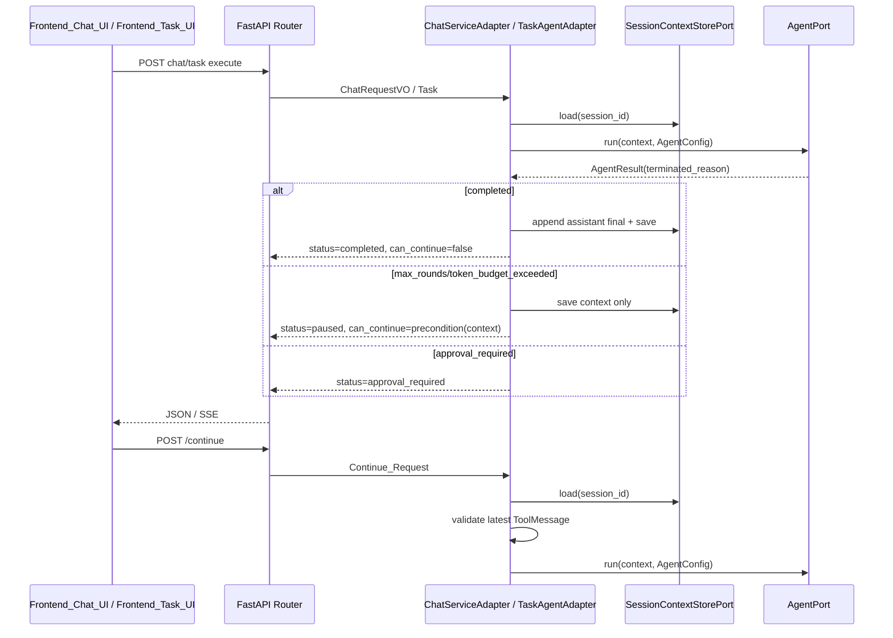

# 设计文档：Long Task Continuation Phase 1

## 概述

本设计在既有 `AgentResult.terminated_reason` 基础上补齐上层可见化与手动继续能力：`Chat_Response`、`Task_Result`、HTTP/SSE、前端均显式表达 `Paused_State`，并为同一 `Conversation_Context` 提供人工 `Continue_Request`。设计遵循 `docs/steering/ddd-architecture.md` 的 DDD / 六边形分层：领域层扩展值对象与 Port，基础设施层实现编排，应用层只做 HTTP 转换；配置不新增强制项，继续保留当前 `CHAT_MAX_TOOL_ROUNDS` / `TASK_AGENT_MAX_ROUNDS` 单段限制。

### 设计决策

| 决策 | 选定方案 | 理由 |
| --- | --- | --- |
| 暂停状态表达 | `status="paused"` + `terminated_reason` + `can_continue` | 对齐 OpenAI `incomplete` / Anthropic `stop_reason` 思路，不把边界命中伪装成完成。 |
| 手动继续位置 | Chat/Task service 层新增 continue 入口 | 不改底层 ReAct Loop；由上层显式决定是否追加执行段。 |
| 继续输入 | 复用同一 `Conversation_Context`，不追加 user message | 符合“继续执行”语义，避免把继续误建模成用户新问题。 |
| 继续前置条件 | 最新消息必须是 `ToolMessage` | 当前 `max_rounds` / `token_budget_exceeded` 命中后，Agent 已写入工具结果；若最新状态不是工具结果，不具备安全续跑上下文。 |
| 暂停时持久化 | 保存上下文但不追加 `Empty_Final_Assistant_Message` | 避免空 assistant final 污染下一段模型输入。 |
| Token 预算 | 只透传已有 `token_budget_exceeded`，不新增预算编排 | 符合第一阶段“可见化”范围，避免滑入第二阶段全局预算。 |
| 工具访问边界 | Continue_Request 复用原始 Agent_Run 的工具集合 | 对齐工具调用继续执行的主流做法，避免 Task 继续时从工具子集意外扩大为全量工具。 |
| 并发控制 | 沿用现有 load/mutate/save；前端禁用重复点击 | 本期不引入 idempotency key 或 Run 锁；并发治理留到后台 Run / 检查点阶段。 |

## 架构



### 分层影响

- `domain/`：扩展值对象、Port、业务异常；不引入 FastAPI / Pydantic Settings / 基础设施依赖。
- `infrastructure/`：在 `ChatServiceAdapter`、`TaskAgentAdapter` 中实现暂停翻译、继续编排、上下文保存规则。
- `application/`：新增 HTTP body/response Pydantic 模型和路由；继续沿用 `BizException` 到 JSON 的映射。
- `epsilon-client/`：扩展 API 类型、SSE 解析、聊天/任务暂停态 UI 与继续按钮。

## 组件与接口

### 1. Chat_Response 值对象

位置：`epsilon-boot/src/domain/chat/value_objects.py`

职责：向 Router / 前端表达聊天运行状态、终止原因与是否可继续。

```python
from domain.agent.value_objects import (
    AgentTerminationReason,
    ApprovalDecision,
    PendingActionRequest,
)

ChatResponseStatus = Literal["completed", "approval_required", "paused"]

@dataclass(frozen=True, kw_only=True)
class ChatResponseVO:
    session_id: str
    reply: str
    model: str
    usage: dict[str, int]
    prompt_id: str
    status: ChatResponseStatus = "completed"
    approval_id: str | None = None
    action_requests: tuple[PendingActionRequest, ...] = field(default_factory=tuple)
    terminated_reason: AgentTerminationReason = "completed"
    can_continue: bool = False
```

新增继续请求值对象：

```python
@dataclass(frozen=True)
class ChatContinueRequestVO:
    """聊天继续请求值对象。"""

    session_id: str
    stream: bool = False
    model: str | None = None

    def __post_init__(self) -> None:
        if not self.session_id:
            raise ValueError("session_id 不能为空")
```

### 2. Task_Result 值对象

位置：`epsilon-boot/src/domain/task/value_objects.py`

职责：让任务执行结果区分 success / failed / paused。

```python
from domain.agent.value_objects import AgentTerminationReason

class TaskStatus(Enum):
    SUCCESS = "success"
    FAILED = "failed"
    HUMAN_INTERVENTION_REQUIRED = "human_intervention_required"
    PAUSED = "paused"

@dataclass(frozen=True)
class TaskResult:
    content: str
    status: TaskStatus
    model: str
    prompt_id: str
    usage: dict[str, int] = field(default_factory=dict)
    trace: list[TraceEntry] = field(default_factory=list)
    latency_ms: float = 0.0
    terminated_reason: AgentTerminationReason = "completed"
    can_continue: bool = False
```

新增继续请求值对象：

```python
@dataclass(frozen=True)
class TaskContinueRequest:
    """任务继续请求值对象。"""

    session_id: str
    model: str | None = None

    def __post_init__(self) -> None:
        if not self.session_id:
            raise ValueError("session_id 不能为空")
```

### 3. 继续不可用异常

位置：`epsilon-boot/src/domain/chat/exceptions.py`

职责：统一表达 `Continue_Precondition` 不满足。

```python
class ContinuationUnavailableError(BizException):
    """当前会话不满足继续执行前置条件。"""

    def __init__(self, session_id: str, reason: str) -> None:
        super().__init__(
            code=60041,
            message=f"当前会话不可继续执行：{reason}",
        )
        self.session_id = session_id
        self.reason = reason
```

### 4. ChatServicePort

位置：`epsilon-boot/src/domain/chat/ports.py`

```python
async def continue_chat(
    self,
    request: "ChatContinueRequestVO",
) -> "ChatResponseVO":
    """基于已有会话上下文继续聊天 Agent 执行。"""
    ...

def stream_continue_chat_events(
    self,
    request: "ChatContinueRequestVO",
) -> AsyncIterator["AgentStreamEvent"]:
    """基于已有会话上下文继续执行并产出结构化事件流。"""
    ...
```

`stream_chat(...)` 保持兼容，不新增 continue 版本；HTTP SSE 路由优先使用 `stream_continue_chat_events(...)`。

### 5. TaskAgentPort

位置：`epsilon-boot/src/domain/task/ports.py`

```python
async def continue_task(self, request: "TaskContinueRequest") -> "TaskResult":
    """基于已有任务会话上下文继续执行。"""
    ...
```

### 6. ChatServiceAdapter

位置：`epsilon-boot/src/infrastructure/chat/chat_service_adapter.py`

新增私有工具方法：

```python
def _make_agent_config(self, model: str | None) -> AgentConfig: ...

@staticmethod
def _can_continue_from_context(context: ConversationContext) -> bool: ...

def _to_chat_response(
    self,
    *,
    session_id: str,
    context: ConversationContext,
    agent_result: AgentResult,
) -> ChatResponseVO: ...

async def _run_agent_on_existing_context(
    self,
    *,
    session_id: str,
    context: ConversationContext,
    model: str | None,
) -> ChatResponseVO: ...
```

关键行为：

- `_can_continue_from_context(context)`：`messages = context.get_messages()`，返回 `bool(messages) and isinstance(messages[-1], ToolMessage)`。
- `_to_chat_response(...)`：
  - `approval_required`：保持现有审批响应，`terminated_reason="completed"`、`can_continue=False`。
  - `terminated_reason == "completed"`：追加 assistant final 后保存，返回 `status="completed"`。
  - 其他终止原因：不追加 assistant final，仅保存上下文，返回 `status="paused"`、`reply=""`、`can_continue=_can_continue_from_context(context)`。
- `continue_chat(...)`：加载上下文、设置 `context.session_id`，检查 `_can_continue_from_context`，不追加 user message，调用 `_run_agent_on_existing_context(...)`。
- `stream_continue_chat_events(...)`：同上，但返回事件流；若前置条件失败，在方法入口抛 `ContinuationUnavailableError`。

现有 `chat(...)`、`resume_approval(...)`、`stream_chat(...)`、`stream_chat_events(...)` 统一复用暂停翻译逻辑，修复暂停时追加 `Empty_Final_Assistant_Message` 的问题。

### 7. TaskAgentAdapter

位置：`epsilon-boot/src/infrastructure/task/task_agent_adapter.py`

新增私有工具方法：

```python
def _make_agent_config(
    self,
    *,
    system_prompt: str,
    tool_schemas: list[dict[str, Any]],
    model_name: str,
) -> AgentConfig: ...

@staticmethod
def _can_continue_from_context(context: ConversationContext) -> bool: ...

def _to_task_result(
    self,
    *,
    agent_result: AgentResult,
    trace: list[TraceEntry],
) -> TaskResult: ...
```

新增公开方法：

```python
async def continue_task(self, request: TaskContinueRequest) -> TaskResult: ...
```

关键行为：

- `execute(...)` 在 `agent_result.terminated_reason != "completed"` 时返回 `TaskStatus.PAUSED`，保存上下文但不写入空 final。
- `execute(...)` 在首次注入 system message 时写入 `SystemMessage.metadata["task_allowed_tool_names"]`：当 `task.tool_names is None` 时值为 `None`，表示使用全量工具；否则值为排序后的工具名列表。
- `continue_task(...)` 只支持 `session_id`；加载上下文后要求最新消息是 `ToolMessage`，否则抛 `ContinuationUnavailableError`。
- `continue_task(...)` 必须读取既有 system message 的 `task_allowed_tool_names` metadata 来重建工具 schema；metadata 缺失、类型非法或包含当前注册表不存在的工具名时，抛 `ContinuationUnavailableError("缺少可继续的工具访问边界")`，不得退化为全量工具。
- 继续时不调用 `build_system_prompt(task)`，也不追加原 task goal；若上下文没有 system message，使用空字符串作为 `system_prompt` 构造 `AgentConfig` 不合理，因此前置条件同时隐含“已有会话上下文”。实现应在没有任何消息或没有 system 消息时抛 `ContinuationUnavailableError("缺少可继续的任务上下文")`。

### 8. HTTP 路由

位置：`epsilon-boot/src/application/api/routers/chat.py`

```python
class ChatContinueRequestBody(BaseModel):
    stream: bool = False
    model: str | None = None

class ChatResponseBody(BaseModel):
    code: int = 0
    session_id: str
    reply: str
    model: str
    usage: dict[str, int]
    prompt_id: str
    status: str = "completed"
    approval_id: str | None = None
    action_requests: list[dict] = []
    terminated_reason: str = "completed"
    can_continue: bool = False

@router.post("/api/chat/sessions/{session_id}/continue", response_model=None)
async def continue_chat(
    session_id: str,
    request: ChatContinueRequestBody,
    service: ChatServicePort = Depends(inject(ChatServicePort)),
) -> ChatResponseBody | EventSourceResponse | JSONResponse: ...
```

SSE `assistant_done` 映射：

```json
{
  "delta_content": "",
  "finished": true,
  "status": "paused",
  "terminated_reason": "max_rounds",
  "can_continue": true
}
```

如果 `assistant_done.metadata.terminated_reason` 缺失或为 `completed`，输出普通 final chunk；`prompt_id` 事件保持现状。

位置：`epsilon-boot/src/application/api/routers/task.py`

```python
class TaskContinueRequestBody(BaseModel):
    model: str | None = None

class TaskExecuteResponseBody(BaseModel):
    code: int = 0
    content: str
    status: str
    model: str
    usage: dict[str, int]
    trace: list[TraceEntryBody]
    latency_ms: float
    prompt_id: str
    terminated_reason: str = "completed"
    can_continue: bool = False

@router.post("/api/task/sessions/{session_id}/continue", response_model=None)
async def continue_task(
    session_id: str,
    request: TaskContinueRequestBody,
    service: TaskAgentPort = Depends(inject(TaskAgentPort)),
) -> TaskExecuteResponseBody | JSONResponse: ...
```

`ContinuationUnavailableError` 在路由层映射为 HTTP 409，响应格式沿用 `{"code": exc.code, "message": exc.message}`。

### 9. 前端 API 与 UI

位置：`epsilon-client/src/lib/chat-api.ts`

```ts
export type TerminationReason =
  | "completed"
  | "max_rounds"
  | "token_budget_exceeded";

export interface StreamChunk {
  delta_content: string;
  finished: boolean;
  status?: "completed" | "paused" | "approval_required";
  terminated_reason?: TerminationReason;
  can_continue?: boolean;
}

export interface TaskExecuteResponse {
  code: number;
  content: string;
  status: string;
  model: string;
  usage: Record<string, number>;
  trace: TaskTraceEntry[];
  latency_ms: number;
  prompt_id: string;
  terminated_reason: TerminationReason;
  can_continue: boolean;
}

export function streamContinueChat(
  sessionId: string,
  model: string | undefined,
  onChunk: (chunk: StreamChunk) => void,
  onDone: () => void,
  onError: (error: Error) => void,
): AbortController;

export async function continueTask(
  sessionId: string,
  model?: string,
): Promise<TaskExecuteResponse>;
```

SSE 解析只把包含 `finished` 布尔字段的 JSON 交给 `onChunk`；`{"prompt_id": ...}` 等控制事件不再进入聊天 chunk 拼接。

位置：`epsilon-client/src/hooks/use-chat.ts`

```ts
export interface ChatMessage {
  id: string;
  role: MessageRole;
  content: string;
  status?: "completed" | "paused";
  terminatedReason?: TerminationReason;
  canContinue?: boolean;
}

export interface UseChatReturn {
  messages: ChatMessage[];
  isLoading: boolean;
  error: string | null;
  sendMessage: (content: string, model?: string) => void;
  continueLast: (model?: string) => void;
  clearChat: () => Promise<void>;
  abort: () => void;
}
```

位置：`message-bubble.tsx` 增加暂停徽标和“继续”按钮；位置：`task-workspace.tsx` 增加暂停状态卡片和继续按钮。按钮在 `isLoading` 时禁用，防止重复点击。

## 数据模型

### 领域模型

`ChatResponseVO` 示例：

```python
ChatResponseVO(
    session_id="session-1",
    reply="",
    model="qwen3.7-max",
    usage={"total_tokens": 1200},
    prompt_id="chat-default@v1",
    status="paused",
    terminated_reason="max_rounds",
    can_continue=True,
)
```

`TaskResult` 示例：

```python
TaskResult(
    content="",
    status=TaskStatus.PAUSED,
    model="qwen3.7-max",
    prompt_id="task-template@v1",
    usage={"total_tokens": 1200},
    trace=[...],
    terminated_reason="max_rounds",
    can_continue=True,
)
```

### 持久化模型

不新增表、不新增 DDL、不新增索引。继续使用 `SessionContextStorePort.save/load/delete` 保存 `ConversationContext.to_dict()`。

暂停时保存后的消息尾部应是：

```json
[
  {
    "role": "assistant",
    "content": "",
    "tool_calls": [{"id": "call_1", "name": "read_file", "arguments": "{\"path\":\"a.md\"}"}]
  },
  {
    "role": "tool",
    "content": "...",
    "tool_name": "read_file",
    "tool_call_id": "call_1"
  }
]
```

禁止追加：

```json
{"role": "assistant", "content": ""}
```

Task_Flow 的 system message metadata 应保存工具访问边界：

```json
{
  "role": "system",
  "content": "...",
  "metadata": {
    "task_allowed_tool_names": ["read_file", "write_file"]
  }
}
```

当原始任务允许全量工具时，`task_allowed_tool_names` 显式保存为 `null`；缺失该 key 表示旧上下文或不可验证上下文，继续入口应拒绝，而不是扩大工具集合。

### 配置项

不新增 `config.properties` 必填项。继续入口使用现有：

- `CHAT_MAX_TOOL_ROUNDS`
- `TASK_AGENT_MAX_ROUNDS`

`AgentConfig.max_total_tokens` 已存在；本期不新增 `CHAT_MAX_TOTAL_TOKENS` / `TASK_AGENT_MAX_TOTAL_TOKENS`，仅在上层收到 `token_budget_exceeded` 时透传状态。

## 事务与并发边界

- 本期不引入数据库事务或 Run 锁；沿用现有 `SessionContextStorePort.load(...)` → 原地修改 `ConversationContext` → `save(...)` 模式。
- `continue_chat(...)` / `continue_task(...)` 的前置校验在 Agent_Run 开始前执行；若校验失败不修改上下文。
- Agent_Run 期间可能执行工具，工具副作用与现有执行路径一致；本期不引入幂等键或补偿机制。
- 前端在继续请求进行中禁用继续按钮，降低重复触发概率；服务端并发请求同一 session 的竞态属于后续后台 Run / 检查点阶段范围。
- `SessionContextStorePort.compare_and_swap(...)` 已存在，但本期不强制迁移所有聊天/任务写路径，避免长时间 Agent_Run 持锁改变现有行为。

## 正确性属性

### Property 1: 暂停状态不伪装成完成

*For any* `AgentResult` with `terminated_reason in {"max_rounds", "token_budget_exceeded"}` and `status == "completed"`, translating it through Chat_Flow or Task_Flow must produce `status="paused"` / `TaskStatus.PAUSED`, preserve the same `terminated_reason`, and must not return ordinary completed or success semantics.

**验证需求：1.5, 1.6, 1.7, 2.1, 2.3, 7.1, 7.2**

### Property 2: 暂停时不追加空最终助手消息

*For any* `Conversation_Context` whose Agent_Run ends in Paused_State after tool results are written, the persisted message list after Chat_Flow or Task_Flow returns must not contain a newly appended `AssistantMessage(content="")` after the latest `ToolMessage`.

**验证需求：5.1, 5.2, 5.3, 5.4**

### Property 3: 继续请求不追加用户消息

*For any* valid Continue_Request accepted by Chat_Flow or Task_Flow, the new Agent_Run input context must have the same user-message count as the context loaded immediately before continuation.

**验证需求：3.2, 3.3, 4.2, 4.3, 6.3, 6.6**

### Property 4: 可继续标记与前置条件一致

*For any* Paused_State response, `can_continue` must be `true` if and only if Continue_Precondition is satisfied for the resulting Conversation_Context.

**验证需求：5.5, 5.6, 5.7, 5.8**

### Property 5: 审批状态与暂停状态正交

*For any* Agent_Run that returns Approval_Required_State, Chat_Flow must preserve `status="approval_required"`, return `terminated_reason="completed"`, and must not expose Paused_State.

**验证需求：1.8, 8.4**

### Property 6: 单段限制不变

*For any* initial run or continuation run, the AgentConfig passed to AgentPort must use the currently configured Segment_Round_Limit for that flow and must not increase it because of Continue_Request.

**验证需求：3.4, 4.4, 8.1**

### Property 7: 继续执行不扩大工具访问边界

*For any* Task_Flow Continue_Request, the AgentConfig.tool_schemas and AgentConfig.allowed_tool_names used by the continued Agent_Run must be equal to or narrower than the original Task_Flow Tool_Access_Boundary persisted in Conversation_Context. If that boundary cannot be reconstructed, the request must be rejected before Agent_Run starts.

**验证需求：4.8, 4.9, 8.8**

## 错误处理

### 错误常量定义

| 错误 | code | HTTP | 位置 | 含义 |
| --- | --- | --- | --- | --- |
| `ContinuationUnavailableError` | `60041` | `409` | `domain/chat/exceptions.py` | 会话不存在、已清空或最新上下文不满足继续前置条件。 |

### 错误场景与处理策略

| 场景 | 处理 |
| --- | --- |
| Continue_Request 的 `session_id` 为空 | 值对象 `__post_init__` 抛 `ValueError`，路由返回 400。 |
| 会话不存在或为空 | `ContinuationUnavailableError(reason="缺少可继续的上下文")`，路由返回 409。 |
| 最新消息不是 `ToolMessage` | `ContinuationUnavailableError(reason="最新消息不是工具结果")`，路由返回 409。 |
| Task 上下文缺少 `task_allowed_tool_names` metadata | `ContinuationUnavailableError(reason="缺少可继续的工具访问边界")`，路由返回 409。 |
| 继续 Agent_Run 期间模型或工具异常 | 沿用现有异常传播；Chat 由全局/路由错误处理，Task 转为 `TaskStatus.FAILED`。 |
| SSE 继续入口前置条件失败 | 进入 SSE 前抛出并由路由返回 JSON 409；若流中异常则沿用现有 error chunk。 |

### 错误传播策略

- `ContinuationUnavailableError` 继承 `BizException`，Chat 路由复用 `_biz_error_response(...)`。
- Task 路由新增同等 `_biz_error_response(...)` 或本地分支，把 `ContinuationUnavailableError` 映射为 HTTP 409。
- 不把继续不可用映射为 `TaskStatus.FAILED`，因为它是请求前置条件错误，不是 Agent_Run 失败。

### 错误处理原则

- 不记录完整用户消息、完整 tool arguments 或工具结果正文。
- 不在继续失败时修改 `Conversation_Context`。
- 不把 `Approval_Required_State` 作为 Continue_Request 处理；审批仍走既有 resume endpoint。

## 测试策略

### 属性测试（Property-Based Testing）

项目已使用 `hypothesis`。本期新增属性测试聚焦纯领域/编排不变量：

| 测试文件 | 覆盖属性 |
| --- | --- |
| `test/domain/chat/test_chat_response_paused_property.py` | Property 1、4 |
| `test/infrastructure/chat/test_chat_continuation_context_property.py` | Property 2、3 |
| `test/infrastructure/task/test_task_continuation_context_property.py` | Property 2、3 |
| `test/infrastructure/task/test_task_continue_tool_boundary_property.py` | Property 7 |

### 单元测试（Example-Based）

| 测试文件 | 场景 |
| --- | --- |
| `test/domain/chat/test_continuation_value_objects_unit.py` | `ChatResponseVO`、`ChatContinueRequestVO` 字段默认值和校验。 |
| `test/domain/task/test_task_paused_result_unit.py` | `TaskStatus.PAUSED`、`TaskResult.terminated_reason/can_continue`。 |
| `test/infrastructure/chat/test_chat_service_paused_unit.py` | 同步 chat 对 `max_rounds` / `token_budget_exceeded` 的暂停翻译，暂停时不追加空 assistant。 |
| `test/infrastructure/chat/test_chat_service_continue_unit.py` | `continue_chat` 不追加 user message、前置条件失败抛 `ContinuationUnavailableError`。 |
| `test/infrastructure/chat/test_chat_service_stream_paused_unit.py` | `stream_chat_events` 与 `stream_continue_chat_events` 的 `assistant_done.metadata.terminated_reason` 保存规则。 |
| `test/infrastructure/task/test_task_agent_paused_unit.py` | `execute` 和 `continue_task` 返回 `TaskStatus.PAUSED`，上下文保存正确。 |
| `test/infrastructure/task/test_task_agent_continue_tool_boundary_unit.py` | `execute` 持久化 `task_allowed_tool_names`，`continue_task` 保留工具子集，缺失边界时 409。 |
| `test/application/test_chat_continue_router_unit.py` | `/api/chat/sessions/{session_id}/continue` JSON/SSE 映射与 409。 |
| `test/application/test_task_continue_router_unit.py` | `/api/task/sessions/{session_id}/continue` 映射与 409。 |

### 集成测试

| 测试文件 | 场景 |
| --- | --- |
| `test/application/test_long_task_phase1_integration.py` | 使用 fake Agent 触发 `max_rounds`，验证 Chat + Task HTTP 响应、继续请求、上下文尾部无空 assistant。 |
| `epsilon-client` lint / 组件测试 | `npm run lint`；如仓库无前端测试框架，本期以类型检查和 lint 作为最低验证。 |

### 验证命令

```bash
cd epsilon-boot && uv run --frozen pytest -q
cd epsilon-client && npm run lint
```

### 需求追踪矩阵

| 需求 | 设计覆盖 | 测试覆盖 |
| --- | --- | --- |
| 需求 1 | 组件 1、2、6、7；Property 1、5 | chat/task paused unit |
| 需求 2 | 组件 8、9；Property 1 | router unit、frontend lint |
| 需求 3 | 组件 4、6；Property 3、6 | chat continue unit |
| 需求 4 | 组件 5、7；Property 3、6、7 | task continue unit、tool boundary unit |
| 需求 5 | 组件 6、7；事务边界；Property 2、4 | context property、integration |
| 需求 6 | 组件 9 | frontend lint、manual smoke |
| 需求 7 | 组件 6、7；数据模型配置说明；Property 1 | paused fake Agent tests |
| 需求 8 | 设计决策；事务与并发边界；Property 5、6、7 | regression suite |
