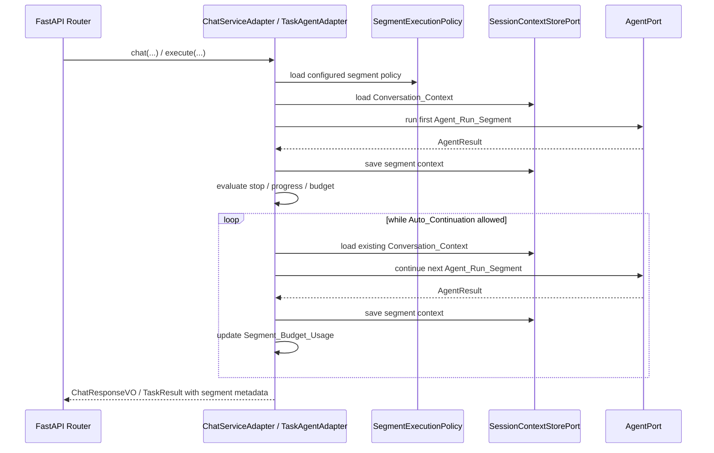
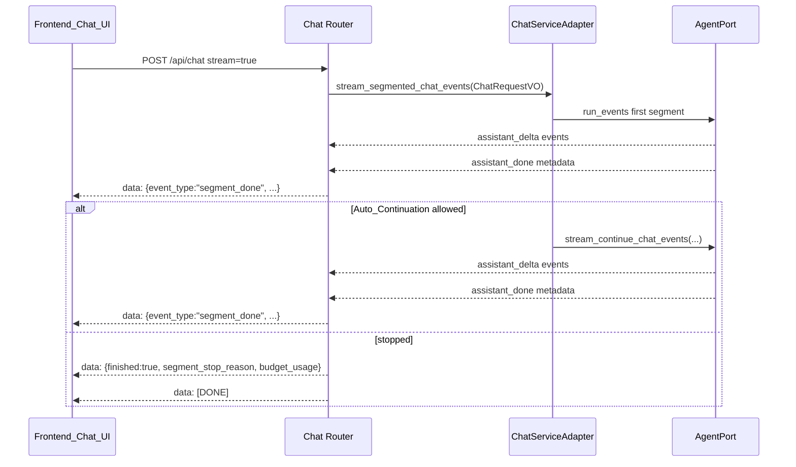

# 设计文档：Long Task Continuation Phase 2

## 概述

本设计在阶段一 `Continue_Request` 基础上增加请求内有限分段编排：`Chat_Flow` 与 `Task_Flow` 仍使用现有单段 Agent 执行入口，但由外层 `Segmented_Run` 统计段数、预算、进展与停止原因。设计遵循 `docs/steering/ddd-architecture.md` 的 DDD / 六边形约束：领域层只新增纯值对象，基础设施层负责分段编排和上下文差异分析，应用层只做 HTTP/SSE 转换；配置按 `docs/steering/config-source.md` 写入 `epsilon-boot/config.properties`。

阶段二不引入后台 `run_id`、持久化检查点或新工作流运行时。自动续跑能力通过配置开关启用，默认关闭；人工继续入口继续沿用阶段一接口。

### 设计决策

| 决策 | 选定方案 | 理由 |
| --- | --- | --- |
| 分段位置 | 在 `ChatServiceAdapter` / `TaskAgentAdapter` 外层方法内循环编排 | 复用阶段一继续入口和上下文保存语义，不改 `AgentPort` 和 ReAct Loop。 |
| 默认自动续跑 | 配置存在但默认关闭 | 满足阶段二能力定义，同时降低成本、延迟和循环风险。 |
| 请求参数 | 不给 HTTP 请求体增加用户级自动续跑开关 | 自动续跑属于运维风险策略，不允许客户端绕过部署配置。 |
| 领域建模 | 新增 `domain/agent/segmented_execution.py` 纯值对象 | Chat / Task 可复用，且不依赖 FastAPI、Pydantic Settings 或基础设施。 |
| 进展判断 | 基于上下文消息数、ToolMessage、trace、usage、最终内容的保守规则 | 可测试、可解释，不引入模型自评或新依赖。 |
| 重复工具调用 | 工具名 + 规范化参数 JSON sha256 摘要 | 避免用对象身份比较，兼容跨序列化上下文。 |
| 流式分段 | 在每段 `assistant_done` 后发 `segment_done` 控制事件 | 前端可展示段边界，同时不把控制 payload 拼入 assistant 文本。 |
| 持久化 | 不新增表或检查点；继续使用 `SessionContextStorePort` 保存上下文 | 阶段二是请求内有限分段，服务重启恢复留到阶段四。 |
| 并发 | 不新增全局锁；每个段沿用现有 load/mutate/save | 与阶段一一致；同 session 并发 continue 留到后台 Run / checkpoint 阶段治理。 |

## 架构

### 同步 Chat / Task 分段



### 流式 Chat 分段



## 组件与接口

### 1. 分段执行领域值对象

位置：`epsilon-boot/src/domain/agent/segmented_execution.py`

职责：表达分段策略、预算、停止原因和段执行摘要。该模块只依赖 Python 标准库和 `domain.agent.value_objects.AgentTerminationReason`。

```python
"""Agent 分段执行值对象模块。"""

from __future__ import annotations

from dataclasses import dataclass, field
from typing import Literal

from domain.agent.value_objects import AgentTerminationReason

SegmentStopReason = Literal[
    "completed",
    "auto_disabled",
    "approval_required",
    "max_continuations_reached",
    "total_token_budget_reached",
    "total_duration_budget_reached",
    "consecutive_paused_limit",
    "no_progress",
    "repeated_tool_call",
    "tool_boundary_unavailable",
    "continue_precondition_failed",
    "risk_gate_required",
]


@dataclass(frozen=True)
class SegmentExecutionPolicy:
    """分段执行策略。"""

    auto_continue_enabled: bool = False
    max_continuations: int = 3
    max_total_tokens: int | None = None
    max_duration_seconds: float | None = None
    max_consecutive_paused: int = 2
    max_no_progress_segments: int = 2
    max_repeated_tool_calls: int = 2

    def __post_init__(self) -> None: ...


@dataclass(frozen=True)
class SegmentBudgetUsage:
    """分段运行累计预算用量。"""

    segment_count: int = 0
    continuation_count: int = 0
    total_tokens: int = 0
    elapsed_ms: float = 0.0
    consecutive_paused_count: int = 0
    no_progress_count: int = 0
    repeated_tool_call_count: int = 0

    def plus_segment(
        self,
        *,
        total_tokens_delta: int,
        elapsed_ms_delta: float,
        paused: bool,
        has_progress: bool,
        repeated_tool_call: bool,
    ) -> "SegmentBudgetUsage": ...

    def to_dict(self) -> dict[str, int | float]: ...


@dataclass(frozen=True)
class SegmentProgressSnapshot:
    """单段执行前后的进展快照。"""

    pre_message_count: int
    post_message_count: int
    new_tool_message_count: int = 0
    new_trace_count: int = 0
    token_delta: int = 0
    final_content_present: bool = False
    repeated_tool_call: bool = False

    @property
    def has_progress(self) -> bool: ...


@dataclass(frozen=True)
class SegmentRunMetadata:
    """返回给上层响应的分段元数据。"""

    segment_index: int = 1
    segment_count: int = 1
    auto_continue_attempted: bool = False
    segment_stop_reason: SegmentStopReason = "completed"
    budget_usage: SegmentBudgetUsage = field(default_factory=SegmentBudgetUsage)

    def to_http_dict(self) -> dict[str, object]: ...
```

校验规则：

- `max_continuations >= 0`
- `max_total_tokens is None or > 0`
- `max_duration_seconds is None or > 0`
- `max_consecutive_paused > 0`
- `max_no_progress_segments > 0`
- `max_repeated_tool_calls > 0`
- `segment_count >= 0`
- 所有计数和耗时不可为负

### 2. Chat_Response / Task_Result 扩展

位置：

- `epsilon-boot/src/domain/chat/value_objects.py`
- `epsilon-boot/src/domain/task/value_objects.py`

职责：在阶段一响应字段基础上追加默认兼容的分段元数据。

```python
from domain.agent.segmented_execution import SegmentRunMetadata

@dataclass(frozen=True, kw_only=True)
class ChatResponseVO:
    ...
    segment_metadata: SegmentRunMetadata = field(default_factory=SegmentRunMetadata)


@dataclass(frozen=True)
class TaskResult:
    ...
    segment_metadata: SegmentRunMetadata = field(default_factory=SegmentRunMetadata)
```

默认行为：如果未启用阶段二自动续跑，单段 completed 或 paused 响应仍返回 `segment_index=1`、`segment_count=1`、`auto_continue_attempted=false`。`segment_stop_reason` 在 completed 路径为 `completed`；paused 且自动续跑未启用时为 `auto_disabled`。

### 3. 分段进展分析工具

位置：`epsilon-boot/src/infrastructure/agent/segmented_progress.py`

职责：在基础设施层读取 `ConversationContext`、`ToolMessage`、`AssistantMessage.tool_calls` 和 trace，计算 `SegmentProgressSnapshot` 和重复工具调用。

```python
"""分段执行进展分析模块。"""

from __future__ import annotations

from domain.agent.segmented_execution import SegmentProgressSnapshot
from domain.chat.context import BaseMessage, ConversationContext
from domain.task.value_objects import TraceEntry


def total_tokens_from_usage(usage: dict[str, int]) -> int:
    """从 usage 字典计算 total_tokens。"""
    ...


def normalized_tool_call_digest(tool_name: str, arguments: str) -> str:
    """对工具名和参数生成稳定摘要。"""
    ...


def analyze_segment_progress(
    *,
    context: ConversationContext,
    pre_message_count: int,
    previous_tool_call_digest: str | None,
    usage: dict[str, int],
    trace: list[TraceEntry] | None = None,
    final_content: str = "",
) -> tuple[SegmentProgressSnapshot, str | None]:
    """分析单段执行是否有进展，并返回本段最后一个工具调用摘要。"""
    ...
```

摘要规则：

- `arguments` 优先按 JSON 解析，成功后用 `json.dumps(..., sort_keys=True, separators=(",", ":"), ensure_ascii=False)` 规范化。
- JSON 解析失败时使用原始字符串。
- 摘要输入为 `f"{tool_name}:{normalized_arguments}"`，输出为 sha256 hex。

### 4. 分段停止决策工具

位置：`epsilon-boot/src/infrastructure/agent/segmented_orchestration.py`

职责：根据 `SegmentExecutionPolicy`、`SegmentBudgetUsage`、当前响应状态和进展快照判断是否继续。

```python
"""分段执行编排决策模块。"""

from __future__ import annotations

from dataclasses import dataclass

from domain.agent.segmented_execution import (
    SegmentBudgetUsage,
    SegmentExecutionPolicy,
    SegmentProgressSnapshot,
    SegmentStopReason,
)


@dataclass(frozen=True)
class SegmentContinuationDecision:
    """单段结束后的续跑决策。"""

    should_continue: bool
    stop_reason: SegmentStopReason


def decide_next_segment(
    *,
    policy: SegmentExecutionPolicy,
    usage: SegmentBudgetUsage,
    status: str,
    can_continue: bool,
    progress: SegmentProgressSnapshot,
    approval_required: bool = False,
    tool_boundary_available: bool = True,
) -> SegmentContinuationDecision:
    """判断是否应自动进入下一段。"""
    ...
```

判定顺序：

1. `status == "completed"` → stop `completed`
2. `approval_required` 或 `status == "approval_required"` → stop `approval_required`
3. `can_continue is False` → stop `continue_precondition_failed`
4. `tool_boundary_available is False` → stop `tool_boundary_unavailable`
5. `policy.auto_continue_enabled is False` → stop `auto_disabled`
6. `usage.continuation_count >= policy.max_continuations` → stop `max_continuations_reached`
7. token / duration / consecutive paused / no progress / repeated tool thresholds → corresponding stop reason
8. otherwise continue

### 5. ChatServiceAdapter 分段同步与流式编排

位置：`epsilon-boot/src/infrastructure/chat/chat_service_adapter.py`

构造器新增参数：

```python
from domain.agent.segmented_execution import SegmentExecutionPolicy

class ChatServiceAdapter(ChatServicePort):
    def __init__(
        self,
        session_store: SessionContextStorePort,
        model_registry: ModelRegistryPort,
        prompt_registry: "PromptRegistryPort",
        context_builder: ContextBuilderPort,
        agent: AgentPort,
        tool_calling_enabled: bool,
        max_tool_rounds: int,
        tool_schemas: list[dict[str, Any]],
        approval_store: ApprovalStateStorePort | None = None,
        segment_policy: SegmentExecutionPolicy | None = None,
    ) -> None: ...
```

新增/修改方法：

```python
async def _run_segmented_chat(
    self,
    request: ChatRequestVO,
) -> ChatResponseVO:
    """执行同步聊天，并在策略允许时自动续跑。"""
    ...

async def _continue_segmented_chat(
    self,
    request: ChatContinueRequestVO,
    *,
    initial_response: ChatResponseVO | None = None,
) -> ChatResponseVO:
    """基于继续请求执行一段或多段聊天。"""
    ...

def stream_segmented_chat_events(
    self,
    request: ChatRequestVO,
) -> AsyncIterator[AgentStreamEvent]:
    """流式聊天分段事件。"""
    ...

def stream_segmented_continue_chat_events(
    self,
    request: ChatContinueRequestVO,
) -> AsyncIterator[AgentStreamEvent]:
    """流式继续聊天分段事件。"""
    ...
```

落地方式：

- `chat(...)` 保持签名不变，内部在 tool calling 路径执行 `_run_segmented_chat(...)`；直接 LLM 路径不进入自动续跑。
- `continue_chat(...)` 保持签名不变，内部执行 `_continue_segmented_chat(...)`。
- `stream_chat_events(...)` 可保持单段语义；路由在 `stream=true` 时优先调用新增 `stream_segmented_chat_events(...)`。如果实现者选择直接替换 `stream_chat_events(...)` 为分段语义，也必须保证 CLI/TUI 消费者仍能识别既有事件。
- 每段结束时基于 `event.metadata["terminated_reason"]`、`can_continue` 和进展快照更新 `SegmentBudgetUsage`。
- 自动续跑只调用既有 `stream_continue_chat_events(ChatContinueRequestVO(...))` 或 `_run_agent_on_existing_context(...)`，不添加 user message。

### 6. TaskAgentAdapter 分段编排

位置：`epsilon-boot/src/infrastructure/task/task_agent_adapter.py`

构造器新增参数：

```python
from domain.agent.segmented_execution import SegmentExecutionPolicy

class TaskAgentAdapter:
    def __init__(
        self,
        agent: AgentPort,
        tool_registry: ToolRegistry,
        model_registry: ModelRegistryPort,
        compaction: ContextCompactionPort,
        session_store: SessionContextStorePort,
        prompt_registry: "PromptRegistryPort",
        max_rounds: int = 10,
        segment_policy: SegmentExecutionPolicy | None = None,
    ) -> None: ...
```

新增/修改方法：

```python
async def _execute_single_task_segment(self, task: Task) -> TaskResult:
    """执行任务首段，等价于阶段一 execute 的单段行为。"""
    ...

async def _continue_single_task_segment(
    self,
    request: TaskContinueRequest,
) -> TaskResult:
    """执行任务继续单段，等价于阶段一 continue_task 行为。"""
    ...

async def _run_segmented_task(self, task: Task) -> TaskResult:
    """执行任务并在策略允许时自动续跑。"""
    ...

async def _continue_segmented_task(
    self,
    request: TaskContinueRequest,
) -> TaskResult:
    """继续任务并在策略允许时自动续跑。"""
    ...
```

落地方式：

- `execute(...)` 保持签名不变，内部调用 `_run_segmented_task(...)`。
- `continue_task(...)` 保持签名不变，内部调用 `_continue_segmented_task(...)`。
- 若 `task.session_id is None`，只执行首段，不自动续跑；因为无 session 无法构造安全 Continue_Request。
- Task 工具边界仍以 `SystemMessage.metadata["task_allowed_tool_names"]` 重建；不可重建时停止，响应 `segment_stop_reason="tool_boundary_unavailable"`。
- `TaskResult.trace` 返回所有段 trace 的顺序合并，`usage` 返回所有段 usage 累加。

### 7. 配置模型

位置：

- `epsilon-boot/src/infrastructure/chat/chat_config.py`
- `epsilon-boot/src/infrastructure/task/task_config.py`
- `epsilon-boot/config.properties`

Chat 配置字段：

```python
class ChatConfig(PropertiesBaseSettings):
    ...
    segment_auto_continue_enabled: bool = False
    segment_max_continuations: int = 3
    segment_max_total_tokens: int = 0
    segment_max_duration_seconds: float = 0.0
    segment_max_consecutive_paused: int = 2
    segment_max_no_progress_segments: int = 2
    segment_max_repeated_tool_calls: int = 2

    def to_segment_policy(self) -> SegmentExecutionPolicy: ...
```

对应键：

```properties
CHAT_SEGMENT_AUTO_CONTINUE_ENABLED=false
CHAT_SEGMENT_MAX_CONTINUATIONS=3
CHAT_SEGMENT_MAX_TOTAL_TOKENS=0
CHAT_SEGMENT_MAX_DURATION_SECONDS=0
CHAT_SEGMENT_MAX_CONSECUTIVE_PAUSED=2
CHAT_SEGMENT_MAX_NO_PROGRESS_SEGMENTS=2
CHAT_SEGMENT_MAX_REPEATED_TOOL_CALLS=2
```

Task 配置字段：

```python
class TaskAgentConfig(PropertiesBaseSettings):
    ...
    segment_auto_continue_enabled: bool = False
    segment_max_continuations: int = 3
    segment_max_total_tokens: int = 0
    segment_max_duration_seconds: float = 0.0
    segment_max_consecutive_paused: int = 2
    segment_max_no_progress_segments: int = 2
    segment_max_repeated_tool_calls: int = 2

    def to_segment_policy(self) -> SegmentExecutionPolicy: ...
```

对应键：

```properties
TASK_AGENT_SEGMENT_AUTO_CONTINUE_ENABLED=false
TASK_AGENT_SEGMENT_MAX_CONTINUATIONS=3
TASK_AGENT_SEGMENT_MAX_TOTAL_TOKENS=0
TASK_AGENT_SEGMENT_MAX_DURATION_SECONDS=0
TASK_AGENT_SEGMENT_MAX_CONSECUTIVE_PAUSED=2
TASK_AGENT_SEGMENT_MAX_NO_PROGRESS_SEGMENTS=2
TASK_AGENT_SEGMENT_MAX_REPEATED_TOOL_CALLS=2
```

映射规则：`0` 表示禁用对应 token / duration 全局预算，转换为 `None`；其他计数字段必须满足领域值对象校验。

### 8. 容器装配

位置：`epsilon-boot/src/application/container_config.py`

修改：

```python
return TaskAgentAdapter(
    ...,
    max_rounds=task_agent_config.max_rounds,
    segment_policy=task_agent_config.to_segment_policy(),
)

return ChatServiceAdapter(
    ...,
    max_tool_rounds=chat_config.max_tool_rounds,
    tool_schemas=tool_schemas,
    approval_store=approval_store,
    segment_policy=chat_config.to_segment_policy(),
)
```

### 9. HTTP / SSE 契约

位置：

- `epsilon-boot/src/application/api/routers/chat.py`
- `epsilon-boot/src/application/api/routers/task.py`
- 如 `src/application/routers/*` 仍保留兼容镜像，也同步修改。

新增 HTTP 模型：

```python
class BudgetUsageBody(BaseModel):
    """分段预算用量 HTTP 模型。"""

    segment_count: int = 0
    continuation_count: int = 0
    total_tokens: int = 0
    elapsed_ms: float = 0.0
    consecutive_paused_count: int = 0
    no_progress_count: int = 0
    repeated_tool_call_count: int = 0
```

`ChatResponseBody` 和 `TaskExecuteResponseBody` 新增：

```python
segment_index: int = 1
segment_count: int = 1
auto_continue_attempted: bool = False
segment_stop_reason: str = "completed"
budget_usage: BudgetUsageBody = BudgetUsageBody()
```

SSE `segment_done` 控制 payload：

```json
{
  "event_type": "segment_done",
  "finished": false,
  "segment_index": 1,
  "segment_count": 1,
  "terminated_reason": "max_rounds",
  "can_continue": true,
  "segment_stop_reason": "auto_disabled",
  "auto_continue_attempted": false,
  "budget_usage": {
    "segment_count": 1,
    "continuation_count": 0,
    "total_tokens": 1200,
    "elapsed_ms": 850.0,
    "consecutive_paused_count": 1,
    "no_progress_count": 0,
    "repeated_tool_call_count": 0
  }
}
```

最终 payload 在阶段一基础上增加同样字段：

```json
{
  "delta_content": "",
  "finished": true,
  "status": "paused",
  "terminated_reason": "max_rounds",
  "can_continue": true,
  "segment_index": 2,
  "segment_count": 2,
  "auto_continue_attempted": true,
  "segment_stop_reason": "max_continuations_reached",
  "budget_usage": {}
}
```

### 10. 前端 API 与 UI

位置：

- `epsilon-client/src/lib/chat-api.ts`
- `epsilon-client/src/hooks/use-chat.ts`
- `epsilon-client/src/components/chat/*`
- `epsilon-client/src/components/task/task-workspace.tsx`

TypeScript 类型：

```typescript
export type SegmentStopReason =
  | "completed"
  | "auto_disabled"
  | "approval_required"
  | "max_continuations_reached"
  | "total_token_budget_reached"
  | "total_duration_budget_reached"
  | "consecutive_paused_limit"
  | "no_progress"
  | "repeated_tool_call"
  | "tool_boundary_unavailable"
  | "continue_precondition_failed"
  | "risk_gate_required";

export interface BudgetUsage {
  segment_count: number;
  continuation_count: number;
  total_tokens: number;
  elapsed_ms: number;
  consecutive_paused_count: number;
  no_progress_count: number;
  repeated_tool_call_count: number;
}

export interface SegmentMetadata {
  segment_index?: number;
  segment_count?: number;
  auto_continue_attempted?: boolean;
  segment_stop_reason?: SegmentStopReason;
  budget_usage?: BudgetUsage;
}
```

`ChatResponse`、`TaskExecuteResponse`、`StreamChunk` 扩展 `SegmentMetadata`。`readStream(...)` 继续只把 `typeof parsed.finished === "boolean"` 的 payload 交给 `onChunk`，但 `event_type === "segment_done"` 的 payload 不拼接 `delta_content`，只更新当前 assistant message 的段状态。

## 数据模型

### 领域模型

- `SegmentExecutionPolicy`：运行策略，不持久化。
- `SegmentBudgetUsage`：请求内累计预算，不持久化。
- `SegmentRunMetadata`：响应元数据，不持久化。
- `SegmentProgressSnapshot`：单段进展判断输入，不持久化。

### 持久化模型

本期不新增 DDL、不新增数据库表、不新增文件持久化格式。`Conversation_Context` 继续由现有 `SessionContextStorePort` 保存；段预算和停止原因仅存在于当前请求内并随 HTTP/SSE 响应返回。

### 配置数据

新增配置写入 `epsilon-boot/config.properties`，`.env` 仅用于本地覆盖。`CHAT_SEGMENT_*` 和 `TASK_AGENT_SEGMENT_*` 分别映射到 Chat 与 Task 策略，互不影响。

### 映射关系

| 来源 | 目标 | 规则 |
| --- | --- | --- |
| `AgentResult.usage` | `SegmentBudgetUsage.total_tokens` | 优先 `total_tokens`，缺失时 `prompt_tokens + completion_tokens`。 |
| `AgentResult.terminated_reason` | `Segment_Stop_Reason` | completed → completed；paused 后按策略决策映射外层停止原因。 |
| `TaskResult.trace` | `SegmentProgressSnapshot.new_trace_count` | 使用本段新增 trace 数量。 |
| `ConversationContext` 新增消息 | `SegmentProgressSnapshot` | 统计新增消息、ToolMessage、最终 assistant 内容和工具调用摘要。 |

## 事务与并发边界

- 本期不新增数据库事务；会话上下文仍通过 `SessionContextStorePort.save(...)` 保存。
- 每个 Agent_Run_Segment 执行完后立即沿用阶段一逻辑保存上下文，避免后续段失败导致已完成工具结果丢失。
- 自动续跑在同一个 HTTP 请求或 SSE 连接内串行执行，不并行启动多个段。
- 不引入 idempotency key；客户端重试整个请求可能产生新的段执行，行为与阶段一手动 continue 重试一致。
- 不新增服务端同 session 锁；若底层会话后端支持乐观锁，保持既有行为。并发治理留到阶段三后台 Run 或阶段四 checkpoint。
- 外部工具副作用不做补偿或去重；重复工具调用只作为停止信号，不回滚已经执行的工具结果。

## 正确性属性

### Property 1: 单段轮次限制不变
*For any* Chat_Flow or Task_Flow Agent_Run_Segment created by Phase_Two_Segmented_Execution, the AgentConfig passed to AgentPort must use the configured Segment_Round_Limit for that flow and must not increase it because Auto_Continuation is enabled.
**验证需求：3, 10**

### Property 2: 自动续跑不追加用户消息
*For any* Segmented_Run that starts one or more continued Agent_Run_Segment executions, the number of user messages in Conversation_Context before each continued segment must be equal to the number after preparing the Continue_Request for that segment.
**验证需求：3, 5**

### Property 3: Task 工具边界不放宽
*For any* Task_Flow continued Agent_Run_Segment, the tool schemas and allowed tool names used by AgentConfig must be equal to or narrower than the Tool_Access_Boundary stored in the task SystemMessage metadata; if that boundary cannot be reconstructed, no Agent_Run_Segment may start.
**验证需求：3, 7**

### Property 4: 自动续跑受配置开关控制
*For any* Paused_State with Can_Continue_Flag true, if Segment_Execution_Policy.auto_continue_enabled is false, Segmented_Run must stop with Segment_Stop_Reason `auto_disabled` and must not start a continued Agent_Run_Segment.
**验证需求：4, 5, 9**

### Property 5: 全局预算先于下一段执行
*For any* Segmented_Run whose Segment_Budget_Usage reaches a configured Global_Budget_Limit after a segment, the next Agent_Run_Segment must not be started and the HTTP_Response must expose the corresponding Segment_Stop_Reason.
**验证需求：4, 5, 7, 8**

### Property 6: 无进展和重复工具调用可停止循环
*For any* sequence of Agent_Run_Segment executions where Progress_Signal remains false or Repeated_Tool_Call count reaches the configured threshold, Segmented_Run must stop before starting another continued segment.
**验证需求：5, 6**

### Property 7: 审批状态不被自动续跑吞掉
*For any* Agent_Run_Segment that returns Approval_Required_State, Segmented_Run must stop Auto_Continuation, preserve existing approval response fields, and not expose Approval_Required_State as Paused_State.
**验证需求：7, 10**

### Property 8: SSE 控制事件不污染消息正文
*For any* SSE_Event control payload with `event_type="segment_done"`, Frontend_Chat_UI must not append payload fields to assistant message content and must only update segment metadata.
**验证需求：8, 9**

## 错误处理

### 错误常量定义

本期优先复用现有错误模型：

- `ContinuationUnavailableError`：继续前置条件不满足，HTTP 409。
- `ConfigurationError`：分段策略配置非法，启动或配置加载期 fail-fast。

如实现时需要区分分段策略内部错误，可新增领域异常：

```python
class SegmentExecutionPolicyError(BizException):
    """分段执行策略非法。"""

    def __init__(self, reason: str) -> None:
        super().__init__(code=60042, message=f"分段执行策略非法：{reason}")
        self.reason = reason
```

优先级：如果配置模型能直接抛 `ConfigurationError`，不新增业务异常。

### 错误场景与处理策略

| 场景 | 处理 |
| --- | --- |
| 配置计数为负数或阈值非法 | 抛 `ConfigurationError`，拒绝启动或配置实例化。 |
| Continue_Precondition 不满足 | 不启动下一段；手动 continue endpoint 仍按阶段一返回 409。 |
| Task 工具边界不可重建 | 不启动下一段；响应 `segment_stop_reason="tool_boundary_unavailable"`。 |
| Agent 返回 Approval_Required_State | 停止自动续跑，保留审批响应。 |
| token / duration / max_continuations 命中 | 不启动下一段，响应对应 Segment_Stop_Reason。 |
| 无进展或重复工具调用阈值命中 | 不启动下一段，响应 `no_progress` 或 `repeated_tool_call`。 |
| 风险门禁命中 | 不启动下一段，响应 `risk_gate_required` 并保留人工继续语义。 |
| 自动续跑中某段模型或工具异常 | 沿用现有异常传播；已保存的前序段上下文不回滚。 |

### 错误传播策略

- 路由层继续通过 `_biz_error_response(...)` 映射 `BizException`。
- 分段停止原因不是异常；它应作为正常响应字段返回。
- SSE 中非致命分段停止通过 final payload 返回；真正异常继续使用现有 `{"error": true, "message": ..., "finished": true}`。

### 错误处理原则

- 自动续跑必须 fail closed：任何不可判定的前置条件、工具边界、风险状态都停止自动续跑。
- 不把审批等待、工具边界错误或预算命中伪装成 completed。
- 不在路由层吞掉业务异常后继续产出成功 final payload。
- 不为了自动续跑改变阶段一的 409、审批和 paused 语义。

## 测试策略

### 属性测试（Property-Based Testing）

使用 pytest + Hypothesis，新增或扩展：

| 测试文件 | 覆盖 |
| --- | --- |
| `test/domain/agent/test_segment_execution_policy_property.py` | `SegmentExecutionPolicy` 合法/非法配置，Property 4、5。 |
| `test/infrastructure/agent/test_segment_progress_property.py` | 进展判断、usage 累加、重复工具摘要，Property 6。 |
| `test/infrastructure/task/test_task_continue_tool_boundary_property.py` | Task 工具边界不放宽，Property 3。 |
| `test/infrastructure/chat/test_segmented_chat_context_property.py` | 自动续跑不追加 user message，Property 2。 |

### 单元测试（Example-Based）

| 测试文件 | 覆盖 |
| --- | --- |
| `test/domain/agent/test_segmented_execution_value_objects_unit.py` | 值对象默认值、校验、`to_dict`。 |
| `test/infrastructure/chat/test_chat_segmented_execution_unit.py` | Chat 同步 `max_rounds -> completed`、auto disabled、预算停止。 |
| `test/infrastructure/chat/test_chat_segmented_stream_unit.py` | `segment_done` 控制事件、final payload、审批停止。 |
| `test/infrastructure/task/test_task_segmented_execution_unit.py` | Task 多段 trace/usage 合并、无 session 不自动续跑。 |
| `test/infrastructure/task/test_task_segmented_stop_reason_unit.py` | 工具边界不可重建、无进展、重复工具调用停止。 |
| `test/application/routers/test_chat_segmented_router_unit.py` | Chat JSON/SSE 字段映射。 |
| `test/application/routers/test_task_segmented_router_unit.py` | Task JSON 字段映射。 |
| `epsilon-client` 现有组件/API 测试或 lint 检查 | TypeScript 类型、SSE 控制 payload 不拼接正文。 |

### 集成测试

| 测试文件 | 覆盖 |
| --- | --- |
| `test/application/test_long_task_phase2_integration.py` | fake Agent 覆盖 `max_rounds -> max_rounds -> completed`、预算耗尽、自动关闭、审批停止。 |
| `test/application/test_long_task_phase2_frontend_contract_static.py` | 文档/配置/HTTP 字段静态契约。 |

验证命令：

```bash
cd epsilon-boot
uv run --frozen pytest -q
```

前端变更后验证：

```bash
cd epsilon-client
npm run lint
npx tsc --noEmit --pretty false
```

若项目决定使用 Bun，则以仓库锁文件为准运行等价命令：

```bash
cd epsilon-client
bun run lint
bunx tsc --noEmit --pretty false
```

### 需求追踪

| 需求 | 设计覆盖 |
| --- | --- |
| 需求 1 | 配置准入、测试策略、前端验证命令 |
| 需求 2 | 组件 1、2、9；数据模型 |
| 需求 3 | 组件 5、6；Property 1、2、3 |
| 需求 4 | 组件 7；数据模型配置；Property 4、5 |
| 需求 5 | 组件 4、5、6；Property 4、5、6 |
| 需求 6 | 组件 3、4；Property 6 |
| 需求 7 | 组件 4、5、6；错误处理；Property 3、7 |
| 需求 8 | 组件 9；Property 8 |
| 需求 9 | 组件 10；Property 8 |
| 需求 10 | 事务与并发边界、错误处理、测试策略 |
