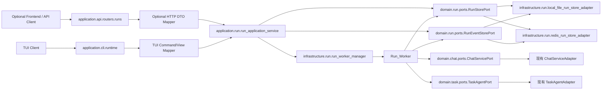
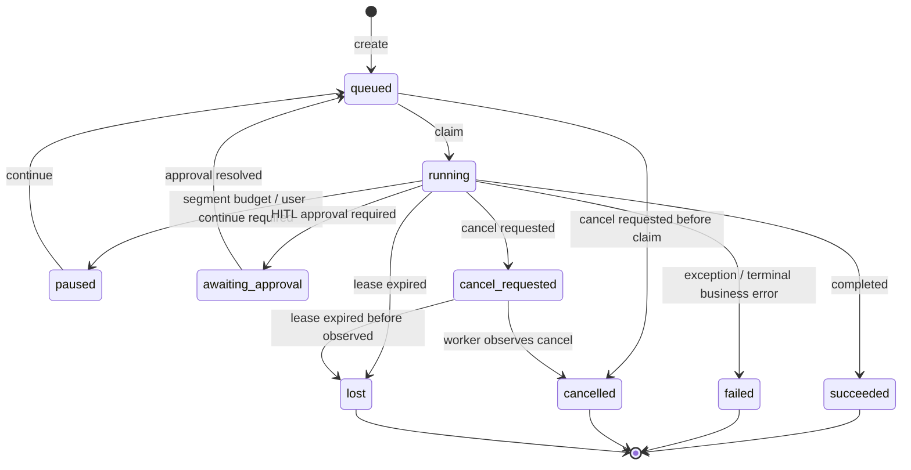

# 设计文档：长任务后台运行与续跑体验阶段三

## 概述

阶段三在阶段一、阶段二已具备的分段执行与继续执行能力之上，引入进程内后台运行时 `Phase_Three_Run_Runtime`。目标是让长任务提交后立即返回 `Run_ID`，由后台 worker 继续推进 `Chat_Run` 或 `Task_Run`，调用方通过应用服务查询和事件流观察状态，并在暂停、审批、取消、失败等状态下执行后续操作。

本阶段不是通用工作流引擎，也不提供 durable checkpoint recovery。运行状态、事件与队列元数据会持久化到本地文件或 Redis 兼容存储，但进程退出时正在执行的模型调用、工具调用和内存栈不会恢复；过期 lease 对应的运行会进入 `lost`，由用户基于同步 API 或继续接口重新发起处理。

### 设计决策

1. **采用轻量 in-process worker，而不是引入外部队列或 workflow runtime。** 当前项目已经有清晰的领域 Port、应用服务和基础设施适配器边界；阶段三只需要把已有同步执行入口搬到后台，并补齐状态、事件、容量与取消控制。引入 Celery、Temporal 或数据库调度器会显著扩大部署和运维面，不符合本阶段边界。

2. **Run 存储复用本地文件与 Redis 两类基础设施能力。** 本地文件默认与 `SessionContextStorePort` 的本地持久化体系一致，复用 `CrossPlatformPathPolicy`、`LockFactory`、`TempFileAtomicWriter`；Redis 实现使用 WATCH/MULTI 或 Lua 脚本完成 claim 与 lease 的原子更新。本阶段不新增 SQL DDL。

3. **过期 lease 统一标记为 `lost`，不自动重入队列。** 项目中的工具调用和模型调用不具备全链路幂等边界，自动重跑可能造成重复副作用。把过期运行转为 `lost` 更符合本阶段“不做 checkpoint recovery、不做 exactly-once”的约束。

4. **继续执行仍沿用阶段一、阶段二的会话语义。** `Run_Worker` 对暂停后的 `Chat_Run` 调用 `ChatServicePort.continue_chat`，对 `Task_Run` 调用 `TaskAgentPort.continue_task`，不重新追加原始用户消息，不扩大工具边界，不改变 `Can_Continue_Flag` 的判定。

5. **事件流是状态观察机制，不是可靠消息总线。** `Run_Event_Stream` 提供 cursor replay、长轮询/adapter 事件订阅和过期提示；当事件超过 `Event_Retention_Policy` 后，调用方 adapter 收到 `replay_expired` 并回退到快照轮询。

6. **同步入口保持兼容，FastAPI 不作为核心前提。** `/api/chat`、`/api/task/execute`、继续与审批端点保持原行为；`/api/runs/*` 只是可选 FastAPI 薄 adapter，不应阻碍核心 RunApplicationService、worker、store 和 TUI/agent 应用体验落地。

7. **所有入口都只能是 adapter。** `RunApplicationService`、`RunWorkerManager`、`RunStorePort`、`RunEventStorePort` 是共享应用能力；FastAPI router 在实现时仅负责 HTTP 请求/响应映射，TUI runtime 负责命令、面板和事件渲染映射，所有 adapter 均不得复制 run 状态机、claim、cancel、continue、approval resume 或 replay 规则。

## 架构

阶段三新增一个独立的 Run bounded context，位于 `epsilon-boot/src/domain/run`。该上下文只编排运行生命周期，不拥有 Chat、Task、Agent 的业务执行规则。



运行生命周期如下：



组件包布局：

```text
epsilon-boot/src/
  domain/run/
    __init__.py
    value_objects.py
    ports.py
    exceptions.py
    state_machine.py
  application/run/
    __init__.py
    run_application_service.py
    run_execution_coordinator.py
  infrastructure/run/
    __init__.py
    run_config.py
    local_file_run_store_adapter.py
    redis_run_store_adapter.py
    run_worker.py
    run_worker_manager.py
  application/api/routers/runs.py
  application/routers/runs.py
  application/cli/runtime.py        # 扩展 run 命令入口，复用同一 RunApplicationService
  application/cli/tui.py            # 扩展 Run View 面板与操作
```

若实现可选 FastAPI adapter，`application/routers/runs.py` 仅作为兼容导出或聚合入口，真实实现放在 `application/api/routers/runs.py`，与当前 `chat.py`、`task.py` 保持一致。TUI 不经过 FastAPI router，而是在 `application/cli/runtime.py` 注入 `RunApplicationService`，由 `application/cli/tui.py` 渲染状态、事件和操作。

## 组件与接口

### 领域值对象

```python
class RunStatus(StrEnum):
    QUEUED = "queued"
    RUNNING = "running"
    PAUSED = "paused"
    AWAITING_APPROVAL = "awaiting_approval"
    CANCEL_REQUESTED = "cancel_requested"
    CANCELLED = "cancelled"
    SUCCEEDED = "succeeded"
    FAILED = "failed"
    LOST = "lost"

class RunKind(StrEnum):
    CHAT = "chat"
    TASK = "task"

class RunEventType(StrEnum):
    RUN_CREATED = "run_created"
    RUN_QUEUED = "run_queued"
    RUN_CLAIMED = "run_claimed"
    RUN_HEARTBEAT = "run_heartbeat"
    SEGMENT_STARTED = "segment_started"
    SEGMENT_DONE = "segment_done"
    RUN_PAUSED = "run_paused"
    APPROVAL_REQUIRED = "approval_required"
    CANCEL_REQUESTED = "cancel_requested"
    RUN_CANCELLED = "run_cancelled"
    RUN_SUCCEEDED = "run_succeeded"
    RUN_FAILED = "run_failed"
    RUN_LOST = "run_lost"
    REPLAY_EXPIRED = "replay_expired"
```

```python
@dataclass(frozen=True)
class RunPayload:
    kind: RunKind
    session_id: str | None
    chat: dict[str, Any] | None = None
    task: dict[str, Any] | None = None
    model: str | None = None

@dataclass(frozen=True)
class RunCreateRequest:
    payload: RunPayload
    client_request_id: str | None
    payload_hash: str | None = None
    created_by: str | None = None

@dataclass(frozen=True)
class RunLease:
    owner_id: str
    lease_until: datetime
    heartbeat_at: datetime

@dataclass(frozen=True)
class RunSnapshot:
    run_id: str
    kind: RunKind
    status: RunStatus
    payload: RunPayload
    client_request_id: str | None
    payload_hash: str | None
    result: dict[str, Any] | None
    error: dict[str, Any] | None
    approval_id: str | None
    segment_metadata: dict[str, Any] | None
    latest_event_cursor: int | None
    can_continue: bool
    terminal_reason: str | None
    lease: RunLease | None
    created_at: datetime
    updated_at: datetime
    version: int

@dataclass(frozen=True)
class RunEvent:
    run_id: str
    cursor: int
    event_type: RunEventType
    payload: dict[str, Any]
    created_at: datetime

@dataclass(frozen=True)
class RunCapacityPolicy:
    max_queued_runs: int
    max_running_runs: int

@dataclass(frozen=True)
class EventRetentionPolicy:
    max_event_count: int
    ttl_seconds: int
```

### 状态机

`RunStateMachine` 负责集中约束状态迁移，禁止路由、worker 和存储适配器各自手写迁移规则。

```python
class RunStateMachine:
    def assert_transition(self, current: RunStatus, target: RunStatus) -> None: ...
    def is_terminal(self, status: RunStatus) -> bool: ...
    def can_cancel(self, status: RunStatus) -> bool: ...
    def can_continue(self, status: RunStatus) -> bool: ...
    def can_claim(self, status: RunStatus) -> bool: ...
```

关键规则：

- `queued -> running` 只能由 `claim_next` 完成。
- `paused -> queued` 只能由 RunApplicationService continue 完成。
- `awaiting_approval -> queued` 只能由 RunApplicationService 的审批恢复入口在审批决策完成后发生。
- `running -> lost` 只能由 lease sweep 或 claim 前检查完成。
- `succeeded`、`failed`、`cancelled`、`lost` 是终态，不允许 continue、cancel 或 claim。

### 存储 Port

```python
class RunStorePort(Protocol):
    async def create_run(self, request: RunCreateRequest) -> RunSnapshot: ...
    async def get_run(self, run_id: str) -> RunSnapshot | None: ...
    async def get_by_client_request_id(self, client_request_id: str) -> RunSnapshot | None: ...
    async def count_by_status(self, statuses: Collection[RunStatus]) -> int: ...
    async def claim_next(self, *, owner_id: str, lease_seconds: int) -> RunSnapshot | None: ...
    async def refresh_lease(self, *, run_id: str, owner_id: str, lease_seconds: int) -> RunSnapshot: ...
    async def request_cancel(self, run_id: str) -> RunSnapshot: ...
    async def mark_succeeded(self, *, run_id: str, owner_id: str, result: dict[str, Any]) -> RunSnapshot: ...
    async def mark_failed(self, *, run_id: str, owner_id: str, error: dict[str, Any]) -> RunSnapshot: ...
    async def mark_paused(self, *, run_id: str, owner_id: str, result: dict[str, Any]) -> RunSnapshot: ...
    async def mark_awaiting_approval(self, *, run_id: str, owner_id: str, approval_id: str, result: dict[str, Any]) -> RunSnapshot: ...
    async def mark_cancelled(self, *, run_id: str, owner_id: str, reason: str) -> RunSnapshot: ...
    async def resolve_approval_resume(self, *, run_id: str, result: ApprovalResumeStoreResult) -> RunSnapshot: ...
    async def enqueue_continue(self, *, run_id: str, model: str | None = None) -> RunSnapshot: ...
    async def mark_lost_expired_leases(self, *, now: datetime) -> list[RunSnapshot]: ...
```

```python
class RunEventStorePort(Protocol):
    async def append_event(self, run_id: str, event_type: RunEventType, payload: dict[str, Any]) -> RunEvent: ...
    async def list_events(self, run_id: str, after_cursor: int | None, limit: int) -> list[RunEvent]: ...
    async def wait_events(self, run_id: str, after_cursor: int | None, timeout_seconds: float) -> list[RunEvent]: ...
    async def trim_events(self, run_id: str, policy: EventRetentionPolicy) -> None: ...
    async def first_cursor(self, run_id: str) -> int | None: ...
```

### 应用服务

```python
(frozen=True)
class ApprovalResumeStoreResult:
    status: Literal["queued", "succeeded", "failed", "cancelled"]
    result: dict[str, Any] | None = None
    error: dict[str, Any] | None = None
    terminal_reason: str | None = None

class RunApplicationService:
    async def create_run(self, request: RunCreateRequest) -> RunSnapshot: ...
    async def get_run(self, run_id: str) -> RunSnapshot: ...
    async def request_cancel(self, run_id: str) -> RunSnapshot: ...
    async def continue_run(self, run_id: str, model: str | None = None) -> RunSnapshot: ...
    async def resume_approval_run(self, run_id: str, decisions: list[ApprovalDecision], model: str | None = None) -> RunSnapshot: ...
    async def list_events(self, run_id: str, after_cursor: int | None, limit: int) -> list[RunEvent]: ...
    async def stream_events(self, run_id: str, after_cursor: int | None) -> AsyncIterator[RunEvent]: ...
```

`create_run` 流程：

1. 校验 `RunCapacityPolicy`，若 queued 或 running 超限则抛出 `RunQueueFullError`。
2. 若 `client_request_id` 已存在且 payload hash 相同，直接返回既有 `RunSnapshot`；若 payload hash 不同，抛出 `RunIdempotencyConflictError` 并返回客户端可见 409。
3. 创建 `queued` 快照并写入 `run_created`、`run_queued` 事件。
4. 唤醒 `RunWorkerManager`，调用方 adapter 立即取得 `Run_ID` 和快照；FastAPI 映射为 HTTP 响应，TUI 映射为运行面板。

`continue_run` 流程：

1. 只允许 `paused` 状态继续；其他状态抛出 `RunContinuationUnavailableError`。
2. 调用 `RunStorePort.enqueue_continue` 把状态改为 `queued`，并把可选 model 写入 continuation 参数。
3. 追加 `run_queued` 事件并唤醒 worker。

审批恢复使用 `resume_approval_run` 完成：应用服务校验 run 处于 `awaiting_approval`，调用既有 `ChatServicePort.resume_approval` 消费审批决策，随后调用 `RunStorePort.resolve_approval_resume` 以状态/版本边界写入同一 `Run_ID` 的 `queued` 或终态。该路径不得调用 worker 专用的 `mark_succeeded`、`mark_failed`、`mark_cancelled`，也不得伪造 worker owner。所有 adapter 都只能做薄封装，不得在 adapter 内修改 run 状态。

### Worker

```python
class RunWorker:
    async def run_forever(self) -> None: ...
    async def run_once(self) -> bool: ...
    async def execute_claimed(self, snapshot: RunSnapshot) -> None: ...
    async def heartbeat_loop(self, run_id: str, owner_id: str) -> None: ...
```

```python
class RunWorkerManager:
    async def start(self) -> None: ...
    async def stop(self) -> None: ...
    def wake_up(self) -> None: ...
```

worker 通过 `claim_next(owner_id, lease_seconds)` 原子领取 `queued` run。领取成功后：

1. 写入 `run_claimed`、`segment_started`。
2. 启动 heartbeat 子任务，按 `RUN_HEARTBEAT_INTERVAL_SECONDS` 刷新 lease。
3. 按 `RunKind` 调用执行协调器。
4. 执行返回后根据 `status`、`can_continue`、`approval_id` 决定进入 `succeeded`、`paused` 或 `awaiting_approval`。
5. 任意业务异常进入 `failed`；取消请求在每段开始前和段完成后检查，进入 `cancelled`。

`RunExecutionCoordinator` 把 Run payload 转换为现有领域请求：

```python
class RunExecutionCoordinator:
    async def execute(self, snapshot: RunSnapshot, progress: RunProgressSink) -> RunExecutionOutcome: ...
```

```python
class RunProgressSink(Protocol):
    async def segment_started(self, run_id: str, segment_index: int) -> None: ...
    async def segment_done(self, run_id: str, metadata: SegmentRunMetadata) -> None: ...
```

Chat 优先复用 `stream_segmented_chat_events` / `stream_segmented_continue_chat_events` 捕获 `segment_done`；Task 若当前仅有同步返回，则阶段三实现需在任务分段循环中注入可选 observer，保证每段完成时至少写一次 `segment_done`。这不改变同步 API 响应，只增加内部可观察性。

### 可选 FastAPI adapter 契约

当实现 FastAPI adapter 且不会阻碍核心 Run runtime 质量时，新增 `application/api/routers/runs.py`：

```http
POST /api/runs
GET /api/runs/{run_id}
GET /api/runs/{run_id}/events?after_cursor=<int>&limit=<int>
GET /api/runs/{run_id}/events/stream?after_cursor=<int>
POST /api/runs/{run_id}/cancel
POST /api/runs/{run_id}/continue
```

请求与响应模型：

```python
class RunCreateRequestBody(BaseModel):
    kind: Literal["chat", "task"]
    client_request_id: str | None = None
    chat: ChatRunCreateBody | None = None
    task: TaskRunCreateBody | None = None

class ChatRunCreateBody(BaseModel):
    session_id: str
    message: str
    model: str | None = None

class TaskRunCreateBody(BaseModel):
    goal: str
    input_data: dict[str, Any] = {}
    constraints: list[str] = []
    output_format: str | None = None
    model: str | None = None
    session_id: str | None = None

class RunSnapshotBody(BaseModel):
    code: int = 0
    run_id: str
    kind: str
    status: str
    client_request_id: str | None
    result: dict[str, Any] | None
    error: dict[str, Any] | None
    approval_id: str | None
    segment_metadata: dict[str, Any] | None
    latest_event_cursor: int | None
    can_continue: bool
    terminal_reason: str | None
    created_at: str
    updated_at: str
    version: int

class RunEventBody(BaseModel):
    run_id: str
    cursor: int
    event_type: str
    payload: dict[str, Any]
    created_at: str

class RunEventsResponseBody(BaseModel):
    code: int = 0
    events: list[RunEventBody]
    replay_expired: bool = False
    polling_required: bool = False

class RunContinueRequestBody(BaseModel):
    model: str | None = None
```

FastAPI SSE 事件 data 使用 JSON，内容与 `RunEventBody` 一致。若 `after_cursor` 早于当前 `first_cursor`，服务端先发送：

```json
{"event_type":"replay_expired","payload":{"polling_required":true}}
```

随后结束 SSE 或返回当前可用事件，由可选 Web 前端调用 `GET /api/runs/{run_id}` 补快照。

### TUI adapter 契约

TUI 入口位于 `application/cli/runtime.py` 和 `application/cli/tui.py`，不得调用 FastAPI HTTP 端点。TUI 通过 DI 容器取得 `RunApplicationService`，把 slash command 或界面操作映射到同一组应用服务方法。

建议命令与行为：

```text
/run chat <message>          创建后台 Chat_Run，返回 run_id 并打开 Run View
/run task <goal>             创建后台 Task_Run，返回 run_id 并打开 Run View
/runs                        列出本 TUI 会话相关 run 快照
/run status <run_id>         查询 run 快照
/run watch <run_id>          基于 cursor 订阅事件并刷新面板
/run continue <run_id>       对 paused run 发起继续
/run cancel <run_id>         请求取消 queued/running/paused/awaiting_approval run
```

TUI runtime 新增方法：

```python
class TuiRuntime:
    async def create_chat_run(self, message: str, model: str | None = None) -> RunSnapshot: ...
    async def create_task_run(self, goal: str, model: str | None = None) -> RunSnapshot: ...
    async def get_run(self, run_id: str) -> RunSnapshot: ...
    async def watch_run_events(self, run_id: str, after_cursor: int | None) -> AsyncIterator[RunEvent]: ...
    async def continue_run(self, run_id: str, model: str | None = None) -> RunSnapshot: ...
    async def cancel_run(self, run_id: str) -> RunSnapshot: ...
```

TUI 事件展示规则：

- `queued`、`running`、`paused`、`awaiting_approval`、`cancel_requested`、`cancelled`、`succeeded`、`failed`、`lost` 必须有明确视觉状态。
- `segment_started`、`segment_done` 追加到运行日志区域，不直接修改领域状态。
- `replay_expired` 出现时，TUI 清空本地事件 cursor 并调用 `get_run` 补最新快照，同时提示事件历史已过期。
- TUI 的 Ctrl+C 或取消按钮只调用 `cancel_run`，不直接取消 worker task。
- TUI 的继续按钮只调用 `continue_run`，不直接调用 `ChatServicePort.continue_chat` 或 `TaskAgentPort.continue_task`。

Adapter 共同约束：

- 所有 adapter 只能做输入校验、DTO/视图模型转换和异常展示。
- 所有 adapter 的错误语义来自同一组 `domain.run.exceptions`。
- 所有 adapter 的事件 cursor、replay 过期、取消和继续行为必须通过同一应用服务测试覆盖。

## 数据模型

### 快照字段

`RunSnapshot` 是所有 adapter 查询的主模型，也是 worker 的执行输入。字段含义：

- `run_id`：服务端生成，推荐 `run_` 前缀加随机安全 ID。
- `kind`：`chat` 或 `task`。
- `status`：运行状态机当前状态。
- `payload`：创建运行时的 JSON-safe 输入。不得存储不可序列化对象。
- `client_request_id`：客户端幂等键，全局唯一索引。
- `payload_hash`：创建 payload 的稳定 JSON hash，用于识别相同幂等键下的不同请求体冲突。
- `segment_metadata`：阶段二分段元数据，用于展示 segment_count、budget usage、segment_stop_reason。
- `latest_event_cursor`：当前快照已知的最新事件游标，用于 adapter 重连和轮询降级。
- `result`：终态、暂停或审批等待时的最后一次执行结果快照。
- `error`：失败信息，包含 `code`、`message`、`type`、`retryable`。
- `approval_id`：等待 HITL 审批时的审批 ID。
- `can_continue`：沿用阶段二语义；只有暂停且可继续时为 true。
- `terminal_reason`：`completed`、`paused`、`approval_required`、`cancelled`、`failed`、`lost` 等。
- `lease`：运行中 worker 持有的租约；非 running 状态为空。
- `version`：乐观锁版本。

### 本地文件布局

```text
<LOCAL_PERSISTENCE_ROOT>/runs/
  snapshots/<bucket>/<run_id>.json
  events/<bucket>/<run_id>.jsonl
  indexes/client_request/<hash>.json
```

本地适配器要求：

- 写快照使用临时文件加原子替换。
- 单 run 修改使用 `LockFactory` 对同一 lock path 加锁。
- `client_request_id` 索引写入与快照创建在同一锁内完成；冲突时读取既有 run 并比较 `payload_hash`，相同则返回既有 run，不同则返回 409 冲突。
- 事件文件按 JSON Lines 追加，cursor 在同一 run 锁内递增。

### Redis key 布局

```text
run:{run_id}:snapshot                 JSON
run:{run_id}:events                   LIST of JSON
run:index:client_request:{hash}       run_id
run:queue                             LIST or ZSET of run_id
run:running                           SET of run_id
```

Redis 适配器要求：

- `create_run` 对 `client_request_id` 使用 SETNX 或 WATCH/MULTI 保证幂等，并比较既有快照 `payload_hash` 识别不同 payload 冲突。
- `claim_next` 以事务方式从 queue 取 run，校验状态为 queued，写入 running、owner、lease_until。
- `refresh_lease` 必须校验 owner_id，非 owner 不得刷新。
- `mark_*` 必须校验 owner_id 与版本或状态，避免过期 worker 覆盖新状态。
- 事件 list 通过 `LTRIM` 实现数量保留，通过 key TTL 实现时间保留。

## 事务与并发边界

1. **创建幂等边界**：`client_request_id` 是 create 的唯一幂等键。相同键且 payload hash 相同时返回第一次创建的 run；相同键但 payload hash 不同时必须返回 409 冲突，不能创建第二个 run。

2. **claim 原子边界**：`queued -> running`、owner、lease_until 和 queue 移除必须在一个存储事务或同一文件锁内完成。任何 worker 不得在未 claim 成功时执行模型或工具调用。

3. **lease 所有权边界**：`refresh_lease`、`mark_succeeded`、`mark_failed`、`mark_paused`、`mark_awaiting_approval`、`mark_cancelled` 必须校验 owner_id。过期 worker 的写入必须被拒绝并记录日志。审批恢复不得伪造 worker owner；`resolve_approval_resume` 只能在当前状态为 `awaiting_approval` 且版本匹配时写入 `queued`、`succeeded`、`failed` 或 `cancelled`。

4. **取消边界**：cancel 应用服务只改变 run 状态或标记，不中断已发出的模型/工具 await。所有 adapter 的取消操作都必须调用该应用服务；worker 在下一次边界检查时转换为 `cancelled`。

5. **继续边界**：continue 只能把 `paused` run 重新入队。worker 执行继续时调用现有 continue port，不能重新执行 create payload 中的用户消息。

6. **事件顺序边界**：同一 run 的事件 cursor 必须单调递增；跨 run 不保证全局顺序。

7. **容量边界**：`RunCapacityPolicy` 在 create 和 claim 两处执行。create 防止无限排队，claim 防止同时运行超过上限。

## 正确性属性

### 属性一：同一 Long_Task_Run 不会被两个 worker 同时执行

**定义**：任意时刻，同一个 `Run_ID` 最多只有一个有效 `Run_Lease.owner_id` 能推进执行并写入终态。

**理由**：长任务可能包含工具副作用；并发执行会造成重复调用和上下文破坏。

**机制**：`claim_next` 原子完成状态迁移和 lease 写入；所有终态写入校验 owner_id；过期 lease 被标记 `lost`，不自动重试。

**测试**：并发启动多个 worker 竞争同一 queued run，断言只有一个 claim 成功，事件中只有一个 `run_claimed`，其他 worker 不调用执行 port。

### 属性二：创建接口在幂等键下不会产生重复 Run

**定义**：相同 `Client_Request_ID` 的多次 `POST /api/runs` 返回同一个 `Run_ID`。

**理由**：网络重试和前端刷新是长任务入口的常见场景，重复创建会浪费模型调用并污染会话。

**机制**：存储层维护 `client_request_id -> run_id` 唯一索引，`create_run` 在索引锁或事务内完成。

**测试**：并发提交相同幂等键，断言只创建一个快照，一个 run_created 事件，全部响应 run_id 相同。

### 属性三：继续暂停运行不会重复追加原始用户消息

**定义**：`paused -> queued -> running` 的继续路径只调用 continue 端口，不重新构造初始 `ChatRequestVO.message` 或 `Task.goal`。

**理由**：阶段二已经定义继续执行的安全边界，重复追加用户消息会改变上下文语义。

**机制**：`RunExecutionCoordinator` 根据 run 当前状态选择 `continue_chat` / `continue_task`；create payload 只在首次执行时使用。

**测试**：构造 paused chat run，调用 continue 后检查 session store 中用户消息数量不增加，并断言调用的是 `continue_chat`。

### 属性四：事件 replay 过期可被客户端明确感知

**定义**：当客户端 cursor 小于事件存储当前最小 cursor 时，服务端必须返回或发送 `replay_expired`。

**理由**：静默丢事件会让前端误以为 run 卡住或错过审批、失败等关键状态。

**机制**：`list_events` 与 `stream_events` 比较 `after_cursor` 和 `first_cursor`；过期时设置 `polling_required=true`。

**测试**：配置 `max_event_count=2`，写入 3 条事件后用 `after_cursor=0` 查询，断言返回 replay_expired 并建议轮询快照。

## 错误处理

新增 `domain/run/exceptions.py`，全部继承 `BizException`，错误码使用 `610xx` 区间，避免与现有 chat/session `6004x` 冲突。

```python
class RunNotFoundError(BizException): code = 61001
class RunQueueFullError(BizException): code = 61002
class RunInvalidTransitionError(BizException): code = 61003
class RunContinuationUnavailableError(BizException): code = 61004
class RunCancelUnavailableError(BizException): code = 61005
class RunLeaseConflictError(BizException): code = 61006
class RunEventReplayExpiredError(BizException): code = 61007
class RunPayloadValidationError(BizException): code = 61008
class RunStoreUnavailableError(BizException): code = 61009
class RunIdempotencyConflictError(BizException): code = 61010
```

Adapter 错误映射原则：

可选 FastAPI HTTP 映射：

- `RunNotFoundError` -> 404。
- `RunPayloadValidationError` -> 400。
- `RunQueueFullError` -> 429，响应包含 `retry_after_seconds`。
- `RunInvalidTransitionError`、`RunContinuationUnavailableError`、`RunCancelUnavailableError`、`RunLeaseConflictError`、`RunIdempotencyConflictError` -> 409。
- `RunStoreUnavailableError` -> 503。
- worker 内部执行异常不直接冒泡给 FastAPI create 或 TUI create；写入 `failed` 快照和 `run_failed` 事件。

TUI 展示映射：

- `RunNotFoundError` -> 状态栏错误，并保留当前面板。
- `RunPayloadValidationError` -> 命令输入错误提示。
- `RunQueueFullError` -> 队列已满提示，展示建议重试时间。
- `RunInvalidTransitionError`、`RunContinuationUnavailableError`、`RunCancelUnavailableError`、`RunLeaseConflictError` -> 当前状态不可执行该操作。
- `RunStoreUnavailableError` -> 持久化不可用提示，并停止自动 watch。

错误传播场景：

1. **创建参数不合法**：adapter 校验 `kind` 与 `chat/task` body 或命令参数的匹配关系；FastAPI 若实现则返回 400，TUI 展示输入错误。
2. **队列满**：应用服务在 `create_run` 前检查容量，返回 429，不创建快照。
3. **取消终态运行**：状态机拒绝，返回 409。
4. **继续非 paused 运行**：返回 409，消息说明当前状态。
5. **store 写入失败**：应用服务返回 503；worker 捕获后记录日志并停止当前循环，避免无限快速重试。
6. **worker 执行业务异常**：写 `failed`，错误 payload 保留业务码和中文 message。
7. **lease 冲突**：过期 worker 写终态失败时记录 warning，不覆盖 store 中状态。

日志与观测：

- 每个 run 日志字段包含 `run_id`、`run_kind`、`run_status`、`worker_id`、`client_request_id`。
- 关键指标包括 queued/running 数、claim 成功数、lease 过期数、lost 数、cancel 请求数、run 执行耗时、事件 replay 过期次数。
- 不记录完整用户消息、工具参数中的敏感内容或模型响应全文。

## 测试策略

### 单元测试

- `RunStateMachine` 覆盖所有合法和非法状态迁移。
- `RunApplicationService.create_run` 覆盖幂等、容量超限、payload 校验、事件写入。
- `RunApplicationService.continue_run` 覆盖 paused 成功、非 paused 冲突、终态冲突。
- `RunApplicationService.request_cancel` 覆盖 queued、running、paused、awaiting_approval、terminal 状态。
- `RunExecutionCoordinator` 覆盖 chat 首次执行、chat 继续、task 首次执行、task 继续、审批等待、暂停、失败。

### 基础设施测试

- `LocalFileRunStoreAdapter` 覆盖原子创建、并发幂等、并发 claim、事件 cursor 单调、trim 后 replay 过期。
- `RedisRunStoreAdapter` 使用现有 Redis 测试约定，在可用 Redis 下覆盖 SETNX/WATCH claim、owner 校验和 TTL trim。
- store 适配器要共享一组契约测试，确保本地文件与 Redis 行为一致。

### Worker 测试

- 多 worker 同时 claim 同一个 queued run，只有一个执行。
- heartbeat 正常刷新 lease；停止 heartbeat 后 sweep 标记 lost。
- cancel 在 queued 状态直接 cancelled，在 running 状态由 worker 于段边界转 cancelled。
- 执行抛异常时进入 failed，并写 run_failed 事件。
- paused run continue 后调用 continue port，不重复 initial payload。

### 可选 FastAPI adapter 测试

- `POST /api/runs` 返回 0 code、run_id、queued/running 快照，且同步 API 不受影响。
- `GET /api/runs/{run_id}` 返回最新快照。
- `GET /api/runs/{run_id}/events` 支持 `after_cursor`、`limit`、`replay_expired`。
- `GET /api/runs/{run_id}/events/stream` 输出 SSE JSON，并在事件过期时发送 replay_expired。
- cancel、continue 的 409/404/429 映射与中文错误消息正确。

### 回归测试

- 现有 `/api/chat`、`/api/task/execute`、`/api/chat/sessions/{session_id}/continue`、`/api/task/sessions/{session_id}/continue` 行为保持不变。
- 阶段二分段预算、`Can_Continue_Flag`、HITL 审批状态的现有测试继续通过。
- `config.properties` 默认配置缺失时使用安全默认值；显式非法配置启动 fail-fast。

### TUI adapter 测试

- `/run chat`、`/run task` 通过 `TuiRuntime` 调用 `RunApplicationService.create_run`，不发 HTTP 请求。
- `/run watch` 使用 `stream_events` 或 `list_events` 的 cursor 语义刷新面板；replay 过期时回退 `get_run`。
- `/run continue` 只允许 paused run，非 paused 状态展示同源 `RunContinuationUnavailableError`。
- `/run cancel` 对 queued/running/paused/awaiting_approval 显示取消中或已取消，终态 run 显示同源冲突错误。
- TUI Ctrl+C 不直接取消 asyncio worker task，只映射为 `request_cancel`。

### 可选前端 Web View 测试

- Run View 能展示 queued/running/paused/awaiting_approval/cancelled/succeeded/failed/lost。
- 事件流断开后使用 cursor 重连；replay 过期后回退快照轮询。
- paused 状态显示继续操作，awaiting_approval 状态显示审批操作，terminal 状态禁用继续与取消。
- 长文本结果、错误信息、移动端宽度下不发生元素重叠。
