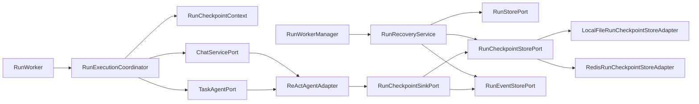
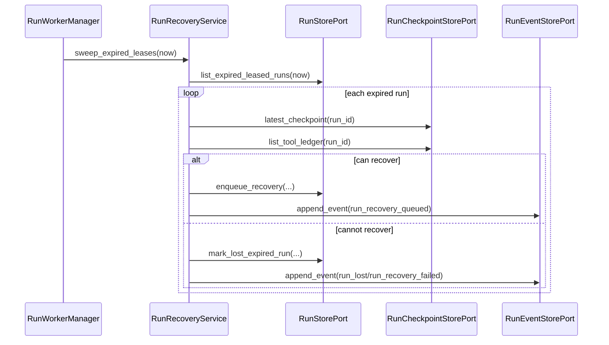
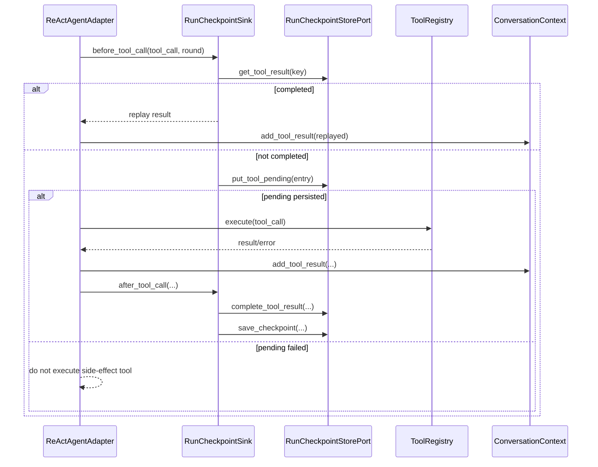

# 设计文档：长任务持久化检查点阶段四

## 概述

阶段四在阶段三 `Run_Runtime` 上增加轻量 `Durable_Checkpoint_Recovery`：后台 worker 在模型、工具、审批和执行段边界保存检查点，租约过期时优先从兼容检查点重新入队恢复，无法证明安全时保持 `lost` 或进入人工处理。设计遵循 `docs/steering/ddd-architecture.md` 的 DDD + 六边形边界：`domain/run` 定义值对象和 Port，`infrastructure/run` 实现 file/Redis Adapter，`application/run` 编排恢复，FastAPI/TUI/Web 只映射共享应用服务结果。

本阶段不引入外部 workflow runtime，不承诺外部副作用 exactly-once。核心安全规则是：副作用工具执行前必须持久化 pending 账本；已 completed 的工具结果恢复时复用；未知 pending 或不可证明幂等的副作用不自动重放。

### 设计决策

| 决策 | 选择 | 理由 |
| --- | --- | --- |
| 检查点运行时 | 在现有 `Run_Runtime` 内自研轻量 checkpoint/ledger | 与阶段三边界一致，不引入 Celery/Temporal/LangGraph/Dapr，也不迁移现有 Agent Loop。 |
| checkpoint 注入方式 | `domain.run.checkpoint_context` ContextVar + `RunCheckpointSinkPort` | 避免修改 Chat/Task HTTP/API DTO 和公开 Port 签名，且与现有 handoff ContextVar 风格一致。 |
| 持久化模式 | 同步落盘/落 Redis 后再继续下一步 | 满足“pending 写入失败不得执行副作用工具”的安全要求，优先可靠性而非最低延迟。 |
| 存储后端 | 新增 `RunCheckpointStorePort`，file/Redis 双实现 | 对齐阶段三 `RunStorePort`/`RunEventStorePort` 的后端选择与测试矩阵。 |
| 工具重放 | completed 复用；pending 按 `Tool_Replay_Policy` 判定；默认人工处理 | 避免未知副作用重复执行，符合 non-exactly-once 边界。 |
| 敏感数据 | 保存恢复所需最小 JSON-safe 状态，默认截断大字段并记录裁剪 metadata | 既支持恢复，又避免无边界落盘完整 trace、命令输出或大 payload。 |
| 过期 lease 处理 | `RunRecoveryService` 取代 manager 直接 mark lost 的决策 | 保留 `RunWorkerManager` 生命周期职责，把恢复判定集中在应用服务。 |
| 观察恢复 | 不触发执行恢复，只复用 `Run_Snapshot`、事件 replay 与 polling fallback | 明确客户端断线/刷新和 worker 恢复是两类问题。 |

## 架构



恢复扫描序列：



工具执行序列：



## 组件与接口

### 1. `domain/run/value_objects.py`

扩展 Run 领域值对象，保持纯 dataclass/StrEnum，不依赖 Redis、文件系统、FastAPI 或 Pydantic。

```python
class RunEventType(StrEnum):
    CHECKPOINT_SAVED = "checkpoint_saved"
    RUN_RECOVERY_QUEUED = "run_recovery_queued"
    RUN_RECOVERY_FAILED = "run_recovery_failed"
    TOOL_RESULT_REPLAYED = "tool_result_replayed"
```

`RunSnapshot` 追加带默认值字段，旧快照反序列化时填默认值：

```python
@dataclass(frozen=True)
class RunSnapshot:
    ...
    latest_checkpoint_id: str | None = None
    recoverable: bool = False
    recovery_attempt_count: int = 0
    last_recovery_error: dict[str, Any] | None = None
```

新增检查点值对象：

```python
class CheckpointPhase(StrEnum):
    RUN_CREATED = "run_created"
    MODEL_COMPLETED = "model_completed"
    TOOL_PENDING = "tool_pending"
    TOOL_COMPLETED = "tool_completed"
    APPROVAL_INTERRUPT = "approval_interrupt"
    SEGMENT_DONE = "segment_done"
    RECOVERY_QUEUED = "recovery_queued"

class ToolLedgerStatus(StrEnum):
    PENDING = "pending"
    COMPLETED = "completed"
    ERROR = "error"

class ToolReplayPolicy(StrEnum):
    REPLAY_RESULT = "replay_result"
    REQUIRE_IDEMPOTENCY_KEY = "require_idempotency_key"
    MANUAL_REVIEW = "manual_review"
    NEVER_REPLAY = "never_replay"

class ToolSideEffectLevel(StrEnum):
    NONE = "none"
    LOCAL_WRITE = "local_write"
    EXTERNAL_WRITE = "external_write"
    IRREVERSIBLE = "irreversible"

@dataclass(frozen=True)
class DurableCheckpoint:
    run_id: str
    checkpoint_id: str
    sequence: int
    phase: CheckpointPhase
    context_snapshot: dict[str, Any]
    round_num: int | None
    usage: dict[str, int]
    trace_summary: dict[str, Any]
    segment_metadata: dict[str, Any]
    tool_execution_key: str | None
    tool_result_ref: str | None
    schema_version: int
    sanitized: bool
    truncated_fields: tuple[str, ...]
    created_at: datetime

@dataclass(frozen=True)
class ToolExecutionKey:
    run_id: str
    segment_index: int
    round_num: int
    tool_call_id: str
    tool_name: str
    arguments_digest: str

    def stable_key(self) -> str: ...

@dataclass(frozen=True)
class ToolResultLedgerEntry:
    run_id: str
    tool_execution_key: str
    status: ToolLedgerStatus
    tool_name: str
    tool_call_id: str
    arguments_digest: str
    replay_policy: ToolReplayPolicy
    side_effect_level: ToolSideEffectLevel
    idempotency_key: str | None
    result: str | None
    is_error: bool
    metadata: dict[str, Any]
    created_at: datetime
    updated_at: datetime

@dataclass(frozen=True)
class CheckpointRetentionPolicy:
    max_checkpoint_count: int
    ttl_seconds: int
    max_payload_bytes: int
    max_tool_ledger_count: int

@dataclass(frozen=True)
class RecoveryDecision:
    recoverable: bool
    reason: str
    checkpoint_id: str | None = None
    error: dict[str, Any] | None = None
```

### 2. `domain/run/ports.py`

新增 checkpoint store 与 sink Port。

```python
class RunCheckpointStorePort(Protocol):
    async def save_checkpoint(self, checkpoint: DurableCheckpoint) -> DurableCheckpoint: ...
    async def latest_checkpoint(self, run_id: str) -> DurableCheckpoint | None: ...
    async def list_checkpoints(
        self, run_id: str, after_sequence: int | None, limit: int
    ) -> list[DurableCheckpoint]: ...
    async def put_tool_pending(
        self, entry: ToolResultLedgerEntry
    ) -> ToolResultLedgerEntry: ...
    async def complete_tool_result(
        self,
        *,
        run_id: str,
        tool_execution_key: str,
        result: str,
        is_error: bool,
        metadata: dict[str, Any],
    ) -> ToolResultLedgerEntry: ...
    async def get_tool_result(
        self, run_id: str, tool_execution_key: str
    ) -> ToolResultLedgerEntry | None: ...
    async def list_tool_ledger(self, run_id: str) -> list[ToolResultLedgerEntry]: ...
    async def trim_checkpoints(
        self, run_id: str, policy: CheckpointRetentionPolicy
    ) -> None: ...

class RunCheckpointSinkPort(Protocol):
    async def model_completed(
        self,
        *,
        context: ConversationContext,
        round_num: int,
        usage: dict[str, int],
        trace_summary: dict[str, Any],
        segment_metadata: dict[str, Any],
    ) -> DurableCheckpoint: ...
    async def before_tool_call(
        self,
        *,
        tool_call: ToolCallRequest,
        round_num: int,
        segment_index: int,
        replay_policy: ToolReplayPolicy,
        side_effect_level: ToolSideEffectLevel,
        idempotency_key: str | None,
    ) -> ToolResultLedgerEntry | None: ...
    async def after_tool_call(
        self,
        *,
        context: ConversationContext,
        tool_execution_key: str,
        result: str,
        is_error: bool,
        metadata: dict[str, Any],
        round_num: int,
        usage: dict[str, int],
    ) -> DurableCheckpoint: ...
    async def approval_interrupt(
        self,
        *,
        context: ConversationContext,
        round_num: int,
        usage: dict[str, int],
        approval_id: str,
    ) -> DurableCheckpoint: ...
    async def segment_done(
        self,
        *,
        context: ConversationContext,
        segment_metadata: dict[str, Any],
        usage: dict[str, int],
    ) -> DurableCheckpoint: ...
```

`RunStorePort` 新增恢复所需方法：

```python
class RunStorePort(Protocol):
    ...
    async def list_expired_leased_runs(self, *, now: datetime) -> list[RunSnapshot]: ...
    async def enqueue_recovery(
        self,
        *,
        run_id: str,
        latest_checkpoint_id: str,
        recovery_attempt_count: int,
    ) -> RunSnapshot: ...
    async def mark_lost_expired_run(
        self,
        *,
        run_id: str,
        reason: str,
        recovery_error: dict[str, Any] | None = None,
    ) -> RunSnapshot: ...
```

`mark_lost_expired_leases()` 保留兼容，但 `RunWorkerManager` 阶段四不再直接调用它。

### 3. `domain/run/checkpoint_context.py`

使用 ContextVar 传递当前后台 Run 检查点 sink。同步 Chat/Task 入口不设置该上下文，保持无检查点行为。

```python
@dataclass(frozen=True)
class RunCheckpointExecutionContext:
    run_id: str
    owner_id: str
    segment_index: int
    recovery_mode: bool
    sink: RunCheckpointSinkPort

def set_run_checkpoint_context(
    value: RunCheckpointExecutionContext,
) -> contextvars.Token[RunCheckpointExecutionContext | None]: ...

def reset_run_checkpoint_context(
    token: contextvars.Token[RunCheckpointExecutionContext | None],
) -> None: ...

def get_run_checkpoint_context() -> RunCheckpointExecutionContext | None: ...
```

### 4. `application/run/run_checkpoint_sink.py`

实现 `RunCheckpointSinkPort`。职责是构造稳定 `Tool_Execution_Key`、裁剪敏感数据、写 checkpoint/ledger、追加事件。

```python
class RunCheckpointSink(RunCheckpointSinkPort):
    def __init__(
        self,
        *,
        checkpoint_store: RunCheckpointStorePort,
        event_store: RunEventStorePort,
        retention_policy: CheckpointRetentionPolicy,
        now: Callable[[], datetime] | None = None,
    ) -> None: ...
```

关键行为：

- `before_tool_call()` 先查 completed ledger；命中时返回该 entry 供 Agent replay。
- 未命中时写 pending；pending 写入失败抛 `RunCheckpointWriteError`，Agent 不得执行工具。
- `after_tool_call()` 将 pending 转为 completed/error，并保存包含 `ToolMessage` 的上下文 checkpoint。
- sanitizer 对 `context_snapshot`、`trace_summary`、tool result 做大小裁剪，记录 `truncated_fields`。

### 5. `application/run/run_checkpoint_recovery_service.py`

负责租约过期恢复判定，不放在 worker manager 或具体 store adapter 中。

```python
class RunRecoveryService:
    def __init__(
        self,
        *,
        run_store: RunStorePort,
        checkpoint_store: RunCheckpointStorePort,
        event_store: RunEventStorePort,
        retention_policy: CheckpointRetentionPolicy,
        max_recovery_attempts: int,
        auto_recovery_enabled: bool,
    ) -> None: ...

    async def sweep_expired_leases(self, *, now: datetime) -> list[RunSnapshot]: ...
    async def evaluate_recovery(self, snapshot: RunSnapshot) -> RecoveryDecision: ...
```

恢复前置条件：

- latest checkpoint 存在且 `schema_version == 1`。
- `context_snapshot` 可通过 `ConversationContext.from_dict()` 反序列化。
- Task 工具边界 metadata 可重建；不可重建则不可自动恢复。
- 没有 pending 且 `Tool_Replay_Policy` 为 `MANUAL_REVIEW` / `NEVER_REPLAY` 的未决工具。
- `recovery_attempt_count < RUN_CHECKPOINT_MAX_RECOVERY_ATTEMPTS`。
- `CANCEL_REQUESTED` 优先转 cancelled，不进入业务恢复。

### 6. `application/run/run_execution_coordinator.py`

构造 sink 并设置 ContextVar。`execute()` 入口在调用 Chat/Task 前确定 `segment_index`，恢复模式下从 latest checkpoint 重建上下文所需元数据。

新增构造参数：

```python
class RunExecutionCoordinator:
    def __init__(
        self,
        *,
        chat_service: ChatServicePort,
        task_agent: TaskAgentPort,
        checkpoint_store: RunCheckpointStorePort | None = None,
        event_store: RunEventStorePort | None = None,
        retention_policy: CheckpointRetentionPolicy | None = None,
        checkpoint_enabled: bool = False,
    ) -> None: ...
```

`checkpoint_enabled=false` 或缺少 store 时保持阶段三行为。Run worker 执行时启用；同步 Chat/Task 入口不受影响。

### 7. `infrastructure/agent/react_agent_adapter.py`

在既有 `_iter_rounds()` 和 `_execute_tool_call()` 增加可选 checkpoint hook。

- `_iter_rounds()` 完成模型调用并构造 `response` 后，如存在 `RunCheckpointExecutionContext`，调用 `sink.model_completed(...)`。
- 记录 assistant tool_calls 后、审批保存前，调用 `sink.approval_interrupt(...)`。
- `_execute_tool_call()` 在 `_tool_registry.execute()` 前调用 `sink.before_tool_call(...)`。
- 如果 `before_tool_call()` 返回 completed entry，则直接 `context.add_tool_result(...)` 并追加 `tool_result_replayed` 事件，不调用工具。
- 如果 pending 写入失败，异常向上冒泡，worker 将 run 标为 failed 或 recovery failed；不得执行工具。
- 工具执行完成后调用 `sink.after_tool_call(...)`。

多工具并发沿用现有 `asyncio.gather`，每个工具独立 pending/completed。恢复时已 completed 的工具立即 replay，未 completed 的工具按策略处理。

### 8. `domain/agent/tools.py`

扩展 `Tool` 基类默认元数据，不破坏现有具体工具。

```python
class Tool(ABC):
    @property
    def side_effect_level(self) -> ToolSideEffectLevel:
        return ToolSideEffectLevel.EXTERNAL_WRITE

    @property
    def replay_policy(self) -> ToolReplayPolicy:
        return ToolReplayPolicy.MANUAL_REVIEW

    def idempotency_key(self, request: ToolCallRequest, execution_key: str) -> str | None:
        return None
```

后续可由具体工具覆盖：纯读工具可声明 `NONE + REPLAY_RESULT`；工作区写文件工具可声明 `LOCAL_WRITE + REPLAY_RESULT`，因为 completed 结果可复用但 pending 不自动重放；外部请求/发消息类工具默认保持人工处理。

### 9. `infrastructure/run/*checkpoint*_adapter.py`

新增两个 Adapter：

- `LocalFileRunCheckpointStoreAdapter`
- `RedisRunCheckpointStoreAdapter`

两者只实现 `RunCheckpointStorePort`，不混入业务恢复判定。组合根按 `SESSION_STORE_BACKEND` 与现有 Run store 一起选择。

### 10. `RunApplicationService` / routers / TUI / Web

`RunApplicationService.get_run()` 返回扩展后的 `RunSnapshot`。FastAPI/TUI/Web 只展示新字段和事件：

- `latest_checkpoint_id`
- `recoverable`
- `recovery_attempt_count`
- `last_recovery_error`
- `checkpoint_saved`
- `run_recovery_queued`
- `run_recovery_failed`
- `tool_result_replayed`

客户端断线或刷新只触发 `Observation_Reattach`：重新查询 snapshot 或从 cursor replay，不调用 recovery service。

## 数据模型

### 领域模型

核心领域模型见“组件与接口”。所有模型必须可由 `_json_safe` 稳定编码，并能从旧数据中填充默认值。

`ToolExecutionKey.stable_key()` 规范：

```text
sha256(
  run_id + "\n" +
  segment_index + "\n" +
  round_num + "\n" +
  tool_call_id + "\n" +
  tool_name + "\n" +
  normalized_json(arguments)
)
```

`normalized_json(arguments)` 使用 `json.loads()` 后 `json.dumps(sort_keys=True, separators=(",", ":"))`；JSON 解析失败时使用原始字符串 SHA-256 摘要，并在 metadata 标记 `arguments_json_valid=false`。

### 本地文件布局

在既有 `runs/` 下新增：

```text
runs/checkpoints/<bucket>/<run_id>.jsonl
runs/tool_ledgers/<bucket>/<run_id>.json
```

`checkpoints` 为 append-only JSONL；同一 `run_id` 持有现有 run lock 时写入。`tool_ledgers` 是 `{tool_execution_key: ToolResultLedgerEntry}` 的 JSON map，pending/completed 在同一 run lock 内原子写回。

### Redis key

```text
run:{run_id}:checkpoints              # list[DurableCheckpoint JSON]
run:{run_id}:checkpoint_seq           # int
run:{run_id}:tool_ledger              # hash tool_execution_key -> ToolResultLedgerEntry JSON
```

写 checkpoint 使用 WATCH/MULTI 读取并递增 sequence；工具 pending 使用 `HSETNX` 语义避免并发重复创建，completed 更新在事务内校验现有状态。

### RunSnapshot 扩展 JSON 示例

```json
{
  "run_id": "run_abc",
  "status": "queued",
  "latest_checkpoint_id": "chk_000012",
  "recoverable": true,
  "recovery_attempt_count": 1,
  "last_recovery_error": null
}
```

### 配置项

新增配置写入 `epsilon-boot/config.properties`，由 `RunRuntimeConfig` 读取：

```properties
RUN_CHECKPOINT_ENABLED=true
RUN_CHECKPOINT_AUTO_RECOVERY_ENABLED=true
RUN_CHECKPOINT_MAX_RECOVERY_ATTEMPTS=3
RUN_CHECKPOINT_MAX_COUNT=200
RUN_CHECKPOINT_TTL_SECONDS=604800
RUN_CHECKPOINT_MAX_PAYLOAD_BYTES=262144
RUN_CHECKPOINT_TOOL_LEDGER_MAX_COUNT=1000
```

`RunRuntimeConfig` 新增字段并提供：

```python
def to_checkpoint_retention_policy(self) -> CheckpointRetentionPolicy: ...
```

## 事务与并发边界

1. **checkpoint 写入**：同一 `run_id` 的 checkpoint sequence 必须在 store 内原子递增。file 后端使用 run lock；Redis 后端使用 WATCH/MULTI。
2. **工具 pending 先于副作用**：`before_tool_call()` 必须先完成 pending 持久化；失败时不调用 `_tool_registry.execute()`。
3. **completed 幂等复用**：同一 `Tool_Execution_Key` 已 completed 时，任何 worker/recovery 都只能 replay 结果，不得再次执行工具。
4. **pending 恢复**：pending 且 `Tool_Replay_Policy` 为 `MANUAL_REVIEW` 或 `NEVER_REPLAY` 时，不自动恢复；pending 且有外部 idempotency key 的工具可由设计后续阶段明确补跑策略，本阶段默认不补跑。
5. **lease 恢复竞争**：`enqueue_recovery()` 必须校验 run 仍是过期 `RUNNING` 或 `CANCEL_REQUESTED`，并原子清除旧 lease。若状态已变化，恢复扫描跳过。
6. **取消优先**：`CANCEL_REQUESTED` 的过期 run 不进入业务恢复；sweep 将其标记 cancelled/lost 并追加事件。
7. **观察恢复隔离**：前端刷新/SSE 断线只读 snapshot/events，不调用 `RunRecoveryService`。
8. **保留裁剪**：checkpoint 写入后 best-effort 调用 `trim_checkpoints()`；裁剪失败记录 warning，不回滚已完成执行结果。

## 正确性属性

### Property 1: Checkpoint 序号单调
*For any* 同一 `run_id` 下任意顺序保存的 `Durable_Checkpoint`，返回的 `sequence` 必须严格递增，`latest_checkpoint()` 必须返回最大 sequence 的检查点。
**验证需求：1, 2**

### Property 2: 副作用前必须持久化 pending
*For any* 带 checkpoint context 的工具调用，如果 `put_tool_pending()` 失败，则 `_tool_registry.execute()` 调用次数必须为 0。
**验证需求：3, 5, 9**

### Property 3: Completed 工具不重复执行
*For any* 已存在 completed `Tool_Result_Ledger` 的 `Tool_Execution_Key`，恢复或重复执行路径必须追加等价 `ToolMessage` 并跳过工具实现调用。
**验证需求：1, 4, 5, 6, 9**

### Property 4: 参数摘要稳定
*For any* 语义相同但 JSON key 顺序不同的工具参数，`Tool_Execution_Key.stable_key()` 必须一致；参数内容不同则 key 不同。
**验证需求：5, 9**

### Property 5: 不安全 pending 不自动恢复
*For any* 存在 pending 且 replay policy 为 `MANUAL_REVIEW` 或 `NEVER_REPLAY` 的过期 run，`RunRecoveryService` 不得调用 `enqueue_recovery()`。
**验证需求：4, 5, 9**

### Property 6: 观察恢复只读
*For any* 客户端断线、刷新、replay 过期或 polling fallback，adapter 只能调用查询/事件读取路径，不得触发 `sweep_expired_leases()` 或 `enqueue_recovery()`。
**验证需求：7, 9**

### Property 7: 关闭 checkpoint 后保持阶段三语义
*For any* `RUN_CHECKPOINT_ENABLED=false` 的运行，worker 不设置 checkpoint context，不写 checkpoint store；租约过期仍使用阶段三 lost 行为。
**验证需求：8**

### Property 8: 旧快照兼容
*For any* 阶段三遗留 `Run_Snapshot` JSON，反序列化必须得到默认 checkpoint 字段，且不会被自动判定为 `Recoverable_Run`。
**验证需求：4, 8**

## 错误处理

### 错误常量定义

延续 `domain/run/exceptions.py` 的 `BizException` 风格，新增错误码从 61011 开始：

```python
class RunCheckpointWriteError(BizException): code = 61011
class RunCheckpointSchemaError(BizException): code = 61012
class RunRecoveryUnavailableError(BizException): code = 61013
class RunToolReplayBlockedError(BizException): code = 61014
class RunCheckpointPayloadTooLargeError(BizException): code = 61015
class RunCheckpointStoreUnavailableError(BizException): code = 61016
```

错误消息不得包含完整用户 prompt、工具参数、工具结果或 trace；只包含 `run_id`、`checkpoint_id`、`tool_name`、`tool_execution_key` 摘要和原因。

### 错误场景与处理策略

| 场景 | 处理 |
| --- | --- |
| checkpoint store 不可用 | 当前 run 标记 failed 或 recovery failed；不伪装恢复成功。 |
| pending 写入失败 | 不执行 `Side_Effect_Tool`，抛 `RunCheckpointWriteError`。 |
| schema version 不兼容 | `RunRecoveryService` 返回不可恢复，run 进入 lost 或人工处理状态。 |
| context 反序列化失败 | 不自动恢复，记录 `run_recovery_failed`。 |
| payload 超过上限 | sanitizer 裁剪可裁剪字段；仍超限则抛 `RunCheckpointPayloadTooLargeError`。 |
| completed ledger 缺少 result | 视为损坏账本，不 replay，恢复失败。 |
| Redis WATCH 冲突 | 按 adapter 既有 `conflict_retry_max` 重试，耗尽后抛冲突错误。 |

### 错误传播策略

- Worker 正常执行段内 checkpoint 错误由 `RunWorker._execute()` 收敛为 failed outcome。
- Recovery sweep 内错误不会杀死 manager loop；记录 `run_recovery_failed` 事件和 `last_recovery_error`。
- FastAPI 映射新增 run checkpoint/recovery BizException 到 409 或 503：不可恢复/重放阻塞为 409，存储不可用为 503。
- TUI/Web 展示 `last_recovery_error` 摘要，不展示完整敏感 payload。

### 错误处理原则

- 安全优先：不能确认是否已执行副作用时，不自动重放。
- 可观测：所有恢复入队、失败和 replay 都写 Run event。
- 最小泄露：错误体和日志只写摘要。
- 兼容：关闭 checkpoint 或读取旧数据时保持阶段三行为。

## 测试策略

### 属性测试（Property-Based Testing）

使用当前仓库已有 pytest + hypothesis 风格（如适用）覆盖：

| Property | 测试目标 |
| --- | --- |
| Property 1 | 随机 checkpoint 写入顺序下 sequence 单调与 latest 正确。 |
| Property 4 | 随机 JSON dict key 顺序变化下 `Tool_Execution_Key` 稳定。 |
| Property 8 | 旧 snapshot 字典缺失新增字段时反序列化默认值正确。 |

若现有测试模块未启用 hypothesis，则用参数化 pytest 覆盖同等用例，不新增依赖。

### 单元测试（Example-Based）

| 模块 | 覆盖 |
| --- | --- |
| `domain/run/value_objects.py` | 新 enum、dataclass、JSON-safe、stable key、默认字段。 |
| `domain/run/ports.py` | Protocol 方法签名 introspection，与阶段三 port 测试风格一致。 |
| `RunCheckpointSink` | model/tool/approval/segment checkpoint；pending 失败不执行工具；completed replay。 |
| `RunRecoveryService` | 可恢复、不可恢复、pending 阻塞、cancel 优先、超过恢复次数。 |
| `Tool` 基类 | 默认 `side_effect_level` / `replay_policy` 不破坏现有子类。 |
| `RunRuntimeConfig` | 新配置校验、`to_checkpoint_retention_policy()`。 |

### 集成测试

| 场景 | 覆盖需求 |
| --- | --- |
| file checkpoint store | append/latest/list、ledger pending/completed、trim、旧数据兼容。 |
| Redis checkpoint store | WATCH/MULTI 并发、HSETNX pending、completed replay、trim。 |
| worker lease 过期恢复 | running run 有 compatible checkpoint 时重新入队并继续。 |
| worker lease 过期 lost | 无 checkpoint 或 schema 不兼容时保持 lost。 |
| Agent 工具后崩溃模拟 | 已 completed 工具不重复执行。 |
| pending 副作用工具崩溃模拟 | 不自动恢复，进入人工处理/恢复失败。 |
| HITL 恢复 | approve/edit/reject 前后 checkpoint 与 ledger 防重放。 |
| Observation reattach | SSE replay 过期、刷新后 polling fallback 不触发执行恢复。 |
| 回归 | Chat SSE final payload、Task paused `can_continue`/工具边界 metadata。 |

最终验证命令：

```bash
cd epsilon-boot
env PYTHONPATH=src uv run --frozen pytest
cd ../epsilon-client
npm run lint
npm run build
```

