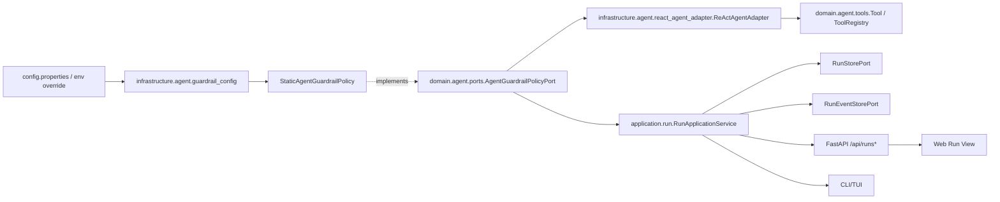

# 设计文档：长任务智能调度与护栏阶段五

## 概述

阶段五按收敛版 v1 交付：在既有 DDD + 六边形架构、后台 Run runtime、分段执行与 checkpoint recovery 基础上，新增确定性任务分类、guardrail 领域值对象、静态策略、工具风险分级、配置读取、Run/API/TUI/Web 字段透传，以及 ReAct 工具真实执行前的 critical 工具阻断。默认 `observe` 不改变 Chat、Task、Run、continue、HITL approval recovery 与 checkpoint recovery 既有行为；只有显式 `enforce` 且命中 critical 工具时，本期才要求在工具真实执行前阻断。

本设计遵循 `docs/steering/ddd-architecture.md` 的依赖方向：领域模型与 Port 位于 `domain/`，静态策略和配置读取位于 `infrastructure/`，Run 编排与 HTTP/TUI adapter 位于 `application/`，Web 仅做 DTO 字段展示。配置遵循 `docs/steering/config-source.md`，默认来源为 `epsilon-boot/config.properties`，环境变量仅用于覆盖。

### 设计决策

| 决策 | 选择 | 理由 |
| --- | --- | --- |
| 阶段五范围 | 收敛版 v1 | 严格匹配已修订 requirement.md，避免把后续完整 guardrail 闭环提前写入设计。 |
| 默认运行模式 | `observe` | 升级后不改变既有同步 Chat/Task、后台 Run、continue、审批恢复和 checkpoint recovery 行为。 |
| 运行时硬阻断点 | 仅 ReAct 工具真实执行前的 critical 工具 | 这是 v1 唯一强制运行时接入；模型调用后、工具执行后、预算累计停止不作为本期运行时验收边界。 |
| 策略实现 | `StaticAgentGuardrailPolicy` 确定性规则 | 不调用 LLM 或外部服务，便于测试、解释和后续扩展。 |
| Guardrail 事件 | `GUARDRAIL_EVALUATED` / `GUARDRAIL_BLOCKED` 仅作为枚举预留 | requirement.md 明确不要求完整事件写入闭环。 |
| Guardrail 摘要 | `RunSnapshot.guardrail_summary` 可为空 | v1 只要求字段可透传，不要求模型后或工具后动态累计更新。 |
| High 风险工具 | 默认不阻断，`require_approval` 不接入 HITL | v1 不扩大审批恢复语义；HITL 仍由既有 approval policy 驱动。 |
| Checkpoint recovery | 不额外保存或恢复 guardrail 累计状态 | 阶段四恢复语义保持不变，guardrail v1 不引入新的 durable 状态。 |

## 架构



关键流转：

1. 组合根 `application/container_config.py` 注册 `AgentGuardrailPolicyPort -> StaticAgentGuardrailPolicy`，并把同一策略注入 `RunApplicationService` 与 `ReActAgentAdapter`。
2. Run 创建时，`RunApplicationService._with_task_classification()` 调用 `classify_payload()` 写入 `RunCreateRequest.task_classification`；创建成功后允许写入 `TASK_CLASSIFIED` 事件。
3. ReAct 执行单个工具前，`ReActAgentAdapter._evaluate_tool_guardrail()` 读取工具 `risk_level`，调用 `evaluate_tool_before_execution()`。只有返回 `require_approval` 或 `stop` 时才跳过真实工具执行，并把错误工具消息回灌上下文。
4. API、TUI、Web 只展示 `RunSnapshot.task_classification` 与 `RunSnapshot.guardrail_summary`，不得复制策略判断逻辑。

## 组件与接口

1. `epsilon-boot/src/domain/agent/guardrails.py`

   责任：定义纯领域值对象，不依赖基础设施或 Web 框架。

   关键接口：

   ```python
   class TaskExecutionClass(StrEnum):
       SHORT_QA = "short_qa"
       TOOL_TASK = "tool_task"
       LONG_TASK = "long_task"
       BATCH_TASK = "batch_task"

   class GuardrailMode(StrEnum):
       OBSERVE = "observe"
       ENFORCE = "enforce"

   class GuardrailAction(StrEnum):
       ALLOW = "allow"
       OBSERVE = "observe"
       REQUIRE_APPROVAL = "require_approval"
       STOP = "stop"

   class ToolRiskLevel(StrEnum):
       LOW = "low"
       MEDIUM = "medium"
       HIGH = "high"
       CRITICAL = "critical"

   @dataclass(frozen=True)
   class GuardrailPolicy:
       enabled: bool = True
       mode: GuardrailMode = GuardrailMode.OBSERVE
       enforce_critical_tools: bool = True
       enforce_high_risk_tools: bool = False
       max_total_tokens: int | None = None
       max_duration_seconds: float | None = None
       max_context_growth_messages: int | None = None
       max_repeated_tool_calls: int = 2
       max_consecutive_failures: int = 3
       model_pricing: dict[str, float] = field(default_factory=dict)

   @dataclass(frozen=True)
   class GuardrailDecision:
       action: GuardrailAction
       reason: GuardrailReason | None = None
       message: str = ""
       mode: GuardrailMode = GuardrailMode.OBSERVE
       estimated_cost: float | None = None
       metadata: dict[str, Any] = field(default_factory=dict)

       @property
       def public_terminal_reason(self) -> str | None: ...
       def to_summary(self) -> GuardrailSummary: ...

   @dataclass(frozen=True)
   class GuardrailEvaluationContext:
       task_classification: TaskExecutionClass | None = None
       tool_name: str | None = None
       tool_risk_level: ToolRiskLevel | None = None
       total_tokens: int = 0
       elapsed_ms: float = 0.0
       context_growth_messages: int = 0
       repeated_tool_call_count: int = 0
       consecutive_failure_count: int = 0
       metadata: dict[str, Any] = field(default_factory=dict)
   ```

2. `epsilon-boot/src/domain/agent/ports.py`

   责任：声明策略 Port。端口保留后续完整评估能力，但 v1 运行时只要求 `classify_payload()` 与工具执行前评估被接入。

   ```python
   class AgentGuardrailPolicyPort(Protocol):
       def classify_payload(self, payload: Any, *, has_tools: bool) -> TaskExecutionClass: ...
       def evaluate_run_start(self, context: GuardrailEvaluationContext) -> GuardrailDecision: ...
       def evaluate_model_completed(self, context: GuardrailEvaluationContext) -> GuardrailDecision: ...
       def evaluate_tool_before_execution(self, context: GuardrailEvaluationContext) -> GuardrailDecision: ...
       def evaluate_tool_after_execution(self, context: GuardrailEvaluationContext) -> GuardrailDecision: ...
   ```

3. `epsilon-boot/src/infrastructure/agent/static_guardrail_policy.py`

   责任：实现确定性分类和静态 guardrail 决策。该策略可对预算、重复工具、连续失败返回 `observe` 或 `stop`，但这些阈值在 v1 不要求接入模型后/工具后运行时累计闭环。

   关键行为：

   - `classify_payload(payload: RunPayload, *, has_tools: bool) -> TaskExecutionClass`：根据 Run kind、工具可用性和批量字段静态分类。
   - `classify_run(snapshot: RunSnapshot) -> TaskExecutionClass`：存在 checkpoint、可继续或多段元数据时归类为 `long_task`。
   - `evaluate_tool_before_execution(context)`：`observe` 模式返回观察决策但不阻断；`enforce` 且 `critical` 时返回 `stop`；`high` 只有显式 `enforce_high_risk_tools=true` 时返回 `require_approval`，但 v1 不接入 HITL。

4. `epsilon-boot/src/infrastructure/agent/guardrail_config.py`

   责任：读取 `AGENT_GUARDRAILS_*` 配置并转换为领域 `GuardrailPolicy`。非法模式、负数阈值、非正重复/失败阈值和非法 `model_pricing` 应 fail-fast。

   配置项：

   ```properties
   AGENT_GUARDRAILS_ENABLED=true
   AGENT_GUARDRAILS_MODE=observe
   AGENT_GUARDRAILS_ENFORCE_CRITICAL_TOOLS=true
   AGENT_GUARDRAILS_ENFORCE_HIGH_RISK_TOOLS=false
   AGENT_GUARDRAILS_MAX_TOTAL_TOKENS=0
   AGENT_GUARDRAILS_MAX_DURATION_SECONDS=0
   AGENT_GUARDRAILS_MAX_CONTEXT_GROWTH_MESSAGES=0
   AGENT_GUARDRAILS_MAX_REPEATED_TOOL_CALLS=2
   AGENT_GUARDRAILS_MAX_CONSECUTIVE_FAILURES=3
   AGENT_GUARDRAILS_MODEL_PRICING=
   ```

5. `epsilon-boot/src/domain/agent/tools.py` 与内置工具

   责任：`Tool` 基类暴露 `risk_level`，未知或未覆盖工具默认 `high`；具体内置工具按静态风险覆盖。

   风险映射：

   - 读类工具：`read_file`、`list_dir`、`web_fetch`、`web_search` 为 `low`。
   - 委派类工具：`delegate_to_agent` 为 `medium`。
   - 文件写入与 HTTP 请求：`write_file`、`edit_file`、`http_request` 为 `high`。
   - Shell/Python 执行：`shell_exec`、`python_exec` 为 `critical`。

6. `epsilon-boot/src/infrastructure/agent/react_agent_adapter.py`

   责任：在 `_execute_tool_call()` 内、checkpoint ledger 和真实工具执行前调用 `_evaluate_tool_guardrail()`。当决策为 `require_approval` 或 `stop` 时，不执行 `ToolRegistry.execute()`，而是追加带错误元数据的 `ToolMessage`：

   ```python
   msg.metadata["error"] = True
   msg.metadata["guardrail_blocked"] = True
   msg.metadata["guardrail_reason"] = decision.reason.value
   ```

   v1 不要求该阻断写入 Run 事件，也不要求把 `require_approval` 转换为既有 `ApprovalInterrupt`。

7. `epsilon-boot/src/domain/run/value_objects.py`

   责任：扩展 Run 对外值对象：

   ```python
   class RunEventType(StrEnum):
       TASK_CLASSIFIED = "task_classified"
       GUARDRAIL_EVALUATED = "guardrail_evaluated"
       GUARDRAIL_BLOCKED = "guardrail_blocked"

   @dataclass(frozen=True)
   class RunCreateRequest:
       task_classification: str | None = None
       guardrail_summary: dict[str, Any] | None = None

   @dataclass(frozen=True)
   class RunSnapshot:
       task_classification: str | None = None
       guardrail_summary: dict[str, Any] | None = None
   ```

   `GUARDRAIL_EVALUATED` 和 `GUARDRAIL_BLOCKED` 是事件枚举预留，不代表 v1 必须写入完整事件闭环。

8. `epsilon-boot/src/application/run/run_application_service.py`

   责任：Run 创建时分类并透传字段。`create_run()` 在容量校验后调用 `_with_task_classification()`，创建快照后在分类存在时写入 `TASK_CLASSIFIED` 事件。应用服务不做 guardrail 阈值运行时累计，不维护 `guardrail_summary` 动态状态。

9. Adapter 与 Web 展示

   - `application/api/routers/runs.py`：`RunSnapshotBody` 和 `_snapshot_body()` 透传 `task_classification`、`guardrail_summary`。
   - `application/cli/commands.py`、`application/cli/tui.py`：Run 快照渲染时展示字段，字段为空则不强行展示摘要。
   - `epsilon-client/src/lib/chat-api.ts`：`RunSnapshot` 类型包含两个字段，`TerminationReason` 包含 `guardrail_blocked`。
   - `epsilon-client/src/components/run/run-view.tsx`：Run View 展示 `Task_Class` 与 `Guardrail`，不推导策略动作。

## 数据模型

### 领域模型

`GuardrailDecision` 是一次策略评估结果，包含动作、原因、消息、模式、估算成本和元数据。`GuardrailSummary` 是其 JSON-safe 展示形态，可由 `GuardrailDecision.to_summary()` 生成，但 v1 不要求 Run runtime 动态生成或累计写入快照。

`GuardrailPolicy` 的阈值中，`0` 配置经 `AgentGuardrailConfig.to_policy()` 转换为 `None`，表示该阈值未启用。`model_pricing` 只作为金额预算 v1 的模型单价入口，不参与硬停止验收。

### 持久化模型

Run store 已保存 `RunCreateRequest.task_classification` 与 `guardrail_summary` 并可恢复到 `RunSnapshot`。本期不新增数据库表、索引、DDL 或迁移脚本；file store / Redis store 只需保持字段 JSON 序列化兼容。

### 对外格式示例

Run 快照字段：

```json
{
  "task_classification": "tool_task",
  "guardrail_summary": null
}
```

Critical 工具被阻断后回灌给模型的工具消息元数据：

```json
{
  "error": true,
  "guardrail_blocked": true,
  "guardrail_reason": "tool_risk_gate_required"
}
```

## 事务与并发边界

本期不新增跨资源事务。Run 创建仍沿用 `RunApplicationService.create_run()` 的既有顺序：幂等检查、容量校验、分类填充、创建快照、追加事件、唤醒 worker。若分类失败，服务记录 warning 并继续创建 Run，避免分类能力影响既有创建语义。

工具阻断必须发生在真实工具执行前，并且早于 checkpoint `before_tool_call()`、`ToolRegistry.execute()` 和工具级 timeout 包裹。被阻断时只向当前 `ConversationContext` 追加错误 `ToolMessage`，不写工具 ledger，不产生外部副作用，不尝试取消或回滚已发生的其他工具调用。

Checkpoint recovery 保持阶段四边界：恢复工具结果账本、上下文和执行段信息；不额外保存、恢复或累计 guardrail 状态。HITL approval recovery 保持既有 `ApprovalPolicyPort` 与 `ApprovalStateStorePort` 语义；guardrail `require_approval` 不转换为 `ApprovalInterrupt`。

## 正确性属性

### Property 1: 任务分类确定且无外部依赖
*For any* Run payload、工具可用性标记、可继续状态、checkpoint/segment 元数据和批量输入字段，分类结果只能由确定性规则产生，且不得调用 LLM 或外部服务。
**验证需求：1.1, 1.2, 1.3, 1.4, 1.5**

### Property 2: Guardrail 领域决策稳定可序列化
*For any* Guardrail 决策动作、原因、模式、估算成本和元数据，`GuardrailDecision` 都能表达该决策；当动作为 `require_approval` 或 `stop` 时，对外主终止原因稳定为 `guardrail_blocked`；摘要转换结果必须 JSON-safe。
**验证需求：2.1, 2.2, 2.3, 2.4, 2.5, 2.6**

### Property 3: 默认 observe 不改变既有运行语义
*For any* Chat、Task、Run、continue、HITL approval recovery 或 checkpoint recovery 流程，在默认 `observe` 模式下，critical 工具不会因阶段五 v1 被阻断，Run 状态流转不因 guardrail 改写，且缺少运行时摘要来源时 `guardrail_summary` 可以为空。
**验证需求：3.1, 3.2, 3.3, 3.4**

### Property 4: Enforce 模式只在 critical 工具真实执行前硬阻断
*For any* 即将执行的工具调用，当配置为 `enforce` 且工具风险为 `critical` 时，ReAct 必须在真实工具执行前回灌错误工具消息并跳过执行；当工具风险为 `high` 且 high-risk enforce 未开启时，v1 默认不得阻断。
**验证需求：4.1, 4.2, 4.3, 4.4, 4.5, 4.6, 4.7, 4.8, 4.9, 4.10**

### Property 5: 预算与进展模型入口不承诺运行时累计闭环
*For any* token、耗时、上下文增长、重复工具调用或连续失败输入上下文，静态策略可以返回 `observe` 或 `stop`；但 v1 不要求在模型调用完成后或工具执行后接入运行时评估，也不要求金额估算成为硬停止条件。
**验证需求：5.1, 5.2, 5.3, 5.4, 5.5, 5.6, 5.7**

### Property 6: Run/API/TUI/Web 只透传字段和事件枚举
*For any* RunSnapshot，`task_classification` 与 `guardrail_summary` 字段必须能被 Run store、FastAPI、TUI 和 Web 透传；`GUARDRAIL_EVALUATED` 与 `GUARDRAIL_BLOCKED` 只作为 v1 预留枚举，不要求运行时事件写入闭环，adapter 不复制策略判断。
**验证需求：6.1, 6.2, 6.3, 6.4, 6.5, 6.6, 6.7, 6.8, 6.9**

### Property 7: 回归验证覆盖 v1 边界
*For any* 阶段五改动，测试必须覆盖领域模型、策略、配置、工具风险等级、observe/enforce 工具前置行为和字段透传，并通过后端全量 pytest 与前端 lint/build。
**验证需求：7.1, 7.2, 7.3, 7.4, 7.5, 7.6, 7.7, 7.8, 7.9, 7.10**

## 错误处理

### 错误常量定义

本期不新增独立业务异常类型。对外稳定终止原因仅新增并复用字符串：

```text
guardrail_blocked
```

配置错误使用既有 `common.configuration.ConfigurationError` fail-fast。工具阻断不抛出 HTTP 业务异常，而是作为 ReAct 工具错误消息回灌。

### 错误场景与处理策略

| 场景 | 处理 |
| --- | --- |
| `AGENT_GUARDRAILS_MODE` 非 `observe/enforce` | 配置加载 fail-fast，抛 `ConfigurationError`。 |
| 阈值为非法负数或重复/失败阈值非正数 | 配置加载 fail-fast。 |
| `AGENT_GUARDRAILS_MODEL_PRICING` 非 JSON object 或价格非法 | 配置加载 fail-fast。 |
| Run 创建分类异常 | 记录 warning，继续创建 Run，不写分类字段。 |
| 工具未注册或未覆盖 `risk_level` | 按 `high` 风险处理。 |
| `observe` 命中 critical 工具 | 返回观察决策，不阻断真实执行。 |
| `enforce` 命中 critical 工具 | 在真实执行前追加错误 `ToolMessage`，metadata 写入 `guardrail_blocked=true` 和原因。 |
| high 工具默认策略 | high-risk enforce 未开启时不阻断；即使策略返回 `require_approval`，v1 也不接入 HITL。 |

### 错误传播策略

配置错误在应用启动或配置创建时暴露，阻止错误配置静默生效。Run 分类失败不向用户传播为创建失败，以维持默认 observe 的兼容性。工具前置阻断作为工具结果进入上下文，由既有 Agent Loop 继续处理；本期不强制把阻断同步写入 Run 事件或 Run 终态。

### 错误处理原则

1. 默认 observe 优先兼容，不把观察命中升级为执行失败。
2. enforce 只对 critical 工具执行硬阻断，不扩大到 high 工具审批链路。
3. Adapter 只展示字段，不根据前端或 CLI 逻辑二次判断风险。
4. 不在 checkpoint recovery 中恢复 guardrail 累计状态，避免与阶段四恢复语义耦合。

## 测试策略

### 属性测试（Property-Based Testing）

本仓库现有阶段五需求未要求引入 property-based testing 依赖，且 `docs/steering/uv-package-manager.md` 禁止随意绕过 `uv` 添加依赖。因此本期不新增 Hypothesis 等属性测试库；上述正确性属性通过聚焦单元测试和集成测试覆盖。

### 单元测试（Example-Based）

| 覆盖点 | 建议测试 |
| --- | --- |
| 任务分类 | `StaticAgentGuardrailPolicy.classify_payload()` 对 chat/task、has_tools、批量字段、checkpoint/segment 条件的分类。 |
| 决策模型 | `GuardrailDecision.public_terminal_reason`、`to_summary()`、`GuardrailSummary.to_dict()`。 |
| 配置 | 默认 observe、非法 mode、非法阈值、`model_pricing` JSON 校验、`0 -> None` 转换。 |
| 风险等级 | `Tool.risk_level` 默认 high，内置读类/委派/写入/HTTP/shell/python 工具风险覆盖。 |
| 静态策略 | observe 命中阈值返回 observe，enforce 命中阈值返回 stop，critical/high 工具策略分支。 |
| ReAct 工具前置 | observe critical 不阻断；enforce critical 在 `ToolRegistry.execute()` 前阻断；high 默认不阻断。 |

### 集成测试

| 覆盖点 | 建议测试 |
| --- | --- |
| Run 创建 | 注入 guardrail policy 后创建 Run，快照包含 `task_classification`，事件允许 `TASK_CLASSIFIED`。 |
| FastAPI adapter | `/api/runs*` 响应透传 `task_classification` 与 `guardrail_summary`。 |
| TUI/CLI | `_format_run_snapshot()`、`render_run_snapshot()` 展示新增字段。 |
| Web | `RunSnapshot` 类型和 `RunView` 展示新增字段，不复制策略判断。 |
| 回归命令 | 后端全量 `env PYTHONPATH=src uv run --frozen pytest`；前端 `npm run lint` 与 `npm run build`。 |

## 非目标与后续扩展边界

- 不实现完整运行时 guardrail 事件闭环；`GUARDRAIL_EVALUATED` 与 `GUARDRAIL_BLOCKED` 在 v1 仅为事件枚举预留。
- 不要求 `guardrail_summary` 在模型调用后、工具执行后或分段结束后动态累计更新；字段可为空。
- 不把 `require_approval` 接入既有 HITL approval recovery，不新增独立审批系统。
- 不要求 checkpoint recovery 保存、恢复或累计 guardrail 状态。
- 不把金额估算作为硬停止条件；`model_pricing` 只是后续成本展示和预算策略入口。
- 不引入外部 workflow runtime，不调用 LLM 做任务分类，不扩大阶段二分段执行或阶段四 checkpoint recovery 的既有语义。
