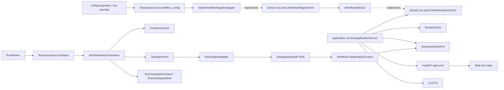
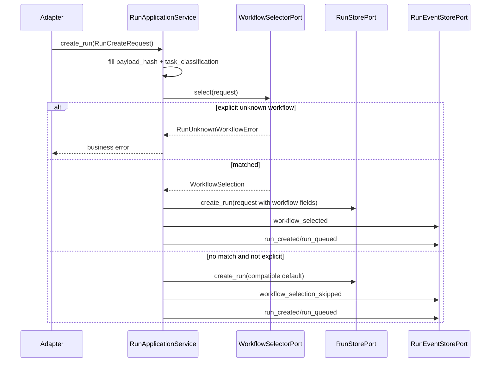
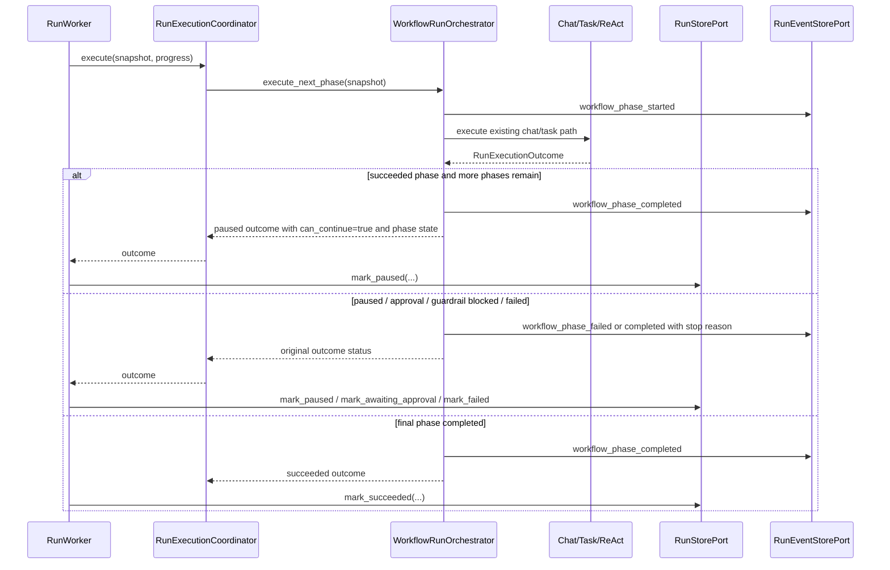

# 设计文档：长任务工作流化与多 Agent 协作阶段六

## 概述

阶段六 v1 在既有阶段三 `Run_Runtime`、阶段四 `Checkpoint_Recovery`、阶段五 `Guardrail_v1` 和当前 `Delegation` / `Handoff` 能力之上，增加轻量工作流定义、工作流选择、Run 层阶段状态和多 Agent 协作可观测治理。设计遵循 `docs/steering/ddd-architecture.md`：领域模型与 Port 位于 `domain/`，静态工作流配置与注册表实现位于 `infrastructure/`，Run 编排位于 `application/run`，FastAPI/TUI/Web 只透传和展示。

本阶段不引入 Temporal、LangGraph、Dapr Workflow、Celery 或其他 durable workflow runtime，不把 `ReActAgentAdapter` 改写为图执行引擎，也不改变阶段一/二 continue 语义、阶段四 non-exactly-once 边界或阶段五 guardrail 收敛版边界。配置遵循 `docs/steering/config-source.md`，默认写入 `epsilon-boot/config.properties`，环境变量仅用于覆盖。

### 设计决策

| 决策 | 选择 | 理由 |
| --- | --- | --- |
| 工作流运行时 | 在现有 Run runtime 内增加轻量编排状态 | 严格匹配 requirement.md，不引入外部 durable workflow engine，也不替换 ReAct loop。 |
| 工作流模型位置 | `domain/run/workflow.py` 定义值对象，`domain/run/ports.py` 定义 registry/selector Port | 保持 DDD/六边形依赖方向，领域层不感知配置文件、Redis、FastAPI 或 Web。 |
| 工作流定义来源 | 静态配置 + 代码内置默认定义 | 满足可配置与 fail-fast 要求，避免 v1 引入数据库表或远程配置系统。 |
| 工作流选择 | 显式 workflow 优先，其次 task classification/payload 规则，失败时兼容默认路径 | 显式未知 workflow 是调用方错误；非显式无法匹配不能阻断既有 Run 创建。 |
| 阶段推进 | `RunExecutionCoordinator` 使用 `WorkflowRunState` 包裹现有 Chat/Task 执行段 | 应用层编排阶段，adapter 不复制状态机；阶段内仍复用 Chat/Task/ReAct/checkpoint/guardrail。 |
| v1 阶段执行深度 | 每次 worker 执行段最多推进一个可执行 phase；暂停/审批/失败保留既有语义 | 避免在一个 worker claim 内隐式循环多个大阶段造成租约、预算和恢复语义复杂化。 |
| 协作可观测关系 | v1 必选 `StepTraceLink`，可选保留 `ParentChildRunLink` 模型 | 不强制把既有 delegation/handoff 改造成子 Run，满足需求 6 至少一种关系表达。 |
| 协作治理接入点 | delegation/handoff 工具与 `DelegationPort` 调用前后记录协作事件/summary | 保持既有“委派回灌父 Agent”和“handoff 控制转移”语义，只增加治理与可观测。 |
| 协作限制 | `CollaborationLimit` 与既有 `AGENT_MAX_DELEGATION_DEPTH` 取更严格值 | 不允许通过工作流配置绕过既有最大委派深度。 |
| Checkpoint 兼容 | `WorkflowRunState` 进入 Run snapshot 和 checkpoint `segment_metadata` | 恢复时优先读取 snapshot；checkpoint 恢复缺失或 schema 不兼容时保守失败或 lost。 |
| Guardrail 兼容 | 只复用阶段五已有 task classification 与 critical enforce 阻断 | 不新增完整 guardrail 事件闭环，不动态累计 `guardrail_summary`。 |
| 外部 engine | 只在文档记录评估维度，不改依赖、不改 lockfile | 后续若引入需重新走 requirement/design/tasks。 |

## 架构



创建序列：



执行段序列：



## 组件与接口

### 1. `epsilon-boot/src/domain/run/workflow.py`

责任：定义阶段六纯领域模型和值对象，只依赖标准库和 `domain/run` 稳定模型。

```python
"""Run 工作流领域模型。

定义标准工作流、阶段运行状态和多 Agent 协作摘要。该模块不依赖
application、infrastructure、FastAPI、Redis 或外部 workflow runtime。
"""

from __future__ import annotations

from dataclasses import dataclass, field
from datetime import datetime
from enum import StrEnum
from typing import Any


class StandardWorkflowName(StrEnum):
    """阶段六 v1 内置标准工作流名称。"""

    RESEARCH = "research"
    CODE_CHANGE = "code_change"
    REPORT = "report"
    BATCH_PROCESSING = "batch_processing"


class WorkflowPhase(StrEnum):
    """Run 层可观察工作流阶段。"""

    PLAN = "plan"
    EXECUTE = "execute"
    EVALUATE = "evaluate"
    REVISE = "revise"
    FINALIZE = "finalize"


class CollaborationAction(StrEnum):
    """多 Agent 协作动作类型。"""

    DELEGATION = "delegation"
    HANDOFF = "handoff"
    CHILD_RUN = "child_run"


@dataclass(frozen=True)
class WorkflowApplicableCondition:
    """工作流适用条件。

    Attributes:
        run_kinds: 允许的 Run kind 字符串，空集合表示不限。
        task_classes: 允许的 guardrail task classification，空集合表示不限。
        payload_keywords: payload 文本命中关键字，空集合表示不限。
    """

    run_kinds: frozenset[str] = frozenset()
    task_classes: frozenset[str] = frozenset()
    payload_keywords: frozenset[str] = frozenset()


@dataclass(frozen=True)
class AgentRoleCapability:
    """工作流内 Agent 角色能力声明。"""

    role: str
    agent_names: tuple[str, ...] = ()
    can_delegate: bool = False
    can_handoff: bool = False


@dataclass(frozen=True)
class CollaborationLimit:
    """多 Agent 协作限制策略。

    `max_recursion_depth` 必须与既有 `AGENT_MAX_DELEGATION_DEPTH` 取更严格值。
    """

    max_recursion_depth: int = 3
    max_parallel_delegations: int = 3
    max_handoff_count: int = 1
    max_revise_per_phase: int = 1
    max_child_runs: int = 0


@dataclass(frozen=True)
class WorkflowPhaseDefinition:
    """单个工作流阶段定义。"""

    phase: WorkflowPhase
    role: str | None = None
    max_attempts: int = 1
    summary: str = ""


@dataclass(frozen=True)
class WorkflowDefinition:
    """标准工作流定义。"""

    name: str
    description: str
    applicable: WorkflowApplicableCondition
    phases: tuple[WorkflowPhaseDefinition, ...]
    roles: tuple[AgentRoleCapability, ...]
    collaboration_limit: CollaborationLimit
    default_strategy_summary: str
    enabled: bool = True

    def validate(self) -> None:
        """校验名称、必需阶段、角色引用和协作限制，非法时抛出 ValueError。"""
        ...


@dataclass(frozen=True)
class WorkflowPhaseRecord:
    """工作流阶段历史记录。"""

    phase: WorkflowPhase
    status: str
    started_at: datetime
    completed_at: datetime | None = None
    summary: dict[str, Any] = field(default_factory=dict)
    error: dict[str, Any] | None = None
    revise_count: int = 0


@dataclass(frozen=True)
class CollaborationStepTraceLink:
    """同一 Run 内的协作步骤追踪关系。"""

    link_id: str
    run_id: str
    phase: WorkflowPhase | None
    source_role: str | None
    target_role: str | None
    target_agent: str | None
    action: CollaborationAction
    task_summary: str
    result_summary: str | None
    depth: int
    created_at: datetime


@dataclass(frozen=True)
class ParentChildRunLink:
    """父子 Run 可观测关系。

    v1 定义序列化模型，但不要求把所有 delegation 改造成子 Run。
    """

    parent_run_id: str
    child_run_id: str
    role: str
    phase: WorkflowPhase
    reason: str
    created_at: datetime


@dataclass(frozen=True)
class CollaborationSummary:
    """Run 快照中的协作摘要。"""

    latest_steps: tuple[CollaborationStepTraceLink, ...] = ()
    child_links: tuple[ParentChildRunLink, ...] = ()
    delegation_count: int = 0
    handoff_count: int = 0
    max_depth_seen: int = 0
    limit_hit_reason: str | None = None


@dataclass(frozen=True)
class WorkflowRunState:
    """绑定到 RunSnapshot 的工作流运行状态。"""

    workflow_name: str | None
    current_phase: WorkflowPhase | None
    phase_started_at: datetime | None
    phase_history: tuple[WorkflowPhaseRecord, ...] = ()
    phase_result_summary: dict[str, Any] | None = None
    phase_error_summary: dict[str, Any] | None = None
    revise_counts: dict[str, int] = field(default_factory=dict)
```

序列化要求：

- 所有 enum 输出 `.value`。
- `datetime` 输出 ISO-8601 字符串。
- `tuple` 输出 JSON array。
- `WorkflowRunState.workflow_name` 未选择时为 `null`。
- `CollaborationSummary.latest_steps` 默认只保留最近 N 条，避免 snapshot 膨胀；完整历史以 Run event stream 为准。

### 2. `epsilon-boot/src/domain/run/ports.py`

新增工作流注册与选择 Port：

```python
class WorkflowRegistryPort(Protocol):
    """工作流定义注册表端口。"""

    def list_definitions(self) -> list[WorkflowDefinition]:
        """返回所有启用或可诊断的工作流定义。"""
        ...

    def get_definition(self, name: str) -> WorkflowDefinition | None:
        """按稳定名称查询工作流定义。"""
        ...

    def require_definition(self, name: str) -> WorkflowDefinition:
        """按名称查询工作流定义，不存在时抛业务错误。"""
        ...


@dataclass(frozen=True)
class WorkflowSelection:
    """工作流选择结果。"""

    workflow: WorkflowDefinition | None
    explicit: bool
    reason: str


class WorkflowSelectorPort(Protocol):
    """工作流选择端口。"""

    def select(self, request: RunCreateRequest) -> WorkflowSelection:
        """根据显式参数、task_classification 与 payload 选择工作流。"""
        ...
```

### 3. `epsilon-boot/src/domain/run/value_objects.py`

扩展既有值对象，保持默认值保证旧快照兼容：

```python
class RunEventType(StrEnum):
    ...
    WORKFLOW_SELECTED = "workflow_selected"
    WORKFLOW_SELECTION_SKIPPED = "workflow_selection_skipped"
    WORKFLOW_PHASE_STARTED = "workflow_phase_started"
    WORKFLOW_PHASE_COMPLETED = "workflow_phase_completed"
    WORKFLOW_PHASE_FAILED = "workflow_phase_failed"
    COLLABORATION_STEP_RECORDED = "collaboration_step_recorded"
    COLLABORATION_LIMIT_HIT = "collaboration_limit_hit"


@dataclass(frozen=True)
class RunCreateRequest:
    ...
    workflow_name: str | None = None
    workflow_run_state: dict[str, Any] | None = None
    collaboration_summary: dict[str, Any] | None = None


@dataclass(frozen=True)
class RunSnapshot:
    ...
    workflow_name: str | None = None
    workflow_run_state: dict[str, Any] | None = None
    collaboration_summary: dict[str, Any] | None = None
```

`RunPayload` 不新增字段，避免改变阶段一/二同步与 continue payload hash 语义。显式 workflow 属于 `RunCreateRequest` 元数据，并参与幂等 payload hash 外的冲突判断：同一 `client_request_id` 若 payload hash 相同但 workflow 显式值不同，应按幂等冲突处理，避免同一幂等键指向不同编排。

### 4. `epsilon-boot/src/domain/run/exceptions.py`

新增错误常量对应的业务异常：

```python
class RunUnknownWorkflowError(BizException):
    """显式指定未知 workflow 时抛出。"""

    def __init__(self, workflow_name: str) -> None: ...


class RunWorkflowDefinitionError(BizException):
    """工作流定义重复、缺少阶段或角色引用非法时抛出。"""

    def __init__(self, reason: str) -> None: ...


class RunCollaborationLimitExceededError(BizException):
    """协作限制命中时抛出或转换为失败结果。"""

    def __init__(self, run_id: str, reason: str) -> None: ...
```

### 5. `epsilon-boot/src/infrastructure/run/workflow_config.py`

责任：读取 `RUN_WORKFLOW_*` 配置，构造默认 `WorkflowDefinition`，并在启动期 fail-fast。

```python
class RunWorkflowConfig(PropertiesBaseSettings):
    """Run 工作流配置。"""

    model_config = SettingsConfigDict(env_prefix="RUN_WORKFLOW_")

    enabled: bool = True
    default_workflow: str = ""
    enabled_workflows: str = "research,code_change,report,batch_processing"
    max_recursion_depth: int = 3
    max_parallel_delegations: int = 3
    max_handoff_count: int = 1
    max_revise_per_phase: int = 1
    max_child_runs: int = 0
    recent_collaboration_summary_limit: int = 5

    @model_validator(mode="after")
    def _validate_run_workflow_config(self) -> "RunWorkflowConfig": ...

    def to_collaboration_limit(self) -> CollaborationLimit: ...
```

默认配置写入 `epsilon-boot/config.properties`：

```properties
RUN_WORKFLOW_ENABLED=true
RUN_WORKFLOW_DEFAULT_WORKFLOW=
RUN_WORKFLOW_ENABLED_WORKFLOWS=research,code_change,report,batch_processing
RUN_WORKFLOW_MAX_RECURSION_DEPTH=3
RUN_WORKFLOW_MAX_PARALLEL_DELEGATIONS=3
RUN_WORKFLOW_MAX_HANDOFF_COUNT=1
RUN_WORKFLOW_MAX_REVISE_PER_PHASE=1
RUN_WORKFLOW_MAX_CHILD_RUNS=0
RUN_WORKFLOW_RECENT_COLLABORATION_SUMMARY_LIMIT=5
```

内置定义：

| workflow | phases | 默认角色 | 选择提示 |
| --- | --- | --- | --- |
| `research` | `plan -> execute -> evaluate -> finalize` | `planner`, `researcher`, `reviewer`, `reporter` | 调研、搜索、资料整理、`task_classification=tool_task/long_task` 且 payload 命中 research 关键词。 |
| `code_change` | `plan -> execute -> evaluate -> revise -> finalize` | `planner`, `executor`, `reviewer` | 代码修改、测试修复、文件编辑；允许 revise 一次。 |
| `report` | `plan -> execute -> evaluate -> finalize` | `planner`, `writer`, `reviewer` | 报告、总结、文档生成。 |
| `batch_processing` | `plan -> execute -> evaluate -> revise -> finalize` | `planner`, `worker`, `reviewer` | 批量处理、多文件/多素材任务；并行委派上限生效。 |

### 6. `epsilon-boot/src/infrastructure/run/static_workflow_registry_adapter.py`

责任：实现 `WorkflowRegistryPort`，从 `RunWorkflowConfig` 和内置定义创建注册表。

关键行为：

- 启动期校验名称唯一。
- 至少保留 requirement.md 要求的四类注册名称。
- 每个定义必须包含 `plan`、`execute`、`evaluate`、`finalize`；`revise` 可按 workflow 选择性包含。
- 阶段引用的 role 必须存在于 `roles`。
- 所有名称和 role 必须非空、JSON-safe、稳定小写 snake_case。

### 7. `epsilon-boot/src/infrastructure/run/static_workflow_selector.py`

责任：实现 `WorkflowSelectorPort`，只做确定性规则，不调用 LLM 或外部服务。

选择顺序：

1. `RunCreateRequest.workflow_name` 非空：必须在 registry 中存在且启用，否则抛 `RunUnknownWorkflowError`。
2. `RunWorkflowConfig.default_workflow` 非空：若存在则选择，若配置非法启动期 fail-fast。
3. `task_classification` 与 payload 关键词规则：匹配 `code_change`、`batch_processing`、`research`、`report`。
4. 无匹配：返回 `WorkflowSelection(workflow=None, explicit=False, reason="no_match")`，Run 创建继续走兼容默认路径。

### 8. `epsilon-boot/src/application/run/run_application_service.py`

构造函数新增可选 `workflow_selector: WorkflowSelectorPort | None = None`。`create_run()` 在 `_with_task_classification()` 后调用 `_with_workflow_selection()`：

```python
def _with_workflow_selection(self, request: RunCreateRequest) -> tuple[RunCreateRequest, WorkflowSelection]:
    """选择工作流并把 workflow 初始状态写入 RunCreateRequest。"""
    ...
```

写入规则：

- 选择成功：`workflow_name` 写入标准名称，`workflow_run_state` 初始化为当前 phase 为第一阶段、history 为空；创建后写 `WORKFLOW_SELECTED` 事件。
- 未匹配且非显式：字段保持 `None`，创建后写 `WORKFLOW_SELECTION_SKIPPED` 事件，payload 只包含 `reason`。
- 显式未知：抛 `RunUnknownWorkflowError`，不创建 Run，不写事件。
- 已存在幂等 Run：直接返回既有 snapshot，不重新选择，不追加重复 workflow 事件。

### 9. `epsilon-boot/src/application/run/workflow_orchestrator.py`

新增应用层编排器，供 `RunExecutionCoordinator` 使用：

```python
class WorkflowRunOrchestrator:
    """在现有 Chat/Task 执行段外包装工作流 phase 状态。"""

    def __init__(
        self,
        *,
        event_store: RunEventStorePort,
        now: Callable[[], datetime] | None = None,
    ) -> None: ...

    async def execute_phase(
        self,
        *,
        snapshot: RunSnapshot,
        execute_existing: Callable[[RunSnapshot], Awaitable[RunExecutionOutcome]],
    ) -> RunExecutionOutcome:
        """推进当前 workflow phase，并委托既有执行函数完成阶段内 ReAct 执行。"""
        ...
```

核心规则：

- `snapshot.workflow_run_state is None` 时直接调用既有执行路径，不写 workflow phase 事件。
- phase 开始前写 `WORKFLOW_PHASE_STARTED`，payload 包含 `workflow_name`、`phase`、`role`、`attempt`。
- phase 内执行仍调用现有 `_execute_chat()` / `_execute_task()`，不改变 Chat/Task Port 签名。
- outcome 为 `SUCCEEDED` 且还有后续 phase：记录当前 phase completed，将 outcome 转为 `PAUSED`、`can_continue=True`，`terminal_reason="workflow_phase_completed"`，供下一次 `/continue` 或 worker 入队推进。
- outcome 为 `PAUSED`、`AWAITING_APPROVAL`、`FAILED`、`CANCELLED`：保留原状态，只补充 `workflow_run_state` 和阶段失败/等待摘要。
- outcome 为最终 phase `SUCCEEDED`：Run 成功。
- `revise` 次数超过 `CollaborationLimit.max_revise_per_phase` 时输出 failed outcome，事件写 `COLLABORATION_LIMIT_HIT` 或 `WORKFLOW_PHASE_FAILED`。

`RunExecutionOutcome` 追加：

```python
@dataclass(frozen=True)
class RunExecutionOutcome:
    ...
    workflow_run_state: dict[str, Any] | None = None
    collaboration_summary: dict[str, Any] | None = None
```

`RunWorker._persist_outcome()` 调用 store mark 方法时把 outcome 中新增字段传入，确保 snapshot 与事件一致。

### 10. `epsilon-boot/src/domain/run/ports.py` 的 store 扩展

为避免只靠事件推断 snapshot，`RunStorePort` 的 worker 写入方法增加可选 keyword-only 字段：

```python
async def mark_succeeded(
    self,
    *,
    run_id: str,
    owner_id: str,
    result: dict[str, Any],
    workflow_run_state: dict[str, Any] | None = None,
    collaboration_summary: dict[str, Any] | None = None,
) -> RunSnapshot: ...
```

`mark_failed`、`mark_paused`、`mark_awaiting_approval`、`resolve_approval_resume`、`enqueue_recovery` 同步支持新增字段。实现时应保持旧调用兼容，新增参数都有默认值。

### 11. 协作治理接入

新增 `epsilon-boot/src/domain/run/workflow_context.py`：

```python
@dataclass(frozen=True)
class WorkflowCollaborationContext:
    """当前 Run 的协作治理上下文。"""

    run_id: str
    workflow_name: str | None
    phase: WorkflowPhase | None
    source_role: str | None
    limit: CollaborationLimit
    depth: int
    handoff_count: int
    delegation_count: int


def set_workflow_collaboration_context(value: WorkflowCollaborationContext) -> Token: ...
def reset_workflow_collaboration_context(token: Token) -> None: ...
def get_workflow_collaboration_context() -> WorkflowCollaborationContext | None: ...
```

`RunExecutionCoordinator` 在设置 checkpoint context 的同一执行窗口设置 collaboration context。`DelegateToAgentTool`、`DelegateParallelTool`、`HandoffToAgentTool` 在调用 `DelegationPort` 前读取 context：

- 若 context 不存在，保持既有行为。
- 若存在，检查 `max_recursion_depth`、`max_parallel_delegations`、`max_handoff_count`。
- 命中限制时不调用真实 delegation/handoff，返回失败 `DelegationResult` 或抛既有深度异常，并写 `COLLABORATION_LIMIT_HIT` 事件。
- 成功或失败后写 `COLLABORATION_STEP_RECORDED` 事件，payload 包含 source role、target role/agent、action、task summary、result summary、depth。

不改变既有语义：

- `DelegationPort.delegate()` 仍通过 `TaskAgentPort.execute()` 让子 Agent 结果以 `ToolMessage` 回灌给父 Agent。
- `DelegationPort.delegate_parallel()` 仍错误隔离，单条失败返回失败 `DelegationResult`。
- `DelegationPort.handoff()` 仍由目标 Agent 接管上下文，成功后父 Agent loop 终止并产出目标 Agent 回复。
- `AGENT_MAX_DELEGATION_DEPTH` 仍有效；工作流限制只能更严格，不能更宽松。

### 12. Adapter 与 Web 透传

- `application/api/routers/runs.py`：`RunSnapshotBody` 增加 `workflow_name`、`workflow_run_state`、`collaboration_summary`；`RunEventBody` 已透传 event type/payload，只需确保新增枚举可序列化。
- `application/cli/commands.py`、`application/cli/tui.py`：Run 快照展示当前 workflow、phase、最近协作摘要；事件日志展示新增 workflow/collaboration 事件。
- `epsilon-client/src/lib/chat-api.ts`：`RunSnapshot` 类型增加同名字段，`RunEvent.event_type` 接受新增事件字符串。
- `epsilon-client/src/components/run/run-view.tsx`：展示当前 workflow、phase、阶段历史摘要、最近协作摘要；不实现选择器、phase 推进或限制判断。
- `RunEvent replay_expired` 时 Web 继续使用既有 polling fallback，通过 `RunSnapshot.workflow_run_state` 观察最新状态。

## 数据模型

### 领域模型

`WorkflowDefinition` 是稳定定义，必须可 JSON-safe 序列化；`WorkflowRunState` 是每个 Run 的运行态；`CollaborationSummary` 是 snapshot 摘要；`CollaborationStepTraceLink` 是事件流里的顺序关系记录。

阶段状态示例：

```json
{
  "workflow_name": "code_change",
  "current_phase": "execute",
  "phase_started_at": "2026-06-08T00:00:00+08:00",
  "phase_history": [
    {
      "phase": "plan",
      "status": "completed",
      "started_at": "2026-06-08T00:00:00+08:00",
      "completed_at": "2026-06-08T00:01:00+08:00",
      "summary": {"terminal_reason": "completed"},
      "error": null,
      "revise_count": 0
    }
  ],
  "phase_result_summary": {"latest_terminal_reason": "workflow_phase_completed"},
  "phase_error_summary": null,
  "revise_counts": {"revise": 0}
}
```

协作事件 payload 示例：

```json
{
  "link_id": "step-01H...",
  "workflow_name": "research",
  "phase": "execute",
  "source_role": "researcher",
  "target_role": "reviewer",
  "target_agent": "reviewer",
  "action": "delegation",
  "task_summary": "verify source quality",
  "result_summary": "success",
  "depth": 1
}
```

### 持久化模型

本期不新增数据库表、DDL、迁移脚本或外部存储组件。file/Redis Run store 在既有 snapshot JSON/hash 结构中追加字段：

- `workflow_name: string | null`
- `workflow_run_state: object | null`
- `collaboration_summary: object | null`

旧快照反序列化时字段缺失应填默认 `None`。本地文件适配器基于 dataclass `fields()` 的兼容读取继续保留未知字段容忍；Redis 适配器同样需要保持缺失字段默认值。

Checkpoint 兼容：

- `DurableCheckpoint.segment_metadata` 追加 `workflow_run_state` 和 `collaboration_summary` 的 JSON-safe 摘要。
- 恢复时优先使用 `RunSnapshot.workflow_run_state`；snapshot 缺失但 checkpoint 存在时，从 checkpoint 恢复最近阶段状态。
- checkpoint schema 不兼容、字段不可反序列化或 phase 非法时，恢复服务按阶段四规则保守进入 `lost` 或 failed，不伪装成功。

### 配置来源和默认配置

新增配置默认进入 `epsilon-boot/config.properties`。`.env` 和环境变量仅覆盖，不作为默认来源。非法配置在容器启动期通过 `ConfigurationError` fail-fast。

默认启用工作流选择，但不匹配时兼容旧路径；因此升级后不会阻止既有 Chat/Task Run 创建。

## 事务与并发边界

- Run 创建：workflow selection、snapshot 创建、`WORKFLOW_SELECTED`/`WORKFLOW_SELECTION_SKIPPED`、`RUN_CREATED`、`RUN_QUEUED` 按现有 RunApplicationService 顺序执行。snapshot 创建由 store 保证幂等与锁保护；事件追加失败不应创建重复 Run，但会让 latest cursor 只反映成功事件。
- worker claim：仍由 `RunStorePort.claim_next()` 原子完成 `queued -> running` 和 lease 写入。工作流 phase 不改变 claim 条件。
- phase 状态持久化：worker 持有 owner lease 时，通过 `mark_paused` / `mark_succeeded` / `mark_failed` / `mark_awaiting_approval` 原子写入 status、result/error、workflow_run_state、collaboration_summary 和 version。
- 事件顺序：phase started 必须先于 phase completed/failed；collaboration step 事件按 event cursor 顺序展示，不要求跨 Run 全局顺序。
- 协作限制：同一执行段内的计数来自 `WorkflowCollaborationContext` 和 snapshot summary；并行委派在发起前按请求数量检查，单条执行结果仍保持错误隔离。
- 取消优先级：RunWorker 既有段前/段后 cancel 检查不变。取消不会被 workflow phase 自动转为 revise 或 finalize。
- 审批恢复：`awaiting_approval` 的 `resume_approval_run()` 仍通过 `resolve_approval_resume()`，不伪造 worker owner。恢复入队后继续当前 phase，而不是重置到第一 phase。
- 外部边界：阶段六不承诺外部副作用 exactly-once；工具 pending/completed ledger 仍由阶段四控制。

## 正确性属性

### Property 1: 工作流定义稳定且 fail-fast
*For any* 工作流定义集合，只要存在重复名称、缺少 `plan/execute/evaluate/finalize` 必需阶段、阶段引用未知 role、非法协作限制或非 JSON-safe 名称，注册表启动期必须失败；否则同一输入定义集合多次加载得到相同名称和 phase 序列。
**验证需求：1.1, 1.2, 1.3, 1.4, 1.5, 1.6, 1.7**

### Property 2: 工作流选择不破坏既有 Run 创建
*For any* Run 创建请求，显式合法 workflow 必须选择对应定义；显式未知 workflow 必须返回业务错误且不创建 Run；非显式无匹配必须创建兼容默认 Run，且不调用 LLM 或外部服务。
**验证需求：2.1, 2.2, 2.3, 2.4, 2.5, 2.6, 2.7**

### Property 3: 工作流阶段状态与 Run 结果一致
*For any* 绑定 workflow 的 Run，进入 phase 必须写 started 事件，完成 phase 必须写 completed 事件，失败或等待审批必须在 `WorkflowRunState` 中保留当前 phase 和错误/等待摘要，且不得把失败 phase 标记为 Run 成功。
**验证需求：3.1, 3.2, 3.3, 3.4, 3.5, 3.6, 3.7, 4.1, 4.2, 4.3**

### Property 4: Checkpoint/HITL/Guardrail 边界保持兼容
*For any* 启用 checkpoint、审批恢复或 guardrail 的 Run，阶段六只能保存和恢复 workflow 可观察状态，不得扩大工具 exactly-once 承诺，不得新增独立审批系统，不得要求 guardrail 模型后/工具后事件闭环。
**验证需求：4.4, 4.5, 4.6, 4.7, 5.6, 5.7, 5.8, 9.5, 9.6, 9.7**

### Property 5: 多 Agent 协作受限且语义不变
*For any* delegation、parallel delegation 或 handoff 调用，若未命中限制，既有结果回灌或控制转移语义必须保持；若命中递归、并行、handoff 或 revise 限制，动作必须被阻止并产生可观测原因，且不得绕过 `AGENT_MAX_DELEGATION_DEPTH`。
**验证需求：5.1, 5.2, 5.3, 5.4, 5.5, 5.6, 5.7, 5.8, 6.1, 6.3, 6.5**

### Property 6: 协作关系可从事件或快照观察
*For any* 协作步骤，若不创建子 Run，事件流必须按顺序记录 `StepTraceLink`；若后续创建子 Run，父 Run snapshot 或事件流必须能找到 `ParentChildRunLink`；v1 不要求所有 delegation 都转为子 Run。
**验证需求：6.1, 6.2, 6.3, 6.4, 6.5, 6.6, 6.7**

### Property 7: Adapter 只透传不编排
*For any* FastAPI、TUI 或 Web 展示路径，新增 workflow 和 collaboration 字段必须来自 `RunSnapshot` 或 `RunEvent`，adapter 不得直接调用 registry/selector、推进 phase、判断 collaboration limit 或判定 checkpoint recovery。
**验证需求：7.1, 7.2, 7.3, 7.4, 7.5, 7.6, 7.7, 9.8, 9.9**

### Property 8: 外部 durable engine 不进入 v1 运行依赖
*For any* 阶段六 v1 验证环境，未安装 Temporal、LangGraph、Dapr Workflow 或 Celery 时后端和前端验证仍可通过；若后续要引入外部 engine，必须进入新的 spec 流程。
**验证需求：8.1, 8.2, 8.3, 8.4, 8.5, 9.10, 9.11**

## 错误处理

### 错误常量定义

| 异常 | 错误码建议 | HTTP 映射 | 场景 |
| --- | --- | --- | --- |
| `RunUnknownWorkflowError` | `RUN_UNKNOWN_WORKFLOW` | 400 | 调用方显式指定未知或未启用 workflow。 |
| `RunWorkflowDefinitionError` | `RUN_WORKFLOW_DEFINITION_INVALID` | 启动失败 / 500 | 静态定义重复、缺少阶段或 role 引用非法。 |
| `RunCollaborationLimitExceededError` | `RUN_COLLABORATION_LIMIT_EXCEEDED` | 409 或工具失败结果 | delegation/handoff/revise 命中工作流协作限制。 |
| `RunCheckpointSchemaError` | 既有 | 既有 | checkpoint 中 workflow state 不兼容。 |
| `RunContinuationUnavailableError` | 既有 | 409 | 非 paused/awaiting_approval 状态继续或审批恢复。 |

### 错误场景与处理策略

| 场景 | 处理 |
| --- | --- |
| 显式 workflow 未知 | `create_run()` 抛 `RunUnknownWorkflowError`，不创建 snapshot，不写事件。 |
| 静态配置非法 | 容器启动期 `ConfigurationError` / `RunWorkflowDefinitionError` fail-fast。 |
| 自动选择无匹配 | 创建兼容默认 Run，写 `WORKFLOW_SELECTION_SKIPPED`。 |
| phase 执行失败 | 保留原 failed outcome，`WorkflowRunState.phase_error_summary` 写安全摘要，写 `WORKFLOW_PHASE_FAILED`。 |
| phase 命中 paused/max rounds/token budget | 保留 paused 与 can_continue 语义，不追加 user message，不放大单段轮次限制。 |
| phase 进入 awaiting approval | 保留既有 approval_id 与 `resume_approval_run()` 入口，workflow 仅记录等待 phase。 |
| guardrail critical enforce 阻断 | 沿用阶段五工具前阻断，workflow phase 记录失败/暂停摘要，不新增 guardrail 闭环。 |
| collaboration limit 命中 | 阻止对应协作动作，写 `COLLABORATION_LIMIT_HIT`，对 delegate 返回失败 result，对 handoff 使用既有异常/工具错误路径。 |
| checkpoint workflow state 不可恢复 | 恢复服务按阶段四保守策略 failed/lost，不伪装成功。 |

### 错误传播策略

- 领域异常保持中文业务错误消息，不包含完整 payload、工具参数或敏感内容。
- FastAPI 复用现有异常映射；新增业务异常映射为 400/409。
- TUI/CLI 展示短错误摘要和 run_id，不展示完整上下文。
- Web 只展示 snapshot/event 中安全摘要，不推导恢复策略。
- worker 内部异常仍收敛为 `RunExecutionOutcome(status=FAILED)`，并写 failed event。

### 错误处理原则

- 显式用户选择错误不得静默降级。
- 自动选择失败不得阻断既有 Run 创建。
- 可观察状态不得伪装成功。
- 协作治理只能收紧，不能放宽既有 Agent 深度限制。
- 恢复安全优先于自动推进；无法证明兼容时保守失败或 lost。

## 测试策略

### 属性测试（Property-Based Testing）

项目现有长任务阶段主要使用 `pytest` example-based 和静态架构测试，未要求引入 Hypothesis 等 property-based 依赖；本阶段不新增测试依赖。正确性属性通过参数化 pytest 覆盖多种定义、状态和事件组合。

| 属性 | 测试位置建议 |
| --- | --- |
| Property 1 | `test/domain/run/test_workflow_value_objects_unit.py`、`test/infrastructure/run/test_workflow_registry_unit.py` |
| Property 2 | `test/infrastructure/run/test_static_workflow_selector_unit.py`、`test/application/run/test_run_application_service_workflow_unit.py` |
| Property 3 | `test/application/run/test_workflow_orchestrator_unit.py`、`test/infrastructure/run/test_run_worker_workflow_unit.py` |
| Property 4 | `test/application/run/test_workflow_checkpoint_recovery_unit.py`、阶段四/五回归测试 |
| Property 5 | `test/infrastructure/agent/test_workflow_collaboration_governance_unit.py` |
| Property 6 | `test/application/run/test_workflow_collaboration_events_unit.py` |
| Property 7 | `test/application/routers/test_runs_router_unit.py`、CLI/TUI/Web contract tests |
| Property 8 | 架构静态测试、`pyproject.toml`/`uv.lock` 依赖断言 |

### 单元测试（Example-Based）

- `WorkflowDefinition.validate()`：四个内置 workflow、重复名称、缺少必需 phase、未知 role、非法名称、非法 limit。
- `StaticWorkflowSelector`：显式选择、显式未知、默认 workflow、task_classification 映射、payload 关键词、无匹配兼容路径。
- `WorkflowRunState` 序列化：datetime/enum/tuple JSON-safe，缺失字段默认兼容。
- `RunApplicationService.create_run()`：workflow selected/skipped 事件、幂等命中不重复写事件、未知 workflow 不创建。
- `WorkflowRunOrchestrator`：phase started/completed/failed、成功转 paused 等待下一 phase、finalize 成功转 succeeded、revise 次数限制。
- `RunWorker`：persist outcome 时写入 workflow/collaboration 字段，owner 校验仍生效。
- 协作治理：delegate 成功事件、delegate_parallel 扇出限制、handoff 次数限制、深度限制取 `AGENT_MAX_DELEGATION_DEPTH` 与 workflow limit 较小值。

### 集成测试

| 需求 | 集成覆盖 |
| --- | --- |
| 1, 2, 3 | create -> worker execute -> snapshot/events，验证 workflow_name、current_phase、phase history。 |
| 4 | paused continue、awaiting approval resume、checkpoint recovery 启用时恢复当前 phase。 |
| 5, 6 | 通过 fake delegation/handoff tool 触发协作事件与 limit hit。 |
| 7 | `/api/runs*`、CLI/TUI、Web Run View 字段透传；replay expired 后 polling fallback 仍展示 snapshot workflow 字段。 |
| 8 | 无 Temporal/LangGraph/Dapr/Celery 依赖时验证通过。 |
| 9 | DDD 静态边界：`domain/run` 不导入 application/infrastructure/FastAPI/Redis；adapter 不导入 workflow selector/orchestrator。 |

验证命令：

```bash
cd epsilon-boot
env PYTHONPATH=src uv run --frozen pytest

cd ../epsilon-client
npm run lint
npm run build
```

## 非目标/后续边界

- 不引入 Temporal、LangGraph、Dapr Workflow、Celery 或其他 durable workflow runtime。
- 不把 `ReActAgentAdapter` 改写为图执行引擎。
- 不删除或改变同步 Chat/Task 入口。
- 不改变阶段一/二 continue 语义：不追加 user message、不放大单段轮次限制、不扩大 Task 工具边界。
- 不扩大阶段四 exactly-once 边界；外部副作用仍不承诺 exactly-once。
- 不实现完整 guardrail 运行时事件闭环，不动态累计 `guardrail_summary`，不把 guardrail `require_approval` 接入 HITL。
- 不要求所有 delegation 都创建子 Run；v1 使用 `StepTraceLink` 满足可观测关系。
- 不要求 FastAPI/TUI/Web 复制 workflow selector、phase 推进、collaboration limit 或 checkpoint recovery 判定。
- durable workflow engine 仅作为后续评估项；若要引入，必须单独创建新的 requirement/design/tasks。

后续可评估项：

- 将 `ParentChildRunLink` 从可选模型推进为创建子 Run 的正式执行路径。
- 将 guardrail `require_approval` 与既有 HITL approval recovery 统一。
- 将 workflow phase 与更细粒度 agent trace store 建立索引关联。
- 对强可靠任务评估 Temporal/LangGraph/Dapr 的收益、迁移成本、部署复杂度和与当前 checkpoint ledger 的重叠。
