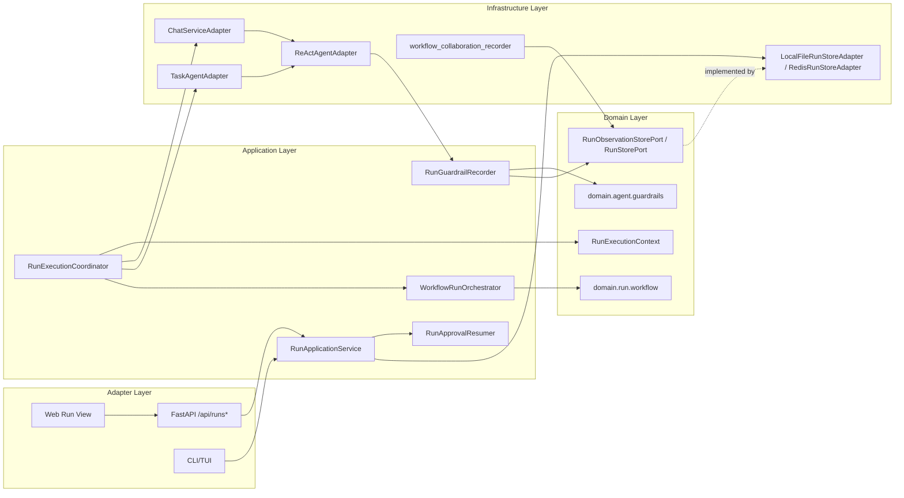
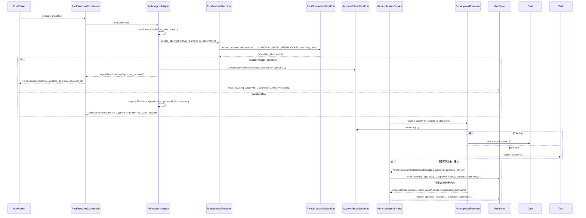

# 设计文档：长任务运行时收敛修复

## 概述

本设计在现有阶段三 `Run_Runtime`、阶段四 `Checkpoint_Recovery`、阶段五 `Guardrail_v1` 和阶段六 `Workflow/Collaboration` 的基础上，补齐长任务运行时的收敛缺口：把 guardrail 评估收敛到 `Run_Event_Stream + RunSnapshot.guardrail_summary` 单一事实源，把 `require_approval` 接回既有 HITL 恢复链路，把 `risk_gate_required` 接入 Chat/Task 全部分段决策，并统一 `Collaboration_Summary_Schema` 的规范字段为 `latest_steps`。设计遵循 `docs/steering/ddd-architecture.md`、`docs/steering/config-source.md`、`docs/steering/code-documentation.md`，并对齐 `docs/architecture.md`、`docs/agent.md`、`docs/domain-model.md` 中既有 DDD/六边形边界、Run runtime、HITL 和 checkpoint 约束。

本设计按 P0/P1/P2 切片推进：P0 以默认开启的 `RUN_GUARDRAIL_RUNTIME_CONVERGENCE_ENABLED=true` 优先落地 guardrail 事件闭环、摘要累计、审批复用、风险门禁接线和协作摘要字段归一；P1 补齐确定性运行时统计与成本估算；P2 继续在默认兼容关闭的前提下落地角色能力强制、workflow 级 handoff 执行策略和保守 child run 编排。整个方案明确不引入外部 durable workflow engine，不宣称 `Checkpoint_Ledger` 之外的 exactly-once 外部副作用语义；同时针对“P0 默认开启”带来的兼容风险，发布时必须执行 observe 模式回归、审批恢复回归、Run 视图 schema 契约验证，并保留单开关回滚路径。

#### 设计决策

| 决策 | 选择 | 理由 |
| --- | --- | --- |
| Guardrail 事实源 | 新增 `RunObservationStorePort.record_runtime_observation(...)`，在同一 adapter 原子区内同时追加事件并更新快照摘要字段 | 满足“事件追加与摘要更新共享同一事实源”，避免 `RunEventStorePort.append_event()` 与 `RunStorePort` 分离调用带来的游标/摘要漂移。 |
| Guardrail 运行时累计位置 | 领域层新增纯值对象与合并函数，应用层新增 `RunGuardrailRecorder` 实现 `RunGuardrailRecorderPort` | 计算规则保持纯领域、可单测；运行时编排位于 `application/run`，不落到 FastAPI/Web。 |
| 运行上下文传递 | 新增 `domain/run/runtime_context.py`，由 `RunExecutionCoordinator` 在所有 Run 段执行时统一设置 | Guardrail 记录、workflow handoff 记录和 child run 编排都需要 `run_id/owner_id/segment_index`，且不能依赖 checkpoint 开关。 |
| `require_approval` 复用策略 | 直接复用 `ApprovalInterrupt` / `ApprovalRequiredPayload` / `ApprovalStateStorePort` / `RunApplicationService.resume_approval_run()`，不新增第二套审批系统 | 满足需求 2，且与既有 `/api/chat/.../resume`、Run approve 语义对齐。 |
| Task 路径审批恢复 | 扩展 `TaskAgentPort.resume_approval(...)`，由新的 `RunApprovalResumer` 按 `RunKind` 选择 Chat 或 Task 恢复实现 | 当前仓库只有 Chat 具备显式审批恢复入口，Run 级审批想覆盖 task path 必须补这一缺口。 |
| 审批后二次 guardrail 评估 | guardrail 审批恢复后若再次命中审批，则同一 Run 保持/重新进入 `awaiting_approval`，并生成新的 `approval_id`；不做一次性审批跳过 | 与既有 HITL 语义一致，避免把后续真实风险误判为重复命中，同时满足用户对“同一 Run 可再次审批”的选择。 |
| 风险门禁来源 | 在 ReAct 工具前/后护栏和审批中断 metadata 上打稳定标记；Chat/Task 分段编排从该稳定标记和 `SegmentRunMetadata.risk_gate_required` 读取 | 使 `risk_gate_required` 由运行时事实导出，而非 UI 或文本推断。 |
| 协作摘要规范字段 | 写入、持久化、HTTP、CLI/TUI、Web 全部以 `latest_steps` 为规范字段；仅在反序列化旧数据时做 `recent_steps -> latest_steps` 兼容映射 | 满足需求 3.3~3.5，避免长期双写双读。 |
| Guardrail 审批参数展示 | 审批界面展示 `PendingActionRequest.arguments` 的完整工具参数，但仅限已认证审批界面/接口；默认日志、事件和错误消息继续脱敏，不复制完整参数到通用观测链路 | 满足审批可判断性，同时控制敏感参数暴露面，符合现有 `_safe_reason(...)` / `_safe_text(...)` 风格。 |
| Guardrail 统计并发模型 | 同一轮多个工具可并发执行，但 guardrail 事件与统计的“记账顺序”按 assistant 返回的 `tool_calls` 原始顺序串行提交 | 保证重复工具调用计数、连续失败计数和事件顺序稳定可重放。 |
| 成本估算配置 | 扩展 `AGENT_GUARDRAILS_MODEL_PRICING` 支持“旧标量”和“新对象”两种格式；对象格式按每 1M token 的 input/output 单价估算 | 兼顾兼容性与可解释性；缺失价格时只标记 `cost_available=false`，不阻断运行。 |
| Role capability 默认行为 | 增加 `RUN_WORKFLOW_ROLE_CAPABILITY_ENABLED=false`；只有 workflow 启用且该开关开启时才强制最小权限 | 满足“默认兼容关闭”的要求。 |
| Role capability 越权收敛语义 | 当 role capability 治理开启时，越权工具/委派/handoff/child run 统一转为既有 HITL `awaiting_approval`，不新增旁路授权系统 | 用户选择“人工审批兜底”优先于直接失败，且保持治理只在 capability 开启时生效。 |
| Child run 范围 | P2 采用“真实 parent-child run 链接 + 保守等待/恢复 + 默认关闭”的最小实现，不把既有所有 delegation 全量改造成 child run | 满足需求 7，同时控制实现与恢复复杂度。 |

## 架构

### 目标结构

```text
epsilon-boot/src/
├── domain/
│   ├── agent/
│   │   ├── guardrails.py                 # 扩展 GuardrailRuntimeStats / GuardrailObservation / GuardrailSummary
│   │   ├── segmented_execution.py        # 扩展 SegmentRunMetadata.risk_gate_required
│   │   ├── ports.py                      # 注入 RunGuardrailRecorderPort
│   │   └── value_objects.py              # 复用 ApprovalInterrupt / ApprovalRequiredPayload
│   ├── run/
│   │   ├── ports.py                      # 新增 RunObservationStorePort；扩展 mark_*/resume/recovery guardrail_summary 参数
│   │   ├── runtime_context.py            # 新增 Run 执行上下文 ContextVar
│   │   ├── value_objects.py              # 扩展 RunEventType、ApprovalResumeStoreResult、RunSnapshot 兼容字段说明
│   │   ├── workflow.py                   # 扩展 AgentRoleCapability / WorkflowExecutionPolicy / child run 链接状态
│   │   └── exceptions.py                 # 复用并补充运行时收敛相关 BizException
│   └── task/
│       ├── ports.py                      # 新增 resume_approval(...)
│       └── value_objects.py              # 新增 TaskApprovalResumeRequest，扩展 TaskResult.approval_id
├── application/run/
│   ├── run_guardrail_recorder.py         # 新增：guardrail 事件 + summary 累计编排
│   ├── run_approval_resumer.py           # 新增：按 RunKind 分派 Chat/Task 审批恢复
│   ├── run_execution_coordinator.py      # 总是设置 RunExecutionContext
│   ├── run_checkpoint_recovery_service.py# 恢复时保持/标记 guardrail_summary
│   └── workflow_orchestrator.py          # P2：角色能力、handoff、child run 策略深化
├── infrastructure/
│   ├── agent/
│   │   ├── react_agent_adapter.py        # 接 guardrail recorder、审批复用、稳定 metadata 标记
│   │   ├── segmented_orchestration.py    # 已有 risk_gate_required 输入继续复用
│   │   └── workflow_collaboration_recorder.py
│   ├── chat/chat_service_adapter.py      # 接 risk_gate_required
│   ├── task/task_agent_adapter.py        # 接 risk_gate_required + task 审批恢复
│   └── run/
│       ├── local_file_run_store_adapter.py
│       ├── redis_run_store_adapter.py    # 实现 RunObservationStorePort 原子更新
│       ├── run_config.py                 # 新增收敛开关默认值
│       └── workflow_config.py            # 新增 role capability / child run 开关
└── application/api/routers/runs.py       # 仅透传 canonical snapshot/events
```

### 组件图



### Guardrail 事件闭环与审批复用序列



### 状态与切片约束

#### P0

1. `GUARDRAIL_EVALUATED` / `GUARDRAIL_BLOCKED` 成为真实运行时事件，不再只存在于 `ToolMessage.metadata`。
2. `guardrail_summary` 成为 `RunSnapshot` 的权威摘要视图，UI 只展示，不推导。
3. `require_approval` 接入既有 `awaiting_approval -> approve -> queued/running` 链路；若恢复后再次命中审批，则同一 Run 重新回到 `awaiting_approval` 并生成新的 `approval_id`。
4. `risk_gate_required` 由 guardrail 决策导出并传入 Chat/Task 全部分段入口。
5. `collaboration_summary.latest_steps` 成为唯一规范写路径；旧 `recent_steps` 仅在读历史数据时映射。

#### P1

1. token、耗时、上下文增长、重复调用、连续失败、估算成本都来自运行时真实数据。
2. checkpoint 恢复只复用已持久化统计，不重复累计历史段的 token/工具失败。
3. 缺失定价时 `cost_available=false`，不改变 allow/observe/require_approval/stop 语义。

#### P2

1. workflow 角色能力默认关闭；开启后按最小权限拒绝越权工具/委派/handoff/child run。
2. workflow 级 handoff 不再只写工具消息 metadata，还要进入 `Workflow_Run_State` 和事件流。
3. child run 只在显式策略启用时创建；parent/child 关系、等待、恢复都以保守账本节点推进。

### 迁移与发布顺序

1. **阶段 A（P0）**：先发布 `RunObservationStorePort`、`RunGuardrailRecorder`、Task 审批恢复、`latest_steps` 规范化读取；因 `RUN_GUARDRAIL_RUNTIME_CONVERGENCE_ENABLED=true` 默认开启，发布前必须完成 chat/task/run 主路径回归、审批恢复回归、历史 snapshot 兼容回归和 Run 视图 schema 契约验证。
2. **阶段 B（P1）**：发布 `GuardrailRuntimeStats` 细化与价格解析兼容；先在 `AGENT_GUARDRAILS_MODE=observe` 环境观察，以验证默认开启的收敛写路径不会改变阻断策略。
3. **阶段 C（P2）**：发布 workflow capability / handoff / child run；默认 `RUN_WORKFLOW_ROLE_CAPABILITY_ENABLED=false`、`RUN_WORKFLOW_CHILD_RUN_ENABLED=false`，按 workflow 逐个灰度。
4. **回滚路径**：关闭 `RUN_GUARDRAIL_RUNTIME_CONVERGENCE_ENABLED`、`RUN_WORKFLOW_ROLE_CAPABILITY_ENABLED`、`RUN_WORKFLOW_CHILD_RUN_ENABLED` 时，Chat/Task/Run 的默认 continue/approval 行为回退到现有兼容模式。

## 组件与接口

### 1. `epsilon-boot/src/domain/agent/guardrails.py`

责任：扩展纯领域护栏模型，表达累计统计、单次观测和摘要合并结果。

```python
"""Agent 智能调度与护栏领域值对象。"""

from __future__ import annotations

from dataclasses import dataclass, field
from datetime import datetime
from enum import StrEnum
from typing import Any


class GuardrailEvaluationStage(StrEnum):
    """护栏评估发生的运行时阶段。"""

    RUN_START = "run_start"
    MODEL_COMPLETED = "model_completed"
    TOOL_BEFORE_EXECUTION = "tool_before_execution"
    TOOL_AFTER_EXECUTION = "tool_after_execution"
    RECOVERY_RESTORED = "recovery_restored"


@dataclass(frozen=True)
class GuardrailRuntimeStats:
    """Guardrail 运行时累计统计。"""

    total_tokens: int = 0
    prompt_tokens: int = 0
    completion_tokens: int = 0
    elapsed_ms: float = 0.0
    context_growth_messages: int = 0
    repeated_tool_call_count: int = 0
    consecutive_failure_count: int = 0
    total_model_calls: int = 0
    total_tool_calls: int = 0
    estimated_cost: float | None = None
    cost_available: bool = False
    last_tool_name: str | None = None
    last_tool_risk_level: str | None = None
    last_tool_error: bool = False

    def to_dict(self) -> dict[str, Any]:
        """转换为 JSON-safe 字典。"""
        ...


@dataclass(frozen=True)
class GuardrailObservation:
    """一次可持久化的护栏观测记录。"""

    stage: GuardrailEvaluationStage
    decision: GuardrailDecision
    stats: GuardrailRuntimeStats
    segment_index: int
    round_num: int | None = None
    tool_name: str | None = None
    tool_call_id: str | None = None
    tool_risk_level: ToolRiskLevel | None = None
    approval_id: str | None = None
    source: str = "run_runtime"
    created_at: datetime | None = None

    def to_event_payload(self) -> dict[str, Any]:
        """转换为 Run 事件 payload。"""
        ...


@dataclass(frozen=True)
class GuardrailSummary:
    """对外展示的护栏摘要。"""

    mode: GuardrailMode
    action: GuardrailAction
    reason: GuardrailReason | None = None
    message: str = ""
    estimated_cost: float | None = None
    metadata: dict[str, Any] = field(default_factory=dict)
    evaluation_count: int = 0
    blocked_count: int = 0
    approval_request_count: int = 0
    last_event_cursor: int | None = None
    updated_at: str | None = None
    runtime_stats: dict[str, Any] = field(default_factory=dict)
    stale: bool = False
    stale_reason: str | None = None

    def to_dict(self) -> dict[str, Any]:
        """转换为 JSON-safe 字典。"""
        ...


def merge_guardrail_summary(
    current: dict[str, Any] | GuardrailSummary | None,
    observation: GuardrailObservation,
    *,
    event_cursor: int,
) -> GuardrailSummary:
    """基于既有摘要与新观测计算下一版 Guardrail_Summary。"""
    ...


def mark_guardrail_summary_stale(
    current: dict[str, Any] | GuardrailSummary | None,
    *,
    reason: str,
    updated_at: datetime,
) -> GuardrailSummary:
    """把恢复后的摘要显式标记为保守过期状态。"""
    ...
```

实现约束：

1. `GuardrailDecision.to_summary()` 继续可用，但语义退化为“生成最近一次动作的摘要基底”；真正的累计由 `merge_guardrail_summary(...)` 负责。
2. `evaluation_count` 对所有阶段评估递增；`blocked_count` 对 `require_approval/stop` 递增；`approval_request_count` 仅对 `require_approval` 递增。
3. `runtime_stats.estimated_cost` 的计算优先使用 input/output 单价；只给出旧标量价格时按 blended 单价乘 `total_tokens`。

### 2. `epsilon-boot/src/domain/run/runtime_context.py`

责任：为所有 Run 段执行提供与 checkpoint 无关的统一上下文。

```python
"""Run 执行上下文 ContextVar。"""

from __future__ import annotations

from contextvars import ContextVar, Token
from dataclasses import dataclass


@dataclass(frozen=True)
class RunExecutionContext:
    """当前线程/协程中的 Run 执行上下文。"""

    run_id: str
    owner_id: str
    segment_index: int
    recovery_mode: bool = False


_RUN_EXECUTION_CONTEXT: ContextVar[RunExecutionContext | None] = ContextVar(
    "run_execution_context",
    default=None,
)


def get_run_execution_context() -> RunExecutionContext | None:
    """返回当前 Run 执行上下文；非 Run 路径时返回 None。"""
    ...


def set_run_execution_context(context: RunExecutionContext) -> Token:
    """设置当前 Run 执行上下文。"""
    ...


def reset_run_execution_context(token: Token) -> None:
    """重置当前 Run 执行上下文。"""
    ...
```

### 3. `epsilon-boot/src/domain/run/ports.py`

责任：补充运行时观测写端口，扩展 Run store 的 guardrail 持久化能力。

```python
"""Run 领域端口定义模块。"""

from __future__ import annotations

from dataclasses import dataclass
from typing import Any, Literal, Protocol

from domain.run.value_objects import RunEvent, RunEventType, RunSnapshot


@dataclass(frozen=True)
class ApprovalResumeStoreResult:
    """审批恢复结果在 Run 存储层的状态变更指令。"""

    status: Literal["queued", "awaiting_approval", "succeeded", "failed", "cancelled"]
    approval_id: str | None = None
    result: dict[str, Any] | None = None
    error: dict[str, Any] | None = None
    terminal_reason: str | None = None
    guardrail_summary: dict[str, Any] | None = None
    workflow_run_state: dict[str, Any] | None = None
    collaboration_summary: dict[str, Any] | None = None


class RunObservationStorePort(Protocol):
    """在同一原子区内追加运行时事件并更新快照摘要字段。"""

    async def record_runtime_observation(
        self,
        *,
        run_id: str,
        owner_id: str,
        event_type: RunEventType,
        payload: dict[str, Any],
        guardrail_summary: dict[str, Any] | None = None,
        workflow_run_state: dict[str, Any] | None = None,
        collaboration_summary: dict[str, Any] | None = None,
    ) -> tuple[RunSnapshot, RunEvent]:
        """原子追加事件并更新快照的 guardrail/workflow/collaboration 摘要。"""
        ...


class RunStorePort(Protocol):
    """后台 Run 快照与控制状态存储端口。"""

    async def mark_succeeded(
        self,
        *,
        run_id: str,
        owner_id: str,
        result: dict[str, Any],
        guardrail_summary: dict[str, Any] | None = None,
        workflow_run_state: dict[str, Any] | None = None,
        collaboration_summary: dict[str, Any] | None = None,
    ) -> RunSnapshot:
        ...

    async def mark_failed(
        self,
        *,
        run_id: str,
        owner_id: str,
        error: dict[str, Any],
        guardrail_summary: dict[str, Any] | None = None,
        workflow_run_state: dict[str, Any] | None = None,
        collaboration_summary: dict[str, Any] | None = None,
    ) -> RunSnapshot:
        ...

    async def mark_paused(
        self,
        *,
        run_id: str,
        owner_id: str,
        result: dict[str, Any],
        guardrail_summary: dict[str, Any] | None = None,
        workflow_run_state: dict[str, Any] | None = None,
        collaboration_summary: dict[str, Any] | None = None,
    ) -> RunSnapshot:
        ...

    async def mark_awaiting_approval(
        self,
        *,
        run_id: str,
        owner_id: str,
        approval_id: str,
        result: dict[str, Any],
        guardrail_summary: dict[str, Any] | None = None,
        workflow_run_state: dict[str, Any] | None = None,
        collaboration_summary: dict[str, Any] | None = None,
    ) -> RunSnapshot:
        ...

    async def mark_cancelled(
        self,
        *,
        run_id: str,
        owner_id: str,
        reason: str,
        guardrail_summary: dict[str, Any] | None = None,
        workflow_run_state: dict[str, Any] | None = None,
        collaboration_summary: dict[str, Any] | None = None,
    ) -> RunSnapshot:
        ...

    async def resolve_approval_resume(
        self,
        *,
        run_id: str,
        result: ApprovalResumeStoreResult,
    ) -> RunSnapshot:
        ...

    async def enqueue_recovery(
        self,
        *,
        run_id: str,
        latest_checkpoint_id: str,
        recovery_attempt_count: int,
        guardrail_summary: dict[str, Any] | None = None,
        workflow_run_state: dict[str, Any] | None = None,
        collaboration_summary: dict[str, Any] | None = None,
    ) -> RunSnapshot:
        ...
```

### 4. `epsilon-boot/src/domain/agent/ports.py`

责任：让 ReAct 通过领域 Port 写入 Run guardrail 事实，而不是依赖 Web/adapter 推导。

```python
"""Agent 端口定义。"""

from __future__ import annotations

from typing import Protocol

from domain.agent.guardrails import GuardrailObservation
from domain.run.value_objects import RunSnapshot


class RunGuardrailRecorderPort(Protocol):
    """把 guardrail 观测写入 Run 事件与摘要。"""

    async def record_observation(
        self,
        *,
        observation: GuardrailObservation,
    ) -> RunSnapshot | None:
        """在存在 Run 执行上下文时记录一次 guardrail 观测；非 Run 路径返回 None。"""
        ...
```

### 5. `epsilon-boot/src/domain/task/value_objects.py` 与 `src/domain/task/ports.py`

责任：补足 task 路径审批恢复缺口。

```python
"""任务领域值对象模块。"""

from __future__ import annotations

from dataclasses import dataclass, field

from domain.agent.value_objects import ApprovalDecision


@dataclass(frozen=True)
class TaskApprovalResumeRequest:
    """任务审批恢复请求值对象。"""

    session_id: str
    approval_id: str
    decisions: tuple[ApprovalDecision, ...]
    model: str | None = None


@dataclass(frozen=True)
class TaskResult:
    """任务执行结果值对象。"""

    content: str
    status: TaskStatus
    model: str
    prompt_id: str
    usage: dict[str, int] = field(default_factory=dict)
    trace: list[TraceEntry] = field(default_factory=list)
    latency_ms: float = 0.0
    terminated_reason: AgentTerminationReason = "completed"
    can_continue: bool = False
    segment_metadata: SegmentRunMetadata = field(default_factory=SegmentRunMetadata)
    approval_id: str | None = None
```

```python
"""任务 Agent 端口定义。"""

from __future__ import annotations

from typing import Protocol

from domain.task.value_objects import Task, TaskApprovalResumeRequest, TaskContinueRequest, TaskResult


class TaskAgentPort(Protocol):
    """面向任务的 Agent 端口协议。"""

    async def execute(self, task: Task) -> TaskResult:
        ...

    async def continue_task(self, request: TaskContinueRequest) -> TaskResult:
        ...

    async def resume_approval(self, request: TaskApprovalResumeRequest) -> TaskResult:
        """提交审批决策并恢复任务 Agent 执行。"""
        ...
```

### 6. `epsilon-boot/src/application/run/run_guardrail_recorder.py`

责任：基于 `RunExecutionContext` 和 `RunObservationStorePort` 完成 guardrail 事件与摘要收敛。

```python
"""Run guardrail 记录应用服务。"""

from __future__ import annotations

from domain.agent.guardrails import GuardrailObservation
from domain.agent.ports import RunGuardrailRecorderPort
from domain.run.ports import RunObservationStorePort, RunStorePort
from domain.run.value_objects import EventRetentionPolicy, RunEventType, RunSnapshot


class RunGuardrailRecorder(RunGuardrailRecorderPort):
    """把 guardrail 决策收敛到 Run 事件流与摘要。"""

    def __init__(
        self,
        *,
        run_store: RunStorePort,
        observation_store: RunObservationStorePort,
        event_retention_policy: EventRetentionPolicy,
    ) -> None:
        """初始化 recorder。"""
        ...

    async def record_observation(
        self,
        *,
        observation: GuardrailObservation,
    ) -> RunSnapshot | None:
        """记录 guardrail 观测；无 RunExecutionContext 时直接返回 None。"""
        ...
```

实现细节：

1. `record_observation(...)` 先读取当前 `RunExecutionContext`；若为空，说明是同步 chat/task 非 Run 路径，直接跳过持久化，仅保留当前上下文 metadata。
2. `RunEventType` 选择规则：
   - `ALLOW/OBSERVE` -> `GUARDRAIL_EVALUATED`
   - `REQUIRE_APPROVAL/STOP` -> `GUARDRAIL_BLOCKED`
3. 通过 `merge_guardrail_summary(...)` 计算 `summary_after`，再调用 `record_runtime_observation(...)` 一次性写入事件与快照。
4. recorder 只负责 Run 级收敛，不直接修改 `ConversationContext`。

### 7. `epsilon-boot/src/application/run/run_approval_resumer.py`

责任：把 Run approve 统一路由到 Chat 或 Task 的既有/新增审批恢复实现。

```python
"""Run 审批恢复分派器。"""

from __future__ import annotations

from domain.agent.value_objects import ApprovalDecision
from domain.chat.ports import ChatServicePort
from domain.chat.value_objects import ApprovalResumeRequestVO
from domain.run.ports import ApprovalResumeStoreResult
from domain.run.value_objects import RunKind, RunSnapshot
from domain.task.ports import TaskAgentPort
from domain.task.value_objects import TaskApprovalResumeRequest, TaskStatus


class RunApprovalResumer:
    """按 RunKind 分派审批恢复。"""

    def __init__(
        self,
        *,
        chat_service: ChatServicePort,
        task_agent: TaskAgentPort,
    ) -> None:
        """初始化审批恢复分派器。"""
        ...

    async def __call__(
        self,
        snapshot: RunSnapshot,
        decisions: list[ApprovalDecision],
        model: str | None = None,
    ) -> ApprovalResumeStoreResult:
        """恢复 awaiting_approval Run，并返回同一 Run 的后续状态指令。"""
        ...
```

状态映射：

- Chat `status="completed"` -> `ApprovalResumeStoreResult(status="queued"|"succeeded")` 按 `can_continue` 与 workflow phase 决定。
- Chat `status="approval_required"` -> `ApprovalResumeStoreResult(status="awaiting_approval")`，由 `RunApplicationService` 使用新的 `approval_id` 再次 `mark_awaiting_approval(...)`，不进入 `queued`。
- Task `TaskStatus.SUCCESS` -> `succeeded`
- Task `TaskStatus.PAUSED` -> `queued`
- Task `TaskStatus.HUMAN_INTERVENTION_REQUIRED` -> `ApprovalResumeStoreResult(status="awaiting_approval")`，并携带新的 `approval_id`
- Task `TaskStatus.FAILED` -> `failed`

实现约束：

1. `RunApprovalResumer` 必须保留既有审批异常透传行为：`ApprovalNotFoundError`、`ApprovalExpiredError`、`ApprovalConsumedError`、`ApprovalDecisionCountMismatchError`、`ApprovalDecisionOrderMismatchError`、`ApprovalDecisionNotAllowedError` 不做语义改写。
2. 对 guardrail 来源恢复后再次命中的审批，`ApprovalResumeStoreResult` 必须显式携带新的 `approval_id`、最近 `guardrail_summary` 和等待态结果摘要，确保同一 Run 的审批链串行推进。

### 8. `epsilon-boot/src/application/run/run_execution_coordinator.py`

责任：在所有 Run 段执行时总是设置 `RunExecutionContext`，并在恢复时保持/标记 `guardrail_summary`。

```python
"""Run 执行协调器。"""

from __future__ import annotations

from typing import Any

from domain.run.runtime_context import (
    RunExecutionContext,
    reset_run_execution_context,
    set_run_execution_context,
)


class RunExecutionCoordinator:
    """协调后台 Run 执行到既有 Chat/Task 端口。"""

    async def execute(
        self,
        snapshot: RunSnapshot,
        progress: RunProgressSink,
    ) -> RunExecutionOutcome:
        """执行一个 Run 快照并返回可持久化 outcome。"""
        ...
```

关键变更：

1. 无论 checkpoint 是否启用，都设置 `RunExecutionContext(run_id, owner_id, segment_index, recovery_mode)`。
2. 恢复模式下不重放既有 guardrail 事件；只读取 snapshot 中的 `guardrail_summary`。
3. 若恢复时发现 `guardrail_summary` 缺失，而 `latest_checkpoint_id` 非空，则由 `RunRecoveryService` 在 `enqueue_recovery(...)` 前写入 `stale=true` 的保守摘要。

### 9. `epsilon-boot/src/infrastructure/agent/react_agent_adapter.py`

责任：在 ReAct 运行时采集真实 guardrail 观测、触发审批复用、输出稳定风险标记，并保持工具并发执行但有序记账。

```python
"""ReAct Agent 适配器。"""

from __future__ import annotations

from typing import Any

from domain.agent.guardrails import (
    GuardrailAction,
    GuardrailEvaluationContext,
    GuardrailEvaluationStage,
    GuardrailObservation,
    GuardrailRuntimeStats,
    ToolRiskLevel,
)
from domain.agent.ports import RunGuardrailRecorderPort
from domain.agent.value_objects import ApprovalInterrupt, ApprovalRequiredPayload
from domain.chat.context import ConversationContext, ToolMessage
from domain.model_access.value_objects import ToolCallRequest


class ReActAgentAdapter:
    """实现 AgentPort 的 ReAct Agent 适配器。"""

    def __init__(
        self,
        ..., 
        guardrail_policy: Any | None = None,
        run_guardrail_recorder: RunGuardrailRecorderPort | None = None,
    ) -> None:
        """初始化 ReActAgentAdapter。"""
        ...

    def _evaluate_tool_guardrail(
        self,
        tool_call: ToolCallRequest,
        *,
        stats: GuardrailRuntimeStats,
    ) -> Any | None:
        """在工具执行前运行 guardrail 策略。"""
        ...

    async def _record_guardrail_observation(
        self,
        *,
        stage: GuardrailEvaluationStage,
        decision: Any,
        stats: GuardrailRuntimeStats,
        round_num: int,
        tool_call: ToolCallRequest | None = None,
        approval_id: str | None = None,
    ) -> None:
        """把一次 guardrail 观测写入 Run recorder。"""
        ...

    async def _execute_tool_call(
        self,
        context: ConversationContext,
        tool_call: ToolCallRequest,
        config: AgentConfig,
        *,
        round_num: int = 0,
        usage: dict[str, int] | None = None,
    ) -> tuple[str, bool]:
        """执行单个工具调用。"""
        ...
```

实现要求：

1. **模型后评估**：在 `_iter_rounds()` 内每轮 `LLMResponse` 生成后，基于真实 `usage`、耗时、消息增长量构造 `GuardrailRuntimeStats`，调用 `evaluate_model_completed(...)`，并记录 `GUARDRAIL_EVALUATED` 或 `GUARDRAIL_BLOCKED`。
2. **工具前评估**：在真实工具执行前按 assistant 返回的 `tool_calls` 原始顺序串行执行 `evaluate_tool_before_execution(...)` 与 `record_observation(...)`；即使工具后续并发执行，前置风险计数与事件顺序仍保持确定性。
3. **`require_approval` 处理**：
   - 不再直接写错误 `ToolMessage`。
   - 改为复用 `_save_interrupt(...)`，生成 `ApprovalInterrupt(metadata={"source": "guardrail", ...})`。
   - `PendingActionRequest.reason` 使用 guardrail message；`ApprovalRequiredPayload` 不新增新协议字段。
   - `PendingActionRequest.arguments` 沿用既有完整 JSON 字符串，供已认证审批界面完整展示；但 `ApprovalInterrupt.metadata`、Run 事件 payload、通用日志和异常 message 不复制完整参数，只保留必要的工具名、`tool_call_id`、风险原因和脱敏摘要。
4. **`stop` 处理**：仍追加 `ToolMessage(error=true)`，但必须同时写 `guardrail_blocked=true`、`guardrail_action="stop"`、`guardrail_reason=...`、`risk_gate_required=true`。
5. **工具后评估**：在所有工具 `gather` 结果返回后，按原始 `tool_calls` 顺序逐个提交 `evaluate_tool_after_execution(...)` 观测，确保 `consecutive_failure_count` 稳定。
6. **审批恢复再次命中**：在 `resume()` 处理来自 guardrail 的 `approve/edit` 后，恢复执行仍执行完整 guardrail before/after evaluation；若同一 Run 因新事实再次命中 `require_approval`，则创建新的 `approval_id` 并再次返回 `approval_required`，由上层重新收敛为同一 Run 的 `awaiting_approval`。

### 10. `epsilon-boot/src/infrastructure/chat/chat_service_adapter.py`

责任：把 guardrail 导出的 `risk_gate_required` 接入聊天分段决策。

```python
"""聊天服务适配器模块（编排层）。"""

from __future__ import annotations

from domain.agent.segmented_execution import SegmentRunMetadata


class ChatServiceAdapter(ChatServicePort):
    """聊天服务适配器（编排层），实现 ChatServicePort。"""

    def _segment_risk_gate_required(
        self,
        *,
        context: ConversationContext,
        pre_message_count: int,
    ) -> bool:
        """根据本段新增 ToolMessage.metadata 判断是否需要风险门禁。"""
        ...
```

接线要求：

1. `_run_segmented_agent_on_context(...)`、`_stream_segmented_agent_events_on_context(...)`、continue 对应路径，都必须把 `risk_gate_required=...` 传给 `decide_next_segment(...)`。
2. `SegmentRunMetadata` 扩展字段：
   - `risk_gate_required: bool = False`
   - `guardrail_reason: str | None = None`
3. `approval_required` 状态下若来源为 guardrail，则 `risk_gate_required` 必须为真；observe 模式不置真。

### 11. `epsilon-boot/src/infrastructure/task/task_agent_adapter.py`

责任：修复 task path 的审批恢复与风险门禁信号。

```python
"""面向任务的 Agent 适配器模块。"""

from __future__ import annotations

from domain.agent.ports import ApprovalStateStorePort
from domain.task.value_objects import TaskApprovalResumeRequest, TaskResult, TaskStatus


class TaskAgentAdapter(TaskAgentPort):
    """面向任务的 Agent 适配器，实现 TaskAgentPort 协议。"""

    def __init__(
        self,
        agent: AgentPort,
        tool_registry: ToolRegistry,
        model_registry: ModelRegistryPort,
        compaction: ContextCompactionPort,
        session_store: SessionContextStorePort,
        prompt_registry: "PromptRegistryPort",
        approval_store: ApprovalStateStorePort | None = None,
        max_rounds: int = 10,
        segment_policy: SegmentExecutionPolicy | None = None,
    ) -> None:
        ...

    async def resume_approval(self, request: TaskApprovalResumeRequest) -> TaskResult:
        """提交审批决策并恢复任务 Agent 执行。"""
        ...
```

实现要求：

1. `_to_task_result(...)` 先判断 `agent_result.status == "approval_required"`，命中时返回 `TaskStatus.HUMAN_INTERVENTION_REQUIRED`，并把 `approval_id` 透传到 `TaskResult.approval_id`。
2. `resume_approval(...)` 的加载、过期、consume、`Agent.resume(...)` 逻辑与 `ChatServiceAdapter.resume_approval(...)` 保持一致，只是系统提示词与工具边界来自任务会话中的 `SystemMessage.metadata["task_allowed_tool_names"]`。
3. `_run_segmented_task_result(...)` 与 `continue_task(...)` 必须把 `risk_gate_required` 传入 `decide_next_segment(...)`。

### 12. `epsilon-boot/src/infrastructure/run/local_file_run_store_adapter.py` 与 `src/infrastructure/run/redis_run_store_adapter.py`

责任：实现新观察写接口，并对旧协作摘要字段做反序列化兼容映射。

```python
"""Run 存储和事件存储实现。"""

from __future__ import annotations

from typing import Any


class LocalFileRunStoreAdapter(RunStorePort, RunEventStorePort, RunObservationStorePort):
    """Run 存储和事件存储的本地文件实现。"""

    async def record_runtime_observation(
        self,
        *,
        run_id: str,
        owner_id: str,
        event_type: RunEventType,
        payload: dict[str, Any],
        guardrail_summary: dict[str, Any] | None = None,
        workflow_run_state: dict[str, Any] | None = None,
        collaboration_summary: dict[str, Any] | None = None,
    ) -> tuple[RunSnapshot, RunEvent]:
        """在同一文件锁区内追加事件并更新快照摘要。"""
        ...
```

```python
class RedisRunStoreAdapter(RunStorePort, RunEventStorePort, RunObservationStorePort):
    """Redis 实现的 Run 快照、队列、租约和事件存储。"""

    async def record_runtime_observation(
        self,
        *,
        run_id: str,
        owner_id: str,
        event_type: RunEventType,
        payload: dict[str, Any],
        guardrail_summary: dict[str, Any] | None = None,
        workflow_run_state: dict[str, Any] | None = None,
        collaboration_summary: dict[str, Any] | None = None,
    ) -> tuple[RunSnapshot, RunEvent]:
        """在同一 Redis watch/multi 事务内追加事件并更新快照摘要。"""
        ...
```

实现要求：

1. `record_runtime_observation(...)` 必须校验 `owner_id` 与当前租约一致，防止过期 worker 追加 summary/event。
2. 该方法内部同时完成：
   - 分配新 `cursor`
   - 追加 `RunEvent`
   - 更新 `snapshot.latest_event_cursor`
   - 更新 `snapshot.guardrail_summary/workflow_run_state/collaboration_summary`
3. `_snapshot_from_dict(...)` 读取 `collaboration_summary` 时做兼容归一：
   - 若有 `latest_steps`，直接保留。
   - 若无 `latest_steps` 且有 `recent_steps`，映射到 `latest_steps`。
   - 不再把 `latest_steps` 反写成 `recent_steps`。
4. 现有 `mark_*`、`resolve_approval_resume(...)`、`enqueue_recovery(...)` 在 `guardrail_summary` 参数非空时覆盖快照，否则保留既有值。

### 13. `epsilon-boot/src/domain/run/workflow.py` 与 `src/application/run/workflow_orchestrator.py`

责任：在 P2 扩展角色能力、workflow handoff 和 child run 策略，但默认关闭强制执行。

```python
"""Run 工作流领域模型。"""

from __future__ import annotations

from dataclasses import dataclass, field
from datetime import datetime
from enum import StrEnum
from typing import Any


@dataclass(frozen=True)
class AgentRoleCapability:
    """工作流内 Agent 角色能力声明。"""

    role: str
    agent_names: tuple[str, ...] = ()
    allowed_tool_names: frozenset[str] = frozenset()
    can_delegate: bool = False
    allowed_delegate_agents: frozenset[str] = frozenset()
    can_handoff: bool = False
    allowed_handoff_agents: frozenset[str] = frozenset()
    can_create_child_run: bool = False


@dataclass(frozen=True)
class WorkflowExecutionPolicy:
    """工作流执行策略。"""

    role_capability_enabled: bool = False
    phase_handoff_required: dict[str, str] = field(default_factory=dict)
    review_required_phases: frozenset[str] = frozenset()
    revise_target_phase: dict[str, str] = field(default_factory=dict)
    child_run_enabled: bool = False


@dataclass(frozen=True)
class WorkflowRunState:
    """绑定到 RunSnapshot 的工作流运行状态。"""

    workflow_name: str | None
    current_phase: WorkflowPhase | None
    phase_started_at: datetime | None
    phase_history: tuple[WorkflowPhaseRecord, ...] = ()
    phase_result_summary: dict[str, Any] | None = None
    phase_error_summary: dict[str, Any] | None = None
    revise_counts: dict[str, int] = field(default_factory=dict)
    active_role: str | None = None
    handoff_state: dict[str, Any] | None = None
```

```python
"""Run workflow phase 编排器。"""

from __future__ import annotations

from application.run.run_execution_coordinator import RunExecutionOutcome
from domain.run.value_objects import RunEventType, RunSnapshot


class WorkflowRunOrchestrator:
    """在现有 Chat/Task 执行段外包装 workflow phase 状态。"""

    async def execute_phase(
        self,
        *,
        snapshot: RunSnapshot,
        execute_existing: ExecuteExisting,
    ) -> RunExecutionOutcome:
        ...
```

P2 执行要求：

1. role capability 只在 `RUN_WORKFLOW_ROLE_CAPABILITY_ENABLED=true` 且当前 snapshot 有 workflow state 时生效。
2. 违规动作在真实执行前拒绝继续自动执行，并统一转为既有 HITL 审批等待：
   - 写入 `RunEventType.ROLE_CAPABILITY_REJECTED`
   - 更新 `Workflow_Run_State.handoff_state` 或 `phase_error_summary`
   - 通过既有 `ApprovalInterrupt` / `ApprovalStateStorePort` 生成审批请求，由同一 Run 进入 `awaiting_approval`
3. workflow handoff 成功时额外写 `RunEventType.WORKFLOW_HANDOFF_RECORDED`，payload 必须包含来源角色、目标角色/agent、触发原因和 resulting `workflow_run_state`。
4. child run 启用时额外写 `RunEventType.CHILD_RUN_LINKED`、`CHILD_RUN_WAITING`、`CHILD_RUN_RECONCILED`。
5. role capability 越权转审批只适用于 capability governance 已开启的 workflow Run；未开启治理时保持当前兼容行为，不存在独立的“越权旁路授权系统”。

## 数据模型

### 1. Guardrail_Summary 规范 JSON

`RunSnapshot.guardrail_summary` 的规范结构如下；所有字段均 JSON-safe：

```json
{
  "mode": "observe",
  "action": "observe",
  "reason": "repeated_tool_call",
  "message": "重复工具调用已达到上限",
  "estimated_cost": 0.0214,
  "metadata": {
    "source": "run_runtime",
    "tool_name": "shell_exec",
    "tool_call_id": "call_123"
  },
  "evaluation_count": 9,
  "blocked_count": 2,
  "approval_request_count": 1,
  "last_event_cursor": 47,
  "updated_at": "2026-06-10T15:02:31.123456+00:00",
  "runtime_stats": {
    "total_tokens": 18234,
    "prompt_tokens": 14601,
    "completion_tokens": 3633,
    "elapsed_ms": 28444.5,
    "context_growth_messages": 18,
    "repeated_tool_call_count": 3,
    "consecutive_failure_count": 1,
    "total_model_calls": 6,
    "total_tool_calls": 8,
    "estimated_cost": 0.0214,
    "cost_available": true,
    "last_tool_name": "shell_exec",
    "last_tool_risk_level": "high",
    "last_tool_error": false
  },
  "stale": false,
  "stale_reason": null
}
```

恢复后若缺失可靠 guardrail 状态，则写入：

```json
{
  "mode": "observe",
  "action": "observe",
  "reason": null,
  "message": "guardrail summary recovered conservatively",
  "estimated_cost": null,
  "metadata": {"source": "checkpoint_recovery"},
  "evaluation_count": 0,
  "blocked_count": 0,
  "approval_request_count": 0,
  "last_event_cursor": 128,
  "updated_at": "2026-06-10T15:10:00+00:00",
  "runtime_stats": {},
  "stale": true,
  "stale_reason": "recovered_without_persisted_guardrail_summary"
}
```

### 2. Guardrail 事件 payload 规范

#### `RunEventType.GUARDRAIL_EVALUATED`

```json
{
  "stage": "model_completed",
  "action": "observe",
  "reason": "context_growth_limit",
  "message": "上下文增长已达到上限",
  "mode": "observe",
  "segment_index": 2,
  "round_num": 4,
  "tool_name": null,
  "tool_call_id": null,
  "tool_risk_level": null,
  "approval_id": null,
  "source": "run_runtime",
  "created_at": "2026-06-10T15:02:31.123456+00:00",
  "stats": {
    "total_tokens": 18234,
    "elapsed_ms": 28444.5,
    "context_growth_messages": 18,
    "repeated_tool_call_count": 3,
    "consecutive_failure_count": 1,
    "estimated_cost": 0.0214,
    "cost_available": true
  }
}
```

#### `RunEventType.GUARDRAIL_BLOCKED`

```json
{
  "stage": "tool_before_execution",
  "action": "require_approval",
  "reason": "tool_risk_gate_required",
  "message": "高风险工具需要人工确认",
  "mode": "enforce",
  "segment_index": 2,
  "round_num": 5,
  "tool_name": "shell_exec",
  "tool_call_id": "call_123",
  "tool_risk_level": "high",
  "approval_id": "approval_abc",
  "source": "run_runtime",
  "created_at": "2026-06-10T15:03:01.100000+00:00",
  "stats": {
    "total_tokens": 18420,
    "elapsed_ms": 30011.0,
    "repeated_tool_call_count": 3,
    "consecutive_failure_count": 1,
    "estimated_cost": 0.0219,
    "cost_available": true
  }
}
```

### 3. ApprovalInterrupt.metadata 扩展

既有 `ApprovalInterrupt` 不改模型，只扩展 `metadata`：

```json
{
  "source": "guardrail",
  "guardrail_action": "require_approval",
  "guardrail_reason": "tool_risk_gate_required",
  "guardrail_message": "高风险工具需要人工确认",
  "run_id": "run_123",
  "tool_call_ids": ["call_123"]
}
```

设计约束：

1. 审批界面需要判断工具动作时，完整参数来源仍是既有 `PendingActionRequest.arguments`；不把完整参数复制到 `ApprovalInterrupt.metadata`、Run 事件 payload 或通用日志字段。
2. 完整参数展示仅限已认证审批界面、审批 API 响应或等价受控展示面；默认运维日志、事件订阅、错误消息与普通 Run 视图继续遵守脱敏规则。
3. 若审批恢复后再次命中 guardrail 审批，则写入新的 `approval_id` 和新一轮 interrupt metadata；同一 Run 上允许形成多次串行审批。

### 4. Collaboration_Summary_Schema 规范 JSON

规范字段只保留 `latest_steps`，不再双写 `recent_steps`：

```json
{
  "latest_steps": [
    {
      "link_id": "collab_1",
      "run_id": "run_123",
      "phase": "execute",
      "source_role": "executor",
      "target_role": "reviewer",
      "target_agent": "review_agent",
      "action": "handoff",
      "task_summary": "提交执行结果等待复核",
      "result_summary": "handoff accepted",
      "depth": 1,
      "created_at": "2026-06-10T15:20:00+00:00"
    }
  ],
  "child_links": [],
  "delegation_count": 2,
  "handoff_count": 1,
  "max_depth_seen": 1,
  "limit_hit_reason": null
}
```

兼容规则：

1. 旧 snapshot/event 中若只存在 `recent_steps`，服务端反序列化时映射到 `latest_steps`。
2. 新写路径不再产生 `recent_steps`。
3. CLI/TUI/Web 类型定义与渲染逻辑全部切换到 `latest_steps`，只保留旧数据 fallback。

### 5. Workflow handoff / child run payload

#### `RunEventType.WORKFLOW_HANDOFF_RECORDED`

```json
{
  "workflow_name": "code_change",
  "phase": "evaluate",
  "source_role": "executor",
  "target_role": "reviewer",
  "target_agent": "review_agent",
  "reason": "phase_handoff_required",
  "workflow_run_state": {
    "workflow_name": "code_change",
    "current_phase": "evaluate",
    "active_role": "reviewer",
    "handoff_state": {
      "status": "completed",
      "source_role": "executor",
      "target_role": "reviewer",
      "target_agent": "review_agent",
      "reason": "phase_handoff_required"
    }
  }
}
```

#### `RunEventType.CHILD_RUN_LINKED`

```json
{
  "parent_run_id": "run_parent",
  "child_run_id": "run_child",
  "phase": "execute",
  "role": "executor",
  "reason": "child_run_policy_enabled",
  "ownership_status": "parent_waiting_child",
  "created_at": "2026-06-10T15:40:00+00:00"
}
```

### 6. 持久化模型与兼容说明

1. **无新增数据库表、DDL、索引或 ORM 模型**。本仓库 Run 持久化仍是 file/Redis 双后端 JSON 快照与 JSONL/Redis list 事件。
2. `LocalFileRunStoreAdapter` 快照 JSON 和 `RedisRunStoreAdapter` snapshot value 仅扩展字段，不破坏旧字段。
3. `client_request_id` 索引、checkpoint ledger、event retention key 模式不变。
4. 新增 `RunEventType` 只影响枚举与展示，不改变现有 replay 协议：
   - file：`runs/events/<bucket>/<run_id>.jsonl`
   - redis：沿用既有 event list key
5. `AGENT_GUARDRAILS_MODEL_PRICING` 新格式兼容：

旧格式：

```json
{"qwen-plus": 1.5}
```

新格式：

```json
{
  "qwen-plus": {"prompt_per_1m": 0.8, "completion_per_1m": 2.0},
  "glm-4.7": {"total_per_1m": 1.5}
}
```

### 7. 配置键

新增/修改的默认配置写入 `epsilon-boot/config.properties`：

```properties
# P0：Run guardrail 收敛，默认开启
RUN_GUARDRAIL_RUNTIME_CONVERGENCE_ENABLED=true

# P2：workflow 角色能力与 child run 默认关闭
RUN_WORKFLOW_ROLE_CAPABILITY_ENABLED=false
RUN_WORKFLOW_CHILD_RUN_ENABLED=false
```

并扩展解析：

- `AGENT_GUARDRAILS_MODEL_PRICING`：支持旧标量/新对象双格式。
- `RUN_WORKFLOW_RECENT_COLLABORATION_SUMMARY_LIMIT`：语义改为控制 `latest_steps` 保留长度，键名可保留以避免破坏已有配置。

兼容与发布要求：

1. 因 `RUN_GUARDRAIL_RUNTIME_CONVERGENCE_ENABLED` 默认开启，升级后历史未显式配置的环境会自动进入新收敛写路径；发布需验证 file/Redis 双后端、chat/task/run 三入口与 resume 流程的兼容回归。
2. 若线上发现事件/摘要漂移、审批恢复异常或历史数据展示不兼容，可通过单独关闭 `RUN_GUARDRAIL_RUNTIME_CONVERGENCE_ENABLED` 快速回退到旧行为，不依赖 role capability 或 child run 开关联动。
3. 生产灰度优先在 `AGENT_GUARDRAILS_MODE=observe` 下验证默认开启的写路径，再逐步覆盖 enforce / require_approval 场景。

## 事务与并发边界

1. **无数据库事务管理器**。本仓库一致性边界仍由：
   - file 后端：单 Run 文件锁 + 原子写
   - redis 后端：`WATCH/MULTI/EXEC` 或 pipeline 原子更新
2. **`record_runtime_observation(...)` 是本特性的最小原子单元**：
   - 输入：`run_id + owner_id + event_type + payload + summary_after`
   - 输出：同一原子区内完成事件 cursor 分配、事件追加、snapshot 摘要更新
   - 作用：避免“事件已写但 summary 未写”或“summary 指向不存在事件游标”的中间态被持久化
3. **worker 竞态控制**：
   - 运行时观测写入必须校验 `owner_id`
   - 过期 worker 无权再写 guardrail/workflow/collaboration 摘要
4. **多工具并发边界**：
   - 真实工具执行可以并发
   - 但 guardrail 统计与事件提交按 assistant `tool_calls` 原始顺序串行 flush
   - 因此 `repeated_tool_call_count`、`consecutive_failure_count`、`blocked_count` 都是确定性的
5. **审批事务边界**：
   - `ApprovalStateStorePort.consume(...)` 与 `RunStorePort.resolve_approval_resume(...)` 不是跨存储 ACID 事务
   - 一致性策略：先消费审批状态，再由 `RunApprovalResumer` 产出唯一 `ApprovalResumeStoreResult`，最后单次 `resolve_approval_resume(...)` 收敛 Run 状态
   - 若恢复执行过程中再次需要 guardrail 审批，必须回到同一 Run 的 `awaiting_approval` 并生成新的 `approval_id`，不能创建第二条审批系统分支
6. **checkpoint/recovery 边界**：
   - checkpoint ledger 与 Run snapshot 分开持久化
   - 恢复时 guardrail summary 以 snapshot 为准；若 snapshot 缺失，则写入 `stale=true` 保守摘要
   - 不重算历史 token、工具调用或失败次数，避免双计数
7. **child run 边界（P2）**：
   - parent run 创建 child run、写 parent-child link、进入 waiting 状态不是分布式事务
   - 一致性策略：先持久化 child run snapshot，再写 `CHILD_RUN_LINKED`，最后 parent 进入等待态并保存 reconciliation 节点
   - 任一步失败都进入保守失败/可恢复状态，不假设 child 已成功完成
8. **无 exactly-once 承诺**：
   - 工具外部副作用仍受 `Checkpoint_Ledger` replay policy 约束
   - child run、审批恢复、workflow handoff 都不扩大 exactly-once 保证范围

## 正确性属性

### Property 1：Guardrail 事件与摘要共享同一事实源

对同一 Run 内任何一次 guardrail 评估，事件 cursor、事件 payload 和 `guardrail_summary.last_event_cursor` 必须来源于同一原子写操作，且 `RunSnapshot.guardrail_summary` 不允许由 FastAPI、CLI/TUI 或前端二次推导。

验证需求：需求 1.1、1.2、1.3、1.4、8.4。

### Property 2：Guardrail 审批恢复只存在一套链路

当 guardrail 动作为 `require_approval` 时，真实工具执行前必须生成 `ApprovalInterrupt` 并进入既有 `awaiting_approval` 语义；审批通过后必须在原 Run 上继续，不重复追加原始 user message；若恢复后又因新的运行时事实再次命中审批，则必须仍回到同一 Run 的 `awaiting_approval` 并生成新的 `approval_id`；审批拒绝/过期/消费失败时沿用既有审批错误与等待/终态语义。

验证需求：需求 2.1、2.2、2.3、2.4。

### Property 3：风险门禁由运行时事实导出且覆盖全部分段入口

Chat 首段、Chat continue、Task 首段、Task continue 的 `decide_next_segment(...)` 输入中，都必须包含同一布尔语义的 `risk_gate_required`；该信号只在 enforce 阻断或 guardrail 审批命中时为真，observe 模式不改变默认续跑行为。

验证需求：需求 3.1、3.2、8.3。

### Property 4：协作摘要只有一个规范 schema

所有新写入的 `Collaboration_Summary` 都只包含 `latest_steps`；旧快照中出现 `recent_steps` 时只能在读取时映射，不允许继续双写或让 UI 依赖两套字段语义。

验证需求：需求 3.3、3.4、3.5。

### Property 5：Guardrail 统计必须可重放且不双计数

token、耗时、上下文增长、重复工具调用、连续失败和估算成本都必须来自模型 usage、实际时钟、工具调用记录与已持久化 snapshot/checkpoint；恢复时不得重新累计已经提交的历史段统计。

验证需求：需求 4.1、4.2、4.3、4.4、4.5、4.6。

### Property 6：Role capability 以最小权限拒绝越权动作并转入既有审批兜底

当 workflow role capability 治理开启时，未声明的工具、委派、handoff 和 child run 创建必须默认拒绝自动执行，并通过既有 HITL 审批把同一 Run 转入 `awaiting_approval`；每次活动角色切换后，下一次动作判断必须重新读取该角色能力，而不是沿用旧角色缓存；未开启治理时不得引入任何额外审批或旁路授权。

验证需求：需求 5.1、5.2、5.3、5.4、5.5。

### Property 7：Workflow handoff 与 phase 策略必须可观察且可执行

workflow 级 handoff 不得只存在于 `ToolMessage.metadata`；相应事件必须记录来源/目标/原因/结果状态，phase review/revise 上限命中时必须停止推进，并在 snapshot 与事件中暴露稳定停止原因。

验证需求：需求 6.1、6.2、6.3、6.4、6.5。

### Property 8：Child run 恢复语义必须保守

未启用 child run 策略时，系统必须保持既有 in-run delegation/handoff 路径；启用后 parent-child 链接、等待和 reconciliation 必须从最近持久化节点继续，不能假定子流程已经成功，也不能宣称超出 checkpoint ledger 边界的 exactly-once。

验证需求：需求 7.1、7.2、7.3、7.4、7.5、7.6。

### Property 9：实现必须保持 DDD/配置/docstring 约束

新增默认开关只能进入 `epsilon-boot/config.properties`；domain 不得导入 infrastructure/FastAPI/Redis/外部 workflow engine；新增公共模块、类、公开函数/方法必须有中文 docstring。

验证需求：需求 8.1、8.2、8.5。

## 错误处理

### 现有错误模型复用原则

1. HTTP/CLI/TUI 继续复用 `common.exceptions.BizException` 及其 `code/message` 输出，不新增另一套错误返回协议。
2. Run 相关错误继续由 `application/api/routers/runs.py` 通过 `BizException -> JSONResponse` 映射。
3. 审批恢复继续复用既有 `ApprovalNotFoundError`、`ApprovalExpiredError`、`ApprovalConsumedError`、`ApprovalDecisionCountMismatchError`、`ApprovalDecisionOrderMismatchError`、`ApprovalDecisionNotAllowedError`。

### 新增/复用错误表

| 场景 | 异常类型 | 建议错误码/现状 | 传播策略 |
| --- | --- | --- | --- |
| guardrail 观测无法原子写入 Run 事件/摘要 | `RunGuardrailStateSyncError`（新增） | 新增 `61020` | worker 收敛为 failed；HTTP/CLI/TUI 返回 BizException。 |
| role capability 拒绝工具/委派/handoff/child run | `RunRoleCapabilityDeniedError`（新增） | 新增 `61021` | 先写 `ROLE_CAPABILITY_REJECTED` 事件，再复用既有 `ApprovalInterrupt` 把当前 Run 收敛为 `awaiting_approval`；仅当审批拒绝或恢复失败时进入失败/终态。 |
| child run 策略未开启却请求创建 child run | `RunChildRunUnavailableError`（新增） | 新增 `61022` | 当前动作拒绝，保持 parent run 在兼容路径或失败路径。 |
| revise/handoff/协作上限命中 | 复用 `RunCollaborationLimitExceededError` | 现有 `61019` | `WorkflowRunOrchestrator` 转为 failed outcome，并写 limit hit 事件。 |
| workflow 名称未知/定义非法 | 复用 `RunUnknownWorkflowError` / `RunWorkflowDefinitionError` | 现有 `61017` / `61018` | create_run fail-fast。 |
| 恢复时 guardrail summary 缺失 | 不抛异常；写 `stale=true` 摘要 | — | 保守降级，不阻断 recovery enqueue。 |
| 模型缺失价格 | 不抛异常；`cost_available=false` | — | 只影响 summary/stats，不改变 allow/stop。 |

### 错误传播细则

1. **P0 原子写失败不是可忽略日志**：guardrail 事件闭环与摘要是运行时事实的一部分，不按“best-effort telemetry”处理；若 `record_runtime_observation(...)` 失败，当前 segment 以 failed 收敛，避免悄悄丢失状态。
2. **审批错误不改 guardrail_summary**：审批状态不存在/已过期/已消费时，保留当前 `RunSnapshot.guardrail_summary`，只报告既有审批异常。
3. **observe 模式不抛策略错误**：observe 命中的 guardrail 只写 `GUARDRAIL_EVALUATED` 与 summary，不把 Run 变为 failed/awaiting_approval。
4. **兼容读映射不抛错**：旧 snapshot 中 `recent_steps` 缺失/类型异常时，映射为空列表，不因展示字段兼容失败阻断 Run 查询。
5. **日志、展示面与隐私**：
   - 审批界面可展示 `PendingActionRequest.arguments` 的完整工具参数，但仅限已认证审批界面/接口与最小必要展示面。
   - 默认 Run 事件、通用 HTTP 响应、CLI/TUI、worker 日志、异常 message 继续禁止拼接完整 prompt、完整 tool arguments、secret、token、API key。
   - 若未来需要在 UI 单独展示敏感字段，必须沿用现有脱敏/受控显示规则，不能顺带放宽通用日志策略。

## 测试策略

### 1. 属性测试（Hypothesis）

1. `test/domain/agent/test_guardrail_summary_properties.py`
   - 性质：`merge_guardrail_summary(...)` 在任意观测序列下都满足 `evaluation_count >= blocked_count >= approval_request_count`。
   - 追踪：需求 1.2、1.3、4.4。
2. `test/domain/agent/test_guardrail_runtime_stats_property.py`
   - 性质：恢复前后同一 checkpoint ledger 序列不会导致 token/tool/failure 双计数。
   - 追踪：需求 4.3、4.6。
3. `test/domain/run/test_collaboration_summary_schema_property.py`
   - 性质：任意 `recent_steps/latest_steps` 旧新输入都 canonicalize 为仅含 `latest_steps` 的 schema。
   - 追踪：需求 3.3、3.4、3.5。
4. `test/domain/run/test_role_capability_property.py`
   - 性质：当 capability 集为空时，所有未声明工具/委派/handoff/child run 都被拒绝；切换角色后旧缓存不泄漏。
   - 追踪：需求 5.1~5.4。

### 2. 领域与应用层示例测试

1. `test/domain/run/test_run_ports_unit.py`
   - 更新 `RunStorePort`、`RunObservationStorePort`、`ApprovalResumeStoreResult` 的静态签名测试。
   - 追踪：需求 1.2、2.2、8.2。
2. `test/application/run/test_run_guardrail_recorder.py`
   - `record_observation(...)` 对 allow/observe/require_approval/stop 分别写正确事件类型与 summary 计数。
   - 同一 `owner_id` 成功、错误 `owner_id` 失败。
   - 追踪：需求 1.1~1.4、4.4。
3. `test/application/run/test_run_approval_resumer.py`
   - Chat run 恢复、Task run 恢复、再次审批、审批拒绝/过期/消费失败。
   - 验证不重复追加原始 user message。
   - 验证恢复后再次命中 guardrail 时，同一 Run 重新进入 `awaiting_approval` 且生成新的 `approval_id`。
   - 追踪：需求 2.1~2.4。
4. `test/application/run/test_run_checkpoint_recovery_guardrail.py`
   - 恢复时保留已有 summary；缺失时写 `stale=true`；不重新累计统计。
   - 追踪：需求 1.5、4.6、7.4。
5. `test/application/run/test_workflow_role_capability.py`
   - capability 开启/关闭切换，违规动作写 `ROLE_CAPABILITY_REJECTED`。
   - 追踪：需求 5.1~5.5、6.2。

### 3. 基础设施契约测试

1. `test/infrastructure/run/test_local_file_run_observation_store.py`
   - file 后端 `record_runtime_observation(...)` 的 cursor 单调、摘要游标同步、锁内原子性。
   - 追踪：需求 1.1、1.2、事务边界 1~4。
2. `test/infrastructure/run/test_redis_run_observation_store.py`
   - redis 后端同样验证 `WATCH/MULTI` 冲突重试、cursor 单调、旧 `recent_steps` 兼容映射。
   - 追踪：需求 1.1、3.5。
3. `test/infrastructure/agent/test_react_agent_guardrail_runtime.py`
   - `require_approval` 走 `ApprovalInterrupt`，`stop` 走 ToolMessage error，审批恢复后再次命中审批时生成新的 `approval_id`，且不会创建第二条审批系统分支。
   - 追踪：需求 2.1、2.3、3.2、4.2。
4. `test/infrastructure/task/test_task_agent_approval_resume.py`
   - task 路径 `resume_approval(...)` 与 `TaskResult.approval_id`。
   - 验证审批展示仍可读取完整 `PendingActionRequest.arguments`，但运行日志/事件不包含完整工具参数。
   - 追踪：需求 2.2、2.3。
5. `test/infrastructure/chat/test_segment_risk_gate_required.py`
   - chat continue / task continue 都能从稳定 metadata 导出 `risk_gate_required`。
   - 追踪：需求 3.1、3.2。

### 4. 集成测试

1. `test/integration/test_long_task_runtime_convergence_p0.py`
   - 创建 chat run -> 触发 high risk/critical tool guardrail -> 事件流收到 `GUARDRAIL_BLOCKED` -> `RunSnapshot.guardrail_summary` 更新 -> Run 进入 `awaiting_approval` -> approve -> 原 Run 继续。
   - 覆盖“恢复后再次命中审批 -> 同一 Run 再次进入 `awaiting_approval` 并产生新 `approval_id`”。
   - 覆盖默认开启 `RUN_GUARDRAIL_RUNTIME_CONVERGENCE_ENABLED=true` 时旧客户端/历史数据仍可读取 snapshot/event。
   - 追踪：需求 1、2、3、8。
2. `test/integration/test_long_task_runtime_convergence_p1.py`
   - 多轮模型 + 多工具 + checkpoint recovery，验证统计累计、成本缺失降级、无双计数。
   - 追踪：需求 4。
3. `test/integration/test_long_task_runtime_convergence_p2.py`
   - workflow role capability 开启时，越权 handoff/child run 不自动执行，而是写 `ROLE_CAPABILITY_REJECTED` 并转入既有审批等待；handoff 事件与 state 可见；child run 等待与恢复保守推进。
   - 追踪：需求 5、6、7。
4. `test/static/test_long_task_runtime_convergence_architecture_boundaries.py`
   - 断言 domain 不导入 infrastructure/FastAPI/Redis/外部 workflow engine；router 不复制 guardrail/workflow 判断；新增公共接口有中文 docstring。
   - 追踪：需求 8.1、8.2、8.4、8.5。

### 5. 前端/CLI 静态契约测试

1. `epsilon-client/src/lib/chat-api.ts`
   - `CollaborationSummary` 类型改为 `latest_steps?: Array<Record<string, unknown>>`。
2. `test/integration/test_run_view_schema_contract.py`
   - `RunSnapshotBody.collaboration_summary.latest_steps`、`guardrail_summary`、`workflow_run_state` 的静态契约。
3. `test/application/test_cli_run_rendering.py`
   - `commands.py` / `tui.py` 只读取 `latest_steps`，历史数据 fallback 正常。

### 6. 需求覆盖检查

| 需求编号 | 主要测试 |
| --- | --- |
| 需求 1 | `test_run_guardrail_recorder.py`、`test_local_file_run_observation_store.py`、`test_long_task_runtime_convergence_p0.py` |
| 需求 2 | `test_run_approval_resumer.py`、`test_task_agent_approval_resume.py`、`test_long_task_runtime_convergence_p0.py` |
| 需求 3 | `test_segment_risk_gate_required.py`、`test_collaboration_summary_schema_property.py`、`test_run_view_schema_contract.py` |
| 需求 4 | `test_guardrail_runtime_stats_property.py`、`test_react_agent_guardrail_runtime.py`、`test_long_task_runtime_convergence_p1.py` |
| 需求 5 | `test_role_capability_property.py`、`test_workflow_role_capability.py`、`test_long_task_runtime_convergence_p2.py` |
| 需求 6 | `test_workflow_role_capability.py`、`test_long_task_runtime_convergence_p2.py` |
| 需求 7 | `test_run_checkpoint_recovery_guardrail.py`、`test_long_task_runtime_convergence_p2.py` |
| 需求 8 | `test_long_task_runtime_convergence_architecture_boundaries.py`、现有 `test_run_ports_unit.py` 更新 |
```