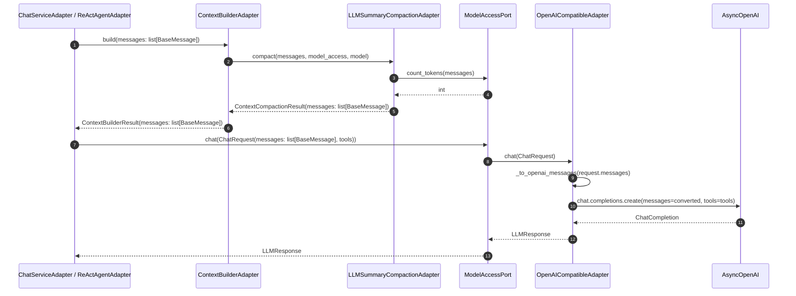

# 设计文档：model_access 协议封装边界归位

## 概述

本次重构把"领域消息 → OpenAI Chat Completions 协议字典"的转换、以及 token 估算
两类长期错位职责，从 `infrastructure/chat/` 与 `domain/model_access/value_objects.py`
归位到 `infrastructure/model_access/` 内每个具体 adapter。改造遵循
`docs/steering/ddd-architecture.md`（Port/Adapter、依赖方向、infrastructure 完成
技术转换）、`docs/steering/code-documentation.md`（中文 docstring）、
`docs/steering/uv-package-manager.md`（uv 唯一）、`docs/steering/config-source.md`
（`config.properties` 优先）四份强制规范。

```
[改造前]
ChatService / ReActAgent
   │ 已丢失领域类型
   ▼
ContextBuilderAdapter.build(messages: list[BaseMessage])
   │ infrastructure/chat/message_serialization.serialize_messages()
   ▼
list[dict OpenAI 协议]                       ← 协议化已被提前完成
   │
   ▼
ChatRequest.messages: list[dict[str, Any]]   ← 端口契约已 OpenAI 协议化
   │
   ▼
OpenAICompatibleAdapter._build_params()
   params["messages"] = request.messages     ← 直接透传

token 估算路径：
TokenCounter.count_message → serialize_messages → tiktoken
                              （强行字典化，与 Provider 绑定）
```

```
[改造后]
ChatService / ReActAgent
   │ 全程持有领域消息
   ▼
ContextBuilderAdapter.build(messages: list[BaseMessage])
   │ 不再 import message_serialization
   ▼
ContextBuilderResult.messages: list[BaseMessage]   ← 字段重命名 + 类型升级
   │
   ▼
ChatRequest.messages: list[BaseMessage]            ← 端口契约去协议化
   │
   ▼
OpenAICompatibleAdapter._build_params()
   ① _to_openai_messages(request.messages)   ← adapter 内私有协议转换
   ② params["messages"] = converted

token 估算路径：
ModelAccessPort.count_tokens(messages: list[BaseMessage]) -> int
   │
   ▼
OpenAICompatibleAdapter.count_tokens   ← Provider 持有自己的 tokenizer
                                          上游不再依赖 tiktoken
```

## 设计决策

| 决策 | 选项 | 选择 | 理由 |
| --- | --- | --- | --- |
| `ChatRequest.tools` 处置 | A 维持 `list[dict]`，语义改为"由 adapter 内部翻译"；B 引入领域 `ToolSchema` 值对象 | **A** | 本次治理的核心是请求消息侧；`ToolSchema` 域建模会牵动 `ToolRegistry.get_schemas`、`AgentConfig.tool_schemas`、`DelegationAdapter`、`TaskAgentAdapter`、`ChatServiceAdapter` 至少 5 个上游，且必须先约定跨 Provider 的最大公约数 schema，远超本次范围。A 方案保留现有 `list[dict]` 数据形状，仅在 `ChatRequest.tools` docstring 中删除"OpenAI function calling schema"硬绑定，明确语义为"opaque tool schema 列表，由具体 adapter 翻译"。`ToolSchema` 域建模留给后续单独 spec（与新增 Anthropic/Bedrock adapter 的需求一同推进）。 |
| `ContextBuilderResult.serialized_messages` 字段处置 | A 重命名为 `messages`；B 保留旧名仅改类型 | **A 重命名** | 旧名 `serialized_messages` 字面就暗示"已序列化为协议字典"，与新类型 `list[BaseMessage]`（领域消息）语义直接冲突；保留旧名会持续误导阅读者。引用面已用 grep 全量定位（生产代码 4 处 + 测试 30+ 处），机械替换可控。 |
| `infrastructure/chat/message_serialization.py` 处置 | A 删除，把逻辑搬到 `OpenAICompatibleAdapter` 内部静态方法；B 保留为 adapter 内部依赖 | **A 删除** | 该模块所在目录 `infrastructure/chat/` 与归口 adapter 所在目录 `infrastructure/model_access/` 不属于同一限界上下文；保留会让"OpenAI 协议字典生成器"以共享形态继续暴露，违反需求 2 验收标准 3-4 的归口意图。删除后等价逻辑作为 `OpenAICompatibleAdapter._to_openai_messages` 私有静态方法存在，单一所有权。 |
| `TokenCounter` 处置 | A 删除；B 简化为 thin wrapper 委派给 `ModelAccessPort` | **A 删除** | `TokenCounter` 的存在前提是"上游可以不依赖 ModelAccessPort 即拿到 token 计数"。本次需求 3 已把 token 计数职责正式上升到端口；保留 wrapper 等于保留两条估算路径，违反需求 3 验收标准 3。删除后 `LLMSummaryCompactionAdapter` 直接通过注入的 `ModelAccessPort` 完成估算。 |
| Token 计数方法签名 | A `count_tokens(messages: list[BaseMessage]) -> int`；B `count_text(text: str) -> int`；C 两者并存 | **A** | 当前唯一消费方 `LLMSummaryCompactionAdapter.compact` 用的是消息列表估算（用于压缩触发阈值判定）。`count_text` 候选用例（直接对纯文本计数）当前没有任何调用点，YAGNI；若未来出现可再追加。单一签名让端口最小、与压缩阈值判定一一对应。 |
| Token 计数 encoding 选择策略 | A Provider 绑定（每个 adapter 自己决定 encoding 名）；B 端口接收 model 名做按需选择 | **A** | `OpenAICompatibleAdapter` 的 5 个 OpenAI 兼容 Provider 全部使用 OpenAI 体系的 BPE 词表，沿用既有 `cl100k_base` 即可；按 model 选择会增加复杂度而无可观察收益。未来 Anthropic/Bedrock adapter 引入时各自决定 tokenizer。 |
| `count_tokens` 的 encoding 来源 | A 复用既有 `CHAT_COMPACTION_ENCODING` 配置；B 新增 `MODEL_OPENAI_COMPATIBLE_TOKENIZER_ENCODING` 配置 | **A** | 既有配置语义本就是"OpenAI 体系下的 token 估算 encoding"，迁移阵地后语义不变。新增配置会让运维表面变大却没有增量价值。 |
| `ChatRequest.__post_init__` 校验 | A 校验所有元素 `isinstance(BaseMessage)`；B 弱化为非空校验 | **A** | 需求 1 验收标准 2 明确要求按"BaseMessage 子类实例"校验。强校验在端口边界把违反契约的输入立即放大暴露，与既有 `ToolCallRequest.__post_init__` 风格一致。 |
| `ReActAgentAdapter._serialize_messages` 处置 | A 立即删除；B 保留为废弃别名 | **A 立即删除** | 该静态方法是 ChatServiceAdapter 历史迁移期残留，当前仅在测试文件被引用为"等价输出参考"。需求 4 验收标准 3 允许任一选项；删除路径更干净，避免"已弃用但仍可用"的灰色态长期残留。 |
| 摘要 prompt 中历史消息字符串化 | A 用 `BaseMessage.to_dict()` + `json.dumps`；B 新增可读化函数（如纯文本拼接） | **A** | 既有摘要 prompt 已经针对"角色 + content + tool_calls 嵌套"的字典结构做训练；改成纯文本拼接会破坏摘要质量。`BaseMessage.to_dict()` 输出的字典不是 OpenAI 协议字典（不含 `type:function` 嵌套等 OpenAI 特化形态），属于领域自身序列化能力，使用合规。 |

## 架构

### 组件级依赖关系（关心改造影响的部分）

```
domain/                              ← 不引入新依赖
├── chat/
│   ├── context.py        BaseMessage / SystemMessage / UserMessage /
│   │                     AssistantMessage / ToolMessage（不变）
│   ├── value_objects.py  ContextBuilderResult        ← 字段类型与名称调整
│   └── ports.py          ContextBuilderPort（不变）
└── model_access/
    ├── ports.py          ModelAccessPort             ← 新增 count_tokens
    └── value_objects.py  ChatRequest                 ← messages 类型升级、tools docstring 调整

infrastructure/
├── chat/
│   ├── context_builder_adapter.py        ← 移除 serialize_messages 调用
│   ├── llm_summary_compaction_adapter.py ← 取消 TokenCounter 依赖、改用 ModelAccessPort
│   ├── message_serialization.py          ← 整体删除
│   └── token_counter.py                  ← 整体删除
├── agent/
│   └── react_agent_adapter.py            ← 删除 _serialize_messages、不再 import serialize_messages
└── model_access/
    └── openai_compatible_adapter.py      ← 新增 _to_openai_messages、count_tokens

application/
└── container_config.py                   ← 调整 _create_compaction_adapter 装配
```

### 改造前后跨组件调用序列对照



## 组件与接口

### 1. `domain/model_access/value_objects.py::ChatRequest`

**位置**：`epsilon-boot/src/domain/model_access/value_objects.py`
**职责**：领域请求值对象，本次承载领域消息列表，不再承载协议字典。

完整签名（保留 frozen dataclass 形态、保留所有既有字段）：

```python
from dataclasses import dataclass, field
from typing import Any, TYPE_CHECKING

if TYPE_CHECKING:
    from domain.chat.context import BaseMessage


@dataclass(frozen=True)
class ChatRequest:
    """对话请求值对象。

    封装一次 LLM 对话调用所需的全部参数。``messages`` 字段承载领域消息
    列表（``BaseMessage`` 及其子类），不感知任何具体 LLM 协议形态；
    协议字典化（OpenAI Chat Completions / Anthropic Messages / Gemini
    contents 等）由 ``ModelAccessPort`` 的具体 adapter 在 SDK 调用前
    自行完成。

    Attributes:
        messages: 对话消息列表，元素为 ``BaseMessage`` 子类实例
            （``SystemMessage`` / ``UserMessage`` / ``AssistantMessage`` /
            ``ToolMessage``）。不可为空。
        model: 可选的模型名称，未指定时使用配置的默认模型。
        temperature: 可选的温度参数（0.0-2.0），控制输出随机性。
        max_tokens: 可选的最大 token 数，限制响应长度。
        system: 可选的 system 消息（Claude 风格），优先于 messages 中的 system 角色。
        provider: 可选的显式提供商指定（"openai"、"claude" 等），用于强制路由。
        thinking: 可选的 Claude Extended Thinking 配置。
        tools: 可选的工具 schema 列表。当前承载 opaque ``list[dict]`` 形态，
            语义为"由具体 adapter 翻译为目标 Provider 的工具 schema 表示"，
            **不再硬绑定 OpenAI function calling 形态**。``None`` 表示
            不传递工具信息，空列表 ``[]`` 视为"无工具"，均不会传递给底层
            SDK。后续若需引入领域 ``ToolSchema`` 值对象，预留独立 spec
            治理。
        extra_params: 扩展参数字典，用于传递特定模型的自定义参数。
    """

    messages: "list[BaseMessage]"
    model: str | None = None
    temperature: float | None = None
    max_tokens: int | None = None
    system: str | None = None
    provider: str | None = None
    thinking: ThinkingConfig | None = None
    tools: list[dict[str, Any]] | None = None
    extra_params: dict[str, Any] | None = None

    def __post_init__(self) -> None:
        """验证请求参数的合法性。

        校验规则：

        - ``messages`` 不能为空；
        - 所有元素必须为 ``BaseMessage`` 子类实例；不再校验字典是否包含
          ``role`` / ``content`` 键。
        - ``temperature`` 在 ``[0.0, 2.0]`` 范围；
        - ``max_tokens`` 为正整数（如指定）。
        """
        # import 本地化以避免与 frozen dataclass 顺序冲突，且让 domain/chat 模块
        # 的依赖在 __post_init__ 调用时按需解析（避免环引用风险）。
        from domain.chat.context import BaseMessage

        if not self.messages:
            raise ValueError("messages 不能为空")

        for index, msg in enumerate(self.messages):
            if not isinstance(msg, BaseMessage):
                raise ValueError(
                    f"messages[{index}] 必须为 BaseMessage 子类实例，当前类型: {type(msg).__name__}"
                )

        if self.temperature is not None and not 0.0 <= self.temperature <= 2.0:
            raise ValueError(f"temperature 必须在 0.0-2.0 之间，当前值: {self.temperature}")

        if self.max_tokens is not None and self.max_tokens <= 0:
            raise ValueError(f"max_tokens 必须大于 0，当前值: {self.max_tokens}")
```

### 2. `domain/model_access/ports.py::ModelAccessPort`

**位置**：`epsilon-boot/src/domain/model_access/ports.py`
**职责**：表达"与 LLM 交互"的业务能力，新增 token 计数能力。

新增方法签名：

```python
class ModelAccessPort(Protocol):
    # ... 既有 chat / stream 方法保持不变 ...

    def count_tokens(self, messages: "list[BaseMessage]") -> int:
        """估算给定领域消息列表的 token 数量。

        本方法用于上游编排层（典型为 ``LLMSummaryCompactionAdapter``）判定
        是否触发上下文摘要压缩等阈值类决策。返回值仅供阈值比较，**不**作为
        硬性截断上限；上游不应依赖跨 Provider 的绝对一致性。

        实现要求：

        - 每个具体 adapter 应使用与对应 Provider tokenizer 一致或近似的算法
          （OpenAI 兼容 adapter 使用 ``tiktoken``，Anthropic adapter 应使用
          其自身 tokenizer，Bedrock/Gemini 等可使用通用 BPE 或字符长度近似，
          需在 docstring 中显式说明回退策略）；
        - 返回值为非负整数；
        - 实现应是同步的（协议为 ``def`` 而非 ``async def``），与单次估算
          的纯计算属性保持一致；上游对该方法的调用不应被网络/IO 阻塞。

        Args:
            messages: 领域消息列表，元素为 ``BaseMessage`` 子类实例。
                空列表合法，返回 ``0``。

        Returns:
            非负整数，估算的 token 总数。
        """
        ...
```

### 3. `domain/chat/value_objects.py::ContextBuilderResult`

**位置**：`epsilon-boot/src/domain/chat/value_objects.py`
**职责**：上下文构建结果值对象。本次把 `serialized_messages` 字段重命名为
`messages` 并升级类型；其它字段保持不变。

完整签名：

```python
from dataclasses import dataclass, field
from typing import Any, TYPE_CHECKING

if TYPE_CHECKING:
    from domain.chat.context import BaseMessage


@dataclass(frozen=True)
class ContextBuilderResult:
    """上下文构建结果值对象。

    表达单次模型调用可直接使用的领域消息列表、上下文构建阶段 usage、
    摘要生成标记、环境上下文注入标记，以及轻量观测元数据。``messages``
    字段承载 ``BaseMessage`` 子类实例列表，不再承载 OpenAI 协议字典；
    具体协议转换由 ``ModelAccessPort`` 的具体 adapter 在 SDK 调用前
    自行完成。
    """

    messages: "list[BaseMessage]"
    usage: dict[str, int] = field(default_factory=dict)
    summary_created: bool = False
    environment_injected: bool = False
    metadata: dict[str, Any] = field(default_factory=dict)

    def __post_init__(self) -> None:
        """校验上下文构建结果结构合法。

        校验规则：

        - ``messages`` 必须为 ``list``；
        - ``messages`` 不能为空；
        - 所有元素必须为 ``BaseMessage`` 子类实例（不再校验是否为含
          ``role`` / ``content`` 键的 ``dict``）；
        - ``usage`` 的 value 必须为非负整数；
        - ``metadata`` 必须为 ``dict``。
        """
        from domain.chat.context import BaseMessage

        if not isinstance(self.messages, list):
            raise ValueError("messages 必须为 list")
        if not self.messages:
            raise ValueError("messages 不能为空")
        for index, message in enumerate(self.messages):
            if not isinstance(message, BaseMessage):
                raise ValueError(
                    f"messages[{index}] 必须为 BaseMessage 子类实例，当前类型: {type(message).__name__}"
                )
        for key, value in self.usage.items():
            if not isinstance(key, str):
                raise ValueError("usage key 必须为 str")
            if type(value) is not int:
                raise ValueError(f"usage[{key!r}] 必须为 int")
            if value < 0:
                raise ValueError(f"usage[{key!r}] 必须为非负整数")
        if not isinstance(self.metadata, dict):
            raise ValueError("metadata 必须为 dict")
```

> 字段重命名影响面（grep 全量定位，须同步迁移，由 tasker 切分子任务）：
>
> - 生产代码 5 处：`infrastructure/chat/context_builder_adapter.py`（构造端）、
>   `infrastructure/agent/react_agent_adapter.py:751,1321,1384`、
>   `infrastructure/chat/chat_service_adapter.py:235,385,445`。
> - 测试代码约 30 处（详见 `serialized_messages` grep 结果），机械替换为 `messages`。
> - 注意 `ContextBuilderResult` 的字段名 `messages` 与 `ContextCompactionResult`
>   现有字段名 `messages` 一致，二者语义连贯（均为领域消息列表）。

### 4. `infrastructure/model_access/openai_compatible_adapter.py::OpenAICompatibleAdapter`

**位置**：`epsilon-boot/src/infrastructure/model_access/openai_compatible_adapter.py`
**职责**：OpenAI 兼容协议适配器；本次承担"领域消息 → OpenAI 字典"协议转换、
新增 `count_tokens` 实现。

#### 4.1 新增私有静态方法 `_to_openai_messages`

```python
@staticmethod
def _to_openai_messages(messages: "list[BaseMessage]") -> list[dict[str, Any]]:
    """把领域消息列表转换为 OpenAI Chat Completions API 所需的字典列表。

    转换规则（与 commit 040695a 加固后的现 ``serialize_messages`` 完全等价）：

    - ``AssistantMessage`` 携带 ``tool_calls`` 时输出 OpenAI ``tool_calls``
      嵌套结构 ``{"id", "type": "function", "function": {"name", "arguments"}}``；
    - ``ToolMessage`` 输出 ``role`` / ``content`` / ``tool_call_id``；
    - 其他消息（``SystemMessage`` / ``UserMessage`` / 不携带 ``tool_calls``
      的 ``AssistantMessage``）仅输出 ``role`` 与 ``content``。

    本方法**不**对 ``AssistantMessage.tool_calls`` 中每个 ``ToolCallRequest``
    的 ``id`` 做额外校验——``ToolCallRequest.__post_init__`` 已强制
    ``id`` 非空，且 commit 040695a 在所有上游入站链路（同步/流式响应解析、
    历史会话恢复、审批 resume）已统一加固 id 校验，本方法仅信任已通过
    校验的领域消息。

    Args:
        messages: 领域消息列表。

    Returns:
        OpenAI Chat Completions API 兼容的字典列表，可直接作为
        ``chat.completions.create(..., messages=...)`` 的入参。
    """
```

#### 4.2 `_build_params` 改造点

```python
def _build_params(self, request: ChatRequest, *, stream: bool) -> dict[str, Any]:
    """构建 OpenAI SDK 调用参数。

    本方法在调用 SDK 前完成领域消息到 OpenAI 字典的协议转换，使端口契约
    （``ChatRequest``）持续承载领域消息，协议细节封闭在本 adapter 内。

    ...（其余 docstring 沿用既有内容，仅修正"messages 已是字典"假设）...
    """
    model = request.model or self._config.default_model
    params: dict[str, Any] = {
        "model": model,
        "messages": self._to_openai_messages(request.messages),  # ← 关键改动
        "temperature": request.temperature if request.temperature is not None else self._config.temperature,
        "max_tokens": request.max_tokens if request.max_tokens is not None else self._config.max_tokens,
        "stream": stream,
    }
    if stream:
        params["stream_options"] = {"include_usage": True}
    if request.tools:
        params["tools"] = request.tools
    if request.extra_params:
        params.update(request.extra_params)
    return params
```

#### 4.3 新增 `count_tokens` 方法与 encoding 持有

构造期一次性加载 `tiktoken` encoding，复用 `chat_config.compaction_encoding`：

```python
def __init__(
    self,
    config: ProviderConfig,
    retry_attempts: int = 1,
    *,
    tokenizer_encoding: str | None = None,
) -> None:
    """初始化适配器。

    新增参数 ``tokenizer_encoding`` 指定 tiktoken encoding 名称，由组合根
    （``container_config._create_openai_compatible_adapter`` 等装配点）
    从 ``chat_config.compaction_encoding``（默认 ``cl100k_base``）注入；
    None 时回退到 ``cl100k_base``，与既有 ``CHAT_COMPACTION_ENCODING`` 默认值
    一致。

    Raises:
        ConfigurationError: encoding 名称非法或无法加载时抛出，沿用
            ``common.configuration.ConfigurationError``。
    """
    # ...既有逻辑保持...
    encoding_name = tokenizer_encoding or "cl100k_base"
    try:
        self._tokenizer = tiktoken.get_encoding(encoding_name)
    except Exception as exc:
        raise ConfigurationError(
            f"CHAT_COMPACTION_ENCODING 非法或不可用: {encoding_name}"
        ) from exc

def count_tokens(self, messages: "list[BaseMessage]") -> int:
    """基于 tiktoken 估算领域消息列表的 token 数。

    实现等价于改造前 ``TokenCounter.count_messages`` 的算法语义：

    1. 对每条消息，先通过 ``_to_openai_messages([message])[0]`` 取得
       OpenAI 协议字典（保留与既有 token 估算一致的字符面）；
    2. 用 ``json.dumps(..., ensure_ascii=False, sort_keys=True,
       separators=(",", ":"))`` 序列化为紧凑 JSON 字符串；
    3. 用 tiktoken encoding 计算 token 数 + 4 token "消息开销"
       （沿用 ``TokenCounter._MESSAGE_OVERHEAD = 4``，与改造前一致以
       保证压缩触发阈值不退化）；
    4. 总 token 数为各消息 token 数之和；空列表返回 0。

    Args:
        messages: 领域消息列表。

    Returns:
        非负整数，token 估算总数。
    """
```

实现时**不**新增对 `serialize_messages` 的依赖——`_to_openai_messages` 已在同
adapter 内，token 计数路径与协议转换路径共用同一份转换函数。

> 说明：`count_tokens` 内部沿用 `_to_openai_messages` 是为了让"估算结果"与
> 改造前完全等价（满足需求 3 验收标准 5），代价是估算函数与 OpenAI 协议
> 形态在 OpenAI 兼容 adapter 内**强耦合**——这是合理的，因为本就是 OpenAI
> 兼容 adapter；其他 Provider 的 adapter 各自决定 tokenizer 算法。

### 5. `infrastructure/chat/context_builder_adapter.py::ContextBuilderAdapter`

**位置**：`epsilon-boot/src/infrastructure/chat/context_builder_adapter.py`
**职责**：上下文构建适配器；本次取消 `serialize_messages` 调用，输出领域消息列表。

改造后 `build` 方法尾部：

```python
async def build(
    self,
    messages: list[BaseMessage],
    *,
    model_access: ModelAccessPort | None = None,
    model: str | None = None,
) -> ContextBuilderResult:
    """构建单次模型调用的领域消息列表。

    输出的 ``ContextBuilderResult.messages`` 为领域消息（``BaseMessage``
    子类）列表，**不再**进行 OpenAI 协议字典化；具体协议转换由
    ``ModelAccessPort`` 的具体 adapter 在 SDK 调用前自行完成。
    """
    # ...既有 compaction + environment 注入逻辑保持...
    combined_messages = (
        self._insert_environment_context(compacted_messages, environment_text)
        if environment_injected
        else compacted_messages
    )
    return ContextBuilderResult(
        messages=combined_messages,                           # ← 不再 serialize_messages
        usage=dict(compaction_result.usage),
        summary_created=compaction_result.summary_created,
        environment_injected=environment_injected,
    )
```

模块顶部不再 `from infrastructure.chat.message_serialization import serialize_messages`。

### 6. `infrastructure/chat/llm_summary_compaction_adapter.py::LLMSummaryCompactionAdapter`

**位置**：`epsilon-boot/src/infrastructure/chat/llm_summary_compaction_adapter.py`
**职责**：基于 token 触发的 LLM 语义摘要压缩适配器；本次取消 `TokenCounter`
注入、改用 `ModelAccessPort.count_tokens`，并改造 `_build_summary_request`
不再生成 OpenAI 协议字典。

#### 6.1 构造签名改造

```python
class LLMSummaryCompactionAdapter:
    """基于 token 触发的 LLM 语义摘要上下文压缩适配器。

    本适配器不再持有 ``TokenCounter``——token 计数职责已上升到
    ``ModelAccessPort.count_tokens``。``compact`` 入口需要 ``model_access``
    形参（既有签名已包含），用其计算消息列表的 token 数与 ``trigger_tokens``
    比较；当 ``model_access`` 为 ``None``（典型为单元测试 stub），按
    既有 fallback 行为降级到滑动窗口策略。
    """

    def __init__(
        self,
        *,
        prompt_registry: PromptRegistryPort,
        trigger_tokens: int,
        keep_recent_messages: int,
        fallback: SlidingWindowCompactionAdapter,
    ) -> None:
        """初始化摘要压缩适配器并加载摘要 Prompt。

        改造点：移除 ``token_counter`` 形参，因为 token 计数职责已通过
        ``ModelAccessPort.count_tokens`` 在 ``compact`` 入口完成。

        Args:
            prompt_registry: Prompt 注册端口，用于加载摘要 prompt。
            trigger_tokens: 触发摘要压缩的 token 阈值，必须为正整数。
            keep_recent_messages: 摘要后保留的最近非 system 消息数。
            fallback: 摘要失败时的滑动窗口降级策略适配器。
        """
        if trigger_tokens <= 0:
            raise ValueError("trigger_tokens 必须为正整数")
        if keep_recent_messages <= 0:
            raise ValueError("keep_recent_messages 必须为正整数")
        self._prompt: LoadedPrompt = prompt_registry.get("context-summary")
        self._trigger_tokens = trigger_tokens
        self._keep_recent_messages = keep_recent_messages
        self._fallback = fallback
```

#### 6.2 `compact` 内部对 token 计数的调用

```python
async def compact(
    self,
    messages: list[BaseMessage],
    *,
    model_access: ModelAccessPort | None = None,
    model: str | None = None,
) -> ContextCompactionResult:
    """按 token 阈值压缩消息列表。

    Token 估算路径变化：改造前由构造期注入的 ``TokenCounter`` 完成，
    改造后通过本方法形参 ``model_access`` 调用 ``count_tokens`` 完成。
    当 ``model_access`` 为 ``None`` 时（典型测试 stub 场景），按 fallback
    行为降级到滑动窗口策略。
    """
    if model_access is None:
        return await self._fallback_with_warning(
            messages, reason_class="ModelAccessMissing"
        )
    if model_access.count_tokens(messages) < self._trigger_tokens:
        return ContextCompactionResult(messages=list(messages))
    # ...其余分支保持原逻辑...
```

> 边界说明：改造前 `compact` 在 `model_access is None` 时仅在"判断需要 LLM 摘要
> 后"才降级，本次因为 token 计数也依赖 `model_access`，提前到入口降级；这与
> 既有降级语义一致（无 model_access 即无 LLM 摘要可做），不引入新行为。

#### 6.3 `_build_summary_request` 改造

```python
def _build_summary_request(
    self,
    messages: list[BaseMessage],
    *,
    model: str | None,
) -> ChatRequest:
    """构造摘要模型调用请求。

    摘要 prompt 中历史消息字符串化路径：使用 ``BaseMessage.to_dict()``
    输出（领域自身序列化能力，不含 OpenAI ``tool_calls`` 嵌套等协议特化
    形态），再经 ``json.dumps`` 序列化为可读 JSON。``ChatRequest.messages``
    本身承载领域 ``SystemMessage`` / ``UserMessage`` 而非协议字典，与
    新端口契约对齐。
    """
    serialized = [m.to_dict() for m in messages]
    content = json.dumps(serialized, ensure_ascii=False, indent=2)
    return ChatRequest(
        messages=[
            SystemMessage(content=self._prompt.content),
            UserMessage(content=content),
        ],
        model=model,
    )
```

### 7. `infrastructure/agent/react_agent_adapter.py::ReActAgentAdapter`

**位置**：`epsilon-boot/src/infrastructure/agent/react_agent_adapter.py`
**职责**：本次仅做"取消 OpenAI 协议字典生成"的改造点：

- **删除** 静态方法 `_serialize_messages`（约 217-236 行）；
- **删除** 顶部 `from infrastructure.chat.message_serialization import serialize_messages` 导入；
- 三个 `ChatRequest(messages=builder_result.serialized_messages, ...)` 调用点
  （751、1321、1384 行）改为 `ChatRequest(messages=builder_result.messages, ...)`，
  传入领域消息列表；
- `tools=config.tool_schemas` 不变（Tool_Schema 处置走 A 方案）。

不调整 `_iter_rounds` / `_stream_final_round` / `_stream_events_final_round`
等流程逻辑，仅改 `ChatRequest` 构造点的入参字段名。

### 8. `infrastructure/chat/chat_service_adapter.py::ChatServiceAdapter`

**位置**：`epsilon-boot/src/infrastructure/chat/chat_service_adapter.py`
**职责**：本次仅做最小调整：3 处 `ChatRequest(messages=builder_result.serialized_messages, ...)`
（235、385、445 行）改为 `ChatRequest(messages=builder_result.messages, ...)`。

### 9. 删除模块

- **删除**：`epsilon-boot/src/infrastructure/chat/message_serialization.py`（顶层 `serialize_messages` 函数所在文件）
- **删除**：`epsilon-boot/src/infrastructure/chat/token_counter.py`（`TokenCounter` 类所在文件）

### 10. 组合根装配调整

**位置**：`epsilon-boot/src/application/container_config.py`
**改造点**：

- `_create_compaction_adapter`：
  - 移除 `from infrastructure.chat.token_counter import TokenCounter` 导入；
  - 不再向 `LLMSummaryCompactionAdapter` 传 `token_counter` 形参；
  - 注释或删除 `chat_config.compaction_encoding` 在该装配点的使用（移到 OpenAI adapter 装配点）。
- `OpenAICompatibleAdapter` 的装配点（搜索 `OpenAICompatibleAdapter(` 的全部装配
  调用）：构造时注入 `tokenizer_encoding=chat_config.compaction_encoding`。

## 数据模型

### 领域消息层次（不变，仅复述消费方）

`BaseMessage`（abstract，`kw_only=True`，`content: str` + `metadata: dict`）：

- `SystemMessage`（`role="system"`）
- `UserMessage`（`role="user"`）
- `AssistantMessage`（`role="assistant"`，可选 `tool_calls: list[ToolCallRequest]`）
- `ToolMessage`（`role="tool"`，`tool_name: str`、`tool_call_id: str`）

序列化能力 `BaseMessage.to_dict()`：领域自身的字典化（含 `role` / `content` /
可选 `tool_calls` / `tool_name` / `tool_call_id`），**不**等同于 OpenAI 协议字典
（OpenAI 协议字典对 `tool_calls` 嵌套 `{"type": "function", "function": {...}}`
两层结构，领域字典只暴露平铺的 `{id, name, arguments}`）。本次摘要 prompt 输入
使用领域字典，避免跨边界。

### OpenAI 协议字典（adapter 内部数据形态）

```json
[
  {"role": "system", "content": "..."},
  {"role": "user",   "content": "..."},
  {"role": "assistant", "content": "...",
   "tool_calls": [
     {"id": "call_xxx", "type": "function",
      "function": {"name": "search", "arguments": "{\"q\":\"...\"}"}}
   ]},
  {"role": "tool", "content": "...", "tool_call_id": "call_xxx"}
]
```

该形态仅作为 `OpenAICompatibleAdapter._to_openai_messages` 的输出 / SDK 入参
存在，不再跨越 `infrastructure/model_access/` 边界。

### 配置键（无新增）

| 配置键 | 默认值 | 文件 | 说明 |
| --- | --- | --- | --- |
| `CHAT_COMPACTION_ENCODING` | `cl100k_base` | `epsilon-boot/config.properties` | tiktoken encoding 名称；本次仅迁移消费点（从 `TokenCounter` 移到 `OpenAICompatibleAdapter`），键名与默认值不变 |
| `CHAT_COMPACTION_TRIGGER_TOKENS` | `8000` | 同上 | 不变 |
| `CHAT_COMPACTION_KEEP_RECENT_MESSAGES` | `20` | 同上 | 不变 |

> 满足 `docs/steering/config-source.md`：所有配置仍由 `config.properties` 提供。

## 事务与并发边界

本次治理为内部边界归位，不涉及数据库写入、事务管理器或跨进程操作。
- 无新增数据源；
- 无消息队列；
- `OpenAICompatibleAdapter._tokenizer` 在构造期一次性加载，运行期只读，
  无并发写入风险；
- `ChatRequest` 仍为 frozen dataclass，跨协程传递安全；
- `ContextBuilderResult` 仍为 frozen dataclass。

故本节不展开，亦不需要跨事务边界的补偿设计。

## 正确性属性

### Property 1：协议转换字面等价

对于任意 `messages: list[BaseMessage]` 输入，`OpenAICompatibleAdapter._to_openai_messages(messages)`
的输出与改造前 `infrastructure.chat.message_serialization.serialize_messages(messages)`
的输出字典级相等（dict-equal）。

**验证需求**：需求 2 验收标准 1、5；需求 5 验收标准 1。

### Property 2：端口契约校验严格性

任何元素不为 `BaseMessage` 子类实例的 `messages` 都会让 `ChatRequest.__post_init__`
抛出 `ValueError`，且错误消息能定位到首个违规元素的 index 与实际类型名。

**验证需求**：需求 1 验收标准 2、5。

### Property 3：Token 估算阈值判定不退化

对于任意 `messages: list[BaseMessage]` 与给定 `trigger_tokens` 阈值，
`OpenAICompatibleAdapter.count_tokens(messages) >= trigger_tokens` 与改造前
`TokenCounter(encoding="cl100k_base").count_messages(messages) >= trigger_tokens`
布尔结果一致。

**验证需求**：需求 3 验收标准 5；需求 5 验收标准 5。

### Property 4：tool_call.id 校验语义保留

任何让改造前 `OpenAICompatibleAdapter.chat` 抛 `InvalidToolCallIdError` 的入站
SDK 响应（commit `040695a` 加固的链路），改造后仍抛同一异常类型且
`source` / `provider` / `model` / `tool_name` / `tool_call_index` 字段一致。

**验证需求**：需求 2 验收标准 6；需求 5 验收标准 1。

### Property 5：流式 `_materialize_full_tool_calls` 契约不变

改造后 `_materialize_full_tool_calls` 行为不变：按 `index` 升序、空串归 `None`、
纯文本流返回 `None`、`finished=True` 分片中 `id` / `name` / `arguments_delta`
三者均非 `None`（来自累积态保证）。

**验证需求**：需求 5 验收标准 3。

### Property 6：摘要 prompt 字符串化形态稳定

`LLMSummaryCompactionAdapter._build_summary_request(messages, model)` 输出的
`ChatRequest.messages` 第二条 `UserMessage.content` 是 `BaseMessage.to_dict()`
列表的 `json.dumps(..., indent=2, ensure_ascii=False)` 输出；不含 OpenAI
协议字典专有字段（如 `"type": "function"` 嵌套）。

**验证需求**：需求 4 验收标准 4。

### Property 7：DDD 反向依赖屏蔽

改造后 `domain/model_access/` 与 `domain/chat/` 模块不 import 任何
`infrastructure/*` 或 `tiktoken` / `openai` SDK；`common/` 不被反向污染。

**验证需求**：需求 7 验收标准 1、2。

## 错误处理

本次改造**不引入新的错误返回风格**，全程沿用既有领域异常体系：

| 错误类型 | 触发场景 | 沿用 / 新增 |
| --- | --- | --- |
| `ValueError` | `ChatRequest.__post_init__` / `ContextBuilderResult.__post_init__` 校验失败 | 沿用 |
| `domain.model_access.exceptions.ModelTimeoutError` | OpenAI SDK `APITimeoutError` | 沿用，映射不变 |
| `domain.model_access.exceptions.ModelRateLimitError` | OpenAI SDK `RateLimitError`（HTTP 429） | 沿用，映射不变 |
| `domain.model_access.exceptions.ModelConnectionError` | OpenAI SDK `APIConnectionError` | 沿用，映射不变 |
| `domain.model_access.exceptions.ModelAccessError` | OpenAI SDK `APIError` 等其它错误 | 沿用，映射不变 |
| `domain.model_access.exceptions.InvalidToolCallIdError` | adapter 解析 `tool_calls[i].id` 为 None / 空串 | 沿用，commit `040695a` 加固语义不变 |
| `common.configuration.ConfigurationError` | 构造期加载 tiktoken encoding 失败 | 沿用，错误消息保持 `CHAT_COMPACTION_ENCODING 非法或不可用` |

错误传播原则（与既有保持一致）：

- 端口入口（`__post_init__`）抛 `ValueError`，让上游编排层在构造时立即失败；
- adapter 内部 SDK 异常翻译为 `domain.model_access.exceptions` 下的领域异常；
- `LLMSummaryCompactionAdapter` 在 token 计数 / LLM 摘要任一阶段失败时，
  通过 `_fallback_with_warning` 静默降级到滑动窗口策略，保留 warning 日志
  以维持可观测性。

## 测试策略

测试框架沿用项目既有 `pytest` + `hypothesis`（参见 `pyproject.toml` 与既有
`test/**/*_unit.py`、`test/**/*_property.py` 命名约定）。运行入口：
`uv run pytest`（满足 `docs/steering/uv-package-manager.md`）。

### 新增测试

#### A. `test/infrastructure/model_access/test_openai_compatible_message_conversion_unit.py`（新增）

针对 `OpenAICompatibleAdapter._to_openai_messages` 的协议转换单元测试，覆盖
需求 6 验收标准 1：

- `test_convert_plain_system_user_assistant_messages` —— 仅含 SystemMessage /
  UserMessage 输出 `{"role", "content"}` 字典；
- `test_convert_assistant_with_tool_calls_outputs_openai_nested_shape` ——
  `AssistantMessage` 携带 `tool_calls` 时输出 OpenAI 嵌套 `{"id", "type":
  "function", "function": {"name", "arguments"}}` 结构；
- `test_convert_tool_message_includes_tool_call_id` —— `ToolMessage` 输出
  `tool_call_id`；
- `test_convert_empty_list_returns_empty_list` —— 空列表返回空列表（边界）；
- `test_convert_does_not_mutate_input_messages` —— 输入列表不被修改。

#### B. `test/infrastructure/model_access/test_openai_compatible_count_tokens_unit.py`（新增）

针对 `OpenAICompatibleAdapter.count_tokens` 的 token 计数单元测试，覆盖
需求 6 验收标准 2：

- `test_count_tokens_empty_list_returns_zero` —— 空列表返回 0；
- `test_count_tokens_pure_text_messages_is_positive_int` —— 纯文本列表返回
  正整数；
- `test_count_tokens_with_tool_calls_is_positive_int` —— 含
  `AssistantMessage.tool_calls` 列表返回正整数；
- `test_count_tokens_invalid_encoding_raises_configuration_error` —— 构造时
  encoding 非法触发 `ConfigurationError`（迁移自 `test_token_counter_unit.py`）；
- `test_count_tokens_message_list_equals_sum_of_individual_messages` —— 列表
  计数等于逐条相加（迁移自 `test_token_counter_unit.py`）。

#### C. `test/domain/model_access/test_chat_request_post_init_unit.py`（新增 / 扩展现有 `test_value_objects.py`）

针对 `ChatRequest.__post_init__` 校验改造，覆盖需求 1 验收标准 2：

- `test_chat_request_rejects_non_base_message_element` —— 列表中混入 `dict`
  / `str` 等非领域消息元素时抛 `ValueError`，错误消息包含违规 index；
- `test_chat_request_accepts_all_concrete_subclasses` —— `SystemMessage` /
  `UserMessage` / `AssistantMessage` / `ToolMessage` 实例均通过校验；
- 既有 `test_chat_request_validation_still_works` 中的"缺少 role 或 content"
  分支调整为"非 BaseMessage 子类元素"。

#### D. `test/domain/chat/test_context_builder_result_unit.py`（改造现有）

把现有 `serialized_messages` 字段重命名 + 校验 `BaseMessage` 子类的断言：

- 把所有构造点的 `serialized_messages=[{"role": ..., "content": ...}]` 改为
  `messages=[UserMessage(content="...")]`；
- 把 `serialized_messages 不能为空` 错误消息断言改为 `messages 不能为空`；
- 把"必须包含 role / content 字典键"测试改为"必须为 BaseMessage 子类实例"；
- 覆盖需求 6 验收标准 4。

#### E. 端口级 fake adapter（新增 `test/domain/model_access/_fake_adapter.py` 或在测试中以 inline `class` 形式存在）

为满足需求 6 验收标准 5，提供一个不依赖 OpenAI SDK 的 `FakeModelAccessAdapter`：

```python
class FakeModelAccessAdapter:
    """端口级 stub，用于测试上游编排独立于 OpenAI SDK。

    仅实现 ``ModelAccessPort`` 协议的最小子集：``count_tokens`` 直接按
    ``sum(len(m.content) for m in messages)`` 估算（或测试自定义 lambda），
    ``chat`` / ``stream`` 在测试需要时自行 mock。
    """

    def __init__(self, count_fn: Callable[[list[BaseMessage]], int] | None = None) -> None: ...
    def count_tokens(self, messages: list[BaseMessage]) -> int: ...
    async def chat(self, request: ChatRequest) -> LLMResponse: ...
    def stream(self, request: ChatRequest) -> AsyncIterator[StreamingChunk]: ...
```

`test/infrastructure/chat/test_llm_summary_compaction_adapter_unit.py` 改造时
注入该 fake，验证：

- token 计数小于 `trigger_tokens` 时直接 short-circuit 返回原 messages；
- token 计数大于等于 `trigger_tokens` 时进入 LLM 摘要分支；
- `model_access=None` 时降级到滑动窗口（既有断言保留）。

### 迁移测试

#### F. `test/infrastructure/chat/test_message_serialization_unit.py`（迁移）

该文件原本针对 `serialize_messages` 顶层函数与 `ReActAgentAdapter._serialize_messages`。
改造方案：

- 把对 `serialize_messages` 的断言迁移到新文件 A
  （`test_openai_compatible_message_conversion_unit.py`），保留三类典型形态覆盖；
- 删除针对 `ReActAgentAdapter._serialize_messages` 的 compatibility shell 测试
  （静态方法已删除）；
- 整文件可删除（语义已被新文件 A 覆盖）。

#### G. `test/infrastructure/chat/test_token_counter_unit.py`（迁移）

该文件针对 `TokenCounter`。改造方案：

- 把 4 个测试用例迁移到新文件 B
  （`test_openai_compatible_count_tokens_unit.py`），断言对象从 `TokenCounter`
  改为 `OpenAICompatibleAdapter` 实例；
- 整文件删除。

### 调整既有测试

#### H. `ContextBuilderAdapter` 单元 / 属性测试

- `test/infrastructure/chat/test_context_builder_adapter_unit.py`：
  断言改为 `result.messages == [SystemMessage(...), UserMessage(...)]` 形态，
  不再断言字典字段；
- `test/infrastructure/chat/test_context_builder_properties.py`：
  `result.serialized` 改为 `result.messages`，对消息列表的内容断言保持。

#### I. `ReActAgentAdapter` 系列测试

约 30 个测试文件（grep `serialized_messages` 命中）需要把构造 `ContextBuilderResult`
的 fixture 从 `serialized_messages=[{"role": "user", "content": "..."}]` 改为
`messages=[UserMessage(content="...")]`，机械替换；同时取消对
`ReActAgentAdapter._serialize_messages` 的引用（删除该静态方法后）。

#### J. `LLMSummaryCompactionAdapter` 单元 / 属性测试

- `test/infrastructure/chat/test_llm_summary_compaction_adapter_unit.py`：
  把 `TokenCounter` 注入改为 fake `ModelAccessPort.count_tokens`；
- `test/infrastructure/chat/test_llm_summary_compaction_properties.py`：
  同上调整。

#### K. `ChatRequest(messages=...)` 调用点（约 10 个测试文件，grep 命中）

把 `messages=[{"role": "user", "content": "hi"}]` 改为
`messages=[UserMessage(content="hi")]`；测试代码改造为机械替换。

### 通过条件

`uv run pytest` 在仓库根目录（`epsilon-boot/`）执行通过，无 skip / xfail
新增；既有针对压缩触发阈值、`tool_call.id` 校验、流式 `_materialize_full_tool_calls`
契约的属性测试全部通过（满足需求 5 / 6 / 7 全集）。

### 测试 → 需求追溯

| 测试文件 / 用例 | 覆盖需求验收标准 |
| --- | --- |
| 文件 A 全部用例 | 需求 2.1、2.5；需求 6.1 |
| 文件 B 全部用例 | 需求 3.1、3.2、3.5；需求 6.2 |
| 文件 C 全部用例 | 需求 1.1、1.2 |
| 文件 D 改造用例 | 需求 4.2；需求 6.4 |
| 文件 E `FakeModelAccessAdapter` | 需求 6.5 |
| `test_openai_preservation_properties.py`（既有，已含 `_make_chat_request` fixture，需切到领域消息） | 需求 5.1 |
| `test_openai_compatible_chat_id_validation_unit.py`（既有，调整 fixture） | 需求 2.6；需求 5.1 |
| `test_openai_compatible_stream_tool_calls_*.py`（既有，调整 fixture） | 需求 5.3 |
| `test_react_agent_*` 系列（既有约 25 个，机械替换 fixture） | 需求 4.3、4.6 |
| `test_llm_summary_compaction_*.py`（既有，TokenCounter→count_tokens 替换） | 需求 3.4、3.5、4.4 |
| `test_chat_service_*` 系列（既有，调整 fixture） | 需求 4.1、4.6 |
| `test_context_builder_result_unit.py` | 需求 4.1、4.2 |
| `test_context_builder_adapter_unit.py` | 需求 4.1 |

## 改造分阶段建议

为便于 tasker 切分任务，建议按下列顺序推进，每一步独立可编译可测：

1. **端口契约调整**：
   - 修改 `domain/model_access/value_objects.py::ChatRequest`（messages 类型 + `__post_init__`）；
   - 修改 `domain/chat/value_objects.py::ContextBuilderResult`（字段重命名 + 类型升级 + `__post_init__`）；
   - 在 `domain/model_access/ports.py::ModelAccessPort` 新增 `count_tokens` Protocol 方法；
   - 此阶段后所有上游调用点会失败（编译失败 / `__post_init__` 抛错），下一步立即跟进。

2. **adapter 协议转换归位**：
   - 在 `OpenAICompatibleAdapter` 新增 `_to_openai_messages` 私有静态方法；
   - 修改 `_build_params` 把 `request.messages` 经 `_to_openai_messages` 转换；
   - 在 `OpenAICompatibleAdapter` 新增 `count_tokens` 方法、构造期接收
     `tokenizer_encoding` 形参并加载 tiktoken encoding；

3. **上游 4 调用点改造**：
   - `ContextBuilderAdapter.build` 不再调用 `serialize_messages`，输出 `ContextBuilderResult.messages`；
   - `ReActAgentAdapter`：删除 `_serialize_messages`、删除 `serialize_messages` 导入、
     3 处 `ChatRequest(messages=...)` 字段更名；
   - `ChatServiceAdapter`：3 处 `ChatRequest(messages=...)` 字段更名；
   - `LLMSummaryCompactionAdapter`：构造取消 `token_counter`，`compact` 用
     `model_access.count_tokens`，`_build_summary_request` 改用领域消息构造；

4. **token 计数下沉与装配调整**：
   - `application/container_config.py::_create_compaction_adapter`：移除
     `TokenCounter` 装配；
   - `OpenAICompatibleAdapter` 装配点注入 `tokenizer_encoding=chat_config.compaction_encoding`；

5. **删除冗余模块**：
   - 删除 `infrastructure/chat/message_serialization.py`；
   - 删除 `infrastructure/chat/token_counter.py`；

6. **测试迁移**：
   - 新增 A / B / C / E 系列测试；
   - 改造 D / H / I / J / K 系列测试（机械替换为主）；
   - 删除 F / G 旧测试文件；
   - 运行 `uv run pytest` 全量通过；

7. **文档同步**：
   - 更新 `docs/architecture.md`、`docs/domain-model.md` 中关于"上下文构建结果
     承载 OpenAI 协议字典"的旧描述；
   - 更新 `docs/spec/model-access-protocol-encapsulation/tasks.md`（由 tasker 生成）。

## DDD 合规性自检

| 改动文件 | 所属层 | 端口 / 适配器关系 | 反向依赖检查 |
| --- | --- | --- | --- |
| `domain/model_access/value_objects.py` | domain | `ChatRequest` 值对象（端口入参） | 仅引用 `domain/chat/context.BaseMessage`（同 domain 内）；无 `infrastructure/` 或 `tiktoken` / OpenAI SDK 依赖 |
| `domain/model_access/ports.py` | domain | `ModelAccessPort` 端口 | 仅 `Protocol` + 标准库；不感知具体实现 |
| `domain/chat/value_objects.py` | domain | `ContextBuilderResult` 值对象 | 仅引用 `BaseMessage`；无 `infrastructure/` 依赖 |
| `infrastructure/model_access/openai_compatible_adapter.py` | infrastructure | `OpenAICompatibleAdapter` 实现 `ModelAccessPort` | 已有 `openai` / `tiktoken` 依赖（在本层合法） |
| `infrastructure/chat/context_builder_adapter.py` | infrastructure | `ContextBuilderAdapter` 实现 `ContextBuilderPort` | 取消 `serialize_messages` 跨包导入后只剩 `domain/` + `infrastructure/chat/` 同包依赖 |
| `infrastructure/chat/llm_summary_compaction_adapter.py` | infrastructure | `LLMSummaryCompactionAdapter` 实现 `ContextCompactionPort` | 取消 `serialize_messages` / `TokenCounter` 跨包导入；保留对 `domain/` 的依赖 |
| `infrastructure/agent/react_agent_adapter.py` | infrastructure | `ReActAgentAdapter` 实现 `AgentPort` | 取消 `serialize_messages` 跨包导入 |
| `application/container_config.py` | application（组合根） | 装配 Port → Adapter | 唯一允许同时引用 `domain/` 端口与 `infrastructure/` 实现的位置 |

无任何反向依赖；改造完成后 `domain/chat/` 与 `domain/model_access/` 不 import
任何 `infrastructure/*` 或 OpenAI SDK / tiktoken。

## 中文 docstring 与配置规范执行清单

- 本次新增 / 修改的所有公开类、公开函数、方法均提供中文 docstring（含参数、
  返回值、异常说明），满足 `docs/steering/code-documentation.md`；
- 复杂逻辑（`_to_openai_messages` 转换规则、`count_tokens` 计算路径、`compact`
  入口降级语义、`_build_summary_request` 字符串化路径）在 docstring 中补充
  背景说明；
- 不引入 `pip` / `poetry` / `pipenv` / `conda` 任何命令或产物，依赖管理走
  `uv`，满足 `docs/steering/uv-package-manager.md`；
- 不新增配置键；既有 `CHAT_COMPACTION_ENCODING` 在 `epsilon-boot/config.properties`
  保持，仅迁移消费点，满足 `docs/steering/config-source.md`。
