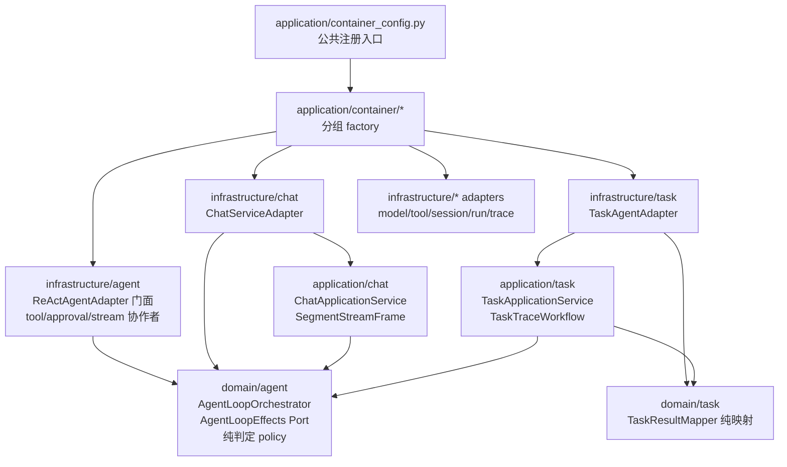

# 设计文档：P0 Adapter 瘦身

## 概述

本设计按行为等价重构推进 P0 adapter 瘦身：`ReActAgentAdapter` 继续拆出基础设施内部协作者，`ChatServiceAdapter` 与 `TaskAgentAdapter` 继续把用例编排委托到 application/domain 纯逻辑，`container_config.py` 拆成组合根子模块但保持唯一装配入口语义。设计遵循 `ddd-architecture.md`、`ddd-tactical-modeling.md`、`srp-principle.md`、`change-discipline.md`、`adr.md`、`doc-sync.md`、`python-typing-lint.md` 与 `code-documentation.md`。

本期不新增业务能力、不修改公开 Port 签名、不引入新持久化格式、不改变事件类型与错误语义。所有拆分以现有测试网和新增边界测试证明行为等价。

#### 设计决策

| 决策 | 选定方案 | 理由 |
| --- | --- | --- |
| D1 ReAct 瘦身方向 | `ReActAgentAdapter` 保留为 `AgentPort` + `AgentLoopEffects` 门面，新增基础设施内部协作者承接工具执行、审批恢复、最终轮 stream/events 映射 | 遵守 ADR-0012：领域编排已上提，副作用仍留基础设施；不把 OTel、ContextVar、ToolRegistry、checkpoint I/O 移入 domain。 |
| D2 Chat 瘦身方向 | 扩展 application 层 `ChatApplicationService` 的分段/保存协调能力，adapter 保留模型解析、direct LLM path、stream/chunk/event 包装 | 与既有 `ChatSessionContextWorkflow` / `ChatApplicationService` 方向一致，减少 adapter 用例编排但不让 application 依赖 infrastructure。 |
| D3 Task 瘦身方向 | 新增 `application/task/` 用例服务与 `TaskTraceWorkflow`，并新增 `domain/task/result_mapping.py` 纯映射；`TaskAgentAdapter` 只负责 AgentPort、ToolRegistry、SessionStore、TraceStore 等边界适配 | 任务已有 `domain/task/policy.py` 样板，继续拆分可独立测试的纯判定；trace shaping 属于无 I/O application workflow，副作用仍留 adapter。 |
| D4 组合根拆分 | 新增 `application/container/` 子包，按 agent、chat、task、run、tools、storage 拆分组注册；`container_config.py` 保留公共 API 与注册入口 | 组合根例外仍集中在 application 层，静态 guard 通过路径集合显式允许；降低单文件膨胀但不把装配散到业务服务。 |
| D5 ADR 判断 | Task application workflow 边界与 `application/container/*` 组合根子包均按 ADR 规范记录为长期决策 | 实现确认新增长期一等抽象与组合根例外边界扩展，已新增 ADR-0017 与 ADR-0018。 |
| D6 切片顺序 | 先 ReAct 内部协作者，再 Chat，后 Task，最后组合根拆分与文档/静态守卫收口 | ReAct 风险最高且测试网最完整；组合根最后拆可避免前面切片频繁改装配模块。 |

## 架构

### 组件视图



### ReAct 执行序列

```mermaid
sequenceDiagram
    participant Chat as ChatServiceAdapter/TaskAgentAdapter
    participant React as ReActAgentAdapter
    participant Loop as AgentLoopOrchestrator
    participant Tools as ReactToolExecutionCoordinator
    participant Approval as ReactApprovalResumeCoordinator
    participant Stream as ReactFinalRoundStreamer

    Chat->>React: run / resume / run_streaming / run_events
    React->>Loop: iter_rounds(effects=self)
    Loop->>React: effects.perform_model_round(...)
    Loop-->>React: RoundOutcome
    alt tool_calls
        React->>Tools: execute_many / stream_progress / events
        Tools->>React: _execute_tool_call callback or ToolExecutionRuntime
    else approval resume
        React->>Approval: apply_decisions(...)
    else final streaming
        React->>Stream: stream_final_round / stream_events_final_round
    end
    React-->>Chat: AgentResult / StreamingChunk / AgentStreamEvent
```

### 目录结构

```text
epsilon-boot/src/
  application/
    chat/
      chat_application_service.py              # 扩展既有服务
    task/
      __init__.py                              # 新增
      task_application_service.py              # 新增，任务 execute/continue/resume 应用编排
      task_trace_workflow.py                   # 新增，trace shaping 应用 workflow
    container/
      __init__.py                              # 新增
      agent.py                                 # 新增，Agent/guardrail/HITL 装配
      chat.py                                  # 新增，Chat 装配
      task.py                                  # 新增，Task 装配
      run.py                                   # 新增，Run 装配
      tools.py                                 # 新增，Tool registry 装配
      storage.py                               # 新增，session/run/trace store 装配
    container_config.py                        # 保留对外函数，委托 container/*
  domain/
    task/
      result_mapping.py                        # 新增，TaskResult 纯映射
  infrastructure/
    agent/
      react_agent_adapter.py                   # 门面继续变薄
      react_tool_execution_coordinator.py      # 新增
      react_approval_resume_coordinator.py     # 新增
      react_final_round_streamer.py            # 新增
    chat/
      chat_service_adapter.py                  # 保留边界适配
    task/
      task_agent_adapter.py                    # 保留边界适配
```

## 组件与接口

### 1. `infrastructure/agent/react_tool_execution_coordinator.py`

职责：收敛 `react_agent_adapter.py` 中工具授权、abuse detection、guardrail before/after、checkpoint before tool、执行结果 trace 与并发/stream/events 工具进度的基础设施副作用协调。该协作者不导入 application，不实现领域策略，只通过门面提供的窄运行时协议访问必要副作用。

```python
from __future__ import annotations

from collections.abc import AsyncIterator, Awaitable, Callable, Mapping, Sequence
from dataclasses import dataclass
from typing import Any, Protocol

from domain.agent.value_objects import AgentConfig, AgentStreamEvent
from domain.chat.context import ConversationContext
from domain.model_access.value_objects import StreamingChunk, ToolCallRequest


ExecuteToolCall = Callable[
    [ConversationContext, ToolCallRequest, AgentConfig],
    Awaitable[None],
]


class ToolExecutionRuntime(Protocol):
    """ReAct 工具执行协作者所需的门面运行时能力。"""

    async def execute_tool_call(
        self,
        context: ConversationContext,
        tool_call: ToolCallRequest,
        config: AgentConfig,
    ) -> None:
        """执行单个工具调用并负责原地写入上下文。"""
        ...

    def tool_progress_chunk(
        self,
        round_num: int,
        tool_call: ToolCallRequest,
        phase: str,
    ) -> StreamingChunk:
        """构造既有 streaming 工具进度分片。"""
        ...


@dataclass(frozen=True)
class ToolExecutionBatchResult:
    """同轮工具执行批次结果。"""

    executed_count: int


class ReactToolExecutionCoordinator:
    """ReAct 工具执行基础设施协作者。"""

    def __init__(self, runtime: ToolExecutionRuntime) -> None:
        """初始化协作者。"""

    async def dispatch(
        self,
        *,
        context: ConversationContext,
        tool_calls: Sequence[ToolCallRequest],
        config: AgentConfig,
    ) -> ToolExecutionBatchResult:
        """并发执行同轮工具调用，保持既有上下文写入语义。"""

    def stream_progress(
        self,
        *,
        context: ConversationContext,
        tool_calls: Sequence[ToolCallRequest],
        config: AgentConfig,
        round_num: int,
    ) -> AsyncIterator[StreamingChunk]:
        """执行工具并产出既有 StreamingChunk 进度分片。"""

    def stream_events(
        self,
        *,
        context: ConversationContext,
        tool_calls: Sequence[ToolCallRequest],
        config: AgentConfig,
        round_num: int,
    ) -> AsyncIterator[AgentStreamEvent]:
        """执行工具并产出既有 tool_start/tool_result/tool_error 事件。"""
```

实现约束：第一切片可先从既有 `_dispatch_concurrent_tool_calls` / `_stream_concurrent_tool_progress` / `_events_concurrent_tool_calls` 平移；若发现必须访问 `_tool_registry`、`_checkpoint_before_tool_call`、`_record_tool_call_trace` 等大量门面内部状态，则 runtime 协议逐项列出，不允许传入整个 `ReActAgentAdapter`。

### 2. `infrastructure/agent/react_approval_resume_coordinator.py`

职责：收敛 `_apply_approval_decisions`、`_record_rejected_tool_call`、`_latest_tool_calls_by_id` 的审批恢复基础设施流程。它仍调用门面提供的工具执行/checkpoint/trace 能力，不进入 domain。

```python
from __future__ import annotations

from collections.abc import Awaitable, Callable, Mapping, Sequence
from typing import Protocol

from domain.agent.value_objects import ApprovalDecision, ApprovalInterrupt
from domain.chat.context import ConversationContext
from domain.model_access.value_objects import ToolCallRequest


class ApprovalResumeRuntime(Protocol):
    """审批恢复协作者所需的运行时能力。"""

    async def execute_approved_tool_call(
        self,
        context: ConversationContext,
        tool_call: ToolCallRequest,
    ) -> None:
        """执行审批通过或编辑后的工具调用。"""
        ...

    async def record_rejected_tool_call(
        self,
        context: ConversationContext,
        tool_call: ToolCallRequest,
        decision: ApprovalDecision,
    ) -> None:
        """记录审批拒绝的工具调用结果。"""
        ...


class ReactApprovalResumeCoordinator:
    """ReAct 审批恢复基础设施协作者。"""

    def __init__(self, runtime: ApprovalResumeRuntime) -> None:
        """初始化协作者。"""

    async def apply_decisions(
        self,
        *,
        context: ConversationContext,
        interrupt: ApprovalInterrupt,
        decisions: Sequence[ApprovalDecision],
    ) -> None:
        """按既有顺序应用 approve/edit/reject 决策。"""

    @staticmethod
    def latest_tool_calls_by_id(
        context: ConversationContext,
    ) -> Mapping[str, ToolCallRequest]:
        """提取上下文内每个 tool_call_id 的最后一次工具调用。"""
```

### 3. `infrastructure/agent/react_final_round_streamer.py`

职责：收敛 `_stream_final_round` 与 `_stream_events_final_round` 的最终轮流式模型访问、累积、tool_arguments_delta 事件映射和终止分片处理。

```python
from __future__ import annotations

from collections.abc import AsyncIterator, Mapping
from typing import Any

from domain.agent.value_objects import AgentConfig, AgentStreamEvent
from domain.chat.context import ConversationContext
from domain.model_access.ports import ModelAccessPort
from domain.model_access.value_objects import StreamingChunk


class ReactFinalRoundStreamer:
    """ReAct 最终轮流式输出协作者。"""

    def stream_chunks(
        self,
        *,
        context: ConversationContext,
        config: AgentConfig,
        model_access: ModelAccessPort,
        round_num: int,
        initial_usage: Mapping[str, Any] | None = None,
    ) -> AsyncIterator[StreamingChunk]:
        """产出既有 run_streaming 最终轮分片。"""

    def stream_events(
        self,
        *,
        context: ConversationContext,
        config: AgentConfig,
        model_access: ModelAccessPort,
        round_num: int,
        initial_usage: Mapping[str, Any] | None = None,
    ) -> AsyncIterator[AgentStreamEvent]:
        """产出既有 run_events 最终轮事件。"""
```

### 4. `application/chat/chat_application_service.py` 分段编排扩展

职责：在既有 `ChatApplicationService` 中承接 `ChatServiceAdapter` 的分段聊天用例编排：分段风险门、自动续跑边界、保存策略、`SegmentRunMetadata` 与 `ChatResponseVO` 状态组合。模型解析、Agent 调用回调和 stream/event 线格式包装仍由 adapter 传入。

```python
from __future__ import annotations

from collections.abc import AsyncIterator, Awaitable, Callable
from dataclasses import dataclass

from domain.agent.value_objects import AgentResult, AgentStreamEvent
from domain.chat.context import ConversationContext
from domain.chat.value_objects import ChatResponseVO

RunAgentCallable = Callable[[ConversationContext, str | None], Awaitable[AgentResult]]


@dataclass(frozen=True)
class SegmentStreamFrame:
    """分段流式应用业务帧。"""

    kind: str
    event: AgentStreamEvent | None = None
    response: ChatResponseVO | None = None


class ChatApplicationService:
    """聊天应用服务。"""

    async def run_segmented_chat_on_context(
        self,
        *,
        context: ConversationContext,
        run_agent: RunAgentCallable,
    ) -> ChatResponseVO:
        """执行同步分段聊天并返回 ChatResponseVO。"""

    def stream_segmented_chat_on_context(
        self,
        *,
        context: ConversationContext,
        stream_agent_events: Callable[..., AsyncIterator[AgentStreamEvent]],
    ) -> AsyncIterator[SegmentStreamFrame]:
        """执行流式分段聊天并产出应用业务帧。"""
```

实现切片已选择扩展既有 `ChatApplicationService`，未新增独立 `ChatSegmentApplicationService`。adapter 只把应用业务帧翻译为既有 `AgentStreamEvent` / SSE 输出格式。

### 5. `domain/task/result_mapping.py`

职责：把 `AgentResult` 与任务状态映射中的纯判定集中到 domain，复用 `TaskContinuationPolicy`，不接触 `ConversationContext`、`ToolRegistry`、TraceStore 或 SessionStore。

```python
from __future__ import annotations

from dataclasses import dataclass

from domain.agent.value_objects import AgentResult, AgentTerminationReason
from domain.task.value_objects import TaskResult, TaskStatus


@dataclass(frozen=True)
class TaskResultMappingInput:
    """任务结果映射输入。"""

    agent_result: AgentResult
    trace: tuple[object, ...]
    can_continue: bool


class TaskResultMapper:
    """任务结果纯映射服务。"""

    @staticmethod
    def status_for_agent_result(agent_result: AgentResult) -> TaskStatus:
        """根据 AgentResult 判定任务状态。"""

    @staticmethod
    def to_task_result(data: TaskResultMappingInput) -> TaskResult:
        """构造 TaskResult，字段语义与 TaskAgentAdapter 现状等价。"""
```

实现时 `trace` 必须替换为仓库真实 trace entry 类型；若现有 `TaskResult.trace` 类型不允许 domain 侧完整构造，则只上提 `status_for_agent_result` 等纯判定，`TaskResult` 构造留在 application/task。

### 6. `application/task/task_trace_workflow.py`

职责：承接 `TaskAgentAdapter._extract_trace` 的应用层 trace shaping。该 workflow 只消费领域 `ConversationContext` 消息和 event timestamps，不持有 trace store。

```python
from __future__ import annotations

from collections.abc import Mapping

from domain.chat.context import ConversationContext


class TaskTraceWorkflow:
    """任务 trace 提取 workflow。"""

    def extract_trace(
        self,
        context: ConversationContext,
        *,
        event_timestamps: Mapping[int, int] | None = None,
    ) -> list[dict[str, object]]:
        """按既有 TaskAgentAdapter 语义提取任务 trace。"""
```

若 `TaskResult.trace` 已有更具体类型，`list[dict[str, object]]` 在实现时替换为真实类型，避免裸 `Any`。

### 7. `application/task/task_application_service.py`

职责：承接任务 execute/continue/resume 的用例编排：加载/保存 session、构造上下文、调用 Agent 回调、审批恢复前置校验顺序、结果映射。具体 AgentPort、ToolRegistry、TraceStore、PromptRegistry 仍由 `TaskAgentAdapter` 或组合根注入，不在 domain 中出现。

```python
from __future__ import annotations

from collections.abc import Awaitable, Callable

from domain.agent.value_objects import AgentConfig, AgentResult
from domain.chat.context import ConversationContext
from domain.task.value_objects import Task, TaskApprovalResumeRequest, TaskContinueRequest, TaskResult

RunTaskAgentCallable = Callable[[ConversationContext, AgentConfig], Awaitable[AgentResult]]


class TaskApplicationService:
    """任务执行应用服务。"""

    async def execute_task(
        self,
        task: Task,
        *,
        run_agent: RunTaskAgentCallable,
    ) -> TaskResult:
        """执行任务并返回 TaskResult。"""

    async def continue_task(
        self,
        request: TaskContinueRequest,
        *,
        run_agent: RunTaskAgentCallable,
    ) -> TaskResult:
        """继续执行任务会话。"""

    async def resume_approval(
        self,
        request: TaskApprovalResumeRequest,
        *,
        run_agent: RunTaskAgentCallable,
    ) -> TaskResult:
        """消费审批状态并恢复任务执行。"""
```

### 8. `application/container/*`

职责：拆分组合根工厂，不改变 DI 对外行为。`container_config.py` 仍导出既有 `create_container` / provider 注册入口，内部委托分组模块。

```python
from __future__ import annotations

from common.container import Container


def register_agent_components(container: Container) -> None:
    """注册 Agent、guardrail、approval、delegation 相关组件。"""


def register_chat_components(container: Container) -> None:
    """注册 ChatServicePort 与聊天应用服务相关组件。"""


def register_task_components(container: Container) -> None:
    """注册 TaskAgentPort 与任务应用服务相关组件。"""


def register_tool_components(container: Container) -> None:
    """注册工具 registry 与工具实例。"""


def register_storage_components(container: Container) -> None:
    """注册 session/run/trace/artifact store adapter。"""
```

静态导入守卫需把 `src/application/container/*.py` 纳入组合根路径集合；除此之外 application 层仍不得导入 infrastructure。

## 数据模型

本期不新增领域实体、持久化表、Redis key、文件格式、API DTO 字段、SSE 事件类型或配置键。

数据结构影响仅限内存级协作者输入输出：

- `ToolExecutionBatchResult`：基础设施内部批次结果，不持久化、不暴露 API。
- `TaskResultMappingInput`：任务结果映射内部输入，不持久化。
- `application/container/*`：只拆分 Python 模块，不改变容器注册键、Scope、配置读取路径。

如果实现时发现必须新增配置键或持久化字段，应停止当前切片，回到 requirement/design 修订并执行 ADR 判断。

## 事务与并发边界

本期不新增写模型，但会移动既有写调用的编排位置，边界如下：

1. 会话保存：仍通过 `SessionContextStorePort.save(...)` / `compare_and_swap(...)` 及 `SessionIndexPort.upsert(...)` 完成。移动 Chat/Task 编排时不得改变保存时机：approval_required 不保存被中断后的临时上下文，completed/paused 按现有逻辑保存。
2. 审批状态：仍由 `ApprovalStateStorePort.load(...)`、`consume(...)` 原子消费保证幂等。Chat/Task 恢复流程必须保持 load → expired/count/order/allowed 校验 → consume → agent.resume 的顺序。
3. 工具执行：同轮工具并发语义保持 `ReactConcurrentToolExecutor` 现状。拆出 `ReactToolExecutionCoordinator` 后不得把同轮工具退化为串行，也不得改变 streaming/events 中同一 tool_call 的 start/end 成对相邻约束。
4. Checkpoint/trace/guardrail observation：仍由基础设施端口或协作者执行，移动代码不得跨越原有工具执行前后检查点边界。
5. 组合根拆分：注册顺序必须保持等价；singleton 对象生命周期仍由 `common.container.Container` 管理，异步资源关闭路径不变。

## 正确性属性

### Property 1：公开端口签名不变

`AgentPort`、`ChatServicePort`、`TaskAgentPort` 的公开方法签名、返回类型与异常传播语义保持不变。

验证需求：需求 2.1、2.2、3.1、4.1。

### Property 2：ReAct 行为等价

对任意既有 ReAct 单测/属性测试覆盖的输入，重构前后模型调用次数、工具调用次数、上下文消息序列、approval metadata、guardrail metadata、checkpoint 写入与事件顺序保持一致。

验证需求：需求 2.4、2.5、2.6、7.1。

### Property 3：Chat 保存与恢复顺序等价

`chat` / `continue_chat` / `resume_approval` / `stream_resume_approval` 的 session load/save/index、prompt_id 传播、continue 前置条件、approval 校验和消费顺序保持一致。

验证需求：需求 3.3、3.4、3.5、7.1。

### Property 4：Task 结果与 trace 等价

`execute` / `continue_task` / `resume_approval` 产出的 `TaskResult.status`、`terminated_reason`、`can_continue`、trace timestamp、tool schema 暴露与审批错误顺序保持一致。

验证需求：需求 4.1、4.3、4.4、7.1。

### Property 5：组合根拆分不扩大例外

除显式列入组合根路径集合的 `application/container_config.py`、`application/api/server_app.py`、`application/server_app.py`、`application/cli/main.py`、`application/container/*.py` 外，application 层不得导入 infrastructure。

验证需求：需求 5.2、5.3、6.2。

### Property 6：无新持久化与配置漂移

本期不新增/修改配置键、Redis key、文件布局、数据库 schema 或 API 字段；任何偏离都必须回到 design 修订。

验证需求：需求 5.1、6.3、7.2。

### Property 7：文档与静态守卫同步

职责移动后，`docs/architecture.md`、`docs/agent.md`、`docs/domain-model.md`、`docs/di-container.md` 与静态导入守卫能描述并约束新的边界。

验证需求：需求 6.1、6.2、6.4。

## 错误处理

本期不引入新的错误返回风格，不新增错误码。所有异常继续使用既有领域异常：

| 场景 | 既有错误/传播方式 | 设计要求 |
| --- | --- | --- |
| Chat continue 不可继续 | `domain.chat.exceptions.ContinuationUnavailableError` | 若编排下沉到 application，异常类型、reason 文案保持一致。 |
| Approval 不存在/过期/已消费 | `ApprovalNotFoundError` / `ApprovalExpiredError` / `ApprovalConsumedError` | load、过期校验、consume 顺序不变。 |
| Approval 决策数量/顺序/类型非法 | `ApprovalDecisionCountMismatchError` / `ApprovalDecisionOrderMismatchError` / `ApprovalDecisionNotAllowedError` | Chat/Task 共用既有校验顺序，不合并为泛化异常。 |
| 工具权限拒绝 | `ToolPermissionDeniedError` 由 ReAct 工具执行分支捕获并写 ToolMessage/trace | 拆出协作者后日志脱敏、ToolMessage 内容与 metadata 不变。 |
| 工具执行失败/超时 | 既有 `_execute_tool_call` 分支与 timeout 语义 | 不新增补偿机制，不改变 `error_class` metadata。 |
| 会话 CAS 冲突 | `SessionConflictError` 由 store adapter 抛出 | 本期不改变 catch 策略。 |
| 容器装配失败 | 既有 `common.container` 解析异常或 RuntimeError | 拆分 factory 后错误仍在启动/解析阶段暴露，不吞异常。 |

协作者内部不得吞掉异常后返回布尔错误码；需要表达业务失败时使用现有异常或既有 `ToolExecutionResult` / `TaskResult` 语义。

## 测试策略

### ReAct 聚焦测试

- 运行既有：`test/infrastructure/agent/test_react_agent_adapter_unit.py`、`test_react_agent_adapter_property.py`、`test_react_agent_events_unit.py`、`test_react_agent_streaming_unit.py`、`test_react_agent_concurrent_tool_calls_unit.py`、`test_react_agent_hitl_unit.py`、`test_react_agent_checkpoint_recovery_unit.py`。
- 新增协作者单测：
  - `test/infrastructure/agent/test_react_tool_execution_coordinator_unit.py`
  - `test/infrastructure/agent/test_react_approval_resume_coordinator_unit.py`
  - `test/infrastructure/agent/test_react_final_round_streamer_unit.py`
- 断言协作者不改变 tool progress adjacency、tool_error metadata、approval_required metadata、tool_arguments_delta 事件。

### Chat 聚焦测试

- 运行既有：`test/application/chat/test_chat_application_service_unit.py`、`test_session_context_workflow_unit.py`、`test/infrastructure/chat/test_chat_service_continue_unit.py`、`test_chat_service_stream_resume_unit.py`、`test_chat_segmented_execution_unit.py`、`test_chat_segmented_stream_unit.py`。
- 扩展 `test/application/chat/test_chat_application_service_unit.py`，覆盖 completed/paused/approval_required、自动续跑停止、保存时机。

### Task 聚焦测试

- 运行既有：`test/infrastructure/task/test_task_agent_adapter_unit.py`、`test_task_agent_adapter_property.py`、`test/domain/task/test_task_continuation_policy_unit.py`、`test_approval_resume_precondition_unit.py`。
- 新增：
  - `test/domain/task/test_task_result_mapping_unit.py`
  - `test/application/task/test_task_trace_workflow_unit.py`
  - `test/application/task/test_task_application_service_unit.py`
- 覆盖 trace timestamp 来源、PAUSED/SUCCESS/HUMAN_INTERVENTION_REQUIRED 映射、approval resume 校验顺序。

### 组合根与静态边界

- 更新并运行 `test/static/test_architecture_import_boundaries.py`，将 `application/container/*.py` 纳入组合根允许路径。
- 更新或新增 `test/application/test_container_config.py`、`test_container_config_backend_dispatch.py`、`test_run_container_wiring_unit.py`、`test_segmented_container_wiring_static.py`，证明 Port-to-Adapter binding 不变。

### 最终检查点

在 `epsilon-boot/` 下执行：

```bash
PYTHONPATH=src uv run --frozen pytest test/static/test_architecture_import_boundaries.py
PYTHONPATH=src uv run --frozen pytest test/infrastructure/agent test/infrastructure/chat test/infrastructure/task test/application/chat test/application/task test/application/test_container_config.py
PYTHONPATH=src uv run --frozen pytest
uv run ruff check src test
uv run pyright src/domain src/application
```

若 pyright 仍存在既有基线错误，最终记录需区分“既有基线”与“本期新增模块 0 error”。

## 自评与已确认决策

### 1. 组合根拆分纳入本期 P0

位置：设计决策 D4、组件 8、Property 5。

已采纳推荐方案：本期纳入组合根拆分，但作为最后一个实现切片推进。

原因：adapter 瘦身会新增 application 服务与基础设施协作者，如果组合根仍单文件承接全部装配，后续迭代会继续在 `container_config.py` 形成新瓶颈。将组合根拆分放在最后一片，可先稳定 ReAct/Chat/Task 行为，再用静态导入守卫和 wiring tests 控制装配风险。

### 2. Chat 分段编排按代码事实决定是否新增独立服务

位置：组件 4。

已采纳推荐方案：扩展既有 `ChatApplicationService`，不新增独立分段服务。

原因：实现切片确认分段风险门、保存时机、自动续跑与 `SegmentRunMetadata` 聚合可作为既有聊天应用服务的方法扩展承载；新增独立类会制造当前不必要的一等抽象。

当前无剩余需要用户裁决的设计问题，可进入 `tasks.md` 阶段。
