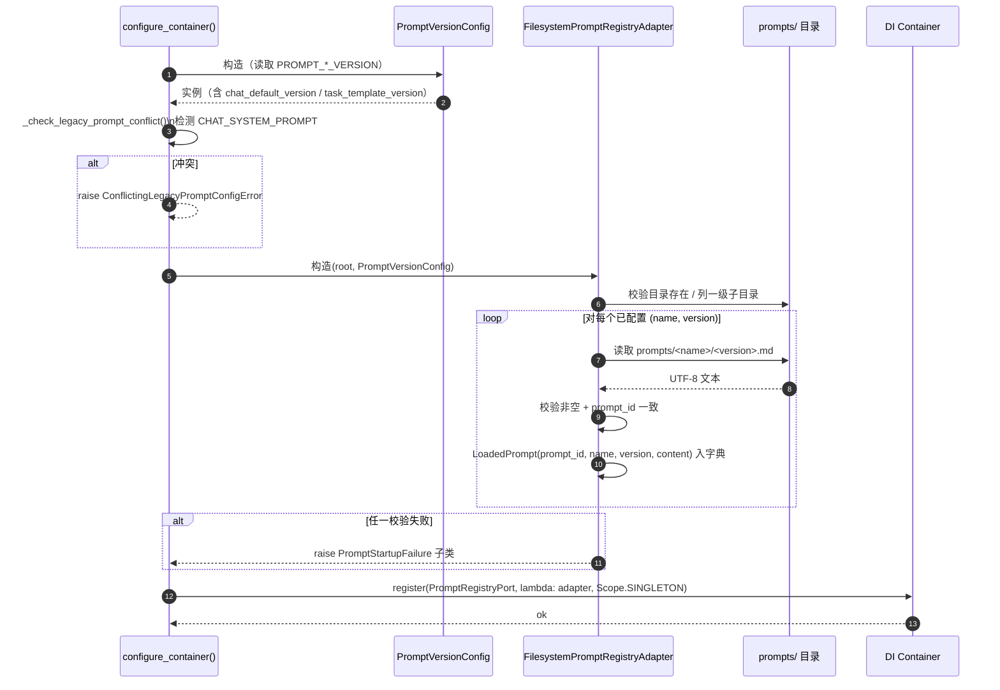
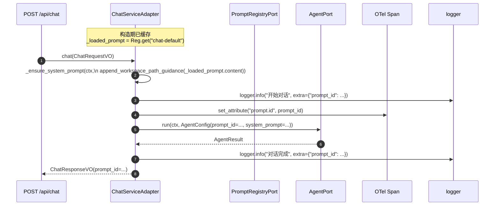
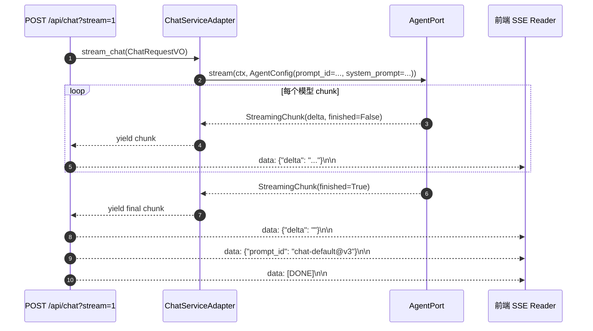

# 设计文档：Prompt 资产目录与版本化注册（Prompt Version Registry）

## 概述

本特性把 `epsilon-boot` 中散落在 `ChatConfig.system_prompt`（字符串字段默认值）与 `TaskAgentAdapter.build_system_prompt`（代码模板）里的系统提示词，升级为三段式 DDD 结构：（1）`epsilon-boot/prompts/<name>/v<N>.md` 资产目录，（2）领域层 `PromptRegistryPort`（`Protocol`）+ 基础设施层 `FilesystemPromptRegistryAdapter`，（3）基于 `PropertiesBaseSettings` 的 `PromptVersionConfig`（`env_prefix="PROMPT_"`）驱动"名→版本"解析。所有 `AgentConfig` / `NamedAgentConfig` / `ChatResponseVO` / `TaskResult` 新增 `prompt_id: str` 伴随字段，结构化日志 `extra["prompt_id"]` 与 OpenTelemetry span 属性 `prompt.id` 全链路透传。

本设计遵循以下项目规范：

- [docs/steering/ddd-architecture.md](../../steering/ddd-architecture.md)：`domain/prompt/` 纯领域（仅 Protocol + frozen dataclass），适配器位于 `infrastructure/prompt/`，装配在 `application/container_config.py` 的组合根。
- [docs/steering/config-source.md](../../steering/config-source.md)：所有新增 `PROMPT_*` 键写入 `epsilon-boot/config.properties`，`.env` 仅本地覆盖。
- [docs/steering/code-documentation.md](../../steering/code-documentation.md)：新增模块、类、公开函数/方法全部配中文 docstring，含职责、参数、返回值、异常。
- [docs/steering/uv-package-manager.md](../../steering/uv-package-manager.md)：本特性不引入新依赖（仅使用 `pathlib`、已在依赖集中的 `pydantic-settings`、`opentelemetry-api`）；若将来需要变动依赖，仅通过 `uv add/remove` 操作。

本设计覆盖 requirement.md 需求 1–11 全部条款，并对齐 [docs/architecture.md](../../../architecture.md) 的分层边界、[docs/di-container.md](../../../di-container.md) 的 Scope 与绑定位置、[docs/configuration.md](../../../configuration.md) 的 `PropertiesBaseSettings` 约定。

### 设计决策

| 决策 | 选定方案 | 理由 |
| --- | --- | --- |
| 资产目录位置 | `epsilon-boot/prompts/` | 与 `config.properties` 同级，Docker 构建上下文一致；requirement §"Prompt 资产目录位置选择"选定方案 B。 |
| Port 协议类型 | `Protocol`（同步 `get` / `list_names`） | 与 `AgentRegistryPort` / `ModelRegistryPort` 等既有 Port 风格一致；I/O 完全在适配器构造期完成，`get` 不触发磁盘读取。 |
| 加载时机 | **启动期一次性扫描 + 加载**到内存只读字典；**不支持**运行期热重载 | 需求 2.5 明确拒绝热切换；避免同一会话中 system 消息前后不一致；`PropertiesBaseSettings.hot_reload: ClassVar[bool] = False`。 |
| 缓存策略 | 启动期只读快照（无 mtime 监听、无 TTL） | 文件在镜像内只读；与 `ChatConfig.system_prompt` 当前非热更新语义对齐。 |
| 版本选择器 | 精确 `v<正整数>`，**无** `latest` / 无隐式回退 | 需求 2.6、`Prompt_Fallback_Semantics`：禁止"找不到版本 → v1"类隐式降级。 |
| `prompt_id` 形状 | `f"{name}@v{N}"`（如 `chat-default@v3`） | 需求术语表与需求 4.1；统一日志 / span / 响应体命名。 |
| 旧 `CHAT_SYSTEM_PROMPT` 处理 | 启动期冲突检测，fail-fast 拒绝启动 | 需求 8.2；避免"prompt 文本直写 vs 版本键"的默默合并语义。 |
| `_WORKSPACE_PATH_GUIDANCE` 归属 | 不纳入版本化，改由纯函数 `append_workspace_path_guidance(content)` 在 Prompt_Consumer 构造 `AgentConfig.system_prompt` 时幂等追加 | 需求 6；`prompt_id` 反映资产版本，不受运行期注入影响。 |
| Task 模板处理 | `prompts/task-template/v<N>.md` 仅作"骨架审计文档"，**不**用于运行期字符串替换；`TaskAgentAdapter.build_system_prompt` 保持纯函数 | 需求 5.1、5.3；模板拼装字段由代码决定，落盘会引入模板引擎与变量插值，已在"不在范围"中排除。 |
| Port/Adapter 装配位置 | `application/container_config.py`（组合根） | Steering 允许的例外；便于在 `configure_container()` 阶段完成启动期 fail-fast 校验。 |
| 适配器 Scope | `Scope.SINGLETON` | 构造即加载、加载即只读，与 `ToolRegistry` / `AgentRegistryPort` 相同风格。 |
| 新增错误类型 | 全部继承 `ConfigurationError`（`common/configuration`） | 与 `_create_local_filesystem_workspace`、`_validate_local_persistence_root` 等既有 fail-fast 分支一致。 |
| 不落盘 Task 运行期文本 | `build_system_prompt(task)` 输出只存在于本次 Agent Loop 内存 | 需求 5.7；避免泄漏 PII / 临时数据到 `prompts/`。 |

#### 设计权衡决策记录（追溯链路）

下表逐条记录 5 条设计权衡的最终选择（选项由 design 初稿自评阶段提出）与理由，供未来 reviewer 按章节号定位落位。

| # | 权衡点 | 候选 | 选定 | 理由与落位章节 |
| --- | --- | --- | --- | --- |
| 1 | `AgentConfig.prompt_id` 字段放置顺序与默认值 | A: 保留 `= ""` 默认值 + `__post_init__` 校空 ／ B: 使用关键字专属语法 ／ C: `dataclass(kw_only=True)` 全类关键字化，`prompt_id` 真正无默认值 | **C（最小侵入）** | 只对**新增必填字段的那几个 dataclass**（`AgentConfig`、`ChatResponseVO`）启用 `kw_only=True`；`NamedAgentConfig` 与 `TaskResult` 因本次新增字段在其语义中允许默认值（见决策 #3 与需求 4.2），不启用 `kw_only=True`，保持最小改动。落位：组件 §9、§10。 |
| 2 | SSE 流式路径如何携带 `prompt_id`（需求 4.6） | A: 在 `[DONE]` 前追加一条 `data:` 事件 ／ B: 自定义 `event: prompt_id` 事件 ／ C: 最后一个 chunk 的元数据字段 | **A**：走默认 `data:` 行，载荷与同步 JSON 字段同名为 `prompt_id` | 与 `epsilon-client` 现有 SSE 解析（`EventSource` / fetch-stream 解析 `data:`）兼容；Next.js rewrites 对未知事件类型不过滤但不解析，保持向前兼容。落位：组件 §12、数据模型 §日志 `extra` 与 OTel 属性、架构 §运行期（Chat 流式路径）时序图。 |
| 3 | `TaskResult.prompt_id` 在 FAILED / CANCELLED / TIMEOUT 路径是否允许为空 | A: 宽松（空串允许）／ B: 强校验非空 ／ C: 异常路径改用 `Optional[str]` | **B**：`__post_init__` 对 `prompt_id` 强校验非空且符合 `name@vN`；异常路径由 `TaskAgentAdapter` 透传 `_task_template_prompt_id`，保证字段在 Task 启动后始终有值 | `prompt_id` 在 Task 启动时已落定（构造 `TaskAgentAdapter` 时即通过 `registry.get("task-template")` 取到），FAILED 也必须透传以保证与 trace / 日志对齐。违反 fail-fast。落位：组件 §11、组件 §13。 |
| 4 | 资产目录根路径解析策略 | A: 环境变量可调 `PROMPT_ASSET_ROOT` ／ B: 复用 `_find_file("prompts")` 向上查找 ／ C: `container_config.py` 硬编码 `Path(__file__).resolve().parents[2] / "prompts"` | **C**：硬编码相对 `container_config.py` 的 `parents[2]` | `container_config.py` 位于 `epsilon-boot/src/application/`，`parents[2]` 正好是 `epsilon-boot/`，与 `config.properties` 同级。不新增运维可调参数，避免误用；测试通过 `monkeypatch` 替换 `PromptRegistry` 工厂或注入自定义根目录。落位：组件 §14 `_create_prompt_registry`。 |
| 5 | `PromptVersionConfig` 是否走 `create_config` 工厂 | A: 不走（避免 `ConfigProxy` 热更新副作用）／ B: 走，依赖 `hot_reload=False` 抑制 | **A** | Prompt 是审计关键字段，`ConfigProxy` 热更新会破坏 `prompt_id` 与已记录 trace 的一致性；运维变更 Prompt 版本需走发版流程。落位：组件 §4 末尾说明 + §配置加载说明。 |

## 架构

### 组件关系图

```mermaid
flowchart TB
    subgraph FS["Prompt 资产目录"]
        F1["prompts/chat-default/v1.md"]
        F2["prompts/task-template/v1.md"]
    end

    subgraph Cfg["配置层"]
        CP["config.properties\nPROMPT_*_VERSION"]
        PVC["PromptVersionConfig\n(PropertiesBaseSettings)"]
    end

    subgraph Domain["domain/prompt/"]
        Port["PromptRegistryPort (Protocol)"]
        LP["LoadedPrompt (frozen dataclass)"]
        Exc["PromptNotFoundError"]
    end

    subgraph Infra["infrastructure/prompt/"]
        Adapter["FilesystemPromptRegistryAdapter"]
        AppendFn["append_workspace_path_guidance()"]
        Errs["PromptStartupFailure 家族\n(继承 ConfigurationError)"]
    end

    subgraph App["application/container_config.py 组合根"]
        CC["configure_container()"]
    end

    subgraph Consumers["Prompt 消费方"]
        CSA["ChatServiceAdapter"]
        TAA["TaskAgentAdapter"]
    end

    subgraph DomainVO["domain/*/value_objects.py"]
        AC["AgentConfig(prompt_id)"]
        NAC["NamedAgentConfig(prompt_id)"]
        CR["ChatResponseVO(prompt_id)"]
        TR["TaskResult(prompt_id)"]
    end

    CP --> PVC
    FS --> Adapter
    PVC --> Adapter
    Adapter -.implements.-> Port
    Adapter --> LP
    Adapter --> Errs
    Adapter -.may raise.-> Exc

    CC -->|register Singleton| Adapter
    CC -->|inject| CSA
    CC -->|inject| TAA

    CSA -->|get("chat-default")| Port
    TAA -->|get("task-template")| Port
    CSA --> AppendFn

    CSA --> AC
    CSA --> CR
    TAA --> AC
    TAA --> TR
    NAC -.future consumers.-> Port
```

### 启动期时序图



### 运行期（Chat 同步路径）时序图



### 运行期（Chat 流式路径）时序图（决策 #2）



### 目录结构

```
epsilon-boot/
├── config.properties                      # 新增 PROMPT_*_VERSION 键
├── prompts/                               # 新增：Prompt 资产目录（需求 1）
│   ├── chat-default/
│   │   └── v1.md                          # 迁移自 CHAT_SYSTEM_PROMPT 默认值
│   └── task-template/
│       └── v1.md                          # Task 模板骨架审计文档
└── src/
    ├── domain/
    │   └── prompt/                        # 新增：领域层
    │       ├── __init__.py
    │       ├── exceptions.py              # PromptNotFoundError
    │       ├── ports.py                   # PromptRegistryPort (Protocol)
    │       └── value_objects.py           # LoadedPrompt
    ├── infrastructure/
    │   └── prompt/                        # 新增：基础设施层
    │       ├── __init__.py
    │       ├── exceptions.py              # PromptStartupFailure 家族
    │       ├── filesystem_prompt_registry_adapter.py
    │       ├── prompt_version_config.py   # PromptVersionConfig
    │       └── workspace_guidance.py      # append_workspace_path_guidance
    └── application/
        └── container_config.py            # 修改：组合根装配 + 冲突检测
```

## 组件与接口

### 1. `LoadedPrompt` —— 领域值对象

- **位置**：`epsilon-boot/src/domain/prompt/value_objects.py`
- **职责**：表达一条已加载的 prompt，携带 `prompt_id`、`name`、`version`、`content` 四字段；构造期校验 `content` 非空白、`prompt_id == f"{name}@{version}"`。

```python
"""Prompt 领域值对象模块。

本模块定义 Prompt 资产加载后的不可变值对象 ``LoadedPrompt``，
作为 :class:`PromptRegistryPort.get` 的返回类型，承载 prompt 身份
（``prompt_id`` / ``name`` / ``version``）与内容（``content``）。
"""

from __future__ import annotations

import re
from dataclasses import dataclass

_VERSION_PATTERN = re.compile(r"^v[1-9]\d*$")
"""合法 ``Prompt_Version_Tag`` 正则：小写 v + 无前导零正整数。"""

_PROMPT_ID_PATTERN = re.compile(r"^[a-z][a-z0-9\-]*@v[1-9]\d*$")
"""合法 ``Prompt_Id`` 正则：小写+连字符的 name + ``@`` + ``v<N>``。"""


@dataclass(frozen=True)
class LoadedPrompt:
    """已加载 Prompt 值对象。

    Attributes:
        prompt_id: 组合标识符，形如 ``chat-default@v3``。
        name: Prompt 名称（小写+连字符）。
        version: Prompt 版本号，形如 ``v3``。
        content: Prompt 文本内容，UTF-8 解码后原文，不含 ``_WORKSPACE_PATH_GUIDANCE``。
    """

    prompt_id: str
    name: str
    version: str
    content: str

    def __post_init__(self) -> None:
        """校验字段一致性与非空语义。

        Raises:
            ValueError: ``content`` 为空白、``prompt_id`` 格式非法，
                或 ``prompt_id`` 与 ``name@version`` 不一致时抛出。
        """
        if not self.content or not self.content.strip():
            raise ValueError("LoadedPrompt.content 不能为空白")
        if not _VERSION_PATTERN.match(self.version):
            raise ValueError(f"非法版本号：{self.version!r}，期望 v<正整数>")
        expected_id = f"{self.name}@{self.version}"
        if self.prompt_id != expected_id:
            raise ValueError(
                f"prompt_id 与 name@version 不一致：prompt_id={self.prompt_id!r}，"
                f"期望={expected_id!r}"
            )
        if not _PROMPT_ID_PATTERN.match(self.prompt_id):
            raise ValueError(f"非法 prompt_id 格式：{self.prompt_id!r}")
```

### 2. `PromptRegistryPort` —— 领域端口

- **位置**：`epsilon-boot/src/domain/prompt/ports.py`
- **职责**：声明只读访问接口；不感知文件系统细节。

```python
"""Prompt 领域端口模块。

定义 ``PromptRegistryPort`` 协议，描述"按名取回已加载 Prompt"的能力。
所有 I/O 在适配器构造期完成；协议本身不声明任何异步方法或 I/O 异常。
"""

from __future__ import annotations

from typing import Protocol

from domain.prompt.value_objects import LoadedPrompt


class PromptRegistryPort(Protocol):
    """Prompt 注册表端口协议。

    由基础设施层提供实现（``FilesystemPromptRegistryAdapter``），
    领域层与应用层仅依赖此抽象。
    """

    def get(self, name: str) -> LoadedPrompt:
        """按 Prompt 名称返回已加载的值对象。

        Args:
            name: Prompt 名称（如 ``chat-default``）。

        Returns:
            对应的 :class:`LoadedPrompt` 实例。

        Raises:
            PromptNotFoundError: 名称未注册或版本未加载时抛出
                （正常路径下启动期校验已覆盖，运行期触发意味着编程错误）。
        """
        ...

    def list_names(self) -> list[str]:
        """列出已加载的 Prompt 名称。

        Returns:
            Prompt 名称列表（稳定顺序，与启动期扫描顺序一致）。
        """
        ...
```

### 3. `PromptNotFoundError` —— 领域异常

- **位置**：`epsilon-boot/src/domain/prompt/exceptions.py`
- **职责**：运行期 `get(name)` 找不到时抛出。继承 `RuntimeError`，不依赖 `common/configuration`。

```python
"""Prompt 领域异常模块。"""

from __future__ import annotations


class PromptNotFoundError(RuntimeError):
    """PromptRegistryPort.get(name) 找不到对应已加载 Prompt 时抛出。

    Attributes:
        name: 被查询的 Prompt 名称。
        registered: 已注册的 Prompt 名称列表，便于错误消息诊断。
    """

    def __init__(self, name: str, registered: list[str]) -> None:
        self.name = name
        self.registered = list(registered)
        super().__init__(
            f"Prompt 未注册：name={name!r}，已注册={self.registered}"
        )
```

### 4. `PromptVersionConfig` —— 基础设施配置

- **位置**：`epsilon-boot/src/infrastructure/prompt/prompt_version_config.py`
- **职责**：承载"从 `Prompt_Name` 到 `Prompt_Version_Tag`"的唯一映射；`env_prefix="PROMPT_"`；默认禁用 `hot_reload`。

```python
"""Prompt 版本配置模块。

基于 ``PropertiesBaseSettings``，从 ``config.properties`` 与环境变量加载
``PROMPT_*_VERSION`` 键，为每个已知 Prompt 名称提供单一字段（如
``chat_default_version``）。本模块不承担文件加载职责，只负责映射与格式校验。
"""

from __future__ import annotations

import re
from typing import Any

from pydantic import field_validator
from pydantic_settings import SettingsConfigDict

from common.configuration import ConfigurationError, PropertiesBaseSettings

_VERSION_PATTERN = re.compile(r"^v[1-9]\d*$")


class InvalidPromptVersionTagError(ConfigurationError):
    """``PROMPT_<NAME>_VERSION`` 值不符合 ``v<正整数>`` 格式时抛出。

    继承 ``ConfigurationError``，由容器启动期 fail-fast 语义捕获。
    """


class PromptVersionConfig(PropertiesBaseSettings):
    """Prompt 版本映射配置。

    每个已注册的 ``Prompt_Name`` 对应一个 ``<name_snake>_version: str`` 字段，
    其中 ``name_snake`` 是 ``Prompt_Name`` 把 ``-`` 替换为 ``_`` 的形式。
    新增 Prompt 时，需同时在此类追加字段、在 ``config.properties`` 追加键、
    在 ``prompts/<name>/`` 下放置版本文件。

    Attributes:
        chat_default_version: ``chat-default`` 对应的版本号，默认 ``"v1"``。
        task_template_version: ``task-template`` 对应的版本号，默认 ``"v1"``。
    """

    model_config = SettingsConfigDict(env_prefix="PROMPT_")

    chat_default_version: str = "v1"
    task_template_version: str = "v1"

    @field_validator("chat_default_version", "task_template_version")
    @classmethod
    def _validate_version_tag(cls, value: str, info: Any) -> str:
        """校验字段值符合 ``v<正整数>`` 格式。

        Args:
            value: 字段实际取值。
            info: pydantic 提供的校验上下文。

        Returns:
            原样返回已校验值。

        Raises:
            InvalidPromptVersionTagError: 格式非法时抛出；错误消息
                含字段名、实际取值、期望格式示例。
        """
        if not _VERSION_PATTERN.match(value):
            raise InvalidPromptVersionTagError(
                f"字段 {info.field_name!r} 取值非法：{value!r}，"
                "期望 v<正整数>（示例：v1、v2、v10）"
            )
        return value

    def as_mapping(self) -> dict[str, str]:
        """返回 ``{prompt_name: version}`` 形式的映射，便于适配器遍历。

        字段名通过 ``_version`` 去尾 + ``_`` → ``-`` 还原为 ``Prompt_Name``。

        Returns:
            ``{"chat-default": "v1", "task-template": "v1"}`` 形式的字典。
        """
        result: dict[str, str] = {}
        for field_name in self.model_fields:
            if not field_name.endswith("_version"):
                continue
            prompt_name = field_name[: -len("_version")].replace("_", "-")
            result[prompt_name] = getattr(self, field_name)
        return result


prompt_version_config = PromptVersionConfig()
"""模块级单例。与 ``chat_config`` / ``workspace_config`` 风格上一致（模块级单例），
但**不走** ``create_config`` 工厂（决策 #5）。

不走 ``create_config`` 的原因：
1. ``create_config`` 会把对象包装为 ``ConfigProxy``，其默认行为在 ``hot_reload=True``
   时会在 ``config.properties`` mtime 变化时触发重载；
2. Prompt 是审计关键字段，``prompt_id`` 在启动时落定后必须与 `trace` / 日志
   中记录值一一对齐，运行期重载会破坏这一一致性；
3. 运维变更 Prompt 版本必须走发版流程（重启容器），本节 `hot_reload=False`
   只是对模型配置的双重保险，不构成"可热更新"承诺。

因此此处**直接构造**普通 ``PropertiesBaseSettings`` 实例——在容器装配期读一次
``config.properties`` 后冻结为只读字段，后续任何 ``config.properties``
修改在不重启的前提下都不会生效，与需求 2.5 对齐。
"""
```

#### 配置加载说明（决策 #5）

- Prompt 版本选择**不走** `create_config` / `ConfigProxy`，原因是 Prompt 是审计关键字段，热更新会破坏 `prompt_id` 与已记录 trace 的一致性；运维变更 Prompt 版本需走发版流程。
- `PromptVersionConfig` 通过 `PropertiesBaseSettings` 构造器一次性读取 `config.properties` 与环境变量，实例生命周期与容器一致。
- 容器以 `Scope.SINGLETON` 注册 `FilesystemPromptRegistryAdapter`，后者构造期通过 `prompt_version_config.as_mapping()` 冻结映射快照；即使未来有人在模块外重新赋值 `prompt_version_config`，已构造的 Adapter 也不受影响（决策 #5 的第三层保险）。

### 5. `FilesystemPromptRegistryAdapter` —— 基础设施适配器

- **位置**：`epsilon-boot/src/infrastructure/prompt/filesystem_prompt_registry_adapter.py`
- **职责**：构造期一次性扫描 `Prompt_Asset_Directory`、校验并加载目标版本文件、生成内存只读字典；运行期 `get` 零 I/O。

```python
"""文件系统 Prompt 注册表适配器模块。

实现 ``PromptRegistryPort``，在构造阶段一次性扫描 ``prompts/`` 目录，
按 ``PromptVersionConfig`` 指定的版本加载每个 Prompt 到只读内存字典。
构造成功即意味着启动期所有校验通过；运行期 ``get`` 零磁盘 I/O。
"""

from __future__ import annotations

import logging
from pathlib import Path

from domain.prompt.exceptions import PromptNotFoundError
from domain.prompt.ports import PromptRegistryPort
from domain.prompt.value_objects import LoadedPrompt
from infrastructure.prompt.exceptions import (
    EmptyPromptAssetError,
    PromptAssetDirectoryMissingError,
    PromptAssetEncodingError,
    PromptAssetFileMissingError,
    PromptNotConfiguredError,
)
from infrastructure.prompt.prompt_version_config import PromptVersionConfig

logger = logging.getLogger(__name__)


class FilesystemPromptRegistryAdapter(PromptRegistryPort):
    """``PromptRegistryPort`` 的文件系统实现。

    Attributes:
        _root: 已规范化的 ``prompts/`` 根目录绝对路径。
        _prompts: ``name -> LoadedPrompt`` 的只读字典，构造后不再变更。
    """

    def __init__(self, root: Path, version_config: PromptVersionConfig) -> None:
        """一次性扫描并加载所有已配置 Prompt。

        Args:
            root: ``Prompt_Asset_Directory`` 路径（通常为
                ``<backend>/prompts/``）。
            version_config: ``PromptVersionConfig`` 实例，提供名→版本映射。

        Raises:
            PromptAssetDirectoryMissingError: ``root`` 不存在或不是目录（需求 9.1）。
            PromptAssetFileMissingError: 目标版本文件缺失（需求 9.2）。
            PromptAssetEncodingError: UTF-8 解码失败（需求 9.3）。
            EmptyPromptAssetError: 文件内容全为空白（需求 9.4）。
            PromptNotConfiguredError: 配置字段引用的 Prompt 名在目录下不存在，
                或目录下存在子目录但配置中缺失对应字段（需求 9.6 / 术语表）。
        """
        if not root.exists() or not root.is_dir():
            raise PromptAssetDirectoryMissingError(
                f"Prompt 资产目录不存在或不是目录：{root}"
            )

        self._root = root.resolve()

        mapping = version_config.as_mapping()
        existing_subdirs = {p.name for p in self._root.iterdir() if p.is_dir()}

        # 需求 9.6：配置引用但目录缺失
        for name in mapping:
            if name not in existing_subdirs:
                raise PromptNotConfiguredError(
                    f"PromptVersionConfig 引用了不存在的 Prompt 名：{name!r}，"
                    f"期望目录：{self._root / name}"
                )

        # 需求 9.5：目录存在但配置缺失 → 允许跳过，但记录审计日志
        unconfigured = sorted(existing_subdirs - set(mapping))
        if unconfigured:
            logger.info(
                "Prompt 目录下存在未配置的子目录（已跳过加载）：%s", unconfigured
            )

        self._prompts: dict[str, LoadedPrompt] = {}
        for name, version in mapping.items():
            self._prompts[name] = self._load_one(name, version)

        logger.info(
            "FilesystemPromptRegistryAdapter 初始化完成：loaded=%s root=%s",
            [lp.prompt_id for lp in self._prompts.values()],
            self._root,
        )

    def _load_one(self, name: str, version: str) -> LoadedPrompt:
        """加载单个 ``<name>/<version>.md`` 文件并返回 ``LoadedPrompt``。

        Args:
            name: Prompt 名称。
            version: Prompt 版本号（``v<N>``）。

        Returns:
            ``LoadedPrompt`` 实例。

        Raises:
            PromptAssetFileMissingError: 文件不存在。
            PromptAssetEncodingError: UTF-8 解码失败。
            EmptyPromptAssetError: 文件内容全空白。
        """
        path = self._root / name / f"{version}.md"
        if not path.is_file():
            raise PromptAssetFileMissingError(
                f"Prompt 资产文件缺失：path={path}，"
                f"对应配置键=PROMPT_{name.upper().replace('-', '_')}_VERSION"
            )
        try:
            content = path.read_text(encoding="utf-8")
        except UnicodeDecodeError as exc:
            raise PromptAssetEncodingError(
                f"Prompt 资产 UTF-8 解码失败：path={path}，"
                f"offset={exc.start}，reason={exc.reason}"
            ) from exc
        if not content.strip():
            raise EmptyPromptAssetError(
                f"Prompt 资产内容为空白：path={path}"
            )
        return LoadedPrompt(
            prompt_id=f"{name}@{version}",
            name=name,
            version=version,
            content=content,
        )

    def get(self, name: str) -> LoadedPrompt:
        """返回已加载的 Prompt（零 I/O）。

        Args:
            name: Prompt 名称。

        Returns:
            :class:`LoadedPrompt` 实例。

        Raises:
            PromptNotFoundError: ``name`` 未在构造期加载。
        """
        lp = self._prompts.get(name)
        if lp is None:
            raise PromptNotFoundError(name, sorted(self._prompts.keys()))
        return lp

    def list_names(self) -> list[str]:
        """返回已加载 Prompt 名称列表（按加载顺序）。"""
        return list(self._prompts.keys())
```

### 6. `PromptStartupFailure` 异常家族 —— 基础设施异常

- **位置**：`epsilon-boot/src/infrastructure/prompt/exceptions.py`
- **职责**：承载启动期 fail-fast 错误类型；全部继承 `ConfigurationError`。

```python
"""Prompt 基础设施异常模块。

所有启动期失败类型均继承 ``ConfigurationError``，以便与既有
``_create_local_filesystem_workspace`` / ``_validate_local_persistence_root``
等启动期校验一致地被 DI 容器 ``container.start()`` 捕获并触发 fail-fast 回滚。
"""

from __future__ import annotations

from common.configuration import ConfigurationError


class PromptAssetDirectoryMissingError(ConfigurationError):
    """``prompts/`` 目录不存在或不是目录时抛出（需求 9.1）。"""


class PromptAssetFileMissingError(ConfigurationError):
    """目标 ``<name>/<version>.md`` 文件缺失时抛出（需求 9.2）。"""


class PromptAssetEncodingError(ConfigurationError):
    """Prompt 资产 UTF-8 解码失败时抛出（需求 9.3）。"""


class EmptyPromptAssetError(ConfigurationError):
    """Prompt 资产内容仅含空白字符时抛出（需求 9.4）。"""


class PromptNotConfiguredError(ConfigurationError):
    """配置引用的 Prompt 名在目录下无对应子目录，
    或字段为空字符串时抛出（需求 9.6 / 术语表）。"""


class ConflictingLegacyPromptConfigError(ConfigurationError):
    """检测到历史 ``CHAT_SYSTEM_PROMPT`` 型配置与 Prompt 版本机制并存时抛出（需求 8.2）。"""
```

### 7. `append_workspace_path_guidance` —— 纯函数

- **位置**：`epsilon-boot/src/infrastructure/prompt/workspace_guidance.py`
- **职责**：把 `_WORKSPACE_PATH_GUIDANCE` 幂等追加到输入文本末尾；从 `chat_config.py` 抽取为独立纯函数，便于 Prompt_Consumer 在构造 `AgentConfig.system_prompt` 时调用（需求 6）。

```python
"""Workspace 路径规范追加纯函数模块。

把原 ``ChatConfig._append_workspace_path_guidance`` 的幂等追加逻辑
抽取为不依赖 ``pydantic`` 的纯函数，由 Prompt_Consumer 在把
``LoadedPrompt.content`` 组装进 ``AgentConfig.system_prompt`` 时调用。

``_WORKSPACE_PATH_GUIDANCE`` 常量保留在 ``infrastructure/chat/chat_config.py``
对外公开，此处仅 re-export 以保持单一常量源。
"""

from __future__ import annotations

from infrastructure.chat.chat_config import _WORKSPACE_PATH_GUIDANCE

__all__ = ["append_workspace_path_guidance", "_WORKSPACE_PATH_GUIDANCE"]


def append_workspace_path_guidance(content: str) -> str:
    """把工作区路径规范文案幂等追加到 ``content`` 末尾。

    幂等判断基于 ``rstrip().endswith(_WORKSPACE_PATH_GUIDANCE.strip())``——
    若末尾已含相同文案，则原样返回。

    Args:
        content: 原始 Prompt 文本（通常来自 ``LoadedPrompt.content``）。

    Returns:
        追加规范后的文本；若已追加则原样返回。
    """
    if content.rstrip().endswith(_WORKSPACE_PATH_GUIDANCE.strip()):
        return content
    return content + _WORKSPACE_PATH_GUIDANCE
```

### 8. `ChatConfig` 变更

- **位置**：`epsilon-boot/src/infrastructure/chat/chat_config.py`
- **变更要点**（需求 6、需求 8.1、需求 8.6）：
  - **移除** `system_prompt: str = "你是一个有用的 AI 助手。"` 字段；
  - **移除** `_append_workspace_path_guidance` `@model_validator(mode="after")` 钩子；
  - 保留 `max_messages`、`max_tool_rounds`、`tool_calling_enabled` 及对应校验；
  - 保留 `_WORKSPACE_PATH_GUIDANCE` 常量（被 `workspace_guidance.append_workspace_path_guidance` 引用）；
  - 保留 `chat_config = create_config(ChatConfig)`。

变更后类体签名：

```python
class ChatConfig(PropertiesBaseSettings):
    """聊天服务配置，对应环境变量前缀 ``CHAT_``。

    Attributes:
        max_messages: 滑动窗口压缩策略中非 system 消息的最大保留数量。
        max_tool_rounds: Agent Loop 最大迭代轮次；≤ 0 时回退为默认值 10。
        tool_calling_enabled: 是否启用 function calling 功能。
    """

    model_config = SettingsConfigDict(env_prefix="CHAT_")

    max_messages: int = 50
    max_tool_rounds: int = _DEFAULT_MAX_TOOL_ROUNDS
    tool_calling_enabled: bool = True

    @model_validator(mode="before")
    @classmethod
    def _clamp_max_tool_rounds(cls, values: dict[str, Any]) -> dict[str, Any]: ...
```

### 9. `AgentConfig` / `NamedAgentConfig` 新增 `prompt_id`

- **位置**：`epsilon-boot/src/domain/agent/value_objects.py`
- **变更要点**（需求 4.1、4.2、4.7；设计权衡决策 #1）：
  - `AgentConfig` 改用 `@dataclass(frozen=True, kw_only=True)`，让 `prompt_id` 作为**真正的必填、无默认值**字段与既有带默认值字段 `allowed_tool_names` 共存。`kw_only=True` 对既有的**关键字式构造调用**（项目代码和测试中既有调用均为关键字式，见 §12 / §13 示例）完全兼容；若存在位置参数调用点，需一并迁移为关键字参数。
  - `NamedAgentConfig` **不启用** `kw_only=True`：`prompt_id` 在其语义中是"命名 Agent 的必填伴随字段"，但为保持与 `AgentConfig` 的一致校验风格，仍以"字段带默认空串 + `__post_init__` 中对空串 fail-fast"实现（最小侵入 / 不破坏字段顺序）；该类目前未暴露公开位置参数构造点。
  - `__post_init__` 追加 `prompt_id` 格式校验（`^[a-z][a-z0-9\-]*@v[1-9]\d*$`），空串与格式非法均抛 `ValueError`。

```python
import re

_PROMPT_ID_PATTERN = re.compile(r"^[a-z][a-z0-9\-]*@v[1-9]\d*$")


@dataclass(frozen=True, kw_only=True)
class AgentConfig:
    """Agent 执行配置值对象。

    改用 ``kw_only=True`` 后，所有字段仅支持关键字参数调用。
    ``prompt_id`` 为无默认值必填字段，未显式传入即构造失败
    （``TypeError: missing 1 required keyword-only argument: 'prompt_id'``）。

    Attributes:
        system_prompt: 系统提示词（可能已被 Prompt_Consumer 追加工作区路径规范）。
        tool_schemas: 工具 schema 列表。
        model: 可选模型名称，None 表示默认。
        max_rounds: Agent Loop 最大迭代轮次，必须 > 0。
        prompt_id: 本次调用使用的 Prompt 标识符，形如 ``chat-default@v3``；
            由 Prompt_Consumer 从 ``LoadedPrompt.prompt_id`` 直接赋值；
            无默认值，未显式传入即构造失败。
        allowed_tool_names: 允许调用的工具名集合，默认从 tool_schemas 自动提取。
    """

    system_prompt: str
    tool_schemas: list[dict[str, Any]]
    model: str | None
    max_rounds: int
    prompt_id: str  # 无默认值；kw_only=True 保证与 allowed_tool_names 可共存
    allowed_tool_names: frozenset[str] = field(default=frozenset())

    def __post_init__(self) -> None:
        if self.max_rounds <= 0:
            raise ValueError(f"max_rounds 必须大于 0，当前值: {self.max_rounds}")
        if not _PROMPT_ID_PATTERN.match(self.prompt_id):
            raise ValueError(
                f"prompt_id 非法，期望形如 'name@v<N>'，当前值: {self.prompt_id!r}"
            )
        # 既有 allowed_tool_names 自动提取逻辑保留
        ...
```

> 说明：需求 4.7 要求 `prompt_id` "不提供默认值"。决策 #1 选定 `kw_only=True`，使 `prompt_id` 成为**真正无默认值**的 kw-only 字段，同时既有 `allowed_tool_names = frozenset()` 带默认值字段不再受"必填字段必须排在默认字段之前"规则影响。此变更不影响任何**关键字式调用**；若迁移过程中发现任何位置参数调用点，必须同步改为关键字式。测试 §11.3 覆盖"未传 `prompt_id` → `TypeError`"与"`prompt_id` 格式非法 → `ValueError`"两类分支。

`NamedAgentConfig` 新增 `prompt_id: str = ""` 字段 + 校验（**不**启用 `kw_only=True`，理由见决策 #1）：

```python
@dataclass(frozen=True)
class NamedAgentConfig:
    """命名 Agent 配置值对象。

    Attributes:
        name: Agent 唯一标识名称。
        description: Agent 职责和能力描述。
        system_prompt: 系统提示词。
        prompt_id: 本 Agent 使用的 Prompt 标识符，形如 ``<prompt-name>@v<N>``；
            默认空串仅用于兼容 dataclass "有默认字段必须排在无默认字段之后"的规则，
            ``__post_init__`` 对空串与格式非法均 fail-fast。
        tool_names: 可用工具名称子集，None 表示全量。
        model: 使用的模型名称。
    """

    name: str
    description: str
    system_prompt: str
    prompt_id: str = ""
    tool_names: frozenset[str] | None = None
    model: str | None = None

    def __post_init__(self) -> None:
        if not self.name or not self.name.strip():
            raise ValueError("name 不能为空或纯空白字符")
        if not self.description or not self.description.strip():
            raise ValueError("description 不能为空或纯空白字符")
        if not self.prompt_id or not _PROMPT_ID_PATTERN.match(self.prompt_id):
            raise ValueError(
                f"prompt_id 非法，期望形如 'name@v<N>'，当前值: {self.prompt_id!r}"
            )
```

### 10. `ChatResponseVO` 新增 `prompt_id`

- **位置**：`epsilon-boot/src/domain/chat/value_objects.py`
- **变更要点**（需求 4.5；设计权衡决策 #1）：新增**无默认值、必填、关键字专属**字段 `prompt_id: str`，整类改为 `@dataclass(frozen=True, kw_only=True)`；`__post_init__` 做格式校验（与 `AgentConfig` 一致）。`ChatResponseVO` 的既有构造点（`ChatServiceAdapter.chat` / `stream_chat` 内）均为关键字式调用，改造无需迁移位置参数。

```python
@dataclass(frozen=True, kw_only=True)
class ChatResponseVO:
    """聊天响应值对象。

    改用 ``kw_only=True`` 后，所有字段仅支持关键字参数调用；
    ``prompt_id`` 为无默认值必填字段，未显式传入即构造失败。

    Attributes:
        session_id: 会话唯一标识符。
        reply: 模型回复文本。
        model: 实际使用的模型名称。
        usage: token 用量。
        prompt_id: 本次对话使用的 Prompt 标识符（``chat-default@v<N>``）；
            来源于 ``ChatServiceAdapter._loaded_prompt.prompt_id``。
    """

    session_id: str
    reply: str
    model: str
    usage: dict[str, int]
    prompt_id: str

    def __post_init__(self) -> None:
        if not _PROMPT_ID_PATTERN.match(self.prompt_id):
            raise ValueError(
                f"prompt_id 非法，期望形如 'name@v<N>'，当前值: {self.prompt_id!r}"
            )
```

### 11. `TaskResult` 新增 `prompt_id`

- **位置**：`epsilon-boot/src/domain/task/value_objects.py`
- **变更要点**（需求 5.6 / 7.4；设计权衡决策 #3）：新增 `prompt_id: str` 字段并对**所有状态分支**强校验非空且格式合法。`prompt_id` 在 `TaskAgentAdapter.__init__` 通过 `registry.get("task-template")` 取到后即作为实例属性 `_task_template_prompt_id` 定住，因此 `execute` 的 SUCCESS / FAILED / CANCELLED / TIMEOUT / HUMAN_INTERVENTION_REQUIRED 等任一分支都能透传非空值，不存在"尚未落定"的异常窗口（除非 `registry.get` 本身抛异常，但那属于启动期错误，不会进入 `execute`）。

```python
_PROMPT_ID_PATTERN = re.compile(r"^[a-z][a-z0-9\-]*@v[1-9]\d*$")


@dataclass(frozen=True)
class TaskResult:
    """任务执行结果值对象。

    Attributes:
        content: 执行结果内容。
        status: 执行状态枚举。
        model: 实际使用的模型名称。
        prompt_id: 本任务使用的 Prompt 标识符（``task-template@v<N>``）；
            必填，对所有 ``TaskStatus`` 均强校验非空且格式合法（决策 #3）。
        usage: token 用量。
        trace: 执行轨迹列表。
        latency_ms: 总执行耗时（毫秒）。
    """

    content: str
    status: TaskStatus
    model: str
    prompt_id: str  # 必填，位于带默认值字段之前，避免默认值顺序冲突
    usage: dict[str, int] = field(default_factory=dict)
    trace: list[TraceEntry] = field(default_factory=list)
    latency_ms: float = 0.0

    def __post_init__(self) -> None:
        """fail-fast 校验 ``prompt_id`` 非空且符合 ``name@v<N>`` 格式。

        所有 ``TaskStatus`` 分支（SUCCESS / FAILED / HUMAN_INTERVENTION_REQUIRED
        等）均必须显式透传由 ``TaskAgentAdapter._task_template_prompt_id``
        缓存的非空值；违反即构造失败，与决策 #3 对齐。

        Raises:
            ValueError: ``prompt_id`` 为空或不符合 ``name@v<N>`` 格式。
        """
        if not self.prompt_id or not _PROMPT_ID_PATTERN.match(self.prompt_id):
            raise ValueError(
                f"prompt_id 非法，期望形如 'name@v<N>'，当前值: {self.prompt_id!r}"
            )
```

> 决策 #3：`prompt_id` 在 Task 启动时已落定（`TaskAgentAdapter.__init__` 取回），FAILED / CANCELLED / TIMEOUT 分支也必须由 `TaskAgentAdapter.execute` 的 `except` 分支显式透传 `self._task_template_prompt_id`。`TaskResult.__post_init__` fail-fast 违规值，保证 `prompt_id` 与已记录 trace 始终一致。测试用例 §11.5 对 FAILED 分支也断言 `TaskResult.prompt_id == "task-template@<版本>"`。

### 12. `ChatServiceAdapter` 构造与运行期签名变更

- **位置**：`epsilon-boot/src/infrastructure/chat/chat_service_adapter.py`
- **变更要点**（需求 4.4、4.5、4.6、6、7）：

```python
class ChatServiceAdapter(ChatServicePort):
    """聊天服务适配器（编排层）。"""

    def __init__(
        self,
        session_store: SessionContextStorePort,
        model_registry: ModelRegistryPort,
        prompt_registry: PromptRegistryPort,
        compaction: ContextCompactionPort,
        agent: AgentPort,
        tool_calling_enabled: bool,
        max_tool_rounds: int,
        tool_schemas: list[dict[str, Any]],
    ) -> None:
        """初始化聊天服务适配器。

        构造期通过 ``prompt_registry.get("chat-default")`` 一次性解析
        ``LoadedPrompt``，并缓存 ``append_workspace_path_guidance`` 处理后的
        ``system_prompt`` 字符串与 ``prompt_id``。

        Args:
            session_store: 会话上下文存储端口。
            model_registry: 模型注册中心端口。
            prompt_registry: Prompt 注册表端口。
            compaction: 上下文压缩端口。
            agent: Agent 端口。
            tool_calling_enabled: 是否启用 function calling。
            max_tool_rounds: Agent Loop 最大迭代轮次。
            tool_schemas: 工具 schema 列表。
        """
        self._session_store = session_store
        self._model_registry = model_registry
        self._loaded_prompt: LoadedPrompt = prompt_registry.get("chat-default")
        self._system_prompt: str = append_workspace_path_guidance(
            self._loaded_prompt.content
        )
        self._prompt_id: str = self._loaded_prompt.prompt_id
        self._compaction = compaction
        self._agent = agent
        self._tool_calling_enabled = tool_calling_enabled
        self._max_tool_rounds = max_tool_rounds
        self._tool_schemas = tool_schemas
```

`chat` / `stream_chat` 内部：
- 构造 `AgentConfig(..., prompt_id=self._prompt_id)`（关键字式调用，配合 `kw_only=True`）；
- `_ensure_system_prompt(context, self._system_prompt)`；
- `logger.info("聊天开始 / 结束", extra={"prompt_id": self._prompt_id, ...})`；
- 在方法入口调用 `trace.get_current_span().set_attribute("prompt.id", self._prompt_id)`（需求 7.2）；
- 返回 `ChatResponseVO(..., prompt_id=self._prompt_id)`。

#### 流式路径 `prompt_id` 事件格式（决策 #2）

需求 4.6 要求流式路径携带 `prompt_id`。决策 #2 选定方案 A：**在 `[DONE]` 前追加一条默认 `data:` 事件**，载荷为 `{"prompt_id": "..."}` 单字段 JSON，与同步 JSON 响应体字段名 `prompt_id` 完全一致。

- **事件序列**（`application/routers/chat.py` 的 SSE 生成器）：

  ```text
  data: {"delta": "你"}\n\n
  data: {"delta": "好"}\n\n
  ...
  data: {"delta": ""}\n\n                             # 最后一个内容 chunk（finished=True）
  data: {"prompt_id": "chat-default@v3"}\n\n          # 新增：prompt_id 事件（决策 #2）
  data: [DONE]\n\n
  ```

- **不使用**自定义 `event: prompt_id` 行（方案 B），理由：
  1. 既有 SSE 生成器与前端 `fetch` 流解析均只读取 `data:` 行，保持一致降低前端改动成本；
  2. 对未升级的前端版本：未知顶层字段（`prompt_id`）会被简单忽略，不会破坏现有 chunk 解析（前端既有代码按 `delta` / `finished` 等字段做可选取值）；
  3. Next.js rewrites 代理（`epsilon-client`）对 SSE 载荷透传不解析，无需任何代理层改动。

- **字段一致性**：
  - 同步 JSON 响应体：`{"session_id": "...", "reply": "...", "model": "...", "usage": {...}, "prompt_id": "..."}`；
  - SSE `prompt_id` 事件载荷：`{"prompt_id": "..."}`；
  - 结构化日志 `extra` 键：`prompt_id`；
  - OTel span attribute：`prompt.id`（点号分隔符合 OTel 语义约定，是唯一一个字段名变体，由需求 7.2 明确要求）。

- **实现锚点**：路由层（`application/routers/chat.py` 或等效 SSE 生成函数）在完成正常 chunk 流后，在 `data: [DONE]` 之前调用 `yield f'data: {json.dumps({"prompt_id": prompt_id})}\n\n'`；`ChatServiceAdapter.stream_chat` 在返回生成器时把 `self._prompt_id` 以参数形式传入（或生成器闭包捕获实例属性）。

### 13. `TaskAgentAdapter` 变更

- **位置**：`epsilon-boot/src/infrastructure/task/task_agent_adapter.py`
- **变更要点**（需求 5.2、5.3、5.4、5.6、5.7）：

```python
class TaskAgentAdapter:
    """面向任务的 Agent 适配器。"""

    def __init__(
        self,
        agent: AgentPort,
        tool_registry: ToolRegistry,
        model_registry: ModelRegistryPort,
        prompt_registry: PromptRegistryPort,
        compaction: ContextCompactionPort,
        session_store: SessionContextStorePort,
        max_rounds: int = 10,
    ) -> None:
        """初始化面向任务的 Agent 适配器。

        构造期通过 ``prompt_registry.get("task-template")`` 记录
        ``_task_template_prompt_id``；``LoadedPrompt.content`` 仅供审计，
        不用于运行期字符串替换。
        """
        self._agent = agent
        self._tool_registry = tool_registry
        self._model_registry = model_registry
        self._compaction = compaction
        self._session_store = session_store
        self._max_rounds = max_rounds
        loaded = prompt_registry.get("task-template")
        self._task_template_prompt_id: str = loaded.prompt_id

    @staticmethod
    def build_system_prompt(task: Task) -> str:
        """根据 Task 构造系统提示词（纯函数，保持既有行为不变）。"""
        ...  # 既有实现

    async def execute(self, task: Task) -> TaskResult:
        """执行任务；``AgentConfig.prompt_id`` = ``self._task_template_prompt_id``；
        ``TaskResult.prompt_id`` 在 **所有状态分支**（SUCCESS / FAILED /
        HUMAN_INTERVENTION_REQUIRED 等）下都必须透传 ``self._task_template_prompt_id``
        （决策 #3），否则 ``TaskResult.__post_init__`` 会触发 ``ValueError``。"""
        try:
            ...
            config = AgentConfig(
                system_prompt=system_prompt,
                tool_schemas=tool_schemas,
                model=model_name,
                max_rounds=self._max_rounds,
                prompt_id=self._task_template_prompt_id,
            )
            ...
            trace.get_current_span().set_attribute("prompt.id", self._task_template_prompt_id)
            logger.info(
                "开始执行任务，目标: %s，模型: %s",
                task.goal, model_name,
                extra={"prompt_id": self._task_template_prompt_id},
            )
            ...
            return TaskResult(
                content=agent_result.content,
                status=TaskStatus.SUCCESS,
                model=agent_result.model,
                prompt_id=self._task_template_prompt_id,
                usage=agent_result.usage,
                trace=trace_entries,
                latency_ms=agent_result.latency_ms,
            )
        except Exception as e:
            # FAILED 路径必须透传 prompt_id，不得省略（决策 #3 / 需求 5.6）
            logger.info(
                "任务执行失败：%s",
                e,
                extra={"prompt_id": self._task_template_prompt_id},
            )
            return TaskResult(
                content=str(e),
                status=TaskStatus.FAILED,
                model=model_name,
                prompt_id=self._task_template_prompt_id,
            )
```

### 14. `application/container_config.py` 组合根装配

- **位置**：`epsilon-boot/src/application/container_config.py`
- **变更要点**（需求 3.7、8.2、9 全族）：

```python
def _check_legacy_prompt_conflict() -> None:
    """检测 ``CHAT_SYSTEM_PROMPT`` 型历史配置是否仍然存在。

    检测来源：
    - 环境变量 ``CHAT_SYSTEM_PROMPT``（非空值）；
    - ``config.properties`` 解析结果中的 ``CHAT_SYSTEM_PROMPT`` 键。

    Raises:
        ConflictingLegacyPromptConfigError: 检测到冲突时抛出，错误消息
            引导运维者按需求 8.2 的三步迁移路径操作。
    """
    legacy_keys: list[str] = []
    if os.getenv("CHAT_SYSTEM_PROMPT"):
        legacy_keys.append("CHAT_SYSTEM_PROMPT(env)")
    # 通过既有 _parse_properties_file 同源解析 config.properties
    from common.configuration.configuration_utils import (
        _PROPERTIES_FILE, _parse_properties_file,
    )
    raw = _parse_properties_file(_PROPERTIES_FILE)
    if raw.get("CHAT_SYSTEM_PROMPT") or raw.get("chat.system.prompt"):
        legacy_keys.append("CHAT_SYSTEM_PROMPT(config.properties)")
    if legacy_keys:
        raise ConflictingLegacyPromptConfigError(
            "检测到历史 prompt 文本直写型配置与 Prompt 版本机制并存："
            f"{legacy_keys}。请按以下步骤迁移：\n"
            "  1) 将原 CHAT_SYSTEM_PROMPT 文本另存为 "
            "prompts/chat-default/v<N+1>.md；\n"
            "  2) 在 config.properties 设置 "
            "PROMPT_CHAT_DEFAULT_VERSION=v<N+1>；\n"
            "  3) 从 config.properties / 环境变量中删除 CHAT_SYSTEM_PROMPT。"
        )


# 资产目录根路径：硬编码相对 ``container_config.py`` 的路径（决策 #4）。
#
# ``container_config.py`` 位于 ``epsilon-boot/src/application/``；
# ``Path(__file__).resolve().parents[2]`` = ``epsilon-boot/``，
# 与 ``config.properties`` 同级，符合需求 1.1 的 ``Prompt_Asset_Directory`` 定义。
# 不提供 ``PROMPT_ASSET_ROOT`` 之类的可调环境变量，避免"运行期指向任意目录"
# 的误用；测试通过 monkeypatch ``_PROMPT_ASSET_ROOT`` 或替换
# ``_create_prompt_registry`` 工厂来注入自定义根目录。
_PROMPT_ASSET_ROOT: Path = Path(__file__).resolve().parents[2] / "prompts"


def _create_prompt_registry() -> PromptRegistryPort:
    """创建 ``FilesystemPromptRegistryAdapter`` 实例。

    根目录硬编码为 ``Path(__file__).resolve().parents[2] / "prompts"``（决策 #4）；
    ``parents[2]`` 对应 ``epsilon-boot/``（与 ``config.properties`` 同级）。

    Returns:
        已加载全部配置 Prompt 的适配器实例。

    Raises:
        ConfigurationError: 子类 ``PromptAssetDirectoryMissingError`` /
            ``PromptAssetFileMissingError`` / ``PromptAssetEncodingError`` /
            ``EmptyPromptAssetError`` / ``PromptNotConfiguredError`` /
            ``InvalidPromptVersionTagError`` 任一触发 fail-fast。
    """
    return FilesystemPromptRegistryAdapter(
        root=_PROMPT_ASSET_ROOT,
        version_config=prompt_version_config,
    )


def configure_container() -> None:
    """注册所有异步资源和 Port → Adapter 映射。"""
    _check_legacy_prompt_conflict()   # 需求 8.2

    ... # 既有 telemetry / model_client / 后端分发等

    # ── Prompt 注册表（必须在 ChatServicePort / TaskAgentPort 之前绑定）──
    container.register(PromptRegistryPort, _create_prompt_registry, Scope.SINGLETON)

    ...

    # ChatService / TaskAgent 工厂内部追加 container.resolve(PromptRegistryPort)
```

`_create_chat_service` 与 `_create_task_agent` 分别改为 `await container.resolve(PromptRegistryPort)` 并作为构造参数注入。

## 数据模型

### Prompt 资产文件布局

```
epsilon-boot/prompts/
├── chat-default/
│   └── v1.md                 # UTF-8, LF, 纯文本
└── task-template/
    └── v1.md
```

- **命名规则**：
  - Prompt 名称：小写 + 连字符，`^[a-z][a-z0-9\-]*$`，且不以连字符结尾；
  - 版本号：`^v[1-9]\d*$`（无前导零、无 `v0`、不使用 SemVer）；
  - 文件名：`<Prompt_Version_Tag>.md`（`.md` 小写）。
- **编码**：UTF-8；换行：LF；允许但不渲染 Markdown 语法。
- **发布规则**：只新增不原地编辑；同一版本号文件一旦提交，禁止后续 `git diff` 内容（删除需单独评审）。
- **跟踪**：全部纳入 git；目录的空壳由 `.gitkeep` 或首个资产文件保障。
- **元数据**：本期不要求 sidecar，文件首行允许可选 YAML front matter（见需求术语表），但当前实现不解析。

### 默认 Prompt 初始内容

| 文件 | 初始内容要点 |
| --- | --- |
| `prompts/chat-default/v1.md` | `你是一个有用的 AI 助手。`（即原 `ChatConfig.system_prompt` 默认值，不含 `_WORKSPACE_PATH_GUIDANCE`；需求 8.4） |
| `prompts/task-template/v1.md` | 以 Markdown 形式记录当前 `build_system_prompt` 的骨架：`<goal>` → `## 输入数据` → `## 约束条件` → `## 期望输出格式`；文档开头说明"本文件仅作审计审阅，不用于运行期字符串替换"。 |

### 内存数据结构

- `FilesystemPromptRegistryAdapter._prompts: dict[str, LoadedPrompt]`
  - Key：Prompt 名称（如 `chat-default`）；
  - Value：不可变 `LoadedPrompt` 实例；
  - 生命周期：容器启动后到容器停止期间只读，**不**支持插入/覆盖/删除。

### `config.properties` 新增键

在现有文件尾部新增如下块：

```properties
# -------------------------------------------
# Prompt 版本注册（Prompt Version Registry）
# 每个 Prompt 名称对应一个 PROMPT_<NAME_UPPER_SNAKE>_VERSION 键；
# 切换版本需重启服务，本配置不支持热更新。
# -------------------------------------------
# Chat 默认系统提示词版本（对应 prompts/chat-default/v<N>.md）
PROMPT_CHAT_DEFAULT_VERSION=v1
# Task 动态模板骨架版本（对应 prompts/task-template/v<N>.md）
PROMPT_TASK_TEMPLATE_VERSION=v1
```

同时在既有 `CHAT_*` 配置块追加一条中文注释提示："不再支持 `CHAT_SYSTEM_PROMPT`，迁移请查阅 `PROMPT_CHAT_DEFAULT_VERSION` 注释与 `prompts/chat-default/` 目录。"

### 日志 `extra` 与 OTel 属性

| 场景 | 字段 | 来源 |
| --- | --- | --- |
| `logger.info` extra | `"prompt_id": str` | `ChatServiceAdapter._prompt_id` 或 `TaskAgentAdapter._task_template_prompt_id` |
| OTel span attribute | `"prompt.id": str` | 同上，由 `trace.get_current_span().set_attribute` 注入 |
| HTTP 响应（Chat） | `ChatResponseBody.prompt_id` | 从 `ChatResponseVO.prompt_id` 拷贝 |
| HTTP 响应（Task） | `TaskExecuteResponseBody.prompt_id` | 从 `TaskResult.prompt_id` 拷贝 |
| SSE 流式响应 | 默认 `data:` 行，载荷 `{"prompt_id": "..."}`；紧邻 `data: [DONE]` 之前追加（决策 #2） | `application/routers/chat.py` 的 SSE 生成器，从 `ChatServiceAdapter._prompt_id` 取值 |

## 事务与并发边界

本特性**不涉及数据库、消息队列、外部服务写入**，因此不涉及事务传播与跨资源一致性。

并发与不变量说明：

- `FilesystemPromptRegistryAdapter` 构造期完成**一次性加载**；构造成功后实例完全只读（`_prompts: dict` 不再变化）；`get` 方法无锁，Python dict 的读操作在 GIL 下线程安全；异步场景下多协程并发调用 `get` 安全。
- `PromptVersionConfig` 通过 `PropertiesBaseSettings` 加载，`hot_reload` 显式保持为 `False`（默认值），且**不通过** `create_config` 包装为 `ConfigProxy`（决策 #5），保证运行期不会重新加载；`Container` 以 `Scope.SINGLETON` 注册适配器，实例在进程生命周期内唯一。
- `_WORKSPACE_PATH_GUIDANCE` 追加为纯函数，调用方是 `ChatServiceAdapter` 构造期一次性计算并缓存字符串，运行期不再重复追加。
- Task 运行期 `build_system_prompt(task)` 输出仅存活于本次 Agent Loop 内存，**不落盘**、不进入 session store（需求 5.7）。

## 正确性属性

### Property 1：启动期加载的完备性

在容器 `start()` 完成后，对于 `PromptVersionConfig.as_mapping()` 返回的每个 `(name, version)`，`FilesystemPromptRegistryAdapter.get(name)` 必定返回 `LoadedPrompt(prompt_id=f"{name}@{version}", name=name, version=version, content=<非空文本>)`；若任一 `(name, version)` 无对应 `prompts/<name>/<version>.md`，容器 `start()` 必定抛出 `ConfigurationError` 子类而**不**成功返回。

- 验证需求：需求 1.2、2.4、3.3、3.4、9.1、9.2。

### Property 2：`prompt_id` 与 `LoadedPrompt` 来源同一

在同一次 `Prompt_Consumer` 请求处理中，注入 `AgentConfig.prompt_id` / `ChatResponseVO.prompt_id` / `TaskResult.prompt_id` / `logger.info(extra={"prompt_id": ...})` / OTel span `prompt.id` 属性的值，全部等于构造期 `prompt_registry.get(<name>).prompt_id`，不得来自两次独立查询、不得被 `append_workspace_path_guidance` 改变。

- 验证需求：需求 4.3、4.5、6.4、7.1、7.2、7.6。

### Property 3：`append_workspace_path_guidance` 幂等

对于任意字符串 `s`，`append_workspace_path_guidance(append_workspace_path_guidance(s)) == append_workspace_path_guidance(s)`；若 `s.rstrip().endswith(_WORKSPACE_PATH_GUIDANCE.strip())`，则 `append_workspace_path_guidance(s) == s`。

- 验证需求：需求 6.1、6.3。

### Property 4：`PromptVersionConfig` 版本校验闭合

对于任意字段 `<name>_version`，当且仅当值匹配 `^v[1-9]\d*$` 时构造成功；`v0`、`v01`、`v1.0.0`、空字符串、大写 `V1` 均触发 `InvalidPromptVersionTagError`。

- 验证需求：需求 2.6、9.7。

### Property 5：不落盘与不污染日志

`TaskAgentAdapter.build_system_prompt` 的运行期输出永不出现在 `prompts/` 下新文件中；`logger.info` 与 OTel span 属性中永不包含 `LoadedPrompt.content` 的任何子串。

- 验证需求：需求 5.7、7.5。

### Property 6：历史配置冲突 fail-fast

若进程启动时 `CHAT_SYSTEM_PROMPT` 环境变量非空 **或** `config.properties` 中存在 `CHAT_SYSTEM_PROMPT` 键，则 `configure_container()` 必定抛出 `ConflictingLegacyPromptConfigError`，容器 `start()` 必定失败。

- 验证需求：需求 8.2、8.5、8.6。

### Property 7：`TaskResult.prompt_id` 全分支非空不变量（决策 #3）

对于 `TaskAgentAdapter.execute(task)` 返回的任意 `TaskResult`（无论 `status` 为 SUCCESS / FAILED / HUMAN_INTERVENTION_REQUIRED），恒有 `TaskResult.prompt_id == self._task_template_prompt_id`，且该值非空、符合 `^[a-z][a-z0-9\-]*@v[1-9]\d*$`。若 `TaskAgentAdapter.execute` 的任一分支构造 `TaskResult` 时漏传 `prompt_id`，`TaskResult.__post_init__` 必定抛出 `ValueError`（由值对象层保证）。

- 验证需求：需求 5.6、7.4。

### Property 8：SSE 流中 `prompt_id` 事件的位置与内容（决策 #2）

对于 `ChatServiceAdapter.stream_chat` 产生的 SSE 流，存在且仅存在一条 `data: {"prompt_id": "..."}\n\n` 事件，其位置**严格紧邻** `data: [DONE]\n\n` 之前；载荷 JSON 的 `prompt_id` 值等于 `self._prompt_id`，与同次请求若走同步路径返回的 `ChatResponseVO.prompt_id` 完全相同。

- 验证需求：需求 4.6、7.3。

## 错误处理

### 错误类型与归属

| 异常类 | 层 | 继承 | 触发条件 | 对应需求 |
| --- | --- | --- | --- | --- |
| `PromptNotFoundError` | `domain/prompt/exceptions.py` | `RuntimeError` | 运行期 `get(name)` 传入未加载名称（正常路径启动期已校验） | 3.5 |
| `InvalidPromptVersionTagError` | `infrastructure/prompt/prompt_version_config.py` | `ConfigurationError` | `PROMPT_*_VERSION` 值不符合 `v<N>` | 2.6、9.7 |
| `PromptAssetDirectoryMissingError` | `infrastructure/prompt/exceptions.py` | `ConfigurationError` | `prompts/` 不存在或不是目录 | 9.1 |
| `PromptAssetFileMissingError` | 同上 | `ConfigurationError` | `<name>/<version>.md` 缺失 | 9.2 |
| `PromptAssetEncodingError` | 同上 | `ConfigurationError` | UTF-8 解码失败 | 9.3 |
| `EmptyPromptAssetError` | 同上 | `ConfigurationError` | 文件内容全空白 | 9.4 |
| `PromptNotConfiguredError` | 同上 | `ConfigurationError` | 配置引用的名在目录下无子目录 / 字段为空 | 9.6 |
| `ConflictingLegacyPromptConfigError` | 同上 | `ConfigurationError` | 检测到 `CHAT_SYSTEM_PROMPT` 并存 | 8.2、8.5 |

### 错误传播与处理策略

- **启动期（boot-time）错误**：全部为 `ConfigurationError` 子类，容器 `start()` 捕获后触发 fail-fast 回滚清理（见 [docs/di-container.md](../../../di-container.md)）；FastAPI 应用不进入 ready 状态，`/health/ready` 不会返回 200；错误消息记录到 stderr，由运维凭日志定位。
- **运行期（runtime）错误**：`PromptNotFoundError` 仅在"Prompt_Consumer 代码传错名字"这种编程错误下触发；沿用既有异常链：Router 未特殊捕获 → FastAPI 全局异常处理器（现有 `application/server_app.py` / 已注册的异常处理器）返回 500。这是 defense-in-depth，业务上不会走到。
- **错误消息风格**：全部使用中文，含字段名、实际取值、期望值/路径；禁止拼接凭证、token。
- **响应体一致性**：现有 FastAPI 响应包装（`code: int = 0` 前缀、`message: str`）不变；本特性不引入新的响应包装格式。

### 错误原则

1. fail-fast 优先：所有可静态校验的错误必须在启动期暴露，不得延迟到 LLM 首次调用。
2. 禁止隐式回退：找不到版本不自动回退到 `v1`（需求术语表 `Prompt_Fallback_Semantics`）。
3. 复用既有异常体系：全部继承 `ConfigurationError`（`common/configuration`），而不是另起一个 prompt 专属 base class，对齐 `_validate_local_persistence_root`、`_create_local_filesystem_workspace` 的风格。
4. 不引入新的响应包装：HTTP 错误码、JSON 结构完全复用现有格式。
5. `prompt_id` 在值对象层统一强校验（决策 #3）：`AgentConfig` / `ChatResponseVO` / `TaskResult` / `NamedAgentConfig` 的 `__post_init__` 对 `prompt_id` 一律 fail-fast，不允许"FAILED 分支可空"类松弛语义。
6. Prompt 版本配置不走 `ConfigProxy` 热更新（决策 #5）：`PromptVersionConfig` 构造一次后即冻结，任何运行期改 `config.properties` 都不生效，杜绝"同一进程内 `prompt_id` 漂移"的失败模式。

## 测试策略

所有测试遵循既有目录布局（`test/<layer>/<module>/test_*_unit.py` 与 `test_*_property.py`），使用 `pytest` + `hypothesis`（已在依赖集中），不新增测试依赖。依赖变更一律通过 `uv` 操作。

### 属性测试（`test_*_property.py`）

| 测试文件 | 覆盖属性 | 关键策略 | 需求 |
| --- | --- | --- | --- |
| `test/domain/prompt/test_loaded_prompt_property.py` | `LoadedPrompt.__post_init__` 对任意合法 `name` / `v<N>` 组合构造成功；对不一致 `prompt_id` 抛 `ValueError`；空白 `content` 抛 `ValueError` | `hypothesis.strategies.from_regex` 生成合法/非法 name / version / prompt_id | 3.2、4.1 |
| `test/infrastructure/prompt/test_prompt_version_config_property.py` | 对任意 `v[1-9]\d*` 接受；对 `v0`、`v01`、`v1.0.0`、空串、`V1` 拒绝 | `from_regex` + 自定义非法样本 | 2.6、9.7 |
| `test/infrastructure/prompt/test_workspace_guidance_property.py` | `append_workspace_path_guidance` 幂等；对任意文本二次追加不堆叠 | 随机 Unicode 字符串 | 6.1、6.3 |

### 单元测试（`test_*_unit.py`）

| 测试文件 | 覆盖要点 | 需求 |
| --- | --- | --- |
| `test/infrastructure/prompt/test_filesystem_prompt_registry_adapter_unit.py` | 目录缺失→`PromptAssetDirectoryMissingError`；文件缺失→`PromptAssetFileMissingError`；UTF-8 失败→`PromptAssetEncodingError`（用含 0xFF 字节的临时文件触发）；空白内容→`EmptyPromptAssetError`；配置引用未建目录→`PromptNotConfiguredError`；未配置目录→跳过 + 日志；加载成功→`get("chat-default").prompt_id == "chat-default@v1"` | 9.1–9.6、3.3–3.5 |
| `test/infrastructure/prompt/test_prompt_version_config_unit.py` | 默认值 `v1`；`PROMPT_CHAT_DEFAULT_VERSION=v3` 覆盖生效；非法格式触发 `InvalidPromptVersionTagError`；`hot_reload is False` | 2.1–2.6 |
| `test/domain/agent/test_agent_value_objects_unit.py`（扩展既有） | `AgentConfig` 因 `kw_only=True`：位置参数调用触发 `TypeError`、未传 `prompt_id` 触发 `TypeError(missing keyword-only)`（决策 #1）；`prompt_id` 合法 `chat-default@v3`；格式非法 `foo`、`chat-default@1` 触发 `ValueError`；`NamedAgentConfig.prompt_id` 空串 / 格式非法 / 合法三种用例 | 4.1、4.2、4.7、11.3 |
| `test/domain/chat/test_chat_response_vo_unit.py`（新增） | `ChatResponseVO` 因 `kw_only=True`：位置参数触发 `TypeError`、未传 `prompt_id` 触发 `TypeError`；合法 / 非法 `prompt_id` 的构造行为 | 4.5、11.3 |
| `test/domain/task/test_task_result_unit.py`（扩展既有） | `TaskResult.prompt_id` 必填且强校验（决策 #3）：空串 / 非 `name@vN` 构造触发 `ValueError`；SUCCESS / FAILED / HUMAN_INTERVENTION_REQUIRED 三种 `TaskStatus` 下合法 `prompt_id` 构造成功 | 5.6 |
| `test/infrastructure/chat/test_chat_service_adapter_unit.py`（扩展既有） | 构造期调用一次 `prompt_registry.get("chat-default")`；`AgentConfig.system_prompt == loaded.content + _WORKSPACE_PATH_GUIDANCE`；`ChatResponseVO.prompt_id == loaded.prompt_id`；多次请求 prompt_id 不变；`AgentConfig` / `ChatResponseVO` 均以关键字式调用构造 | 4.3–4.5、6.2、6.6、11.4 |
| `test/infrastructure/chat/test_chat_stream_prompt_id_event_unit.py`（新增） | SSE 路径：mock Agent 流产出 N 个 chunk；断言响应流序列含 `data: {"prompt_id": "chat-default@v<N>"}\n\n` 事件，且紧邻 `data: [DONE]` 之前；`prompt_id` 字段与同步路径响应一致（决策 #2） | 4.6、7.3 |
| `test/infrastructure/task/test_task_agent_adapter_unit.py`（扩展既有） | 构造期调用 `prompt_registry.get("task-template")`；`execute` 路径 `AgentConfig.prompt_id == "task-template@<版本>"`；SUCCESS 路径 `TaskResult.prompt_id` 同值；**FAILED 路径**（通过 mock Agent.run 抛异常）断言 `TaskResult.prompt_id == "task-template@<版本>"`（决策 #3）；`build_system_prompt` 输出不依赖 `loaded.content` | 5.2–5.6、11.5 |
| `test/infrastructure/chat/test_workspace_guidance_integration_unit.py`（新增） | 替代旧 `test_chat_config_system_prompt_unit.py`：对 `ChatServiceAdapter` 构造结果的 `_system_prompt` 断言：含 `LoadedPrompt.content` 为前缀、`_WORKSPACE_PATH_GUIDANCE` 为后缀 | 6.6、8.6、11.7 |
| `test/application/test_prompt_conflict_detection_unit.py`（新增） | `CHAT_SYSTEM_PROMPT` 设置为 env 时 `configure_container()` 抛 `ConflictingLegacyPromptConfigError`；在 `config.properties` 置入同键时同样抛；未设置时不抛 | 8.2、8.5 |
| `test/infrastructure/prompt/test_prompt_id_propagation_unit.py`（新增） | `caplog` 断言 `extra["prompt_id"]` 被写入；`InMemorySpanExporter`（`opentelemetry-sdk` 自带）断言 `prompt.id` 属性被写入；同一事件 `prompt.id` 与日志 `prompt_id` 完全一致 | 7.1、7.2、7.6、11.6 |

### 集成/冒烟测试

| 测试文件 | 覆盖要点 | 需求 |
| --- | --- | --- |
| `test/application/test_prompt_registry_boot_regression_unit.py`（新增） | 通过 `configure_container()` + `container.start()` 端到端验证：默认 `prompts/chat-default/v1.md` + `prompts/task-template/v1.md` 存在时容器启动成功；任一文件被 `tmp_path` 空目录替换后 `await container.start()` 必定抛 `ConfigurationError` 并触发回滚 | 9.1、9.2、11.1 |
| `test/application/routers/test_chat_router.py`（扩展既有） | 同步路径响应 JSON 含 `prompt_id` 字段；非空且符合 `name@vN` | 7.3 |
| `test/application/routers/test_task_router_unit.py`（扩展既有） | 响应体含 `prompt_id` 字段 | 7.4 |

### 测试策略原则

- 所有新增/扩展测试在 PR 中注明对应需求编号（沿用现有 `**Validates: Requirements X.Y**` 风格）；
- 不引入测试用新依赖（`opentelemetry-sdk` 自带 `InMemorySpanExporter`；`caplog` 为 pytest 内建）；
- 启动期错误测试通过 `tmp_path` 构造隔离的 `prompts/` 目录 + 注入自定义 `PromptVersionConfig` 替代全局单例，避免污染真实资产；由于根路径硬编码（决策 #4），测试**不**直接调用 `_create_prompt_registry`，而是：
  - 单元测试直接构造 `FilesystemPromptRegistryAdapter(root=tmp_path/"prompts", version_config=...)`；
  - 集成测试通过 `monkeypatch.setattr("application.container_config._PROMPT_ASSET_ROOT", tmp_path / "prompts")` 替换模块级常量，然后调用 `configure_container()`；
- `test_chat_config_system_prompt_unit.py` 不被简单删除——而是以 `test_workspace_guidance_integration_unit.py` 等量迁移覆盖（需求 6.6、8.6），保证覆盖面不降。

## 不在本期范围（Out of Scope 再声明）

- 不做运行期热切换 prompt 版本（需求 2.5）；
- 不做 A/B 分流；
- 不做前端 UI、多租户隔离、多语言分支、敏感信息扫描；
- 不引入 Jinja2 等模板引擎；
- 不暴露 HTTP API；
- 不把 `_WORKSPACE_PATH_GUIDANCE` 本身纳入版本化（需求 6.5）。

## 需求追溯映射

| 需求章节 | 设计章节 |
| --- | --- |
| 1. 资产目录结构、命名、版本化 | 数据模型 §Prompt 资产文件布局；组件 §5（扫描）；架构 §目录结构 |
| 2. `PromptVersionConfig` + `config.properties` | 组件 §4；数据模型 §`config.properties` 新增键；Property 4 |
| 3. `PromptRegistryPort` + `FilesystemPromptRegistryAdapter` | 组件 §2、§3、§5；架构 §启动期时序图；Property 1 |
| 4. `AgentConfig` / `NamedAgentConfig` / Chat 的 `prompt_id` | 组件 §9、§10、§12；Property 2、Property 8；测试 §单元（含 SSE 事件测试） |
| 5. Task 动态 Prompt 模板版本化 | 组件 §13；Property 5、Property 7；测试 §单元 |
| 6. `_WORKSPACE_PATH_GUIDANCE` 组合顺序 | 组件 §7、§8；Property 3 |
| 7. `prompt_id` 日志 / OTel / 响应 | 组件 §12、§13、§14；数据模型 §日志与 OTel 属性；测试 §单元 |
| 8. 向后兼容与迁移 | 组件 §14（`_check_legacy_prompt_conflict`）；Property 6；测试 §单元 |
| 9. 启动期校验与 `Prompt_Startup_Failure` | 组件 §5、§6；错误处理；Property 1 |
| 10. 文档、依赖、DDD 边界 | 概述；架构 §目录结构；组件 §2、§5、§14 |
| 11. 测试覆盖 | 测试策略 §属性 / §单元 / §集成 |
