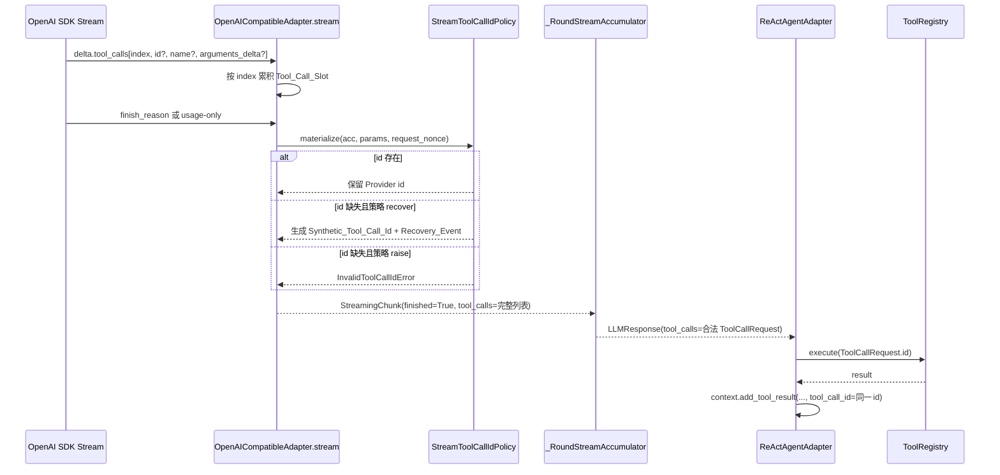

# 设计文档：流式工具调用 ID 兼容恢复

## 概述

本设计在 `infrastructure/model_access/openai_compatible_adapter.py` 内新增流式工具调用 id 恢复策略，使 OpenAI-compatible Provider 缺失 `delta.tool_calls[i].id` 时仍可生成合法 `ToolCallRequest`。设计遵循 DDD 依赖方向：领域层继续保持非空 id 契约，兼容第三方协议偏差的逻辑只放在基础设施适配层；新增配置写入 `epsilon-boot/config.properties`，测试使用 `pytest`、`pytest-asyncio` 与 Hypothesis。

主流方案依据：

- OpenAI Chat Completions 流式 function calling 以 `index` 聚合同一工具调用，`id` 与 `function.name` 通常只在首个 delta 出现，后续 delta 持续追加 `function.arguments`。因此正确聚合策略应以 `index` 为槽位键，并在首片保留 id。
- OpenAI API 文档将资源/对象 id 视为 opaque string，生产排障建议记录 request id；因此本地合成 id 不应伪装为 Provider id，而应使用清晰前缀并通过日志暴露。
- Anthropic fine-grained tool streaming 明确要求调用方处理不完整或无效流式输入；这支持在适配层把第三方流式边界视为可恢复输入，而不是把缺失字段泄漏到领域层。

### 设计决策

| # | 决策 | 选项 | 理由 |
| --- | --- | --- | --- |
| D1 | 缺失 id 默认处理 | 默认 `recover`，可配置 `raise` | 当前线上故障目标是恢复可用性；保留 `raise` 作为诊断/灰度回滚开关。 |
| D2 | 修复落点 | `OpenAICompatibleAdapter` 基础设施层 | 第三方 Provider 协议兼容属于 adapter 职责；领域层继续只接收合法 `ToolCallRequest`。 |
| D3 | 合成 id 生成方式 | `call_synthetic_<request_nonce>_<index>` | 避免与 Provider 原生 `call_...` 混淆，同时确保单次请求内唯一、可追踪、ASCII 安全。 |
| D4 | 聚合键 | 继续使用 SDK `tool_calls[i].index` | 与 OpenAI 官方流式工具调用聚合示例一致，支持多工具并行。 |
| D5 | 空参数处理 | 不把缺失参数的槽位恢复为可执行工具调用 | id 恢复只解决 id 缺失；工具名称/参数缺失仍视为不完整工具调用，避免执行错误工具。 |
| D6 | 观测方式 | WARN 结构化日志 + finished chunk metadata 摘要 | 日志用于运维聚合，metadata 用于上层 SSE/事件轻量诊断；均不记录敏感正文。 |
| D7 | 同步 `chat()` 链路 | 保持 fail-fast | 用户当前故障来自流式 ReAct；同步链路完整响应缺失 id 更接近 Provider 严重违约，先不放宽范围。 |

## 架构



## 组件与接口

### 1. `StreamToolCallIdRecoveryMode`

位置：`epsilon-boot/src/infrastructure/model_access/openai_compatible_adapter.py`

职责：表达流式工具调用 id 缺失时的策略，不新增跨层 Port。

```python
from typing import Literal

StreamToolCallIdRecoveryMode = Literal["recover", "raise"]
```

### 2. `ProviderConfig.stream_tool_call_id_strategy`

位置：`epsilon-boot/src/infrastructure/model_access/provider_config.py`

职责：为每个 Provider 提供独立策略。配置名继承现有 `MODEL_<PROVIDER>_` 前缀，例如 `MODEL_QWEN_STREAM_TOOL_CALL_ID_STRATEGY`。

```python
stream_tool_call_id_strategy: str = "recover"
```

校验策略：

- 允许值：`"recover"`、`"raise"`。
- 非法值在配置读取/适配器使用时 fail-fast 为 `ConfigurationError`。
- `config.properties` 为各启用 Provider 写入默认值，优先满足 Qwen 当前故障。

### 3. `_StreamToolCallIdRecovery`

位置：`epsilon-boot/src/infrastructure/model_access/openai_compatible_adapter.py`

职责：封装合成 id 与日志字段，避免 `stream()` 主循环继续膨胀。

```python
@dataclass(frozen=True)
class _StreamToolCallIdRecovery:
    """流式工具调用 id 兼容恢复结果。"""

    recovered_count: int = 0
    synthetic_ids: tuple[str, ...] = ()

    @property
    def occurred(self) -> bool:
        """是否发生过 id 恢复。"""
        return self.recovered_count > 0
```

### 4. `OpenAICompatibleAdapter._stream_tool_call_id_strategy`

位置：`epsilon-boot/src/infrastructure/model_access/openai_compatible_adapter.py`

职责：读取并校验 Provider 配置。

```python
def _stream_tool_call_id_strategy(self) -> StreamToolCallIdRecoveryMode:
    """返回流式工具调用 id 缺失处理策略。"""
```

### 5. `OpenAICompatibleAdapter._synthetic_tool_call_id`

位置：`epsilon-boot/src/infrastructure/model_access/openai_compatible_adapter.py`

职责：生成单请求内唯一的 ASCII 安全 id。

```python
@staticmethod
def _synthetic_tool_call_id(request_nonce: str, index: int) -> str:
    """生成本地合成工具调用 id。"""
```

建议格式：`call_synthetic_{request_nonce}_{index}`。`request_nonce` 在 `stream()` 开始时使用 `uuid.uuid4().hex[:12]` 创建；同一个 `index` 在同一次 stream 中生成同一个 id。

### 6. `OpenAICompatibleAdapter._materialize_full_tool_calls`

位置：`epsilon-boot/src/infrastructure/model_access/openai_compatible_adapter.py`

现有签名：

```python
@staticmethod
def _materialize_full_tool_calls(
    acc: dict[int, dict[str, Any]],
) -> list[StreamingToolCallDelta] | None:
```

目标签名：

```python
def _materialize_full_tool_calls(
    self,
    acc: dict[int, dict[str, Any]],
    params: dict[str, Any],
    *,
    request_nonce: str,
) -> tuple[list[StreamingToolCallDelta] | None, _StreamToolCallIdRecovery]:
    """把累积态展开为完整工具调用列表，并按策略恢复缺失 id。"""
```

行为：

- 空 `acc` 返回 `(None, _StreamToolCallIdRecovery())`。
- `slot["id"]` 非空时保留。
- `slot["id"]` 为空、`name` 与 `arguments` 非空、策略为 `recover` 时生成合成 id。
- `slot["id"]` 为空且策略为 `raise` 时抛 `InvalidToolCallIdError(source="stream_finished", ...)`。
- `name` 或 `arguments` 为空时不生成 id，保留 `None` 给 `_RoundStreamAccumulator` 的 finished 违约回退逻辑处理。

### 7. `OpenAICompatibleAdapter._log_stream_tool_call_id_recovery`

位置：`epsilon-boot/src/infrastructure/model_access/openai_compatible_adapter.py`

```python
def _log_stream_tool_call_id_recovery(
    self,
    *,
    params: dict[str, Any],
    delta: StreamingToolCallDelta,
    synthetic_id: str,
) -> None:
    """输出流式工具调用 id 恢复的结构化 WARN 日志。"""
```

`extra` 字段：

```python
{
    "source": "stream_finished",
    "provider": self._config.provider_name,
    "model": params.get("model"),
    "tool_name": delta.name,
    "tool_call_index": delta.index,
    "raw_id_value": None,
    "synthetic_id": synthetic_id,
    "recovery_strategy": "recover",
}
```

### 8. `StreamingChunk.metadata`

位置：`epsilon-boot/src/domain/model_access/value_objects.py` 不改字段，仅复用现有 `metadata: dict[str, Any]`。

finished chunk metadata 增加：

```python
{
    "tool_call_id_recovered": True,
    "synthetic_tool_call_count": 1,
}
```

若未恢复，不写入这两个键，避免改变纯文本流和正常 Provider 行为。

## 数据模型

### 领域模型

不新增或放宽领域模型：

- `ToolCallRequest(id: str, name: str, arguments: str)` 继续在 `__post_init__` 中拒绝空 id。
- `StreamingToolCallDelta.id` 仍为 `str | None`，中间分片仍允许 `None`。
- `StreamingChunk.metadata` 已存在，用于轻量诊断，不改变序列化契约。

### 配置模型

`epsilon-boot/config.properties` 新增或补齐：

```properties
# 流式工具调用返回空 id 时的策略：
# - recover（默认）：生成本地合成 id，继续执行工具，并记录 WARN
# - raise：保持严格校验，抛 InvalidToolCallIdError
MODEL_QWEN_STREAM_TOOL_CALL_ID_STRATEGY=recover
MODEL_ZHIPU_STREAM_TOOL_CALL_ID_STRATEGY=recover
MODEL_CLIPROXY_STREAM_TOOL_CALL_ID_STRATEGY=recover
MODEL_OPENAI_STREAM_TOOL_CALL_ID_STRATEGY=raise
```

说明：

- OpenAI 官方 Provider 默认 `raise`，因为官方协议应返回 id；兼容 Provider 默认 `recover`。
- 若实现复杂度需要保持统一默认，可先在 `ProviderConfig` 默认为 `recover`，并在 `config.properties` 对 OpenAI 显式设 `raise`。

### 日志模型

结构化日志不记录完整参数，只记录工具名、index、合成 id、Provider、模型、策略，便于按 `source=stream_finished AND recovery_strategy=recover` 聚合。

## 事务与并发边界

本特性不引入数据库写入、事务或跨请求共享状态。`request_nonce` 是单次 `stream()` 调用的局部变量，`acc` 也是单次异步迭代内局部累积态，不存在跨请求并发共享。

幂等性边界：

- 同一次 stream 内，同一 `index` 的合成 id 由同一个 `request_nonce + index` 决定。
- 同一请求的 finished chunk 与 usage-only chunk 若都触发 materialize，应复用已写入 `acc[index]["id"]` 的合成 id，避免产生两个不同 id。

## 正确性属性

### Property 1: Provider 原始 id 优先
*For any* 已累积 `id` 非空的 `Tool_Call_Slot`，无论策略为 `recover` 还是 `raise`，展开后的 `StreamingToolCallDelta.id` 都等于原始 id，且不会记录 `Recovery_Event`。
**验证需求：1, 4, 5**

### Property 2: 缺失 id 可恢复为非空唯一 id
*For any* 同一 stream 内按不同 `index` 聚合出的完整 `Tool_Call_Slot`，当原始 id 缺失且策略为 `recover` 时，展开后的 id 全部非空且互不相同。
**验证需求：1, 2, 5**

### Property 3: 合成 id 链路一致
*For any* 由 `Recovery_Mode` 生成的 `Synthetic_Tool_Call_Id`，Agent 记录的 `AssistantMessage.tool_calls[].id`、工具执行入参 `ToolCallRequest.id`、工具结果 `ToolMessage.tool_call_id` 必须一致。
**验证需求：1, 2, 6**

### Property 4: 严格模式保持原异常
*For any* 缺失 id 的完整 `Tool_Call_Slot`，当策略为 `raise` 时，`OpenAICompatibleAdapter.stream(...)` 必须抛出 `InvalidToolCallIdError(source="stream_finished")`。
**验证需求：3, 6**

### Property 5: 不完整槽位不被错误恢复
*For any* 缺失工具名称或参数的 `Tool_Call_Slot`，`Recovery_Mode` 不得构造可执行 `ToolCallRequest`。
**验证需求：1, 5**

## 错误处理

### 错误常量定义

不新增领域异常。继续使用：

- `InvalidToolCallIdError(code=50007)`：严格模式或同步 `chat()` 返回空 id。
- `ConfigurationError`：配置策略不是 `recover` 或 `raise`。

### 错误场景与处理策略

| 场景 | 策略 | 结果 |
| --- | --- | --- |
| 流式工具调用 id 缺失，name/arguments 完整，策略 `recover` | 合成 id | 继续执行，WARN 日志。 |
| 流式工具调用 id 缺失，name/arguments 完整，策略 `raise` | 严格失败 | 抛 `InvalidToolCallIdError`。 |
| 流式工具调用 name 缺失 | 不恢复 | finished 分片由 `_RoundStreamAccumulator` 记录违约并回退；最终不构造无名工具调用。 |
| 流式工具调用 arguments 缺失 | 不恢复 | 同上。 |
| 配置值非法 | fail-fast | 抛 `ConfigurationError`，避免静默进入错误策略。 |

### 错误传播策略

- `recover` 路径不向 application 层传播异常。
- `raise` 路径沿用现有 `ModelAccessError` 传播，由 FastAPI `BizException` handler 包装为业务错误。
- 日志 `message` 不包含敏感信息，敏感上下文不进入 `extra`。

### 错误处理原则

1. 保持领域层严格，兼容逻辑只消化在 Provider adapter 边界。
2. 能恢复的仅恢复 id；工具名、参数这类执行语义缺失不自动编造。
3. 恢复事件必须可观测、可统计、可按 Provider 回溯。

## 测试策略

### 属性测试（Property-Based Testing）

使用 Hypothesis 覆盖：

- 多 `index` 完整槽位生成的合成 id 非空且唯一。
- 已存在原始 id 时不被覆盖。
- 任意合法工具名/参数组合在 `recover` 下不会触发 `InvalidToolCallIdError`。

### 单元测试（Example-Based）

新增/修改：

- `epsilon-boot/test/infrastructure/model_access/test_openai_compatible_stream_id_recovery_unit.py`
  - finished 分支 `id=""` 或 `None` 恢复。
  - usage-only 末尾分片恢复。
  - 配置 `raise` 保持旧异常。
  - metadata 与 WARN `extra` 字段完整。
- 修改 `test_openai_compatible_stream_id_validation_unit.py`
  - 将默认缺失 id 用例从“抛异常”改为“恢复成功”。
  - 增加严格模式用例保留原断言。
- 修改 `test_openai_compatible_materialize_normalize_unit.py`
  - 适配 `_materialize_full_tool_calls` 新签名和返回 recovery 结果。

### 集成测试

新增/修改：

- `epsilon-boot/test/infrastructure/agent/test_react_agent_stream_tool_call_id_recovery_unit.py`
  - Fake `ModelAccessPort.stream(...)` 返回缺失 id 但完整 name/arguments 的分片。
  - 断言 `ReActAgentAdapter.run(...)` 或 `_iter_rounds` 能执行工具并写入匹配 `ToolMessage.tool_call_id`。

### 验证命令

在 `epsilon-boot/` 目录运行：

```bash
uv run --frozen pytest test/infrastructure/model_access/test_openai_compatible_stream_id_recovery_unit.py -q
uv run --frozen pytest test/infrastructure/model_access/test_openai_compatible_stream_id_validation_unit.py test/infrastructure/model_access/test_openai_compatible_stream_tool_calls_unit.py -q
uv run --frozen pytest test/infrastructure/agent/test_react_agent_stream_tool_call_id_recovery_unit.py -q
uv run --frozen pytest test -q
```
