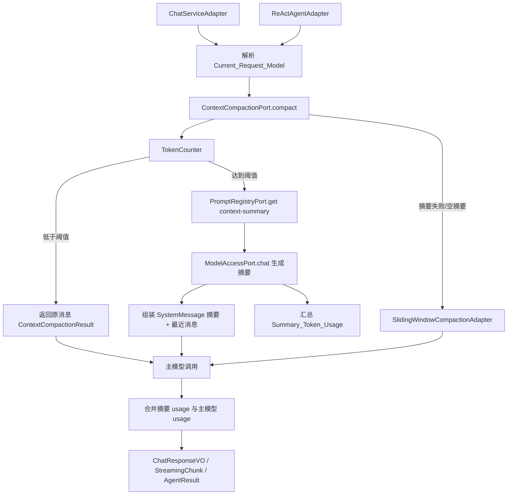
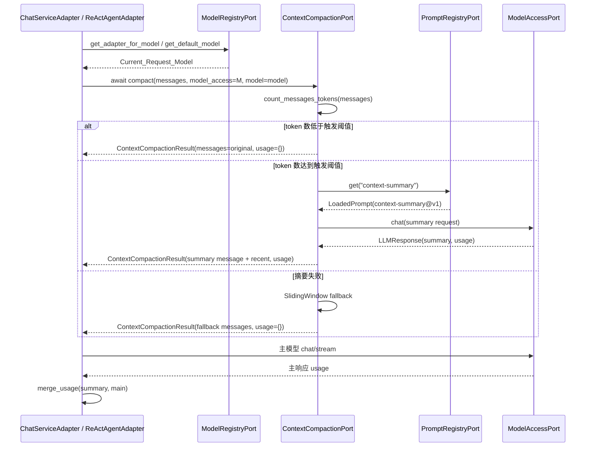

# 设计文档：Token 语义摘要上下文压缩

## 概述

本设计在现有 DDD / 六边形架构下扩展 `ContextCompactionPort`：领域层只定义异步压缩端口与压缩结果值对象，基础设施层实现 token 触发、LLM 摘要、Prompt 文件化加载、滑动窗口降级和 usage 合并。设计遵循 `docs/steering/ddd-architecture.md` 的依赖方向、`docs/steering/config-source.md` 的配置来源规则，以及 `docs/steering/code-documentation.md` 的中文 docstring 要求。

核心路径为：聊天或 Agent 调用在解析出当前请求模型后，把完整消息列表、当前模型访问端口和模型名称交给 `LLMSummaryCompactionAdapter`；适配器低于触发阈值时透传，高于阈值时使用 `context-summary@v1` Prompt 调用同一模型生成摘要，并返回包含摘要消息、最近消息和摘要 usage 的 `ContextCompactionResult`。完整会话历史不被摘要替换，仍按现有 `SessionContextStorePort` 保存。

### 设计决策

| 决策 | 选定方案 | 理由 |
| --- | --- | --- |
| 摘要模型来源 | 复用 `Current_Request_Model` | 用户已确认 A；不新增摘要专用模型路由，减少配置面和容器装配复杂度。 |
| 非法压缩配置 | 启动失败 | 用户已确认 A；避免 token 触发阈值或最近消息数误配后静默运行。 |
| 摘要 Prompt | 创建 `prompts/context-summary/v1.md` 基础版 | 用户已确认 A；满足 Prompt 文件化，后续通过版本文件迭代内容。 |
| 端口形态 | `ContextCompactionPort.compact` 改为 async 并返回 `ContextCompactionResult` | LLM 摘要需要模型调用；结果必须携带摘要 usage，避免成本不可见。 |
| 默认策略 | 容器默认注册 `LLMSummaryCompactionAdapter` | 满足默认启用；保留滑动窗口作为降级和独立测试对象。 |
| token 计数 | 新增显式依赖 `tiktoken>=0.12.0`，默认 `cl100k_base` | 避免依赖传递依赖；配置非法编码时 fail-fast。 |
| 消息序列化 | 抽出 `infrastructure/chat/message_serialization.py` | Chat、Agent、摘要适配器共享模型消息格式，避免摘要适配器依赖 `ReActAgentAdapter`。 |
| “预算”概念 | 不引入 | 用户明确要求；所有配置使用 trigger / keep_recent / encoding 命名。 |

## 架构





## 组件与接口

### 1. 领域层：`ContextCompactionResult`

位置：`epsilon-boot/src/domain/chat/value_objects.py`

职责：表达压缩结果，避免端口只返回消息列表而丢失摘要调用 usage。

```python
@dataclass(frozen=True)
class ContextCompactionResult:
    """上下文压缩结果值对象。"""

    messages: list[BaseMessage]
    usage: dict[str, int] = field(default_factory=dict)
    summary_created: bool = False

    def __post_init__(self) -> None:
        """校验 messages 为 list，usage 值为非负整数。"""
```

### 2. 领域层：`ContextCompactionPort`

位置：`epsilon-boot/src/domain/chat/ports.py`

职责：定义异步压缩能力。领域层只通过 `TYPE_CHECKING` 引用 `ModelAccessPort`，不导入基础设施。

```python
class ContextCompactionPort(Protocol):
    """上下文压缩端口。"""

    async def compact(
        self,
        messages: list["BaseMessage"],
        *,
        model_access: "ModelAccessPort | None" = None,
        model: str | None = None,
    ) -> "ContextCompactionResult":
        """压缩消息列表并返回结构化结果。"""
        ...
```

`model_access` 和 `model` 为关键字参数，便于滑动窗口适配器忽略它们，也便于所有调用点显式传入当前请求模型。

### 3. 基础设施：`TokenCounter`

位置：`epsilon-boot/src/infrastructure/chat/token_counter.py`

职责：封装 `tiktoken` 编码加载和消息 token 估算。编码名称非法时抛 `ConfigurationError`，由容器启动失败暴露。

```python
class TokenCounter:
    """基于 tiktoken 的消息 token 估算器。"""

    def __init__(self, encoding_name: str) -> None: ...

    def count_text(self, text: str) -> int: ...

    def count_message(self, message: BaseMessage) -> int: ...

    def count_messages(self, messages: list[BaseMessage]) -> int: ...
```

计数规则：按序列化后 `role`、`content`、`tool_call_id`、`tool_calls` JSON 文本估算，并为每条消息增加固定小开销 4 tokens。该值用于触发判断，不作为预算或截断上限。

### 4. 基础设施：消息序列化模块

位置：`epsilon-boot/src/infrastructure/chat/message_serialization.py`

职责：从 `ReActAgentAdapter._serialize_messages` 提取公共函数，供 Chat、Agent、摘要适配器复用。

```python
def serialize_messages(messages: list[BaseMessage]) -> list[dict[str, Any]]:
    """将 BaseMessage 列表转换为 OpenAI Chat Completions 兼容消息。"""
```

`ReActAgentAdapter._serialize_messages` 保留为兼容薄壳，内部调用 `serialize_messages`，减少测试改动风险。

### 5. 基础设施：usage 合并工具

位置：`epsilon-boot/src/infrastructure/chat/usage.py`

职责：合并摘要调用 usage 与主模型 usage。缺失键按 0 处理，非 int 值不支持。

```python
def merge_usage(*usages: dict[str, int] | None) -> dict[str, int]:
    """合并多个 usage 字典。"""
```

### 6. 基础设施：`SlidingWindowCompactionAdapter`

位置：`epsilon-boot/src/infrastructure/chat/sliding_window_compaction_adapter.py`

职责：保留既有策略，并适配新的异步端口。

```python
class SlidingWindowCompactionAdapter:
    """滑动窗口压缩适配器。"""

    def compact_messages(self, messages: list[BaseMessage]) -> list[BaseMessage]:
        """同步执行滑动窗口消息选择，供评测和降级复用。"""

    async def compact(
        self,
        messages: list[BaseMessage],
        *,
        model_access: ModelAccessPort | None = None,
        model: str | None = None,
    ) -> ContextCompactionResult:
        """返回滑动窗口压缩结果。"""
```

既有同步测试可迁移到 `compact_messages`；端口测试使用 async `compact`。

### 7. 基础设施：`LLMSummaryCompactionAdapter`

位置：`epsilon-boot/src/infrastructure/chat/llm_summary_compaction_adapter.py`

职责：默认压缩策略。构造期加载摘要 Prompt 和 token counter；运行期根据触发阈值决定是否调用摘要模型。

```python
class LLMSummaryCompactionAdapter:
    """LLM 语义摘要上下文压缩适配器。"""

    def __init__(
        self,
        *,
        prompt_registry: PromptRegistryPort,
        token_counter: TokenCounter,
        trigger_tokens: int,
        keep_recent_messages: int,
        fallback: SlidingWindowCompactionAdapter,
    ) -> None: ...

    async def compact(
        self,
        messages: list[BaseMessage],
        *,
        model_access: ModelAccessPort | None = None,
        model: str | None = None,
    ) -> ContextCompactionResult: ...

    def _split_messages(
        self,
        messages: list[BaseMessage],
    ) -> tuple[list[BaseMessage], list[BaseMessage], list[BaseMessage]]: ...

    def _build_summary_request(
        self,
        old_messages: list[BaseMessage],
        *,
        model: str | None,
    ) -> ChatRequest: ...

    def _fallback(self, messages: list[BaseMessage]) -> ContextCompactionResult: ...
```

拆分规则：

1. `system_messages = [m for m in messages if m.role == "system"]`
2. `non_system_messages = [m for m in messages if m.role != "system"]`
3. `recent_messages = non_system_messages[-keep_recent_messages:]`
4. `old_messages = non_system_messages[:-keep_recent_messages]`
5. `old_messages` 为空时不摘要，返回原消息。
6. 摘要成功后返回 `system_messages + [SystemMessage(content=summary)] + recent_messages`。

摘要请求消息格式：

```python
ChatRequest(
    messages=[
        {"role": "system", "content": loaded_summary_prompt.content},
        {"role": "user", "content": json.dumps([serialize_messages(old_messages)], ensure_ascii=False)},
    ],
    model=model,
)
```

不传 `tools`，避免摘要模型调用触发工具调用。

失败降级：`model_access is None`、摘要调用抛异常、返回空白摘要、摘要响应带 tool_calls 均记录 warning 并调用 `fallback.compact_messages(messages)`。

### 8. 配置：`ChatConfig`

位置：`epsilon-boot/src/infrastructure/chat/chat_config.py`

新增字段：

```python
compaction_trigger_tokens: int = 8000
compaction_keep_recent_messages: int = 20
compaction_encoding: str = "cl100k_base"
```

新增 `@model_validator(mode="after")` 校验：

- `compaction_trigger_tokens > 0`
- `compaction_keep_recent_messages > 0`
- 字段名和错误消息不使用 budget 语义。

### 9. 配置：`PromptVersionConfig`

位置：`epsilon-boot/src/infrastructure/prompt/prompt_version_config.py`

新增字段并纳入 validator：

```python
context_summary_version: str = "v1"
```

`as_mapping()` 自动产生 `{"context-summary": "v1"}`，无需额外分支。

### 10. Prompt 资产

位置：`epsilon-boot/prompts/context-summary/v1.md`

职责：基础版结构化摘要提示词。文件必须可运行，不是空占位。

内容要求：

- 明确模型只输出结构化摘要；
- 明确保留目标、约束、已做操作、错误、文件路径、命令结果、用户偏好；
- 明确弱化重复日志、寒暄、无关过程细节、失效假设；
- 固定栏目：`当前目标`、`已完成`、`关键文件`、`关键命令与结果`、`约束与偏好`、`错误与阻塞`、`下一步`；
- 不直接写入用户要求避免的那句提示词。

### 11. 容器装配

位置：`epsilon-boot/src/application/container_config.py`

`_create_compaction_adapter()` 改为 async 工厂。`Container.register` 已能识别 async provider，后续 `await container.resolve(ContextCompactionPort)` 时会正确创建 singleton。

```python
async def _create_compaction_adapter() -> ContextCompactionPort:
    from infrastructure.chat.chat_config import chat_config
    from infrastructure.chat.llm_summary_compaction_adapter import LLMSummaryCompactionAdapter
    from infrastructure.chat.sliding_window_compaction_adapter import SlidingWindowCompactionAdapter
    from infrastructure.chat.token_counter import TokenCounter

    prompt_registry = await container.resolve(PromptRegistryPort)
    fallback = SlidingWindowCompactionAdapter(max_messages=chat_config.max_messages)
    return LLMSummaryCompactionAdapter(
        prompt_registry=prompt_registry,
        token_counter=TokenCounter(chat_config.compaction_encoding),
        trigger_tokens=chat_config.compaction_trigger_tokens,
        keep_recent_messages=chat_config.compaction_keep_recent_messages,
        fallback=fallback,
    )
```

### 12. 调用点改造

`ChatServiceAdapter`：

```python
compaction_result = await self._compaction.compact(
    all_messages,
    model_access=model_access,
    model=resolved_model,
)
chat_request = ChatRequest(
    messages=serialize_messages(compaction_result.messages),
    model=request.model,
)
response_usage = merge_usage(compaction_result.usage, response.usage)
```

流式路径保存 `compaction_result.usage`，在最终 chunk 或 `assistant_done` 事件处合并。

`ReActAgentAdapter`：

每轮主模型调用前：

```python
compaction_result = await self._compaction.compact(
    context.get_messages(),
    model_access=model_access,
    model=config.model,
)
for key, value in compaction_result.usage.items():
    total_usage[key] = total_usage.get(key, 0) + value
chat_request = ChatRequest(
    messages=serialize_messages(compaction_result.messages),
    model=config.model,
    tools=config.tool_schemas,
)
```

`TaskAgentAdapter` 不直接调用 compaction，但它依赖的 `AgentPort` 会统一处理；仅测试 mock 需要迁移。

## 数据模型

### 领域值对象

`ContextCompactionResult` 为新增领域值对象，不持久化。

示例：

```python
ContextCompactionResult(
    messages=[
        SystemMessage(content="原 system"),
        SystemMessage(content="当前目标：...\n已完成：..."),
        UserMessage(content="最近问题"),
    ],
    usage={"prompt_tokens": 1200, "completion_tokens": 260, "total_tokens": 1460},
    summary_created=True,
)
```

### 配置键

写入 `epsilon-boot/config.properties`：

```properties
# 上下文语义摘要压缩触发 token 数；达到或超过该值时触发摘要压缩。该值不是预算。
CHAT_COMPACTION_TRIGGER_TOKENS=8000
# 摘要压缩后保留的最近非 system 消息数量。
CHAT_COMPACTION_KEEP_RECENT_MESSAGES=20
# token 计数编码名称。
CHAT_COMPACTION_ENCODING=cl100k_base
# 上下文摘要 Prompt 版本。
PROMPT_CONTEXT_SUMMARY_VERSION=v1
```

保留既有 `CHAT_MAX_MESSAGES`，仅供 `SlidingWindowCompactionAdapter` 降级使用。

### Prompt 资产

新增：

```text
epsilon-boot/prompts/context-summary/v1.md
```

该文件纳入 git，不运行期生成。

### 依赖

`epsilon-boot/pyproject.toml` 新增直接依赖：

```toml
"tiktoken>=0.12.0",
```

通过 `uv lock` 更新 `uv.lock`。

### 持久化模型

无数据库、Redis 或文件持久化结构变更。摘要不写入 `SessionContextStorePort`，不产生 DDL、迁移脚本或数据回填。

## 事务与并发边界

本特性不引入新的持久化写事务。压缩发生在单次模型调用请求内，是内存级转换。

- `ChatServiceAdapter`：先加载完整上下文，追加用户消息，执行压缩和主模型调用，最后按既有流程保存完整上下文。摘要消息不写回，故无需新事务。
- `ReActAgentAdapter`：每轮压缩仅读取当前 `ConversationContext.get_messages()`；工具结果仍按既有 Agent Loop 原地追加到 `ConversationContext`。
- `PromptRegistryPort.get("context-summary")` 返回启动期已加载的只读 `LoadedPrompt`，并发读取安全。
- `TokenCounter` 构造后只读，多个请求可共享。
- 摘要调用是外部模型边界；失败不回滚已追加到内存的用户消息，但主请求会继续走降级压缩并按既有流程保存最终上下文。

## 正确性属性

### Property 1: 未达到触发阈值不调用摘要模型

*For any* 有效消息列表和任意正整数 `Compaction_Trigger_Tokens`，当 `TokenCounter.count_messages(messages) < Compaction_Trigger_Tokens` 时，`LLM_Summary_Compaction_Adapter.compact` 返回的 `Context_Compaction_Result.messages` 与输入消息列表内容等价，`summary_created=False`，且不调用 `Model_Access_Port.chat`。
**验证需求：1.3, 9.1**

### Property 2: 摘要压缩保留 system 与最近消息

*For any* 包含任意数量 system / user / assistant / tool 消息的 `Full_Conversation_History`，当触发摘要且较早非 system 消息非空时，压缩结果包含全部原 system 消息、一条摘要 `SystemMessage`、以及原非 system 子列的最近 `Compaction_Keep_Recent_Messages` 条消息，且最近消息保持原始相对顺序。
**验证需求：4.1, 4.2, 4.3, 4.5**

### Property 3: 压缩不修改完整历史

*For any* `ConversationContext`，在 Chat 或 Agent 调用压缩前后，原 `ConversationContext.get_messages()` 返回的历史消息内容不被摘要消息替换，摘要消息仅存在于 `Context_Compaction_Result.messages` 中。
**验证需求：4.6, 5.1, 5.2, 5.3, 5.4**

### Property 4: 摘要 usage 合并可交换且缺失键按 0

*For any* 两个或多个 usage 字典，`merge_usage` 对每个 key 的结果等于所有输入中该 key 的整数值之和；缺失 key 视为 0；空输入返回 `{}`。
**验证需求：6.1, 6.2, 6.3, 6.4, 6.5, 6.6**

### Property 5: 摘要失败降级不阻断主请求

*For any* 触发摘要的消息列表，当摘要模型调用抛异常或返回空白内容时，`LLM_Summary_Compaction_Adapter.compact` 返回滑动窗口降级结果，`summary_created=False`，且异常不向 Chat 或 Agent 主调用传播。
**验证需求：7.1, 7.2, 7.3, 7.4**

### Property 6: Prompt 正文不来自生产代码常量

*For any* `LLM_Summary_Compaction_Adapter` 实例，摘要请求中的 system prompt 必须等于 `Prompt_Registry_Port.get("context-summary").content`，而不是适配器模块中的硬编码完整正文。
**验证需求：2.5, 3.1, 3.4, 3.5**

## 错误处理

### 错误常量定义

本特性不新增领域业务错误码。错误沿用：

- 配置加载错误：`common.configuration.ConfigurationError` 或其子类。
- Prompt 资产错误：`infrastructure.prompt.exceptions` 现有 `ConfigurationError` 子类。
- 模型调用错误：`domain.model_access.exceptions.ModelAccessError` 族，由摘要适配器捕获并降级。

新增 `InvalidChatCompactionConfigError(ConfigurationError)` 可放在 `infrastructure/chat/chat_config.py` 或同模块附近，用于 `CHAT_COMPACTION_TRIGGER_TOKENS`、`CHAT_COMPACTION_KEEP_RECENT_MESSAGES` 非法时 fail-fast。

### 错误场景与处理策略

| 场景 | 处理 |
| --- | --- |
| `CHAT_COMPACTION_TRIGGER_TOKENS <= 0` | `ChatConfig` 构造失败，服务拒绝启动。 |
| `CHAT_COMPACTION_KEEP_RECENT_MESSAGES <= 0` | `ChatConfig` 构造失败，服务拒绝启动。 |
| `CHAT_COMPACTION_ENCODING` 无法被 `tiktoken.get_encoding` 加载 | `TokenCounter` 构造时抛 `ConfigurationError`，服务拒绝启动。 |
| `PROMPT_CONTEXT_SUMMARY_VERSION` 非法 | `PromptVersionConfig` validator 抛 `InvalidPromptVersionTagError`。 |
| `context-summary` Prompt 文件缺失/空白/解码失败 | `FilesystemPromptRegistryAdapter` 按现有 Prompt 启动失败语义抛错。 |
| 摘要模型调用异常 | `LLMSummaryCompactionAdapter` warning 日志 + 滑动窗口降级。 |
| 摘要模型返回空白或 tool_calls | warning 日志 + 滑动窗口降级。 |
| 调用端未传 `model_access` 且达到触发阈值 | warning 日志 + 滑动窗口降级，避免测试替身或未来调用点直接崩溃。 |

### 错误传播策略

- 启动期配置与 Prompt 资产错误向上传播，阻止容器启动。
- 运行期摘要生成错误不向主聊天或 Agent 请求传播，降级后继续主模型调用。
- 主模型调用错误仍按现有 `ModelAccessPort` 错误传播策略处理，不被压缩适配器吞掉。
- 降级日志使用 `logger.warning(..., extra={...})`，包含 `message_count`、`trigger_tokens`、`reason_class`，不记录完整消息正文。

### 错误处理原则

- 配置错误 fail-fast，运行期摘要失败 soft-fail。
- 不因摘要失败破坏完整会话历史。
- 不在异常消息或日志中输出完整上下文正文。
- 不引入预算相关错误名称或字段。

## 测试策略

### 属性测试（Property-Based Testing）

使用 Hypothesis，放在 `epsilon-boot/test/domain/chat/test_compaction_properties.py` 或新增 `test_llm_summary_compaction_properties.py`：

| Property | 测试重点 | 需求 |
| --- | --- | --- |
| Property 1 | 未达到阈值不调用摘要模型 | 1.3, 9.1 |
| Property 2 | 保留 system 和最近 N 条非 system | 4.1-4.5 |
| Property 3 | 压缩不修改原 `ConversationContext` | 5.1-5.4 |
| Property 4 | `merge_usage` 对任意 usage 字典求和 | 6.1-6.6 |
| Property 5 | 摘要失败降级不抛出 | 7.1-7.4 |

### 单元测试（Example-Based）

新增或更新：

- `test/infrastructure/chat/test_token_counter_unit.py`
- `test/infrastructure/chat/test_llm_summary_compaction_adapter_unit.py`
- `test/infrastructure/chat/test_usage_unit.py`
- `test/infrastructure/chat/test_message_serialization_unit.py`
- `test/infrastructure/prompt/test_prompt_version_config_unit.py`
- `test/infrastructure/prompt/test_filesystem_prompt_registry_adapter_unit.py`
- `test/infrastructure/chat/test_chat_config.py`
- 现有 Chat / Agent 测试中所有 `compaction.compact` mock 改为 `AsyncMock`，返回 `ContextCompactionResult`。

关键用例：

- 构造期调用 `prompt_registry.get("context-summary")`。
- 摘要请求使用 `LoadedPrompt.content`。
- 空摘要降级。
- 模型异常降级。
- 直接聊天路径合并 summary usage。
- 流式路径最终 chunk 合并 summary usage。
- Agent 多轮累计 summary usage。
- 生产代码中不存在完整摘要 Prompt 正文常量。

### 集成测试

使用现有 pytest：

- 容器装配测试：`ContextCompactionPort` 默认解析为 `LLMSummaryCompactionAdapter`。
- Prompt 资产启动测试：`context-summary@v1` 可被 `FilesystemPromptRegistryAdapter` 加载。
- ChatService 直接 LLM 路径：超低触发阈值下执行摘要，再调用主模型，保存完整历史。
- ReActAgentAdapter：两轮模型调用中压缩 usage 被累计。
- 评测迁移：`tests/evaluation/metrics/test_context_compaction_effectiveness.py` 继续验证 `SlidingWindowCompactionAdapter.compact_messages` 或 async `compact` 的滑动窗口不变量。

验证命令：

```bash
UV_CACHE_DIR=../.uv-cache uv run pytest test/domain/chat test/infrastructure/chat test/infrastructure/agent test/infrastructure/prompt test/application/test_container_config.py -q
UV_CACHE_DIR=../.uv-cache uv run pytest ../../tests/evaluation/metrics/test_context_compaction_effectiveness.py ../../tests/evaluation/metrics/test_meta_context_compaction_effectiveness.py -q
```

## 需求追踪矩阵

| 需求 | 设计覆盖 |
| --- | --- |
| 需求 1 | 组件 2、6、7、11、12；Property 1 |
| 需求 2 | 组件 10；Property 6 |
| 需求 3 | 组件 9、10、11；错误处理；测试策略 |
| 需求 4 | 组件 7；Property 2 |
| 需求 5 | 组件 12；事务与并发边界；Property 3 |
| 需求 6 | 组件 1、5、12；Property 4 |
| 需求 7 | 组件 7；错误处理；Property 5 |
| 需求 8 | 组件 8；数据模型；错误处理 |
| 需求 9 | 组件 2、12；测试策略 |
| 需求 10 | 测试策略 |
