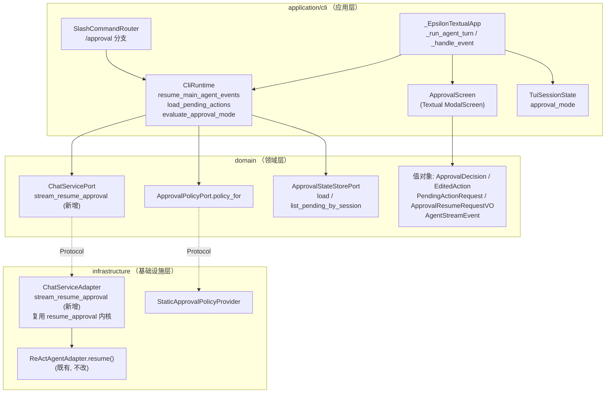
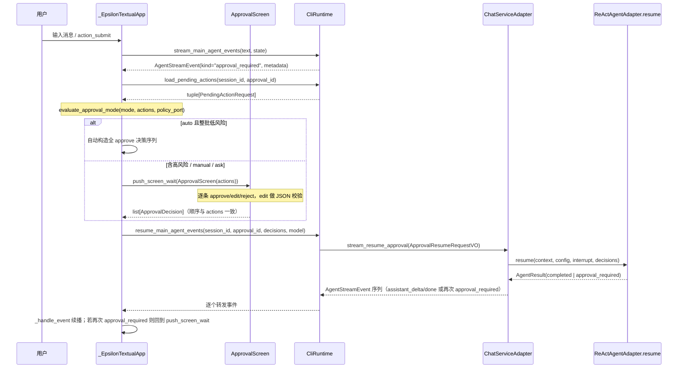

# 设计文档：本地 TUI 审批与高风险工具闭环（tui-approval-workflow）

## 概述

本特性在既有 HITL v1 能力之上补齐本地 Textual TUI 的 inline 审批闭环：先在 `ChatServicePort` 新增流式恢复入口 `stream_resume_approval` 与对称的 `CliRuntime.resume_main_agent_events`，再把 TUI 中纯文本的 `approval_required` 提示替换为交互式 `ApprovalScreen`（Textual `ModalScreen`），逐条收集 approve/edit/reject 决策后走 inline 流式恢复通路续播，并支持再次中断。所有决策应用、审批校验、trace 写入均复用 `ChatServiceAdapter.resume_approval` 与 `ReActAgentAdapter.resume` 既有逻辑，本特性不重写。

设计遵循以下仓库规范（binding）：
- `docs/steering/ddd-architecture.md`：Port 定义在 `domain/chat/ports.py`，实现在 `infrastructure/chat/chat_service_adapter.py`；`CliRuntime`/`TUI`/`SlashCommandRouter`/`ApprovalScreen` 归属 `application/cli/`；不在 `application` 层绕过 Port 直连基础设施。
- `docs/steering/python-typing-lint.md`：全量类型标注、禁裸 `Any`（沿用现有 `Any` 仅限已有模式如 metadata dict）、异常链 `raise ... from err`、走 logger 不用 print、`line-length=100`。
- `docs/steering/pydantic-model.md` 与领域值对象：复用既有 `frozen` dataclass 值对象（`ApprovalDecision`/`EditedAction`/`PendingActionRequest`/`ApprovalResumeRequestVO`），不新增并行结构。
- `docs/steering/srp-principle.md`：`ApprovalScreen` 只负责决策采集与 JSON 校验，恢复编排留在 `CliRuntime`/`ChatServiceAdapter`，策略判定委托 `ApprovalPolicyPort`。
- `docs/steering/code-documentation.md`：所有新增模块/类/公开方法配中文 docstring。

## 设计决策

| 决策点 | 选定方案 | 理由 |
| --- | --- | --- |
| `stream_resume_approval` 的实现方式 | 复用 `resume_approval` 的“加载中断→校验→consume→`agent.resume()`”得到 `AgentResult`，再把该结果“翻译”为 `AgentStreamEvent` 序列产出；不新增 `AgentPort.resume_events` | `AgentPort.resume()` 已封装完整的决策应用与继续执行且返回 `AgentResult`；需求 1.6 要求不重复实现 approve/edit/reject 应用。以 `AgentResult`→事件的翻译层实现续播，避免侵入 `ReActAgentAdapter` 恢复内核，风险最小。见“正确性属性 5”对续播事件形态的约束。 |
| 续播的 `assistant_delta` 粒度 | 恢复后自然完成时以单个 `assistant_delta`（整段 `AgentResult.content`）+ `assistant_done` 产出，客户端按累加渲染 | 恢复内核 `resume()` 是同步 `AgentResult`，不产生 token 级分片；需求 4.1 只要求“按既有渲染逻辑续播”，TUI 的 `_handle_event` 对 `assistant_delta` 已按累加处理，单段分片完全兼容。 |
| 再次中断的事件形态 | 当 `AgentResult.status=="approval_required"` 时，产出 `kind="approval_required"` 事件，`metadata` 复用 `approval_payload_to_metadata(agent_result.approval)` 并合并 `{"round": ...}` | 与 `run_events` 首次中断的事件 schema 完全一致（需求 1.3 / 4.2），前端无需区分首次/再次。 |
| ApprovalScreen 如何拿到 `arguments`（edit 预填） | `CliRuntime` 在打开面板前调用 `approval_store.load(session_id, approval_id)` 取回完整 `tuple[PendingActionRequest, ...]` 传入面板；不从 inline 事件 metadata 取 | `approval_payload_to_metadata` 白名单**刻意不透传 `arguments`**（避免泄露到通用观测链路）；edit 需要原始参数预填，只能从受控的 `ApprovalStateStorePort.load` 读取完整动作。`load` 不消费状态，恢复时仍走 `consume` 原子路径。 |
| Approval_Mode 三档判定位置 | 在 TUI 收到 `approval_required` 时，由 `application/cli` 侧的纯函数 `evaluate_approval_mode(...)` 依据 `ApprovalPolicyPort.policy_for(tool_name)` 逐动作判定 | 需求 6.6 禁止 TUI 硬编码风险分级；判定必须以后端策略为准。抽为纯函数便于单测。 |
| `auto` 档定位 | 标注为“面向未来扩展位”，仅当**整批**动作经 `policy_for` 判定 `interrupt=False`（低风险）时才自动 approve；任一 `interrupt=True` 高风险动作强制打开面板 | 当前 `StaticApprovalPolicyProvider` 中 `interrupt=True` 恰为 6 个高风险工具，低风险工具不产生 `approval_required`，故 auto 在现网几乎不触达；安全约束确保未来放开低风险中断时不会整批绕过高风险红线（需求 6.4/6.5）。 |
| trace 写入职责 | 不在恢复路径为“被恢复批次”额外写 `ApprovalTrace`；被恢复批次的 `ApprovalTrace` 已在**首次中断**时由 `run_events`/`run` 经 `_build_approval_trace` 写入；再次中断时 `resume()` 内 `_iter_rounds` 会为**新批次**写 trace | 复用既有写入路径（需求 7.2），避免重复审批追踪结构；需求 7.1 语义已由首次中断的 trace 满足。见“错误处理·trace 写入失败”。 |
| `/approval` 命令解析 | 在 `SlashCommandRouter.handle` 增加 `/approval` 分支：无参=查看模式+pending 列表；`mode <value>`=切换 | 与既有 `/model`/`/run` 分支同构，复用 `approval_store.list_pending_by_session`（只读）。 |

## 架构

### 组件与 DDD 分层



### inline 审批闭环时序



### 目录与文件影响

```
epsilon-boot/src/
├── domain/chat/ports.py                       # 新增 ChatServicePort.stream_resume_approval
├── infrastructure/chat/chat_service_adapter.py# 新增 stream_resume_approval（复用 resume_approval 内核）
└── application/cli/
    ├── runtime.py                             # 新增 resume_main_agent_events / load_pending_actions / policy_for 暴露
    ├── approval_mode.py（新增）                # evaluate_approval_mode 纯函数
    ├── approval_screen.py（新增）              # ApprovalScreen(ModalScreen)
    ├── tui.py                                  # approval_required 分支改为打开 ApprovalScreen + 续播
    ├── commands.py                             # /approval 分支 + HELP_TEXT
    └── session.py                              # 复用既有 approval_mode 字段（默认 "ask"）
```

## 组件与接口

以下签名均使用仓库现有 Python 3.11 风格（`from __future__ import annotations`、`frozen dataclass`、Protocol、既有导入根 `src`）。

### 1. `ChatServicePort.stream_resume_approval`（domain/chat/ports.py）

职责：暴露流式审批恢复能力端口方法，与 `stream_chat_events` 同构。

```python
def stream_resume_approval(
    self,
    request: ApprovalResumeRequestVO,
) -> AsyncIterator[AgentStreamEvent]:
    """提交审批决策并以结构化事件流恢复聊天执行。

    与 ``stream_chat_events`` 对称：恢复自然完成时依次产出
    ``assistant_delta`` / ``assistant_done``；恢复后再次触发工具审批
    中断时产出新的 ``kind="approval_required"`` 事件（metadata 携带新的
    session_id / approval_id / 动作摘要）。决策应用与校验复用既有
    ``resume_approval`` 内核，不在本方法重复实现 approve/edit/reject。
    """
    ...
```

`ApprovalResumeRequestVO` 与 `AgentStreamEvent` 已在 `ports.py` 顶部的 `TYPE_CHECKING` 块导入，无需新增导入。

### 2. `ChatServiceAdapter.stream_resume_approval`（infrastructure/chat/chat_service_adapter.py）

职责：复用 `resume_approval` 的加载/校验/consume/`agent.resume()` 内核，把 `AgentResult` 翻译为事件流。**为避免逻辑分叉**，将 `resume_approval` 现有主体抽出为私有内核方法 `_resume_to_agent_result`，`resume_approval`（同步）与 `stream_resume_approval`（流式）共用之。

```python
async def _resume_to_agent_result(
    self,
    request: ApprovalResumeRequestVO,
) -> tuple[ConversationContext, AgentResult]:
    """加载并原子消费审批中断、校验决策、委托 agent.resume 恢复执行。

    从既有 resume_approval 抽取的共享内核：包含 load / is_expired /
    数量与顺序与 allowed_decisions 校验 / consume / agent.resume。
    返回恢复后的上下文与 AgentResult，供同步与流式两条出口共用，
    满足需求 1.6“不重复实现动作应用”。
    """
    ...

async def resume_approval(self, request: ApprovalResumeRequestVO) -> ChatResponseVO:
    """提交审批决策并恢复聊天执行（同步，签名不变）。"""
    context, agent_result = await self._resume_to_agent_result(request)
    await self._save_context_for_agent_result(
        session_id=request.session_id, context=context, agent_result=agent_result
    )
    return self._to_chat_response(
        session_id=request.session_id, context=context, agent_result=agent_result
    )

async def stream_resume_approval(
    self,
    request: ApprovalResumeRequestVO,
) -> AsyncIterator[AgentStreamEvent]:
    """提交审批决策并以结构化事件流恢复执行。"""
    context, agent_result = await self._resume_to_agent_result(request)
    await self._save_context_for_agent_result(
        session_id=request.session_id, context=context, agent_result=agent_result
    )
    if agent_result.status == "approval_required":
        approval = agent_result.approval
        assert approval is not None
        yield AgentStreamEvent(
            kind="approval_required",
            content="当前请求等待人工审批，请通过审批恢复接口提交决策。",
            usage=agent_result.usage,
            metadata=approval_payload_to_metadata(approval),
        )
        return
    if agent_result.content:
        yield AgentStreamEvent(kind="assistant_delta", content=agent_result.content)
    yield AgentStreamEvent(
        kind="assistant_done",
        usage=agent_result.usage,
        metadata={"terminated_reason": agent_result.terminated_reason},
    )
```

说明：
- `_save_context_for_agent_result` 与 `_to_chat_response` 已存在，直接复用。
- `approval_payload_to_metadata` 从 `infrastructure.agent.approval_serialization` 导入（同层，符合依赖方向）。
- `paused`（`terminated_reason in ("max_rounds","token_budget_exceeded")`）时 `content` 为空、仅产出 `assistant_done`，TUI 现有渲染即可展示（本特性不新增 paused 续跑 UI）。

### 3. `CliRuntime` 新增方法（application/cli/runtime.py）

```python
async def resume_main_agent_events(
    self,
    session_id: str,
    approval_id: str,
    decisions: list[ApprovalDecision],
    *,
    model: str | None = None,
) -> AsyncIterator[AgentStreamEvent]:
    """为当前 TUI 会话提交审批决策并流式续播主 Agent 事件。

    与 stream_main_agent_events 对称：构造 ApprovalResumeRequestVO 委托
    ChatServicePort.stream_resume_approval，逐个转发 AgentStreamEvent。
    """
    request = ApprovalResumeRequestVO(
        session_id=session_id,
        approval_id=approval_id,
        decisions=tuple(decisions),
        model=model,
    )
    async for event in self._require_chat_service().stream_resume_approval(request):
        yield event

async def load_pending_actions(
    self,
    session_id: str,
    approval_id: str,
) -> tuple[PendingActionRequest, ...]:
    """读取指定审批批次的完整待审批动作（含 arguments），供面板渲染与 edit 预填。

    通过 ApprovalStateStorePort.load 只读取不消费；批次不存在或已过期时
    返回空元组，由调用方回退到无 arguments 的事件 metadata 摘要展示。
    """
    if self.approval_store is None:
        return ()
    interrupt = await self.approval_store.load(session_id, approval_id)
    return interrupt.actions if interrupt is not None else ()

def policy_for(self, tool_name: str) -> ApprovalPolicy:
    """按工具名返回后端审批策略，供 Approval_Mode 判定使用（不硬编码分级）。"""
    return self._require_approval_policy().policy_for(tool_name)
```

`CliRuntime.__init__` 新增字段 `self.approval_policy: ApprovalPolicyPort | None = None`，`start()` 中 `self.approval_policy = await self._container.resolve(ApprovalPolicyPort)`，并新增 `_require_approval_policy()`（与既有 `_require_*` 同构）。新增导入：`from domain.agent.value_objects import ApprovalPolicy, PendingActionRequest`、`from domain.agent.ports import ApprovalPolicyPort`（`ApprovalStateStorePort` 已导入）。

`stream_chat_events` 已在容器内绑定 `ApprovalPolicyPort`（`StaticApprovalPolicyProvider` 由 `container_config` 注册），此处只 resolve，不新建实例，符合“不绕过容器装配”。

### 4. `evaluate_approval_mode`（application/cli/approval_mode.py，新增）

职责：纯函数，依据后端策略逐动作判定当前审批载荷是否可自动放行。

```python
from __future__ import annotations

from collections.abc import Callable

from domain.agent.value_objects import ApprovalDecision, ApprovalPolicy, PendingActionRequest

def evaluate_approval_mode(
    mode: str,
    actions: tuple[PendingActionRequest, ...],
    policy_for: Callable[[str], ApprovalPolicy],
) -> list[ApprovalDecision] | None:
    """根据本地审批模式决定是否自动放行整批待审批动作。

    返回值语义：
    - None：需要打开 ApprovalScreen 请求人工决策；
    - list[ApprovalDecision]：可自动提交的、与 actions 顺序一致的全 approve 决策序列。

    判定规则（需求 6）：
    - mode == "manual"：始终返回 None（对所有可中断工具要求人工审批）。
    - mode == "auto"：仅当 **每个** action 经 policy_for 判定 interrupt is False
      且 "approve" in allowed_decisions 时，返回全 approve 序列；只要任一 action
      的 policy interrupt is True（高风险红线）即返回 None。
    - mode 其它值（含 "ask" 及非法值）：返回 None（按后端策略走人工审批）。

    严禁在本函数硬编码工具名或风险分级，风险来源唯一为 policy_for 返回的 ApprovalPolicy。
    """
    ...
```

`auto` 分支的“扩展位”定位与安全约束在 docstring 中显式说明；因当前后端低风险工具不产生 `approval_required`，正常路径几乎只会命中 `None`，任何高风险动作都强制走面板。

### 5. `ApprovalScreen`（application/cli/approval_screen.py，新增）

职责：Textual `ModalScreen`，逐条展示 `PendingActionRequest` 并采集决策；edit 子状态做 JSON 校验。只负责“采集与校验”，不做恢复编排。

```python
from __future__ import annotations

import json

from textual.app import ComposeResult
from textual.screen import ModalScreen

from domain.agent.value_objects import ApprovalDecision, EditedAction, PendingActionRequest

class ApprovalScreen(ModalScreen[list[ApprovalDecision] | None]):
    """交互式审批面板。

    构造入参 actions 为完整待审批动作（含 arguments 与 allowed_decisions），
    以及按工具名解析出的 risk_label 映射。逐条推进决策，全部完成后
    dismiss(list[ApprovalDecision])；用户取消时 dismiss(None)。
    """

    BINDINGS = [
        ("a", "approve", "Approve"),
        ("e", "edit", "Edit"),
        ("r", "reject", "Reject"),
        ("escape", "cancel", "Cancel"),
    ]

    def __init__(
        self,
        actions: tuple[PendingActionRequest, ...],
        risk_labels: dict[str, str],
    ) -> None:
        """初始化面板并置零当前决策游标。"""
        super().__init__()
        self._actions = actions
        self._risk_labels = risk_labels
        self._decisions: list[ApprovalDecision] = []
        self._index = 0
        self._editing = False

    def compose(self) -> ComposeResult:
        """组合当前待审批动作的展示区、决策按钮与（edit 时）JSON 编辑区。"""
        ...

    def action_approve(self) -> None:
        """对当前动作提交 approve 决策并推进（allowed_decisions 不含 approve 时忽略）。"""
        ...

    def action_reject(self) -> None:
        """对当前动作提交 reject 决策并推进（不含 reject 时忽略）。"""
        ...

    def action_edit(self) -> None:
        """进入 edit 子状态，展示预填当前 arguments 的可编辑区（不含 edit 时忽略）。"""
        ...

    def action_submit_edit(self) -> None:
        """校验编辑区 JSON；失败原地报错不推进，成功则构造 edit 决策并推进。"""
        ...

    def action_cancel(self) -> None:
        """取消整个审批：dismiss(None)，语义为中止本轮恢复（见错误处理·取消）。"""
        ...

    def _advance_or_finish(self, decision: ApprovalDecision) -> None:
        """记录决策，游标 +1；若已覆盖全部动作则 dismiss(self._decisions)。"""
        ...

    def _decision_allowed(self, decision_type: str) -> bool:
        """判断决策类型是否在当前动作的 allowed_decisions 内。"""
        return decision_type in self._actions[self._index].allowed_decisions
```

TUI 侧调用（`tui.py`）：`risk_labels = {a.tool_name: self._runtime.policy_for(a.tool_name).risk_label for a in actions}`，随后 `decisions = await self.push_screen_wait(ApprovalScreen(actions, risk_labels))`。

### 6. `SlashCommandRouter` `/approval` 分支（application/cli/commands.py）

在 `handle` 中，`/model` 分支后新增：

```python
if command == "/approval" or command.startswith("/approval "):
    return await self._handle_approval_command(command, state)

async def _handle_approval_command(self, command: str, state: TuiSessionState) -> CommandResult:
    """处理 /approval：无参=查看模式+pending 列表；mode <value>=切换本地审批模式。"""
    rest = command.removeprefix("/approval").strip()
    if not rest:
        return await self._render_approval_overview(state)
    action, _, value = rest.partition(" ")
    if action == "mode":
        value = value.strip()
        if value not in _APPROVAL_MODES:  # frozenset({"ask", "auto", "manual"})
            return CommandResult(APPROVAL_MODE_USAGE)  # 用法提示，不改 state（需求 6.3）
        state.approval_mode = value
        return CommandResult(f"已切换审批模式: {value}")
    return CommandResult(APPROVAL_USAGE)

async def _render_approval_overview(self, state: TuiSessionState) -> CommandResult:
    """展示当前 Approval_Mode 与本会话未过期 pending approval（只读，不消费）。"""
    summaries = await self._runtime.list_pending_approvals(state.session_id)
    ...
```

`CliRuntime.list_pending_approvals(session_id) -> list[ApprovalInterruptSummary]` 薄封装 `approval_store.list_pending_by_session`（`ResumeSessionResult` 已用同一接口，只读、不消费，满足需求 5.2）。`HELP_TEXT` 增补：`/approval` 与 `/approval mode <ask|auto|manual>` 两行（需求 5.5）。

### 7. `tui.py` `approval_required` 分支改造

`_handle_event` 的 `approval_required` 分支改为：读取 `session_id`/`approval_id` → `actions = await self._runtime.load_pending_actions(...)`（空则回退摘要文本提示）→ `evaluate_approval_mode(...)` → 自动放行或 `push_screen_wait(ApprovalScreen)` → 得到 `decisions` 后触发续播。为保持 `_run_agent_turn` 的单一事件循环与取消路径，续播采用“事件驱动的续跑”：当收到 `approval_required` 时结束当前 `stream_main_agent_events` 循环，转入 `resume_main_agent_events` 循环（同一 `_current_task` 内串接），继续用 `_handle_event` 渲染；再次中断则再次进入面板。取消（`action_cancel`）沿用既有 `self._current_task.cancel()`（inline 无 `_active_run_id`），中止当前恢复流。

## 数据模型

本特性**不新增任何值对象或 DTO**，全部复用既有 `frozen dataclass` 领域值对象：

| 值对象 | 关键字段（复用，不改） | 用途 |
| --- | --- | --- |
| `PendingActionRequest` | `tool_call_id: str`、`tool_name: str`、`arguments: str`、`allowed_decisions: frozenset[ApprovalDecisionType]`、`reason: str` | 面板逐条展示与 edit 预填 |
| `ApprovalDecision` | `type: ApprovalDecisionType`、`tool_call_id: str`、`edited_action: EditedAction \| None`、`message: str` | 面板产出、resume 提交 |
| `EditedAction` | `name: str`、`arguments: str` | edit 决策载荷；`name` 恒等于原 `tool_name` |
| `ApprovalResumeRequestVO` | `session_id`、`approval_id`、`decisions: tuple[ApprovalDecision, ...]`、`model: str \| None` | CliRuntime→Port 传参 |
| `AgentStreamEvent` | `kind`、`content`、`usage`、`metadata` | 续播事件模型 |
| `ApprovalPolicy` | `tool_name`、`interrupt`、`allowed_decisions`、`risk_label` | Approval_Mode 判定与 risk_label 展示 |
| `ApprovalInterruptSummary` | `approval_id`、`tool_names`、`expires_at_epoch` | `/approval` 概览 |
| `ApprovalTrace` | `round_num`、`approval_id`、`actions_summary`、`timestamp_epoch` | 复用既有写入路径 |

`TuiSessionState.approval_mode`：既有字段，默认 `"ask"`（已核对 `session.py`），本特性只读写该字符串，取值域 `{"ask","auto","manual"}` 由 `/approval mode` 与 `evaluate_approval_mode` 共同约束。

`_APPROVAL_MODES = frozenset({"ask", "auto", "manual"})` 为 `commands.py` 模块级常量；`evaluate_approval_mode` 与命令校验共用同一取值域定义（避免漂移，可在 `approval_mode.py` 导出后被 `commands.py` 复用）。

审批事件 metadata（JSON 安全）示例，续播再次中断时形态与首次一致：

```json
{
  "status": "approval_required",
  "session_id": "tui-xxxx",
  "approval_id": "ap-2",
  "action_count": 1,
  "action_summaries": [
    {"tool_call_id": "call_1", "tool_name": "shell_exec",
     "allowed_decisions": ["approve", "reject"], "reason": "高风险命令执行"}
  ],
  "round": 3
}
```

## 事务与并发边界

本特性不引入新的数据库事务；写路径全部复用既有 HITL v1 通路，本节说明并发/一致性边界：

- **审批状态的原子消费**：恢复的原子性由既有 `ApprovalStateStorePort.consume`（`load→校验→consume` 顺序，`consume` 原子）保证。`stream_resume_approval` 复用 `_resume_to_agent_result` 内核，重复恢复同一 `approval_id` 时第二次 `consume` 返回 `None` → 抛 `ApprovalConsumedError`（幂等防重）。`load_pending_actions`/`list_pending_by_session` 为纯读，不消费、不刷新过期。
- **上下文持久化**：恢复完成后 `_save_context_for_agent_result` 经 `SessionContextStorePort.save`（其 `compare_and_swap` 提供乐观锁）保存；本特性不新增并发写入点。
- **跨边界一致性**：一次恢复内“消费审批状态 + 执行工具（可能有外部副作用）+ 保存上下文 + 写 trace”跨多个进程外资源（审批存储 / 工具副作用 / 会话存储 / trace 存储），既有 HITL v1 已按“审批状态先原子 consume、trace 尽力而为不阻断”的顺序处理；本特性不改变该顺序，仅在其后追加事件流翻译（无副作用）。trace 写入失败经 `_record_trace` 的 `try/except` 吞掉并 `logger.warning`，不回滚已执行的工具与已保存上下文（需求 7.3）。
- **TUI 侧并发**：`_current_task` 单任务串行，`action_submit` 在有活跃任务时拒绝新请求；`push_screen_wait` 在同一任务内 await，恢复流是其后续，无并发交叠。

## 正确性属性

### Property 1：决策顺序与动作顺序严格一致
`ApprovalScreen` 按 `actions` 索引 0..N-1 逐条推进，`_decisions[i]` 对应 `actions[i]`，产出的 `list[ApprovalDecision]` 顺序即 `actions` 顺序；`stream_resume_approval` 内核对每对 `(action, decision)` 校验 `decision.tool_call_id == action.tool_call_id`，任一不匹配抛 `ApprovalDecisionOrderMismatchError`。
验证需求：需求 2.5、2.6、1.5。

### Property 2：不绕过后端高风险红线
`evaluate_approval_mode` 仅当**每个** action 的 `policy_for(tool_name).interrupt is False` 时才返回自动 approve 序列；任一 `interrupt is True` 即返回 `None` 强制打开面板。风险来源唯一为 `ApprovalPolicyPort.policy_for`，TUI 侧无工具名/分级硬编码。
验证需求：需求 6.4、6.5、6.6。

### Property 3：edit JSON 校验失败不推进、不关面板、不提交
`action_submit_edit` 对编辑区文本执行 `json.loads`；`JSONDecodeError` 时原地展示原因、保留 `_editing=True`、不调用 `_advance_or_finish`、不 `dismiss`。仅在解析成功后构造 `EditedAction(name=原 tool_name, arguments=校验通过文本)`。
验证需求：需求 3.2、3.3、3.4。

### Property 4：续播事件与首次流同构
`stream_resume_approval` 自然完成时产出 `assistant_delta`（可省略当 content 为空）+ `assistant_done`；再次中断时产出 `kind="approval_required"` 且 metadata schema 与 `run_events` 首次中断一致（`approval_payload_to_metadata`）。TUI `_handle_event` 对两类事件的渲染分支不因“首次/恢复”而分裂。
验证需求：需求 1.2、1.3、4.1、4.2。

### Property 5：恢复决策应用不重复实现
`stream_resume_approval` 与 `resume_approval` 共用 `_resume_to_agent_result`，approve/edit/reject 的实际应用只发生在 `ReActAgentAdapter.resume` → `_apply_approval_decisions`，恢复路径无第二份动作应用代码。
验证需求：需求 1.6。

### Property 6：pending 查询只读、trace 复用且幂等
`/approval` 与 `load_pending_actions` 仅调用 `load`/`list_pending_by_session`，不 `consume`/`delete`；被恢复批次的 `ApprovalTrace` 由首次中断写入，恢复路径不重复写同批 trace，再次中断的新批次 trace 由 `resume()` 内 `_iter_rounds` 经既有 `_build_approval_trace` 写入，无并行审批追踪结构。
验证需求：需求 5.2、7.1、7.2、7.3。

## 错误处理

复用仓库既有错误模型：领域校验错误为 `domain/agent/exceptions.py` 中的 `BizException` 子类（错误码 6xxxx），TUI 侧以既有 `_append_panel("Error", ..., "red")` / `AgentStreamEvent(kind="error")` 渲染，斜杠命令错误以 `CommandResult(message)` 返回。**不新增错误返回风格**。

| 场景 | 处理策略 | 复用的错误类型/机制 |
| --- | --- | --- |
| edit JSON 校验失败 | 面板内原地展示 `json.JSONDecodeError` 的 `str(exc)`，不推进不关闭 | `ApprovalScreen` 本地捕获（UI 校验，不抛领域异常） |
| tool_call_id 顺序/不匹配 | `_resume_to_agent_result` 校验抛出 → `resume_main_agent_events` 传播 → TUI 以 error 面板展示；绝不以 approve 静默执行 | `ApprovalDecisionOrderMismatchError`(60024) |
| 决策数量与动作数不一致 | 同上传播展示 | `ApprovalDecisionCountMismatchError`(60023) |
| 决策类型不在 allowed | 面板侧置灰 + 内核二次校验 | `ApprovalDecisionNotAllowedError`(60025) |
| edit 改了工具名 / 参数非法 | `resume()` 内校验抛出并传播 | `ApprovalEditToolNameMismatchError`(60026) / `ApprovalEditInvalidArgumentsError`(60027) |
| 审批批次不存在/已过期/已消费 | 传播并以 error 面板展示，提示重新发起 | `ApprovalNotFoundError`(60020) / `ApprovalExpiredError`(60021) / `ApprovalConsumedError`(60022) |
| `load_pending_actions` 取回空（批次已过期/清理） | 回退到用事件 metadata 的 `action_summaries` 渲染纯文本提示（无 arguments，edit 不可用），不崩溃 | 空 `tuple` 分支 |
| 恢复流产出 `kind="error"` 事件 | TUI `_handle_event` 既有 error 分支渲染并结束本轮续播 | `AgentStreamEvent(kind="error")` |
| 用户在面板取消（Esc） | `dismiss(None)`；TUI 视为中止本轮恢复：不提交任何决策、不 `consume` 审批状态（批次保留可再次恢复），复用 inline 取消语义，会话不进入不可恢复状态 | `push_screen_wait` 返回 `None` |
| 恢复流进行中用户取消 | 复用 `action_cancel` → `self._current_task.cancel()`，`_run_agent_turn` 的 `asyncio.CancelledError` 分支展示“已中止” | 既有 `CancelledError` 路径 |
| trace 写入失败 | 由 `ReActAgentAdapter._record_trace` 的 `try/except` 吞掉并 `logger.warning`，不阻断恢复主流程与结果 | 既有 `_record_trace` |
| `/approval mode <非法值>` | 返回用法提示，保持 `approval_mode` 不变 | `CommandResult`（无异常） |

原则：领域/审批错误一律走既有 `BizException` 传播并在展示层收敛；UI 输入校验（JSON）在面板内本地处理不外抛；trace 与 pending 查询为旁路，失败不影响主决策语义。

## 测试策略

测试框架 pytest（`PYTHONPATH=src uv run --frozen pytest`），沿用现有 `test/**` 分层与 `test_*_unit.py` 命名，Textual 侧沿用 `app.run_test()` / `pilot.pause()` 模式（见 `test/application/cli/test_tui_hitl_approval.py`）。

### 单元测试

| 测试文件（新增/扩充） | 覆盖点 | 追溯需求 |
| --- | --- | --- |
| `test/infrastructure/chat/test_chat_service_stream_resume_unit.py` | `stream_resume_approval` 自然完成产出 `assistant_delta`+`assistant_done`（1.2）；恢复再次中断产出 `approval_required` 且 metadata 含新 session_id/approval_id/摘要（1.3/4.2）；`_resume_to_agent_result` 与 `resume_approval` 共用（1.6/Property5，用假 `agent.resume` 断言只调用一次） | 1.2、1.3、1.6、4.2 |
| 同上 | tool_call_id 不匹配→`ApprovalDecisionOrderMismatchError`，不 approve 执行；数量不匹配→`ApprovalDecisionCountMismatchError`；重复恢复→`ApprovalConsumedError` | 1.5 |
| `test/application/cli/test_runtime.py`（扩充） | `resume_main_agent_events` 转发事件、签名与 `stream_main_agent_events` 对称；`load_pending_actions` 只读返回完整 actions / 空批次返回 `()`；`policy_for` 透传 | 1.4 |
| `test/application/cli/test_approval_mode_unit.py`（新增） | `evaluate_approval_mode`：manual 恒 None；auto 且整批低风险返回全 approve；auto 含任一高风险（`policy_for.interrupt=True`）返回 None；ask/非法值返回 None；断言判定只依赖注入的 `policy_for` | 6.1、6.4、6.5、6.6 |
| `test/application/cli/test_approval_screen_unit.py`（新增） | 逐条推进顺序与 actions 一致（2.5/2.6/Property1）；allowed_decisions 不含某类型时该 action 提交被忽略/置灰（2.4）；edit 预填原 arguments（3.1）；edit 非法 JSON 原地报错、不推进不关面板不提交（3.2/3.3）；edit 合法 JSON 构造 `EditedAction(name==tool_name)`（3.4）；Esc 取消 dismiss(None)（4.3 语义） | 2.4、2.5、2.6、3.1–3.4 |
| `test/application/cli/test_commands.py`（扩充） | `/approval` 无参展示模式与 pending 概览（含 approval_id/tool_names/过期时间）（5.1/5.3），无 pending 时明确“暂无待处理审批”（5.4）；`/approval mode manual` 更新 state；非法值保持不变并给用法（6.2/6.3）；`/help` 含 `/approval`（5.5）；断言只用 `list_pending_by_session` 不消费（5.2） | 5.1–5.5、6.2、6.3 |

### 集成测试

| 测试文件（新增） | 场景 | 追溯需求 |
| --- | --- | --- |
| `test/application/cli/test_tui_approval_flow_integration.py` | 用假 runtime 驱动 `_EpsilonTextualApp.run_test`：首次 `approval_required`→打开 `ApprovalScreen`→提交 approve→`resume_main_agent_events` 续播 `assistant_delta/done`→再次 `approval_required`→再次打开面板（闭环）；恢复流 `kind="error"` 结束续播；进行中取消不使会话不可恢复 | 2.1–2.3、4.1、4.2、4.3、4.4 |
| `test/infrastructure/chat/test_chat_service_hitl_unit.py`（扩充回归） | auto 模式高风险仍中断的端到端断言（后端 `StaticApprovalPolicyProvider` 高风险工具 `interrupt=True`，配合 `evaluate_approval_mode` 返回 None） | 6.5 |

### 属性/回归对齐
- 现有 `test_tui_hitl_approval.py` 更新为断言“打开 ApprovalScreen”而非纯文本提示（需求 2.1 替换语义），保持流程不崩溃断言。
- `ruff check .` / `pyright` 零新增告警为验收硬门槛（`docs/steering/python-typing-lint.md`）。

---

（本设计为评审草稿，等待用户评审确认后再进入 tasks 阶段。）
