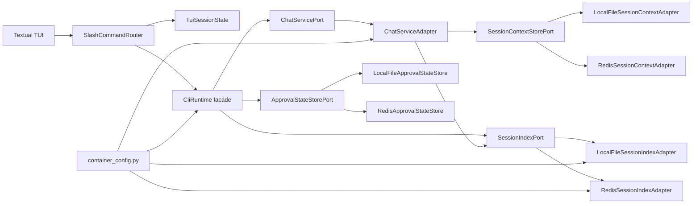
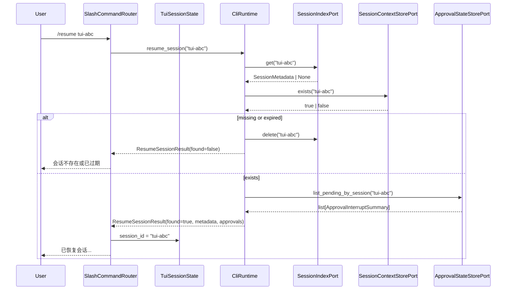

# 设计文档：TUI Session Resume

## 概述

本设计把 TUI 的“新会话”从破坏性清理改为仅切换 `session_id`，并新增会话恢复、会话列表和显式不可逆删除能力。实现遵循 `docs/steering/ddd-architecture.md`：`domain` 定义 Port 与值对象，`infrastructure` 实现本地文件和 Redis Adapter，`application` 通过 `CliRuntime` 与 `SlashCommandRouter` 编排，组合根为 `epsilon-boot/src/application/container_config.py`。新增配置优先落在 `epsilon-boot/config.properties`，公开模块、类、方法使用中文 docstring，验证命令使用 `uv` 并在 `epsilon-boot/` 工作目录执行。

### 设计决策

| 决策 | 选择 | 理由 |
| --- | --- | --- |
| `/new` 语义 | 仅调用 `TuiSessionState.reset_session()`，移除 `CliRuntime.clear_session(old_session_id)` | 覆盖旧 spec 的隐式删除语义，保留旧 `Session_Context` 与 `Approval_State`。 |
| 会话存在性 | 新增 `SessionIndexPort.get(session_id)`，恢复时不使用 `SessionContextStorePort.load()` 判定存在 | 现有 `load()` 缺失时返回空 `ConversationContext`，无法区分不存在和空会话。 |
| 会话索引维护点 | 在 `ChatServiceAdapter` 注入 `SessionIndexPort`，每次成功保存上下文后更新 metadata；显式删除时由 `ChatServiceAdapter.clear_session()` 一并删除索引 | `ChatServiceAdapter` 已是聊天上下文保存/删除编排点，能复用 `ConversationContext` 计算 metadata；避免 `commands.py` 直接依赖 infrastructure。 |
| 空会话注册 | `/new` 不立即注册空会话；首次保存后注册。若未来需要“刚创建但无消息也可恢复”，通过 runtime facade 显式 `register_empty_session()` 扩展 | 需求要求“首次保存或被 TUI 创建为可恢复会话”注册，本期取首次保存，避免 `/new` 产生大量无内容索引项。已有索引中的空会话仍允许恢复。 |
| 显式删除命令 | 使用 `/delete! <session_id>`，不提供 `/delete <session_id>` 的交互确认 | `!` 明确表达不可逆，避免 Textual 多轮确认状态和超时处理复杂度；缺少 `!` 时返回用法提示。 |
| Redis TTL 不一致 | Redis context 与 Redis index 使用相同 TTL；`/resume` 先读 index，再用新增 `SessionContextStorePort.exists()` 探测 context key，过期时返回 missing/expired 并删除 stale index | 保持列表和恢复语义一致；避免 Redis context 过期但 index 残留导致恢复空上下文。 |
| `/sessions` 性能 | 主路径只读 `SessionIndexPort.list_recent()`，不加载完整 `ConversationContext` | 满足列表不加载正文要求；preview 在保存时从上下文末尾消息生成。 |
| HITL 提示 | 扩展 `ApprovalStateStorePort` 增加 `list_pending_by_session(session_id)` 只读方法 | 现有 Port 无法按 session 查询 pending approval；最小扩展不改变 consume/delete 和后台 Run 行为。 |

## 架构





## 组件与接口

1. `domain.chat.value_objects`

   位置：`epsilon-boot/src/domain/chat/value_objects.py` 或新文件 `epsilon-boot/src/domain/chat/session_metadata.py`。若新增文件，需在模块顶部写中文 docstring；下游导入以 `domain.chat.value_objects import SessionMetadata` 为优先，减少新公开面。

   ```python
   from dataclasses import dataclass

   @dataclass(frozen=True, slots=True)
   class SessionMetadata:
       """会话发现与恢复使用的轻量元数据。"""

       session_id: str
       updated_at_epoch_ms: int
       message_count: int
       preview: str
       created_at_epoch_ms: int | None = None
       model: str | None = None
   ```

   `preview` 生成规则：从 `ConversationContext.get_messages()` 逆序取最后一条 `role != "system"` 且 `content.strip()` 非空的消息，去掉换行并压缩空白，截断为 120 个字符；没有可展示消息时为 `"(空会话)"`。`updated_at_epoch_ms` 使用保存时的 `time.time() * 1000`，不得依赖文件 mtime。

2. `domain.chat.ports.SessionIndexPort`

   位置：`epsilon-boot/src/domain/chat/ports.py`。

   ```python
   class SessionIndexPort(Protocol):
       """会话索引端口，用于发现、恢复和删除可恢复会话。"""

       async def upsert(self, metadata: "SessionMetadata") -> None:
           """新增或更新会话元数据。"""
           ...

       async def get(self, session_id: str) -> "SessionMetadata | None":
           """按会话 ID 读取元数据；不存在时返回 None。"""
           ...

       async def list_recent(self, limit: int = 20) -> "list[SessionMetadata]":
           """按更新时间倒序列出最近会话。"""
           ...

       async def delete(self, session_id: str) -> None:
           """幂等删除指定会话索引项。"""
           ...
   ```

3. `domain.chat.ports.SessionContextStorePort` 最小扩展

   新增存在性探测，避免恢复命令通过 `load()` 误判。

   ```python
   async def exists(self, session_id: str) -> bool:
       """判断指定会话上下文是否真实存在。"""
       ...
   ```

   本地文件实现检查目标 JSON 文件是否存在；Redis 实现使用 `EXISTS <session:context:{session_id}>`。该方法不加载完整正文，也不刷新 TTL。

4. `domain.agent.value_objects.ApprovalInterruptSummary`

   位置：`epsilon-boot/src/domain/agent/value_objects.py`。

   ```python
   from dataclasses import dataclass

   @dataclass(frozen=True, slots=True)
   class ApprovalInterruptSummary:
       """用于会话恢复提示的审批中断摘要。"""

       session_id: str
       approval_id: str
       action_count: int
       created_at_epoch: float
       expires_at_epoch: float
       expired: bool
       tool_names: tuple[str, ...] = ()
   ```

5. `domain.agent.ports.ApprovalStateStorePort` 最小扩展

   ```python
   async def list_pending_by_session(
       self,
       session_id: str,
   ) -> "list[ApprovalInterruptSummary]":
       """列出指定会话未过期的审批中断摘要。"""
       ...
   ```

   本地文件 adapter 扫描 `<root>/approvals/<bucket>/<stem>/*.json`，读取后过滤过期项，并可顺手删除过期文件。Redis adapter 使用现有 key 前缀 `agent:approval:{session_id}:*` 的 `scan_iter`，读取、反序列化、过滤过期项。该方法只读展示，不消费 approval，不触发后台 Run 状态改变。

6. `infrastructure.session.local_file_session_index_adapter.LocalFileSessionIndexAdapter`

   ```python
   class LocalFileSessionIndexAdapter(SessionIndexPort):
       """会话索引的本地文件实现。"""

       def __init__(
           self,
           root: Path,
           lock_factory: Callable[[Path], CrossPlatformFileLock],
           path_policy: CrossPlatformPathPolicy,
           atomic_writer: TempFileAtomicWriter,
       ) -> None: ...

       async def upsert(self, metadata: SessionMetadata) -> None: ...
       async def get(self, session_id: str) -> SessionMetadata | None: ...
       async def list_recent(self, limit: int = 20) -> list[SessionMetadata]: ...
       async def delete(self, session_id: str) -> None: ...
   ```

7. `infrastructure.session.redis_session_index_adapter.RedisSessionIndexAdapter`

   ```python
   class RedisSessionIndexAdapter(SessionIndexPort):
       """会话索引的 Redis 实现。"""

       def __init__(
           self,
           redis_client: aioredis.Redis,
           key_prefix: str = "session:index:",
           recent_zset_key: str = "session:index:recent",
           ttl_seconds: int = 3600,
       ) -> None: ...

       async def upsert(self, metadata: SessionMetadata) -> None: ...
       async def get(self, session_id: str) -> SessionMetadata | None: ...
       async def list_recent(self, limit: int = 20) -> list[SessionMetadata]: ...
       async def delete(self, session_id: str) -> None: ...
   ```

8. `ChatServiceAdapter`

   构造函数增加可选 `session_index: SessionIndexPort | None = None`。在所有保存上下文的路径中，完成 `self._session_store.save(session_id, context)` 后调用私有方法：

   ```python
   async def _save_context_and_index(
       self,
       session_id: str,
       context: ConversationContext,
       *,
       model: str | None = None,
   ) -> None:
       """保存上下文并同步更新会话索引。"""
       ...
   ```

   所有当前直接调用 `_session_store.save()` 的聊天、继续、分段、流式结束路径改为该方法。若 `session_index.upsert()` 失败，异常向上传播：上下文已保存但索引失败属于跨存储边界的非原子失败，调用方收到错误后可重试同一请求或后续保存修复索引。`clear_session()` 在删除 context 与 approval 后调用 `session_index.delete(session_id)`。

9. `CliRuntime` facade

   `CliRuntime.start()` 解析并保存 `SessionContextStorePort`、`SessionIndexPort` 与 `ApprovalStateStorePort | None`。`resume_session()` 通过 `SessionContextStorePort.exists()` 执行真实存在性探测；`SlashCommandRouter` 仍只调用 runtime facade，commands 不直接依赖 infrastructure adapter。

   ```python
   @dataclass(frozen=True)
   class ResumeSessionResult:
       """恢复会话命令的运行时结果。"""

       found: bool
       metadata: SessionMetadata | None = None
       approval_summaries: list[ApprovalInterruptSummary] | None = None
       missing_reason: str | None = None

   class CliRuntime:
       session_store: SessionContextStorePort | None
       session_index: SessionIndexPort | None
       approval_store: ApprovalStateStorePort | None

       async def list_sessions(self, limit: int = 20) -> list[SessionMetadata]:
           """列出最近可恢复会话。"""
           ...

       async def resume_session(self, session_id: str) -> ResumeSessionResult:
           """校验并返回恢复会话所需信息。"""
           ...

       async def delete_session(self, session_id: str) -> bool:
           """显式删除会话上下文、审批状态和索引；返回删除前是否存在。"""
           ...
   ```

   `resume_session()` 流程：`index.get()` 为 `None` 直接返回 `found=False`；非空时通过 runtime 持有的 `session_store.exists(session_id)` 调用 domain port，若 false 则 `index.delete(session_id)` 并返回 `missing_reason="expired_or_missing"`；存在时读取 approval summaries 并返回。`delete_session()` 先读取 index 或调用 `session_store.exists(session_id)` 判断删除前是否存在，再调用 `ChatServicePort.clear_session(session_id)`；由于 `clear_session()` 会删除 context、approval、index，runtime 不重复访问底层 infrastructure adapter。

10. `SlashCommandRouter`

   `HELP_TEXT` 增加：

   ```text
   /sessions         列出可恢复会话
   /resume <id>      恢复指定会话
   /delete! <id>     不可逆删除指定会话
   ```

   命令行为：

   - `/new`：`state.reset_session()`，返回 `已开始新会话: <new_id>`，不调用任何删除 facade。
   - `/sessions`：调用 `runtime.list_sessions()`，空列表返回 `暂无可恢复会话`；非空按行展示 `updated_at | messages=<n> | <session_id> | <preview>`。
   - `/resume` 或 `/resume   `：返回 `用法: /resume <session_id>`。
   - `/resume <session_id>`：成功后设置 `state.session_id = session_id`，返回目标 ID、消息数、更新时间；若有 pending approval，追加 `待处理 approval: <count> 个` 和最多 3 个 `approval_id/tool_names/expires_at` 摘要。失败时不改 state。
   - `/delete <session_id>`：返回 `删除会话是不可逆操作，请使用: /delete! <session_id>`。
   - `/delete!` 或 `/delete!   `：返回 `用法: /delete! <session_id>`。
   - `/delete! <session_id>`：调用 `runtime.delete_session()`；若删除的是当前 `state.session_id`，调用 `state.reset_session()` 切换到新会话并提示；missing 可返回 `会话不存在或已删除: <id>`，不得创建空上下文。

## 数据模型

### 领域模型

`SessionMetadata` 是不可变值对象，不承载完整消息正文，只用于列表、恢复校验和展示。`ApprovalInterruptSummary` 是不可变摘要值对象，不含 `context_snapshot`、工具参数等敏感/大字段，只用于提示待处理 approval。

### 本地文件持久化

会话上下文保持现有布局：

```text
<root>/sessions/<bucket>/<stem>.json
<root>/sessions/<bucket>/<stem>.json.lock
```

新增索引布局：

```text
<root>/session_index/<bucket>/<stem>.json
<root>/session_index/<bucket>/<stem>.json.lock
```

索引 JSON 示例：

```json
{
  "session_id": "tui-abc",
  "created_at_epoch_ms": 1760000000000,
  "updated_at_epoch_ms": 1760000012345,
  "message_count": 6,
  "preview": "好的，我会继续处理...",
  "model": "qwen-plus"
}
```

`upsert()` 使用每 session 独立 EXCLUSIVE 锁和 `TempFileAtomicWriter` 原子替换；`get()` 使用 SHARED 锁读取；`delete()` 使用 `unlink(missing_ok=True)`。`list_recent()` 扫描 `session_index/*/*.json`，逐个反序列化 metadata，按 `updated_at_epoch_ms` 倒序排序并截断 `limit`。本地文件后端无 TTL，不做过期判断；损坏索引文件记录日志并跳过，不加载 context 修复。

### Redis 持久化

现有 context key 保持默认：

```text
session:context:<session_id>
```

新增索引：

```text
session:index:<session_id>       # JSON 字符串，EX 与 context TTL 相同
session:index:recent             # ZSET，member=session_id，score=updated_at_epoch_ms
```

`upsert()` 使用 pipeline 执行 `SET key payload EX ttl_seconds` 与 `ZADD recent updated_at session_id`。Redis 不保证 context 与 index 跨 key 绝对原子；同一 pipeline 降低部分失败窗口，失败时异常透传。`get()` 读取 JSON；若 metadata key 不存在，返回 `None`。`list_recent()` 用 `ZREVRANGE recent 0 limit-1` 后批量读取 metadata；发现 metadata 缺失时 `ZREM` 清理 stale member。`delete()` 删除 metadata key 并 `ZREM`。Redis context TTL 与 index TTL 均来自 `SESSION_REDIS_TTL_SECONDS`，默认 3600。

### 配置

新增配置类建议放在 `epsilon-boot/src/infrastructure/session/session_ttl_config.py`：

```python
class SessionRedisTtlConfig(PropertiesBaseSettings):
    """Redis 会话 context 与 index 的 TTL 配置。"""

    hot_reload: ClassVar[bool] = False
    model_config = SettingsConfigDict(env_prefix="SESSION_REDIS_")
    ttl_seconds: int = 3600
```

`config.properties` 增加：

```properties
# Redis 会话 context 与 session index 的 TTL（秒）；仅 SESSION_STORE_BACKEND=redis 生效。
SESSION_REDIS_TTL_SECONDS=3600
```

`_create_session_store()` 和 `_create_session_index()` 使用同一个 `session_redis_ttl_config.ttl_seconds`，避免 context/index 过期策略分裂。

## 事务与并发边界

本设计不引入跨 Redis key、文件和 approval store 的全局事务。`Session_Context` 是聊天正确性的主数据；`Session_Index` 是可重建/可修复的发现索引，允许短暂滞后，但恢复路径必须通过 `exists()` 再次确认 context 真实存在。

保存路径的一致性边界：`ChatServiceAdapter._save_context_and_index()` 先保存 context，再 upsert index。若 context 保存失败，不更新 index；若 index 更新失败，向上抛出异常，已保存 context 保留，后续同 session 成功保存会修复 index。对本地文件而言，context 文件和 index 文件各自通过独立文件锁和原子替换保证单文件一致；对 Redis 而言，context save 和 index upsert 是两个调用边界，不承诺跨调用原子性。

删除路径的一致性边界：`ChatServiceAdapter.clear_session()` 顺序执行 `session_store.delete(session_id)`、`approval_store.delete_session(session_id)`、`session_index.delete(session_id)`。每步幂等；若中间失败，异常向上传播，用户可重试 `/delete! <session_id>` 补偿。删除当前 TUI 会话时，应用层在删除 facade 返回后切换到新 `session_id`。

恢复路径的一致性边界：`CliRuntime.resume_session()` 不修改 context、approval 或 run，只读取 index、探测 context、读取 approval summary。若 index 存在但 context 不存在，调用 `index.delete(session_id)` 清理 stale index；清理失败不影响“不可恢复”的返回结果，但应记录日志。

并发规则：同一 session 的 context 写入继续使用现有文件锁或 Redis CAS 语义；index upsert 采用 last-write-wins，`updated_at_epoch_ms` 由保存时刻生成。多个 TUI 同时 `/resume` 同一 session 允许发生；多个 TUI 同时 `/delete!` 同一 session 通过幂等 delete 收敛。`/new` 只变更当前进程内 `TuiSessionState`，无共享写入。

## 正确性属性

### Property 1: `/new` 不删除历史
*For any* 当前 `TuiSessionState`、旧 `session_id`、任意已保存 context 和 approval 状态，执行 `/new` 后 state 必须持有新的 `session_id`，且不得调用 `CliRuntime.clear_session()`、`delete_session()` 或任何 `Session_Context_Store.delete()`/`ApprovalStateStorePort.delete_session()` 等删除入口。
**验证需求：1.1, 1.2, 1.3, 1.4, 1.5, 7.1, 9.4, 10.1**

### Property 2: 恢复只接受真实存在的会话
*For any* 输入 `session_id`，当 `SessionIndexPort.get(session_id)` 为 `None` 或 `SessionContextStorePort.exists(session_id)` 为 `False` 时，`/resume <session_id>` 必须返回可读错误并保持当前 state 不变；不得通过 `load()` 返回的空 context 创建或恢复空会话。
**验证需求：2.3, 2.4, 5.5, 6.2, 6.4, 10.3**

### Property 3: 已索引空会话可恢复
*For any* `SessionMetadata(message_count=0)` 且 context 真实存在的 session，`/resume <session_id>` 必须切换当前 state，并提示消息数为 0。
**验证需求：2.1, 2.2, 5.5, 5.6**

### Property 4: `/sessions` 只展示索引主路径
*For any* `SessionIndex` 中的 metadata 集合，`/sessions` 返回结果必须按 `updated_at_epoch_ms` 倒序排列，并展示 `session_id`、更新时间、消息数和 preview；主路径不得加载完整 `ConversationContext` 正文。
**验证需求：3.1, 3.2, 3.3, 3.4, 3.5, 10.4**

### Property 5: 显式删除收敛清理三类状态
*For any* 被 `/delete! <session_id>` 删除的会话，命令执行后 context、approval state 和 session index 均被删除或处于已不存在状态；重复执行不得创建空会话。
**验证需求：4.1, 4.2, 4.3, 4.4, 4.5, 4.6, 7.2, 10.5**

### Property 6: 索引随上下文保存更新
*For any* 成功保存的 `ConversationContext`，`SessionIndexPort` 中对应 metadata 的更新时间、消息数和 preview 必须反映该次保存后的上下文。
**验证需求：5.1, 5.2, 5.3, 5.4, 5.5, 9.1, 9.2, 9.3, 9.5**

### Property 7: Redis TTL 过期不恢复空上下文
*For any* Redis index 仍存在但 context key 已因 TTL 过期的 session，`/resume` 必须返回“会话不存在或已过期”，并删除或延迟清理 stale index，不得切换 state。
**验证需求：6.2, 6.3, 6.4, 6.5, 10.7**

### Property 8: Approval 与后台 Run 不被恢复命令破坏
*For any* 包含 pending approval 或 paused run 相关状态的 session，`/resume` 只读取并展示可用 approval summary，不 consume、不 delete、不 cancel、不重建任何 background run。
**验证需求：2.5, 2.6, 7.3, 7.4, 7.5**

### Property 9: CLI 帮助和错误保持自解释
*For any* 缺参或未知 slash 命令输入，router 必须返回包含正确用法或现有未知命令语义的文本，并不进入模型调用；既有 `/model`、`/config doctor`、`/run ...`、`/runs`、`/quit` 行为保持不变。
**验证需求：8.1, 8.2, 8.3, 8.4, 8.5**

## 错误处理

### 错误常量定义

本期 CLI 命令沿用当前 `CommandResult(message=...)` 文本错误模型，不新增领域异常族。建议在 `commands.py` 定义模块级常量，便于测试断言稳定：

```python
RESUME_USAGE = "用法: /resume <session_id>"
DELETE_USAGE = "用法: /delete! <session_id>"
DELETE_EXPLICIT_HINT = "删除会话是不可逆操作，请使用: /delete! <session_id>"
SESSION_MISSING_MESSAGE = "会话不存在或已过期"
NO_SESSIONS_MESSAGE = "暂无可恢复会话"
```

底层 adapter 的 `OSError`、`redis.asyncio.RedisError` 保持原样抛出并记录日志；commands 只对已有 Run 业务异常使用 `_RUN_ERRORS` 捕获，不吞掉 session index 的基础设施失败，避免误提示成功。

### 错误场景与处理策略

| 场景 | 处理 |
| --- | --- |
| `/resume` 缺少 session_id | 返回 `用法: /resume <session_id>`，state 不变。 |
| `/resume` index 不存在 | 返回 `会话不存在或已过期: <id>`，state 不变。 |
| `/resume` index 存在但 context 不存在 | 调用 `index.delete(id)` 清理 stale index，返回 missing/expired，state 不变。 |
| `/resume` approval store 不可用或未注入 | 仍允许恢复 context，提示仅包含会话信息；不声称有 pending approval。 |
| `/resume` approval summary 为空 | 恢复成功，不展示 approval 提示。 |
| `/delete` 未带 `!` | 返回不可逆提示，不执行删除。 |
| `/delete!` 缺少 session_id | 返回 `用法: /delete! <session_id>`。 |
| `/delete!` missing session | 返回 `会话不存在或已删除: <id>` 或幂等成功文本，不创建空 context。 |
| 删除当前 session | 删除完成后切换到新 `session_id` 并在提示中展示新 ID。 |
| `/sessions` 索引为空 | 返回 `暂无可恢复会话`。 |
| 本地索引 JSON 损坏 | adapter 记录错误并跳过该索引项；不加载 context 兜底。 |
| Redis list 发现 zset member 无 metadata | `ZREM` stale member，列表跳过。 |

### 错误传播策略

CLI 使用可读文本处理用户输入错误和 missing/expired 业务结果。基础设施故障继续向上传播，由现有 TUI 顶层错误展示/日志机制处理；不在 `SlashCommandRouter` 中宽泛捕获 `Exception`。删除命令的各步都是幂等操作，失败后用户可再次执行 `/delete! <session_id>` 进行补偿。

### 错误处理原则

不得把缺失 context 的 `load()` 空返回解释为可恢复会话；不得在 resume/delete 失败时修改当前 `TuiSessionState`；不得为了展示 `/sessions` 而读取完整消息正文；不得在 `/new`、`/resume` 或 `/sessions` 中消费、删除或重建 approval/background run。

## 测试策略

所有测试命令在 `epsilon-boot/` 下执行，使用 `uv`，例如：

```bash
uv run --frozen pytest test/application/cli/test_commands.py test/application/cli/test_runtime.py
uv run --frozen pytest test/infrastructure/session
```

### 属性测试（Property-Based Testing）

本仓库现有测试以 pytest example-based 为主，未发现 Hypothesis 等属性测试依赖；本期不新增依赖。正确性属性通过参数化 pytest 用例覆盖不同 session_id、message_count、preview、missing/expired 和 current-session deletion 场景。

| 属性 | 测试位置 | 覆盖点 |
| --- | --- | --- |
| Property 1 | `test/application/cli/test_commands.py` | fake runtime 断言 `/new` 不调用 clear/delete。 |
| Property 2/3/7 | `test/application/cli/test_runtime.py` | fake index/store 覆盖 success、missing、expired、empty session。 |
| Property 4 | `test/application/cli/test_commands.py` | `/sessions` 格式、排序、空列表。 |
| Property 5 | `test/application/cli/test_commands.py`, `test_runtime.py` | `/delete!` 调用显式 facade，删除当前会话后 reset。 |
| Property 6 | `test/infrastructure/chat/test_chat_service_adapter.py` 或既有 chat adapter 测试 | 成功保存后 upsert metadata，保存失败不 upsert。 |
| Property 8 | `test/application/cli/test_runtime.py` | approval summary 只读展示，不 consume/delete run。 |
| Property 9 | `test/application/cli/test_commands.py`, `test_tui_textual.py` | help、缺参、未知命令、既有命令回归。 |

### 单元测试（Example-Based）

1. `test/application/cli/test_commands.py`
   - `/new` 返回新 ID 且 fake runtime 的 `clear_session`/`delete_session` 未被调用。
   - `/resume` 缺参返回用法。
   - `/resume existing` 成功设置 `state.session_id` 并展示消息数、更新时间、approval 提示。
   - `/resume missing` 不改变 `state.session_id`。
   - `/sessions` 空列表和多项列表格式。
   - `/delete` 未带 `!` 只返回提示。
   - `/delete!` 缺参、missing、删除非当前、删除当前。
   - `/help` 包含 `/sessions`、`/resume <session_id>`、`/delete! <session_id>`。

2. `test/application/cli/test_runtime.py`
   - `CliRuntime.list_sessions()` 委托 `SessionIndexPort.list_recent()`。
   - `CliRuntime.start()` 解析并保存 `SessionContextStorePort`、`SessionIndexPort` 和可选 `ApprovalStateStorePort`。
   - `resume_session()` 通过 `SessionContextStorePort.exists()` 覆盖 index missing、context missing、context exists、approval store absent/present 的行为。
   - `delete_session()` 通过 index 或 `SessionContextStorePort.exists()` 判断删除前存在性，并委托 `ChatServicePort.clear_session()`。

3. `test/infrastructure/session/test_local_file_session_index_adapter.py`
   - `upsert/get/list_recent/delete`。
   - 同一 session 二次 upsert 覆盖 message_count、preview、updated_at。
   - 损坏 JSON 在 list 中被跳过。

4. `test/infrastructure/session/test_redis_session_index_adapter.py`
   - 使用 fake Redis 或 fakeredis 风格既有测试替身覆盖 `SET EX`、`ZADD`、`ZREVRANGE`、`ZREM`。
   - metadata key 缺失时 list 清理 zset stale member。
   - TTL 参数传入 context/index adapter 一致。

5. `test/infrastructure/agent/test_approval_state_store.py`
   - 本地文件和 Redis `list_pending_by_session()` 返回未过期摘要，过滤过期项，不删除未过期项，不 consume。

### 集成测试

1. `test/application/cli/test_tui_textual.py`
   - 在 Textual 输入路径中验证新增 slash 命令不进入模型调用。
   - 验证 `/new` 后旧会话可通过 fake runtime `/resume` 恢复。

2. `test/application/test_container_config.py` 或既有 container 配置测试
   - `SESSION_STORE_BACKEND=file` 时 `SessionIndexPort` 解析为 `LocalFileSessionIndexAdapter`。
   - `SESSION_STORE_BACKEND=redis` 时解析为 `RedisSessionIndexAdapter`，且 `SESSION_REDIS_TTL_SECONDS` 被传给 Redis context 和 index。

3. Redis 集成环境可用时，增加 Redis index/context TTL 边界测试；若 CI 无 Redis，则保留隔离单元测试并在集成测试中使用 skip 标记说明依赖。

### 需求追踪

| 需求 | 设计覆盖 | 测试覆盖 |
| --- | --- | --- |
| 需求 1 | `/new` 命令、Property 1 | command 单元测试 |
| 需求 2 | `resume_session()`、`exists()`、approval summary、Property 2/3/8 | runtime + command 单元测试 |
| 需求 3 | `SessionIndexPort.list_recent()`、`/sessions`、Property 4 | command + adapter 单元测试 |
| 需求 4 | `/delete!`、`clear_session()` 索引删除、Property 5 | command + runtime 单元测试 |
| 需求 5 | `SessionMetadata`、`SessionIndexPort`、Local/Redis adapter、container 装配 | adapter + container 测试 |
| 需求 6 | Redis TTL 配置、exists 探测、stale index 清理、Property 7 | Redis adapter/runtime 测试 |
| 需求 7 | `/new` 不删 approval、resume 只读 approval、delete 显式清理 | command/runtime/approval store 测试 |
| 需求 8 | HELP_TEXT、缺参、未知命令保持 | command/Textual 测试 |
| 需求 9 | DDD 分层、docstring、uv 命令、container_config | review + container 测试 |
| 需求 10 | 测试策略整体 | 上述全部 |
