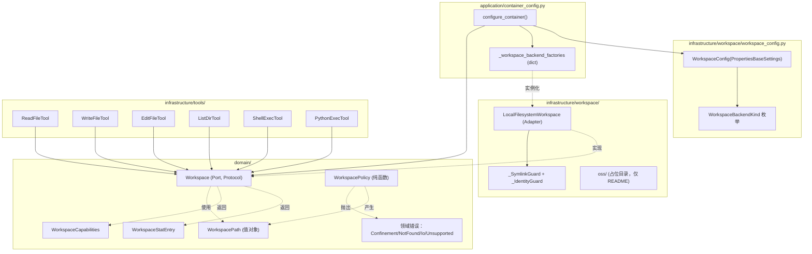
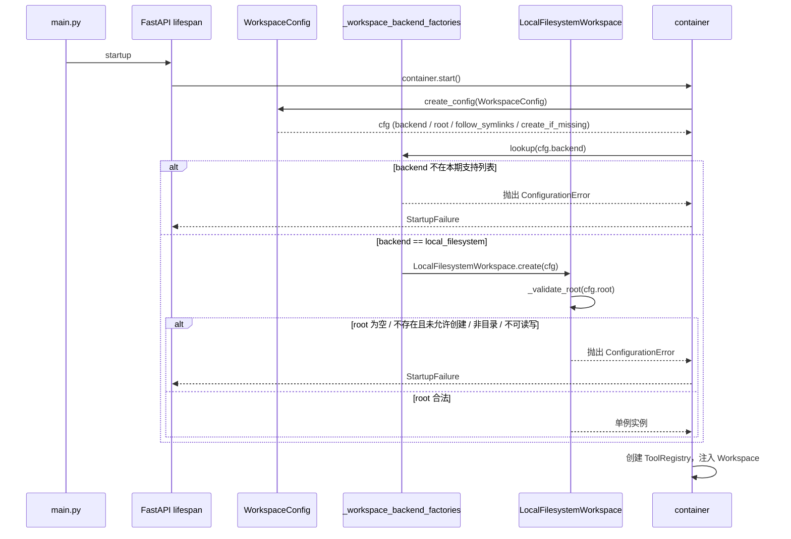
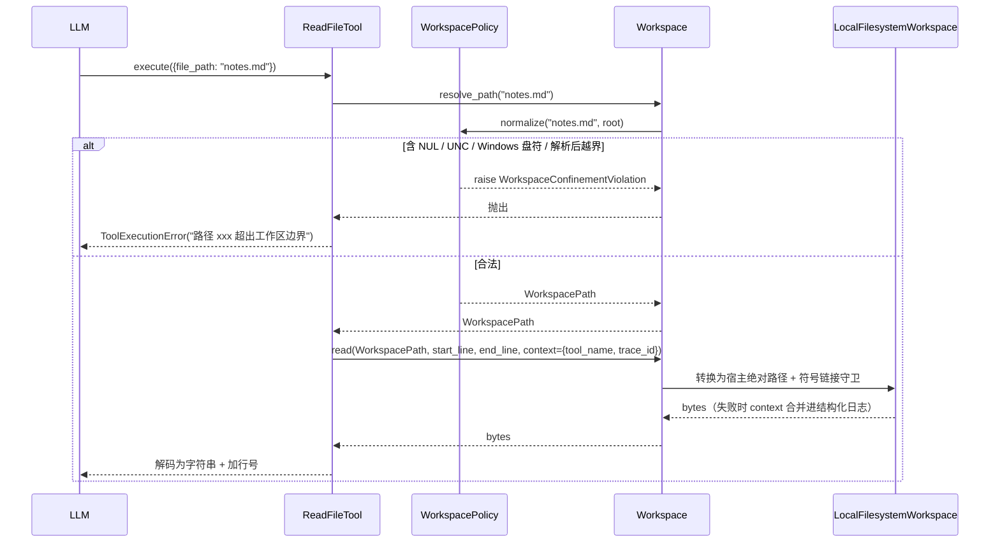

# 设计文档：Workspace 工作区抽象与本地文件系统实现

## 概述

本设计在 `domain/workspace/` 引入一个与存储介质无关的 `Workspace` Port，在 `infrastructure/workspace/local_filesystem/` 实现本期唯一后端 `LocalFilesystemWorkspace`，并把现有 6 个受控工具（`ReadFileTool` / `WriteFileTool` / `EditFileTool` / `ListDirTool` / `ShellExecTool` / `PythonExecTool`）改造为仅通过注入的 `Workspace` 完成 I/O，从而把 Agent 的文件影响面收敛到由配置项 `WORKSPACE_ROOT` 指定的逻辑工作区之内。设计遵循仓库既有约定：DDD + 六边形架构（见 `docs/architecture.md`）、Port 使用 `typing.Protocol`（见 `docs/development.md`）、`PropertiesBaseSettings + create_config(...)` 配置加载（见 `docs/configuration.md`）、`BizException` 继承链与 `ToolExecutionError` 响应语义（见 `docs/domain-model.md`、`docs/tools.md`）、`configure_container()` 统一装配（见 `docs/di-container.md`）以及 pytest + `asyncio_mode=auto` 测试风格。

### 设计决策

| 决策点 | 选项 | 选择 | 理由 |
| --- | --- | --- | --- |
| Port 形态 | `typing.Protocol` vs `abc.ABC` vs 拆分 Reader/Writer | 单一 `typing.Protocol`，名为 `Workspace` | 与仓库所有 Port（`AgentPort`、`ModelAccessPort`、`ChatServicePort` 等）保持一致；`development.md` 明文"Port 使用 `Protocol`（结构类型），测试可直接使用 `MagicMock`"；受控工具的操作集合有限（10 个方法，含 `display_root_hint`），拆分只会增加装配复杂度 |
| `Workspace_Path` 类型 | 裸 `str` vs `NewType` vs frozen dataclass 值对象 | frozen dataclass 值对象 `WorkspacePath`，内部持有 `pathlib.PurePosixPath` | 需要在类型系统上区分"已校验逻辑路径"与"原始入参字符串"，以消除工具内部的 TOCTOU 风险；`NewType` 无法强制走构造函数，`str` 子类化在 pydantic 下边界模糊；frozen dataclass 与仓库现有 `Task`、`TraceEntry`、`AgentConfig` 等值对象风格一致 |
| `Backend_Location` 是否暴露 | 暴露为工具入参/返回 vs 仅后端内部使用 vs 暴露只读调试字符串 | 完全不暴露物理定位；仅后端内部持有；日志/异常消息只呈现 `WorkspacePath` | 需求 1.3/2.7/4.4/8.6 明确要求不泄露宿主绝对路径与 `bucket+key`；调试信息通过服务端结构化日志（字段 `workspace_path` / `workspace_backend_kind`）满足 |
| `read/write` 的字节 vs 文本 | 全 `bytes` vs 全 `str` vs 同时支持 | Port 层只暴露 `bytes`，由后端负责字节读写；编码解码在**工具层**完成，复用工具原有 UTF-8 语义（已确认：Port 层只暴露 `bytes`，工具层完成 UTF-8 编解码） | 保持 Port 与编码无关，为 OSS 后端的二进制对象（图片、PDF）留出扩展空间；现有 `common_tools.read_file`/`write_file`/`edit_file` 已经在字符串边界上做了 UTF-8 处理，本期将其逻辑内联到后端的字节流 + 工具层编码拼装，单一事实来源集中在工具层 |
| `Workspace_Capabilities` 最小字段集 | 仅 2-3 个布尔 vs 完整面向 OSS 的字段 | 6 个稳定字段：`supports_symlinks` / `supports_atomic_write` / `supports_append` / `supports_streaming` / `supports_large_files` / `local_materialization` | 完全对齐需求 3.1 的清单；字段命名为布尔便于未来扩展；不额外引入 `max_read_bytes` / `case_sensitive` 等需求未列项以保持最小表面（未来可追加，frozen dataclass 带默认值不破坏旧调用） |
| 原子写降级策略 | 要求后端必须原子 vs `Workspace_Capabilities` 表达 + 后端各自决策 | 后端自声明 `supports_atomic_write`；`LocalFilesystemWorkspace` 使用 `tempfile.NamedTemporaryFile(dir=parent) + os.replace` 实现 POSIX rename 原子性 | `os.replace` 在同一卷上是原子的，满足"写入失败不留下半写文件"的语义；`supports_atomic_write=False` 的后端（未来 OSS）由工具层决定是否走直写或拒绝 |
| `edit` 并发保护 | 不加锁 vs `fcntl.flock` advisory 锁 vs 外部分布式锁 | `fcntl.flock(LOCK_EX)` advisory 锁；Windows 无此系统调用时降级为无锁并在日志 `warning` 记录 | 防多 worker / 多 Pod 挂同一 PVC 的真实写写竞态；POSIX 生效、语义足够；分布式锁会引入 Redis/Zk 依赖，超出本期范围；Windows 仅作开发态保底 |
| 符号链接逃逸检测算法 | 逐段 `lstat` vs `os.path.realpath` + 前缀比较 vs 只在 `follow_symlinks=True` 时解引用 | `follow_symlinks=False`：`os.lstat` 逐段判断，命中链接直接判定越界；`follow_symlinks=True`：`Path.resolve(strict=False)` 后与 root 做 `os.path.commonpath` 判断 | 逐段 `lstat` 可在不解引用的前提下阻止 `workspace/link -> /etc`；`realpath` 仅在允许跟随时使用，并显式检查归一化后仍落在 root 之下 |
| 大小写处理 | 原样比较 vs `os.path.normcase` vs inode 比较 | **原样比较 + 二次兜底**：所有归一化在 `PurePosixPath` 上做（保留原大小写），将 root 前缀匹配基于字符串；在本地后端启动期用 `os.stat(root).st_ino + st_dev` 记录 root 的身份，`resolve` 后用 `os.stat` 对齐共祖先的 inode 以阻止 macOS/HFS+ 大小写折叠越界 | macOS 默认大小写不敏感，`pathlib` 的字符串比较无法区分 `/WS/a` 与 `/ws/a`；inode 比较是跨文件系统都可靠的幂等身份依据；Windows 默认不支持但本项目运行容器在 Linux Pod 上，Windows 作为开发态保底 |
| `follow_symlinks` 对 OSS 后端 | 报错 vs 忽略 vs 字段不存在 | 配置字段保留，对非本地后端 no-op；由具体后端在 `capabilities.supports_symlinks` 中自行声明 | 配置骨架需要稳定（需求 5.2 要求未来新增后端不改骨架）；字段语义"是否允许跟随符号链接"在无链接概念的 OSS 下自然退化 |
| Shell / Python Exec 与非本地后端 | 临时物化 vs 直接拒绝 | 本期直接拒绝：当 `capabilities.local_materialization=False` 时抛 `WorkspaceUnsupportedOperationError`，工具层翻译为 `ToolExecutionError`；本期唯一后端恒为 `True`，行为等价于现状 | 需求 6.6/6.7 已固化此行为；"临时物化"是 OSS 后端自身的设计课题，留给未来 feature |
| "只允许 `local_filesystem`" 的表达位置 | DI 工厂注册表不注册其他值 vs 配置校验阶段拒绝 | 配置校验阶段（`WorkspaceConfig` 的 `model_validator`）拒绝；DI 装配阶段后端工厂以 dict 分发，未注册 key 触发 `ConfigurationError` | 双重保险：配置校验给出用户可读错误，DI 分发保证即使绕过校验也无法实例化；工厂 dict 也是未来扩展点 |
| `common_tools` 迁移 | 完全内联 vs 保留为内部函数 | 将 `read_file`/`write_file`/`edit_file`/`tree` **迁移为 `LocalFilesystemWorkspace` 的私有辅助函数**（`_read_bytes_in_range` / `_write_bytes_atomically` / `_edit_with_fallback_match` / `_render_tree`），`common/tools/common_tools.py` 保留为薄壳并在 docstring 中标注"仅供 `LocalFilesystemWorkspace` 内部使用" | 避免两条入口（工具直连 vs Port）共存导致的边界漂移；保留薄壳可使已有测试渐进迁移；新的公共入口只有 `Workspace` |
| 观测上下文透传 | Port 无透传通道 vs 工具层 except 补打一条 warning 靠 trace_id 关联 vs Port I/O 方法新增 `context: dict` 参数 | Port 7 个 I/O 方法新增末位 `context: dict \| None = None`（纯观测透传，不改变 I/O 行为）；`resolve_path` / `capabilities` / `display_root_hint` 不加 | 需求 8.1 / 8.2 要求结构化日志含 `tool_name`（违规日志额外 `trace_id`），Port 层无其他干净渠道拿到调用方身份；rejected alternative 是"工具层 except 再打一条 warning 靠 `trace_id` 关联"——会产生双点日志（Port 的一条 + 工具的一条）且聚合困难，需求 8 的字段约束也难在 Port 层一次性满足 |
| `WorkspacePath.join` 实现 | 调用 `WorkspacePolicy` 二次校验 vs 纯 `PurePosixPath` + 手动 `..` 折叠 | 纯 `PurePosixPath` 拼接 + 手动 `..` 折叠 + 私有 `_reject_illegal_chars`，**不导入** `WorkspacePolicy` | 避免 `domain/workspace/value_objects.py` ↔ `domain/workspace/policy.py` 循环导入（`policy.py` 导入 `WorkspacePath`，若 `join` 反向依赖 `Policy` 将形成闭环）；`join` 的输入是"已合法 WorkspacePath + 纯逻辑段"，不需要 Policy 面向"原始字符串入参"的符号链接 / Windows 盘符 / UNC 等检查；轻量校验（非法字符 + `..` 不越根）足以守住 `WorkspacePath` 不变式 |

## 架构

### 组件/模块关系图



### 启动期序列图



### 运行期工具→Workspace 调用序列



### 包/目录结构

```
epsilon-boot/src/
├── domain/
│   └── workspace/
│       ├── __init__.py                  # 导出 Port、值对象、Policy、错误
│       ├── ports.py                     # class Workspace(Protocol)
│       ├── value_objects.py             # WorkspacePath / WorkspaceStatEntry / WorkspaceCapabilities / WorkspaceBackendKind
│       ├── policy.py                    # WorkspacePolicy 纯函数
│       └── exceptions.py                # 4 种领域错误
├── infrastructure/
│   └── workspace/
│       ├── __init__.py                  # 对外导出 LocalFilesystemWorkspace（占位）
│       ├── workspace_config.py          # WorkspaceConfig(PropertiesBaseSettings)
│       ├── local_filesystem/
│       │   ├── __init__.py
│       │   ├── local_workspace.py       # LocalFilesystemWorkspace（实现 Workspace Port）
│       │   ├── _guards.py               # _SymlinkGuard / _IdentityGuard
│       │   └── _common_impl.py          # 从 common_tools 迁移过来的字节级 read/write/edit/tree
│       └── oss/
│           └── README.md                # 占位：未来 OSS 后端的扩展点，无 Python 文件
└── common/
    └── tools/
        └── common_tools.py              # 保留薄壳，docstring 标注"仅供 LocalFilesystemWorkspace 使用"
```

其中 `infrastructure/workspace/oss/` 本期**只放 README.md**，不落盘任何 Python 文件（含 `__init__.py`），以避免空包误导测试发现；README 明确"本期不实现，扩展点包含：`Backend_Location = (bucket, key)`、流式读写、分片上传、`supports_atomic_write=False` 的降级契约"。

## 组件与接口

### 1. `Workspace` Port

- 位置：`src/domain/workspace/ports.py`
- 职责：对外暴露与存储介质无关的 10 个操作（含 `display_root_hint`）；实现者为 `LocalFilesystemWorkspace`（本期）。

```python
"""Workspace 端口定义。"""

from __future__ import annotations

from typing import Protocol

from domain.workspace.value_objects import (
    WorkspaceCapabilities,
    WorkspacePath,
    WorkspaceStatEntry,
)


class Workspace(Protocol):
    """工作区端口协议。

    与存储介质无关，暴露受控工具真正需要的 10 个操作（含 display_root_hint）。
    所有路径参数均为 WorkspacePath；不暴露任何宿主绝对路径或 bucket+key。

    观测上下文参数 ``context``：
        7 个 I/O 方法（``exists`` / ``stat`` / ``read`` / ``write`` / ``edit`` /
        ``list_dir`` / ``delete``）末位统一接受 ``context: dict | None = None``，
        作为纯观测透传通道（不改变 I/O 行为）。调用方（工具层或未来的其他入口）
        可通过 ``context`` 携带结构化日志需要的元数据，典型白名单字段：

            - ``tool_name: str`` —— 触发本次 I/O 的工具名（需求 8.1 / 8.2 要求该字段）
            - ``trace_id: str``  —— 当前请求的链路追踪 ID
            - ``agent_id: str``  —— （可选）Agent 标识

        后端实现约束：
            - 后端**可以**把 ``context`` 中的白名单字段合并进结构化日志；
            - 后端**不得**据 ``context`` 改变 I/O 行为或分支（纯观测透传）；
            - 后端应容忍 ``context=None``、未知 key、缺失约定字段；
            - **禁止**把 ``context`` 原样拼入异常 ``message`` 或其他对 LLM 可见
              的出口（防止 ``trace_id`` / 内部标识意外泄露），只允许从白名单
              字段取值用于服务端日志。

        ``resolve_path`` / ``capabilities`` / ``display_root_hint`` 是纯函数
        或元数据查询，不产生需要结构化日志关联的 I/O 事件，因此**不**接受
        ``context``。
        ``context`` 与 ``WorkspaceCapabilities`` 的区别：前者是"本次调用的观测
        元数据"，后者是"后端静态能力声明"。
    """

    def resolve_path(self, requested: str) -> WorkspacePath:
        """将入参字符串规范化为 WorkspacePath，越界时抛 WorkspaceConfinementViolation。"""
        ...

    async def exists(
        self,
        path: WorkspacePath,
        *,
        context: dict | None = None,
    ) -> bool:
        """判定 path 是否存在。"""
        ...

    async def stat(
        self,
        path: WorkspacePath,
        *,
        context: dict | None = None,
    ) -> WorkspaceStatEntry:
        """返回 path 的元数据，不存在时抛 WorkspaceNotFoundError。"""
        ...

    async def read(
        self,
        path: WorkspacePath,
        *,
        start_line: int | None = None,
        end_line: int | None = None,
        context: dict | None = None,
    ) -> bytes:
        """读取 path 的字节内容，可选按 UTF-8 行范围切片。

        行范围为闭区间（start_line/end_line 均从 1 起）。
        若 path 为二进制文件且指定了 start_line/end_line，后端应抛
        WorkspaceIoError（文本解码失败）。
        """
        ...

    async def write(
        self,
        path: WorkspacePath,
        content: bytes,
        *,
        context: dict | None = None,
    ) -> int:
        """将 content 写入 path，返回写入的字节数。

        自动创建父级逻辑目录。对 supports_atomic_write=True 的后端必须原子写。
        返回值与写入字节数严格一致，调用方用于生成面向 LLM 的成功消息。
        """
        ...

    async def edit(
        self,
        path: WorkspacePath,
        old_content: bytes,
        new_content: bytes,
        *,
        context: dict | None = None,
    ) -> int:
        """对 path 做"首个匹配替换"。

        两阶段匹配：精确字节匹配 → 行级去空白模糊回退（仅在 UTF-8 可解码时启用）。
        未匹配返回 WorkspaceIoError（保留 common_tools.edit_file 的"未找到匹配文本"语义）。
        """
        ...

    async def list_dir(
        self,
        path: WorkspacePath,
        *,
        recursive: bool = True,
        context: dict | None = None,
    ) -> list[WorkspaceStatEntry]:
        """列出 path 下的条目。recursive=True 时深度优先。

        返回的每个 WorkspaceStatEntry.path 均为相对于工作区根的 WorkspacePath。
        """
        ...

    async def delete(
        self,
        path: WorkspacePath,
        *,
        context: dict | None = None,
    ) -> None:
        """删除 path。不存在时抛 WorkspaceNotFoundError。

        本方法不对 LLM 直接暴露，仅供后端内部使用（例如 edit 回滚）。
        """
        ...

    def capabilities(self) -> WorkspaceCapabilities:
        """返回本后端的能力声明。不接受 context（纯元数据查询，无 I/O 事件）。"""
        ...

    def display_root_hint(self) -> str:
        """返回对 LLM 有意义的工作区定位字符串，供工具 description 动态拼接。

        实现者应返回可在 LLM 上下文中展示的工作区根标识：
        本地后端返回 `str(self._root)`（宿主绝对路径）；
        未来 OSS 后端可返回 `oss://bucket/prefix/` 等形式。

        注意：此值会被 LLM 上下文读取（已由用户在设计审批阶段明确决策放行），
        调用方（工具层）会在 `description` 中 f-string 拼入。实现者应权衡
        信息价值与信息泄露的边界，不要在此返回凭证、签名等敏感信息。
        """
        ...
```

**实现者可选的"受限物化"能力**：对 `local_materialization=True` 的后端，通过一个独立的协议 `LocallyMaterializable`（在 `domain/workspace/ports.py` 同文件定义）提供：

```python
class LocallyMaterializable(Protocol):
    """本地物化能力协议，仅用于 ShellExecTool / PythonExecTool 的子进程 cwd。"""

    def materialize_cwd(self, path: WorkspacePath) -> str:
        """返回可直接作为子进程 cwd 的宿主目录绝对路径。

        仅 capabilities.local_materialization=True 时实现；调用方必须先判断
        capabilities 再调用。返回值为宿主绝对路径（str）。
        此方法是"本地后端"对工具层暴露的唯一物理路径出口，其返回值
        绝不能被放回工具的对外参数或成功消息中。
        """
        ...
```

Guarded_Exec_Tool 在调用前必须 `isinstance(workspace, LocallyMaterializable)` 或等价通过 `capabilities.local_materialization` 判断；未满足则抛 `WorkspaceUnsupportedOperationError`。`ShellExecTool` / `PythonExecTool` 是**唯二**允许接触宿主绝对路径的调用方，边界在工具内部 `subprocess.create_subprocess_exec(cwd=...)` 的那一行完成。

### 2. `LocalFilesystemWorkspace` Adapter

- 位置：`src/infrastructure/workspace/local_filesystem/local_workspace.py`
- 职责：基于 `os` / `pathlib` 实现 `Workspace` + `LocallyMaterializable`。

```python
"""本地文件系统工作区适配器。"""

from __future__ import annotations

import logging
import os
from pathlib import Path, PurePosixPath
from typing import Any

from domain.workspace.exceptions import (
    WorkspaceConfinementViolation,
    WorkspaceIoError,
    WorkspaceNotFoundError,
    WorkspaceUnsupportedOperationError,
)
from domain.workspace.ports import LocallyMaterializable, Workspace
from domain.workspace.policy import WorkspacePolicy
from domain.workspace.value_objects import (
    WorkspaceBackendKind,
    WorkspaceCapabilities,
    WorkspacePath,
    WorkspaceStatEntry,
)
from infrastructure.workspace.local_filesystem._guards import (
    IdentityGuard,
    SymlinkGuard,
)

logger = logging.getLogger(__name__)


class LocalFilesystemWorkspace(Workspace, LocallyMaterializable):
    """基于本地文件系统的 Workspace 实现。

    启动期完成一次性的 root 校验（存在性、类型、读写权限），之后所有
    操作都以 root 为前缀，并通过 SymlinkGuard / IdentityGuard 做二次越界防御。

    本类不直接调用 common_tools.common_tools，迁移后的字节级实现位于
    infrastructure/workspace/local_filesystem/_common_impl.py。
    """

    def __init__(
        self,
        *,
        root: Path,
        follow_symlinks: bool,
        policy: WorkspacePolicy,
    ) -> None:
        """初始化本地工作区，调用方必须保证 root 已规范化且存在。

        Args:
            root: 已规范化的宿主绝对目录。
            follow_symlinks: 是否允许跟随符号链接。
            policy: WorkspacePolicy 纯函数对象。
        """
        self._root: Path = root
        self._follow_symlinks: bool = follow_symlinks
        self._policy: WorkspacePolicy = policy
        self._symlink_guard: SymlinkGuard = SymlinkGuard(
            root=root,
            follow_symlinks=follow_symlinks,
        )
        self._identity_guard: IdentityGuard = IdentityGuard(root=root)
        self._capabilities: WorkspaceCapabilities = WorkspaceCapabilities(
            supports_symlinks=follow_symlinks,
            supports_atomic_write=True,
            supports_append=True,
            supports_streaming=False,
            supports_large_files=True,
            local_materialization=True,
        )

    # ── Workspace ──

    def resolve_path(self, requested: str) -> WorkspacePath:
        """委托 WorkspacePolicy 做纯函数式归一化。"""
        return self._policy.resolve(requested)

    async def exists(
        self,
        path: WorkspacePath,
        *,
        context: dict | None = None,
    ) -> bool: ...
    async def stat(
        self,
        path: WorkspacePath,
        *,
        context: dict | None = None,
    ) -> WorkspaceStatEntry: ...
    async def read(
        self,
        path: WorkspacePath,
        *,
        start_line: int | None = None,
        end_line: int | None = None,
        context: dict | None = None,
    ) -> bytes: ...
    async def write(
        self,
        path: WorkspacePath,
        content: bytes,
        *,
        context: dict | None = None,
    ) -> int: ...
    async def edit(
        self,
        path: WorkspacePath,
        old_content: bytes,
        new_content: bytes,
        *,
        context: dict | None = None,
    ) -> int: ...
    async def list_dir(
        self,
        path: WorkspacePath,
        *,
        recursive: bool = True,
        context: dict | None = None,
    ) -> list[WorkspaceStatEntry]: ...
    async def delete(
        self,
        path: WorkspacePath,
        *,
        context: dict | None = None,
    ) -> None: ...

    def capabilities(self) -> WorkspaceCapabilities:
        return self._capabilities

    def display_root_hint(self) -> str:
        """返回宿主绝对路径字符串，供工具 description 动态拼接。

        本地后端直接返回 `str(self._root)`。用户已在设计审批阶段明确
        接受此字符串进入 LLM 上下文，换取 LLM 对相对路径更准确的心智。
        """
        return str(self._root)

    # ── LocallyMaterializable ──

    def materialize_cwd(self, path: WorkspacePath) -> str:
        """返回宿主绝对路径，用于子进程 cwd；经 SymlinkGuard 再次校验。"""
        host_path = self._to_host_path(path)
        self._symlink_guard.check(host_path)
        self._identity_guard.check(host_path)
        if not host_path.is_dir():
            raise WorkspaceIoError(
                operation="materialize_cwd",
                workspace_path=path,
                reason="not_a_directory",
            )
        return str(host_path)

    # ── 内部 ──

    def _to_host_path(self, path: WorkspacePath) -> Path:
        """把 WorkspacePath 拼到 root 下，返回宿主 Path；不做 I/O。"""
        # 关键不变式：WorkspacePath 已由 Policy 保证不含 ".." 且以 / 起始
        return self._root / path.to_posix().lstrip("/")
```

- 关键内部算法（仅在 docstring / 代码注释中落地，不改变 Port 契约）：
  - `read`：打开 `host_path` 为二进制 → 若 `start_line` 或 `end_line` 非 None，解码 UTF-8 → splitlines → 切片 → 再编码；未指定行范围时直接 `path.read_bytes()`。`UnicodeDecodeError` 翻译为 `WorkspaceIoError(reason="decode_failed")`。
  - `write`：`tempfile.NamedTemporaryFile(dir=host_path.parent, delete=False) + os.replace(tmp, host_path)`；`parent.mkdir(parents=True, exist_ok=True)` 先于临时文件创建。
  - `edit`：以 `os.open(host_path, O_RDWR)` 打开 target → `fcntl.flock(fd, LOCK_EX)` 在该文件描述符上加 advisory 锁（作用域覆盖`read bytes → 匹配 → write bytes`整个临界区，函数退出时 fd 关闭自动释放）→ 读 bytes → 先 `bytes.find(old_content)` 精确匹配；失败则 UTF-8 解码做行级去空白回退匹配；最终走 `write` 的原子路径。Windows (`platform.system() == "Windows"`) 跳过加锁，降级为无锁并在日志中 `warning` 记录一次；`flock` 返回 `EAGAIN` / `EINTR` 翻译为 `WorkspaceIoError(reason="lock_failed")`。
  - `list_dir`：`os.scandir`（非 `Path.iterdir`）以减少额外 stat；`recursive=True` 时内部走迭代式 DFS 而非递归；每个条目的 `WorkspacePath` 由 `path.join(entry.name)` 构建，不触发真实 I/O。

- **`context` 透传到结构化日志的示意**（示意代码，不代表完整实现；每个 I/O 方法的 `except` 分支遵循同一模式）：

  ```python
  # 白名单键：只允许这些 context 字段进入结构化日志
  _LOG_CONTEXT_WHITELIST: frozenset[str] = frozenset(
      {"tool_name", "trace_id", "agent_id"}
  )

  def _sanitize_context(context: dict | None) -> dict[str, Any]:
      """从 context 中取白名单字段，容忍 None 与未知 key。"""
      if not context:
          return {}
      return {k: v for k, v in context.items() if k in _LOG_CONTEXT_WHITELIST}

  async def read(
      self,
      path: WorkspacePath,
      *,
      start_line: int | None = None,
      end_line: int | None = None,
      context: dict | None = None,
  ) -> bytes:
      host_path = self._to_host_path(path)
      self._symlink_guard.check(host_path)
      try:
          ...  # 真正的字节读取与行切片
      except FileNotFoundError as e:
          logger.info(
              "workspace_not_found",
              extra={
                  "workspace_backend_kind": "local_filesystem",
                  "operation": "read",
                  "workspace_path": path.to_posix(),
                  **_sanitize_context(context),  # 合并 tool_name / trace_id
              },
          )
          raise WorkspaceNotFoundError(workspace_path=path) from e
      except OSError as e:
          logger.warning(
              "workspace_io_error",
              extra={
                  "workspace_backend_kind": "local_filesystem",
                  "operation": "read",
                  "workspace_path": path.to_posix(),
                  "underlying_error_class": type(e).__name__,
                  **_sanitize_context(context),
              },
          )
          raise WorkspaceIoError(
              operation="read",
              workspace_path=path,
              reason="os_error",
              underlying_error_class=type(e).__name__,
          ) from e
  ```

  注意：异常构造参数中**不**含 `context`；`context` 仅进入 `logger.*(extra=...)`，
  与异常分开，守住需求 4.4 / 8.6（LLM 不可见部署信息）的约束。

### 3. `WorkspacePolicy` 纯函数对象

- 位置：`src/domain/workspace/policy.py`
- 职责：把 `Requested_Path` 规范化为 `WorkspacePath`，失败抛 `WorkspaceConfinementViolation`；**不做任何 I/O**。

```python
"""WorkspacePolicy：逻辑路径归一化与合法性校验（纯领域）。"""

from __future__ import annotations

from dataclasses import dataclass
from pathlib import PurePosixPath

from domain.workspace.exceptions import (
    ConfinementViolationReason,
    WorkspaceConfinementViolation,
)
from domain.workspace.value_objects import WorkspacePath


@dataclass(frozen=True)
class WorkspacePolicy:
    """逻辑路径规范化策略（纯函数式）。

    不依赖任何基础设施、不触发 I/O；所有失败通过
    WorkspaceConfinementViolation 以明确 reason 枚举传递。
    """

    def resolve(self, requested: str) -> WorkspacePath:
        """把任意输入字符串规范化为 WorkspacePath。

        顺序：
        1. 非法字符前置拒绝（NUL / Windows 盘符 / UNC / 反斜杠）
        2. 以 "/" 起始 → 解释为相对工作区根的绝对逻辑路径；否则锚定到根
        3. PurePosixPath 归一化（消除 "."、"..", 折叠重复 "/"）
        4. 归一化后首段仍为 ".." → 越界拒绝
        5. 构造 WorkspacePath("/" + normalized)

        Raises:
            WorkspaceConfinementViolation: 命中任一校验分支。
        """
        ...
```

校验分支对应 `ConfinementViolationReason` 枚举，可被日志与测试用例一一覆盖：

```python
class ConfinementViolationReason(str, Enum):
    NUL_BYTE = "nul_byte"
    BACKSLASH = "backslash"
    WINDOWS_DRIVE = "windows_drive"     # e.g. "C:", "D:\\"
    UNC_PATH = "unc_path"                # e.g. "\\\\server\\share"
    ABSOLUTE_OUTSIDE = "absolute_outside" # 归一化后越过 root
    SYMLINK_ESCAPE = "symlink_escape"    # 由 SymlinkGuard 在后端阶段触发
    CROSS_DEVICE = "cross_device"        # IdentityGuard 在后端阶段触发
```

### 4. `WorkspaceConfig`

- 位置：`src/infrastructure/workspace/workspace_config.py`

```python
"""Workspace 配置，对应 env_prefix "WORKSPACE_"。"""

from enum import Enum
from typing import Any

from pydantic import model_validator
from pydantic_settings import SettingsConfigDict

from common.configuration import PropertiesBaseSettings, create_config


class WorkspaceBackendKind(str, Enum):
    """工作区后端取值枚举。本期仅允许 LOCAL_FILESYSTEM。"""

    LOCAL_FILESYSTEM = "local_filesystem"
    # 预留：OSS = "oss"  # 未来扩展


class WorkspaceConfig(PropertiesBaseSettings):
    """Workspace 配置。

    Attributes:
        backend: 后端种类，对应 WORKSPACE_BACKEND，默认 "local_filesystem"。
        root: 工作区根路径，对应 WORKSPACE_ROOT；本期后端为 local_filesystem 时必填。
        follow_symlinks: 是否允许跟随符号链接，对应 WORKSPACE_FOLLOW_SYMLINKS，默认 false。
        create_if_missing: 当 root 不存在时是否自动创建，默认 false。
    """

    model_config = SettingsConfigDict(env_prefix="WORKSPACE_")

    backend: WorkspaceBackendKind = WorkspaceBackendKind.LOCAL_FILESYSTEM
    root: str = ""
    follow_symlinks: bool = False
    create_if_missing: bool = False

    @model_validator(mode="after")
    def _reject_unsupported_backend(self) -> "WorkspaceConfig":
        """仅允许 LOCAL_FILESYSTEM；其他合法枚举值本期拒绝启动。"""
        if self.backend != WorkspaceBackendKind.LOCAL_FILESYSTEM:
            raise ValueError(
                f"本期仅支持 WORKSPACE_BACKEND=local_filesystem，实际值：{self.backend.value}"
            )
        return self


workspace_config = create_config(WorkspaceConfig)
```

注意：`hot_reload` 保持默认 `False`（需求 5.12 禁止运行时变更 root / backend）。

### 5. 受控工具改造

每个工具的构造函数新增 `workspace: Workspace` 参数；`execute` 内部不再直接调用 `common_tools` 或 `os/pathlib`，而是走 `Workspace` Port。下面给出 `ReadFileTool` 改造后的完整签名以示意；其他工具的改造矩阵详见"工具层改造矩阵"小节。

```python
"""改造后的 ReadFileTool。"""

from typing import Any

from domain.agent.exceptions import ToolExecutionError
from domain.agent.tools import Tool
from domain.workspace.exceptions import (
    WorkspaceConfinementViolation,
    WorkspaceIoError,
    WorkspaceNotFoundError,
)
from domain.workspace.ports import Workspace


class ReadFileTool(Tool):
    """文件内容读取工具，所有 I/O 通过注入的 Workspace 完成。"""

    def __init__(self, workspace: Workspace) -> None:
        """注入 Workspace 依赖。"""
        self._workspace = workspace

    @property
    def name(self) -> str:
        return "read_file"

    @property
    def description(self) -> str:
        # description 为动态字符串 property：每次访问时从注入的 workspace
        # 取 display_root_hint()，拼入具体的工作区根展示值（本地后端为宿主绝对路径）。
        # 用户已在设计审批阶段明确接受该字符串进入 LLM 上下文。
        workspace_root = self._workspace.display_root_hint()
        return (
            f"读取工作区内指定文件的内容。路径相对于工作区根 `{workspace_root}` 解析，"
            "使用 POSIX 正斜杠分隔符。支持通过 offset/limit 分页读取大文件。"
        )

    @property
    def parameters(self) -> dict[str, Any]:
        ...

    async def execute(self, **kwargs: Any) -> str:
        file_path: str = kwargs["file_path"]
        offset: int = kwargs.get("offset", 1)
        limit: int = kwargs.get("limit", 200)
        # ... offset/limit 校验保持不变 ...

        # 观测上下文：把 tool_name 以及（若可用）当前 trace_id 透传给 Workspace，
        # 由后端在结构化日志中合并，满足需求 8.1 / 8.2 的字段约束。
        # trace_id 从 `common.logging.trace_context` 或等价的 ContextVar 读取；
        # 不可用时传入 None 字段，后端以白名单过滤容忍缺失。
        context: dict[str, Any] = {"tool_name": self.name}
        trace_id = _current_trace_id_or_none()
        if trace_id is not None:
            context["trace_id"] = trace_id

        try:
            ws_path = self._workspace.resolve_path(file_path)
            raw = await self._workspace.read(
                ws_path,
                start_line=offset,
                end_line=offset + limit - 1,
                context=context,
            )
        except WorkspaceConfinementViolation as e:
            raise ToolExecutionError(
                message=f"路径 {file_path} 超出工作区边界，请改用工作区内的路径",
                tool_name=self.name,
            ) from e
        except WorkspaceNotFoundError as e:
            raise ToolExecutionError(
                message=f"路径 {e.workspace_path} 不存在",
                tool_name=self.name,
            ) from e
        except WorkspaceIoError as e:
            raise ToolExecutionError(
                message=f"读取 {e.workspace_path} 失败：{e.reason}",
                tool_name=self.name,
            ) from e

        text = raw.decode("utf-8", errors="replace")
        # 行号拼装逻辑从 common_tools.read_file 下沉到此处
        return _render_with_line_numbers(text, start_line=offset)
```

`ShellExecTool` 的改造要点：

```python
class ShellExecTool(Tool):
    def __init__(
        self,
        *,
        workspace: Workspace,
        timeout: int = 30,
        max_output_size: int = 51200,
        default_working_dir: str = "",  # LLM 传入的相对路径；空则默认工作区根 "/"
    ) -> None:
        self._workspace = workspace
        self._timeout = timeout
        self._max_output_size = max_output_size
        self._default_working_dir = default_working_dir

    async def execute(self, **kwargs: Any) -> str:
        caps = self._workspace.capabilities()
        if not caps.local_materialization:
            raise ToolExecutionError(
                message="当前工作区后端不支持本地命令执行",
                tool_name=self.name,
            )
        requested = kwargs.get("working_dir") or self._default_working_dir or "/"
        try:
            ws_path = self._workspace.resolve_path(requested)
            host_cwd = self._workspace.materialize_cwd(ws_path)  # type: ignore[attr-defined]
        except WorkspaceConfinementViolation as e:
            raise ToolExecutionError(
                message=f"工作目录 {requested} 超出工作区边界",
                tool_name=self.name,
            ) from e
        # ... 后续 subprocess 创建照旧，cwd=host_cwd ...
```

`PythonExecTool` 同理：子进程 cwd 通过 `materialize_cwd` 取得；AST / 黑名单 / 内存限制保持不变（需求 6.10 要求 AST 层不受 Workspace 影响）。

### 6. DI 装配

在 `application/container_config.py` 新增：

```python
# ── Workspace 后端工厂注册表 ──
# 本期仅注册 local_filesystem；未来新增后端在此追加条目。
_WORKSPACE_BACKEND_FACTORIES: dict[
    WorkspaceBackendKind, Callable[[WorkspaceConfig], Workspace]
] = {
    WorkspaceBackendKind.LOCAL_FILESYSTEM: _create_local_filesystem_workspace,
}


async def _init_workspace() -> None:
    """启动期校验 WorkspaceConfig 并构造 Workspace 实例（fail-fast）。"""
    global _workspace_singleton
    factory = _WORKSPACE_BACKEND_FACTORIES.get(workspace_config.backend)
    if factory is None:
        raise ConfigurationError(
            f"不支持的 WORKSPACE_BACKEND 值：{workspace_config.backend.value}"
        )
    _workspace_singleton = factory(workspace_config)
    logger.info(
        "Workspace 初始化完成：backend=%s，local_materialization=%s",
        workspace_config.backend.value,
        _workspace_singleton.capabilities().local_materialization,
    )


def _create_local_filesystem_workspace(cfg: WorkspaceConfig) -> Workspace:
    """本地后端工厂：完成 root 存在性 / 权限 / 类型校验后构造实例。"""
    # 1. root 非空
    # 2. 不存在且 create_if_missing=False → ConfigurationError
    # 3. 不存在且 create_if_missing=True  → Path.mkdir(parents=True)
    # 4. 存在但非目录 → ConfigurationError
    # 5. 无读/写权限 → ConfigurationError
    # 6. 构造 LocalFilesystemWorkspace（传入 WorkspacePolicy 实例）
    ...


async def _cleanup_workspace() -> None:
    """无状态资源，无需清理。"""


def configure_container() -> None:
    ...
    # Workspace 必须先于 ToolRegistry 初始化
    container.register_async_resource("workspace", _init_workspace, _cleanup_workspace)
    container.register(Workspace, lambda: _workspace_singleton, Scope.SINGLETON)
    ...
```

`_create_tool_registry()` 在实例化每个受控工具时解析 `Workspace` 并作为构造参数注入：

```python
async def _create_tool_registry() -> ToolRegistry:
    ws = await container.resolve(Workspace)
    registry = ToolRegistry()
    registry.register(ReadFileTool(workspace=ws))
    registry.register(WriteFileTool(workspace=ws))
    registry.register(EditFileTool(workspace=ws))
    registry.register(ListDirTool(workspace=ws))
    # ShellExecTool / PythonExecTool 的注册增加 workspace=ws 参数
    ...
```

`container.register_async_resource("workspace", ...)` 注册在 `redis` / `gateway` / `database` 之后、`_register_delegate_tool` 之前（`ToolRegistry` 构造 `Scope.SINGLETON` 的延迟解析会在首次被依赖时触发，此时 `_workspace_singleton` 已可用）。

### 7. 工具层改造矩阵

| 工具 | 原始路径入参 | 改造后路径入参 | Workspace 调用点 | 成功返回示例（面向 LLM） | 新增校验 |
| --- | --- | --- | --- | --- | --- |
| `ReadFileTool` | `file_path: str`（任意宿主路径）| `file_path: str`（逻辑路径）| `resolve_path` → `read(ws_path, start_line, end_line)` | 与现状一致（带行号文本）| 无（`offset/limit` 保留）|
| `WriteFileTool` | `file_path: str` | `file_path: str`（逻辑路径）| `resolve_path` → `write(ws_path, content.encode("utf-8"))` | `"成功写入文件 {ws_path}，共 N 字节"` | 无 |
| `EditFileTool` | `file_path, old_str, new_str` | 同左（逻辑路径）| `resolve_path` → `edit(ws_path, old_str.encode(), new_str.encode())` | `"成功编辑文件 {ws_path}，共 N 字节"` | `old_str == ""` 继续拒绝 |
| `ListDirTool` | `directory_path: str` | `directory_path: str`；空串 / "." / "/" 映射工作区根 | `resolve_path` → `list_dir(ws_path, recursive=...)` → 自行拼装 `tree()` 输出 | 逻辑路径前缀的树 | 默认参数语义（需求 7.2）|
| `ShellExecTool` | `command, timeout, working_dir` | 同左；`working_dir` 作为逻辑路径 | `resolve_path(working_dir or "/")` → `materialize_cwd` | 与现状一致 | `local_materialization=False` → 拒绝（需求 6.7）|
| `PythonExecTool` | `code, timeout` | 同左；子进程 cwd 来自 workspace 根 | `resolve_path("/")` → `materialize_cwd` | 与现状一致 | 同上 |

工具 schema `description` 与 `parameters.description` 统一追加："路径相对于工作区根 `{workspace_root}` 解析，使用 POSIX 正斜杠分隔符"（需求 6.5），其中 `{workspace_root}` 由工具的 `description` property 在访问时通过 `self._workspace.display_root_hint()` 动态填入（本地后端为宿主绝对路径、未来 OSS 为 `oss://bucket/prefix/`）。此机制覆盖 `ReadFileTool` / `WriteFileTool` / `EditFileTool` / `ListDirTool` / `ShellExecTool` / `PythonExecTool` 全部受控工具。

`ChatConfig.system_prompt` 在本期同步追加一行说明：`所有文件路径使用工作区相对的 POSIX 路径，以 / 分隔`。该文案作为硬编码字符串附加在现有 system prompt 之后，位置在任何 `%(...)s` 占位符之后；不引入新的配置项。详细实现见第 8 节。

### 8. `ChatConfig.system_prompt` 追加

- **架构层级澄清**：经核实，`ChatConfig` 的实际位置是 `infrastructure/chat/chat_config.py`，它是 `PropertiesBaseSettings`（`pydantic-settings`）子类、`env_prefix="CHAT_"`、通过模块末尾 `chat_config = create_config(ChatConfig)` 构造单例；**整个文件位于基础设施层配置对象**，不属于领域层。因此本节修改在 infrastructure 层进行，不违反领域层纯度原则（需求 9.5）。system prompt 拼接逻辑保持在**配置字段默认值 / 校验器**层面，不下沉到 `domain/` 层。
- 修改位置：`epsilon-boot/src/infrastructure/chat/chat_config.py`。
- 追加文案（硬编码字符串常量，不引入配置项）：

  ```python
  _WORKSPACE_PATH_GUIDANCE: str = (
      "\n\n所有文件路径使用工作区相对的 POSIX 路径，以 / 分隔。"
  )
  ```

- **实现方案（方案 Y：`model_validator(mode="after")` 追加）**：新增一个 `@model_validator(mode="after")` 方法 `_append_workspace_path_guidance`，在模型完成字段加载（含环境变量 `CHAT_SYSTEM_PROMPT` 覆盖）之后，将 `_WORKSPACE_PATH_GUIDANCE` 追加到 `self.system_prompt` 末尾；追加前做幂等判断（若末尾已含该文案则不重复追加）。签名如下（已与现有 `ChatConfig` 风格对齐，与同文件中已有的 `_clamp_max_tool_rounds(mode="before")` 共存）：

  ```python
  @model_validator(mode="after")
  def _append_workspace_path_guidance(self) -> "ChatConfig":
      """在 system_prompt 末尾追加工作区路径规范说明（幂等）。

      无论 system_prompt 来自默认值 ``"你是一个有用的 AI 助手。"`` 还是
      ``CHAT_SYSTEM_PROMPT`` 环境变量覆盖，本约束都应守住（需求 7.3）。
      幂等判断避免多次加载或重复校验时造成文案堆叠。
      """
      prompt = self.system_prompt
      if not prompt.rstrip().endswith(_WORKSPACE_PATH_GUIDANCE.strip()):
          self.system_prompt = prompt + _WORKSPACE_PATH_GUIDANCE
      return self
  ```

- **rejected alternative（方案 X：直接改默认值字符串）**：把工作区路径文案硬拼到字段默认值（例如把 `system_prompt: str = "你是一个有用的 AI 助手。"` 改为 `system_prompt: str = "你是一个有用的 AI 助手。" + _WORKSPACE_PATH_GUIDANCE`）。侵入最小，但**无法覆盖 `CHAT_SYSTEM_PROMPT` 环境变量自定义**的场景——一旦运维通过环境变量给出完整 prompt，工作区路径规范就会丢失。需求 7.3 要求"prompt 中必须告知 LLM 工作区路径规范"，这是与后端一致性绑定的硬约束，而非可选的"默认文案"，因此拒绝方案 X。
- 拼接规则：`model_validator(mode="after")` 在 pydantic-settings 完成字段装载后运行，位置在任何 `%(...)s` 占位符**之后**；不改变 `system_prompt` 属性的类型与签名，也不改变既有的占位符替换逻辑（占位符由下游消费方处理，本追加在"模板字符串"层面附加，不影响占位符解析）。
- 回滚策略：
  - 此文案对**新会话**生效；对已持久化到 `event_store` 的历史会话不追溯，以避免触发事件重放不一致。
  - 若需要回滚，只需删除 `_WORKSPACE_PATH_GUIDANCE` 常量与 `_append_workspace_path_guidance` 方法，无数据迁移。
- 与需求的对应关系：配合第 7 节"工具层改造矩阵"中对工具 `description` 的动态填充，共同满足需求 7.3（LLM 应理解路径是工作区相对 POSIX 路径）。
- 与 `display_root_hint()` 的关系：`system_prompt` 只陈述"使用工作区相对 POSIX 路径"的语义约束，不包含具体 root 值；具体 root 值由各工具的 `description` 在运行时通过 `display_root_hint()` 动态拼入，避免 `system_prompt` 与后端实现耦合。

## 数据模型

### `WorkspacePath`（值对象）

```python
@dataclass(frozen=True, slots=True)
class WorkspacePath:
    """逻辑路径值对象。

    必须经 WorkspacePolicy.resolve() 构造，外部调用方不应直接实例化。
    内部持有已归一化的 PurePosixPath，始终以 "/" 起始，不含 ".."、
    不含反斜杠、不含 NUL、首段不越过根。
    """

    _posix: PurePosixPath  # 约束："/" 起始、绝对、已归一

    def to_posix(self) -> str:
        """返回 "/"-起始的字符串形式，供日志与工具返回消息使用。"""
        return self._posix.as_posix()

    def join(self, segment: str) -> "WorkspacePath":
        """在已合法的 WorkspacePath 后拼接一个相对段，返回新的 WorkspacePath。

        **关键决策**：本方法**不调用** `WorkspacePolicy`，而是采用纯
        `PurePosixPath` 拼接 + 手动 `..` 折叠实现自洽校验。
        理由：`WorkspacePath` 已由 Policy 保证"/"-起始、不含 ".."、不含非法字符；
        ``join`` 的输入是"已合法 WorkspacePath + 纯逻辑段"（典型调用来自
        ``LocalFilesystemWorkspace.list_dir`` 用 ``entry.name`` 拼子条目），
        无需 Policy 的符号链接守卫、Windows 盘符、UNC、反斜杠等面向
        "原始字符串入参"的检查——那些检查对纯逻辑段无意义。
        好处是打破 ``value_objects.py`` 与 ``policy.py`` 之间的潜在循环依赖
        （``policy.py`` 导入 ``WorkspacePath``；若 ``join`` 反向依赖 Policy，
        将形成闭环）。

        算法：
            1. 类型校验：segment 必须为 ``str``，否则 TypeError；
            2. ``combined = PurePosixPath(self._posix) / segment``；
            3. 手动折叠 combined.parts：
               - ``".."`` → 回退一段；若回退会越过根（parts 只剩 "/"）
                 则抛 ``WorkspaceConfinementViolation(reason=ABSOLUTE_OUTSIDE)``，
                 错误消息含原 ``self._posix`` + ``segment``；
               - ``"."`` 或空段 → 跳过；
               - 其他段 → 追加；
            4. 拒绝 segment 中含 ``\\`` / NUL / Windows 盘符（保持与 Policy 相同
               的字符闭合，但不走 Policy 对象：实现为 ``value_objects.py`` 内部
               私有函数 ``_reject_illegal_chars(segment)``，与 Policy 共享字符常量
               但不导入 Policy 类）；
            5. 重组为 "/"-起始的 POSIX 路径，返回新 ``WorkspacePath``。

        Raises:
            TypeError: segment 非字符串。
            WorkspaceConfinementViolation: 拼接后越过根或 segment 含非法字符。
        """
        ...

    def parent(self) -> "WorkspacePath": ...
    def name(self) -> str: ...
    def __str__(self) -> str:
        return self.to_posix()
```

**`join` 伪码**（供 implementer 参照，最终实现按仓库风格落地）：

```python
def join(self, segment: str) -> "WorkspacePath":
    if not isinstance(segment, str):
        raise TypeError(f"segment 必须为 str，实际类型：{type(segment).__name__}")
    _reject_illegal_chars(segment)  # NUL / 反斜杠 / Windows 盘符，与 Policy 字符常量共享
    combined = PurePosixPath(self._posix) / segment
    parts: list[str] = []
    for part in combined.parts:
        if part == "..":
            if not parts or parts == ["/"]:
                raise WorkspaceConfinementViolation(
                    requested_path=f"{self._posix.as_posix()}/{segment}",
                    reason=ConfinementViolationReason.ABSOLUTE_OUTSIDE,
                    resolved_workspace_path=None,
                )
            parts.pop()
        elif part in ("", "."):
            continue
        else:
            parts.append(part)
    if not parts or parts[0] != "/":
        # 理论不可达（self._posix 已以 "/" 起始），防御性断言
        parts.insert(0, "/")
    rebuilt = PurePosixPath(*parts)
    return WorkspacePath(_posix=rebuilt)
```

注意：`_reject_illegal_chars` 与 `ConfinementViolationReason` 枚举共享同一份常量来源（字符集），但实现体放在 `value_objects.py` 内部，**不**导入 `policy.py`。如果后续要避免字符集重复，可将"字符常量"下沉为 `domain/workspace/_chars.py` 之类的纯常量模块，由 `value_objects.py` 与 `policy.py` 双向导入（常量模块不导入任何一方）；但本期不做此拆分，保持最小改动。

### `WorkspaceStatEntry`

```python
@dataclass(frozen=True, slots=True)
class WorkspaceStatEntry:
    """后端无关的条目元数据。

    对 OSS 后端，is_dir 表示"以 / 结尾的前缀存在"；size / mtime 可为 None。
    """

    path: WorkspacePath
    is_file: bool
    is_dir: bool
    size: int | None
    mtime: float | None  # Unix 时间戳秒
```

### `WorkspaceCapabilities`

```python
@dataclass(frozen=True, slots=True)
class WorkspaceCapabilities:
    """后端能力声明。所有字段带默认值，新增字段对旧调用方透明。"""

    supports_symlinks: bool = False
    supports_atomic_write: bool = False
    supports_append: bool = False
    supports_streaming: bool = False
    supports_large_files: bool = False
    local_materialization: bool = False
```

工具层使用点：
- `local_materialization` → `ShellExecTool`/`PythonExecTool` 准入判断（需求 6.6 / 6.7）
- `supports_atomic_write` → 未来工具若显式要求原子写时的降级决策（本期工具默认依赖 True，遇到 False 时拒绝；本期后端恒为 True，只在测试中用 mock 验证）
- `supports_symlinks` → 日志与诊断（值来自 `WorkspaceConfig.follow_symlinks`）
- 其余字段在本期代码路径中不作为分支依据，但在 `capabilities` 接口中必须如实声明，供未来扩展与诊断

### 配置键（`config.properties`）

在 `# Workspace 工作区配置` 配置块新增：

```properties
# Workspace 后端种类，本期仅支持 local_filesystem
WORKSPACE_BACKEND=local_filesystem
# 工作区根目录的宿主绝对路径，Agent 的文件影响面被锁定在此目录之内
WORKSPACE_ROOT=
# 是否允许解引用符号链接（解引用后仍必须落在工作区之内），默认 false 更严格
WORKSPACE_FOLLOW_SYMLINKS=false
# 当 WORKSPACE_ROOT 不存在时是否自动创建（含父级），默认 false 触发启动失败
WORKSPACE_CREATE_IF_MISSING=false
```

### 领域错误

```python
# domain/workspace/exceptions.py

from common.exceptions import BizException
from domain.workspace.value_objects import WorkspacePath


class _WorkspaceError(BizException):
    """Workspace 领域错误基类。code 使用 605xx 段，不与 Tool 的 600xx 冲突。"""


class WorkspaceConfinementViolation(_WorkspaceError):
    """逻辑路径越界或含非法字符。"""

    def __init__(
        self,
        requested_path: str,
        reason: "ConfinementViolationReason",
        resolved_workspace_path: WorkspacePath | None = None,
    ) -> None:
        super().__init__(
            code=60501,
            message=f"路径 {requested_path} 超出工作区边界（{reason.value}）",
        )
        self.requested_path = requested_path
        self.reason = reason
        self.resolved_workspace_path = resolved_workspace_path


class WorkspaceNotFoundError(_WorkspaceError):
    """请求的 WorkspacePath 在后端不存在。"""

    def __init__(self, workspace_path: WorkspacePath) -> None:
        super().__init__(code=60502, message=f"路径 {workspace_path} 不存在")
        self.workspace_path = workspace_path


class WorkspaceIoError(_WorkspaceError):
    """后端 I/O 失败的统一包装。"""

    def __init__(
        self,
        operation: str,
        workspace_path: WorkspacePath,
        reason: str,
        underlying_error_class: str = "",
    ) -> None:
        super().__init__(
            code=60503,
            message=f"{operation} 操作失败：{reason}",
        )
        self.operation = operation
        self.workspace_path = workspace_path
        self.reason = reason
        self.underlying_error_class = underlying_error_class


class WorkspaceUnsupportedOperationError(_WorkspaceError):
    """当前后端不支持调用方请求的能力。"""

    def __init__(
        self,
        operation: str,
        capability: str,
    ) -> None:
        super().__init__(
            code=60504,
            message=f"当前工作区后端不支持 {capability}（操作：{operation}）",
        )
        self.operation = operation
        self.capability = capability
```

错误码 605xx 与工具层 600xx 分段，便于异常处理器在未来按领域聚合。

## 事务与并发边界

本特性**不涉及数据库事务**，但涉及本地文件系统的原子性与并发：

- 每次 `write` 的实际落盘路径是 `<root>/<relative>`，通过 `tempfile.NamedTemporaryFile(dir=parent) + os.replace(tmp, target)` 保证同卷 rename 原子性；跨卷 rename 被显式拒绝并翻译为 `WorkspaceIoError(reason="cross_device")`。
- `edit` 存在读-改-写竞态：两个并发 `edit` 可能相互覆盖。本期对 `edit` 引入 POSIX `fcntl.flock(LOCK_EX)` advisory 锁，锁作用域覆盖`read bytes → 匹配 → write bytes`整个临界区；Windows 不支持 `fcntl` 时降级为无锁 + `warning` 日志，不阻断 edit。`flock` 在同一 inode 上跨进程互斥，可覆盖"多 uvicorn worker"或"多 Pod 挂同一 PVC"的真实写写竞态；若底层文件系统为 NFS 等对 `flock` 支持不完整的实现，退化为尽力而为。极端场景下 `flock` 返回 `EAGAIN` / `EINTR` 被统一翻译为 `WorkspaceIoError(reason="lock_failed")`，由工具层兜底为 `ToolExecutionError`。
- Workspace 本身是单例，无可变状态（root / follow_symlinks 在构造后不可变），多协程共享安全。
- 工具层的错误处理不持有任何外部事务；所有错误映射在 `execute` 内部完成，符合仓库既有的"工具异常作为 ToolMessage 内容回传"模型（`docs/agent.md`）。

## 正确性属性

### Property 1：所有返回给工具层的路径都位于工作区根之下

对任意 `Workspace` 实例 `ws` 和任意字符串 `s`：若 `ws.resolve_path(s)` 返回 `wp: WorkspacePath`，则对 `LocalFilesystemWorkspace` 而言，`_to_host_path(wp)` 的规范化结果（解引用符号链接前后）始终满足 `os.path.commonpath([host, root]) == root`。

**验证需求：** 需求 2.2 / 2.5 / 5.10 / 5.11 / 6.3

### Property 2：Port 接口对错误 / 状态路径不泄露物理定位

对 `Workspace` Port 的 I/O 类方法（`exists` / `stat` / `read` / `write` / `edit` / `list_dir` / `delete` / `resolve_path`）和 `capabilities`，其入参类型和返回类型 **都不**含有宿主绝对路径 `str`、`Path`、`bucket: str`、`key: str` 或任何等价字段；`materialize_cwd` 在 `LocallyMaterializable` 子协议中隔离，与 `Workspace` 主协议分开声明。

**例外（经用户决策 3-B 放行）**：`display_root_hint() -> str` 作为 Port 的独立出口，允许返回后端的展示字符串（本地为宿主绝对路径、未来 OSS 为 `oss://bucket/prefix/`）；该方法仅供工具 `description` 动态拼接使用，**不得**出现在任何 `WorkspaceStatEntry` / `WorkspacePath` / 错误消息的字段中。

**验证需求：** 需求 1.3 / 2.7（对 I/O 方法），另 3-B 决策的审批边界

### Property 3：逻辑路径对相同语义输入幂等

对任意字符串 `s`，若 `ws.resolve_path(s)` 成功返回 `wp`，则 `ws.resolve_path(wp.to_posix())` 与 `ws.resolve_path(s)` 等价（返回的 `WorkspacePath` 在 `==` 下相等）。

**验证需求：** 需求 2.1 / 2.2 / 2.3 / 2.4

### Property 4：非法字符集合闭合

对任意包含 NUL 字节、`\\`、Windows 盘符（正则 `^[A-Za-z]:`）、UNC 前缀（`^\\\\`）的字符串，`ws.resolve_path` 必然抛 `WorkspaceConfinementViolation` 且 `reason` 为对应枚举值；**不返回**被裁剪后的路径。

**验证需求：** 需求 2.5 / 2.6

### Property 5：capabilities 单调

对同一 `Workspace` 单例，`capabilities()` 在进程生命周期内始终返回 `==` 相等的值。`LocalFilesystemWorkspace` 的 `supports_symlinks` 取值严格等于 `WorkspaceConfig.follow_symlinks`。

**验证需求：** 需求 3.2 / 3.4 / 5.12

### Property 6：工具层无后端分支

对受控工具的 `execute` 源代码做 AST 扫描，**不得**出现 `isinstance(..., LocalFilesystemWorkspace)` 或等价的后端类型判断；所有分支经由 `capabilities` 字段展开。

**验证需求：** 需求 3.5

### Property 7：启动失败不启动

启动期 `WorkspaceConfig` 校验不通过、root 校验不通过、或后端枚举不支持时，`container.start()` 抛出异常，**后续所有** `register_async_resource` 不被调用，已初始化资源按 `start()` 的 fail-fast 语义回滚。

**验证需求：** 需求 5.4 / 5.5 / 5.6 / 5.8 / 5.9 / 9.2

## 错误处理

### 错误常量与领域映射

| 领域错误 | code | 翻译到工具层的 `ToolExecutionError.message` 模板 | 日志级别 | 结构化日志字段 |
| --- | --- | --- | --- | --- |
| `WorkspaceConfinementViolation` | 60501 | `"路径 {requested_path} 超出工作区边界，请改用工作区内的路径"` | `warning` | `tool_name, requested_path, resolved_workspace_path?, workspace_root, workspace_backend_kind, violation_reason` |
| `WorkspaceNotFoundError` | 60502 | `"路径 {workspace_path} 不存在"` | `info` | `tool_name, workspace_backend_kind, operation, workspace_path` |
| `WorkspaceIoError` | 60503 | `"{operation} 操作失败：{reason}"` | `warning`（可 `error`，视 reason）| `tool_name, workspace_backend_kind, operation, workspace_path, underlying_error_class, reason` |
| `WorkspaceIoError(reason="lock_failed")` | 60503 | `"{operation} 操作失败：文件锁获取失败，请稍后重试"` | `warning` | 同上，额外标记 `reason=lock_failed`；仅在 `edit` 的 `fcntl.flock` 返回 `EAGAIN` / `EINTR` 时产生 |
| `WorkspaceUnsupportedOperationError` | 60504 | `"当前工作区后端不支持 {capability}"` | `warning` | `tool_name, workspace_backend_kind, operation, capability` |
| `ConfigurationError`（启动期）| n/a（启动失败，非 LLM 路径）| n/a | `error` | 启动阶段日志，含具体字段（缺失 `root` / 不可读 / 非目录等）|

### 错误处理原则

1. 工具层是领域错误的**唯一翻译点**：`Workspace` Port 的调用只能抛出 4 种 `_WorkspaceError` 子类或 `WorkspaceIoError` 的具体实例；工具在 `except` 块中显式映射到 `ToolExecutionError`。原生 `OSError` / `FileNotFoundError` / `PermissionError` 必须在后端内部捕获翻译，不得穿透到工具层（需求 4.2）。
2. 面向 LLM 的**错误消息**不含宿主绝对路径 / `bucket+key` / 凭证（需求 4.4 / 8.6）；工具 `description` 可以包含工作区根的展示字符串（由 `display_root_hint()` 提供，经用户在设计审批阶段明确决策放行，换取 LLM 路径相对化的准确性）。`requested_path` 作为用户输入是"用户已经知道的信息"，可以原样回显；日志中的 `workspace_root` 仍仅出现在服务端结构化日志中。
3. 日志对路径做最小脱敏：若 `requested_path` 含子串匹配 `^(.*?)(token|secret|password|api[_-]?key|credential)=([^&\\s]+)(.*)$`（不区分大小写），对 group(3) 做长度保留的 `***` 替换后写入（需求 8.3）。
4. 工具层保留对 Workspace 错误类之外的兜底：其余异常沿既有 `Tool.run` → `ToolExecutionError(str(e))` 包装路径（需求 4.5）。
5. 启动期的 `ConfigurationError` 不走 LLM 路径：由 DI 容器抛出并终止 `container.start()`，FastAPI lifespan 阻止服务就绪，K8S readiness 探针失败（需求 5.4 - 5.9 / 9.2）。

## 测试策略

测试框架延续 `pyproject.toml` 中声明的 `pytest` + `asyncio_mode = "auto"` + Hypothesis；命名沿用仓库的 `_property.py` / `_unit.py` 后缀惯例。

### 单元测试（example-based）

| 测试文件 | 覆盖需求 | 关键用例 |
| --- | --- | --- |
| `test/domain/workspace/test_workspace_path_unit.py` | 2.1 - 2.6 | `WorkspacePolicy.resolve` 对相对 / 绝对 / `..` / `.` / `//` / 反斜杠 / NUL / Windows 盘符 / UNC 的 happy-path 和越界路径；`WorkspacePath.join` 对合法相对段（`"a.md"` / `"sub/x"` / `"./x"` / `"a/../b"`）的 happy-path、对越根段（`"../../etc"`）抛 `WorkspaceConfinementViolation(ABSOLUTE_OUTSIDE)`、对含 NUL / `\\` / Windows 盘符的段抛 `WorkspaceConfinementViolation` 且 `reason` 对应；验证 `join` 不导入 `policy` 模块（用 `sys.modules` 或 AST 扫描）|
| `test/domain/workspace/test_workspace_exceptions_unit.py` | 4.1 | 4 种错误类的字段 / code / 继承关系 |
| `test/domain/workspace/test_workspace_capabilities_unit.py` | 3.1 / 3.4 | 默认值、新增字段的向前兼容（dataclass 带默认值）|
| `test/infrastructure/workspace/local_filesystem/test_local_workspace_unit.py` | 1.2 / 4.2 / 5.10 / 5.11 | 每个方法 happy-path + 不存在 / 权限不足 / 非目录 / 大小写不敏感边界 |
| `test/infrastructure/workspace/local_filesystem/test_local_workspace_edit_lock_unit.py` | 4.2（并发保护）| 并发两个 asyncio Task 同时 `edit` 同一文件：用 `threading.Barrier` + 多进程或 `loop.run_in_executor` 验证 `fcntl.flock` 串行化；Windows 环境下（`platform.system() == "Windows"`）断言降级路径触发一次 `warning` 日志且不抛异常 |
| `test/infrastructure/workspace/local_filesystem/test_local_workspace_startup_unit.py` | 5.4 - 5.9 | 空 root / 不存在 + `create_if_missing` 两态 / 文件而非目录 / 无权限 / 无法创建 |
| `test/infrastructure/workspace/local_filesystem/test_symlink_guard_unit.py` | 5.10 / 5.11 | `follow_symlinks=False` 时逐段 lstat 命中链接 / `follow_symlinks=True` 时解引用后越界 |
| `test/infrastructure/workspace/test_workspace_config_unit.py` | 5.1 - 5.3 / 5.12 | 默认值 / env_prefix / `model_validator` 拒绝非 local / `hot_reload=False` |
| `test/infrastructure/tools/filesystem/test_read_file_tool_unit.py` | 6.1 - 6.5 | 相对路径 / 绝对 `/notes.md` / 越界 `../etc/passwd` 转 `ToolExecutionError` / 成功返回逻辑路径 |
| `test/infrastructure/tools/filesystem/test_write_file_tool_unit.py` | 6.1 - 6.5 / 7.4 | 成功消息含 `{ws_path}` 而非宿主路径；跨父级创建 |
| `test/infrastructure/tools/filesystem/test_edit_file_tool_unit.py` | 6.1 - 6.5 | 精确 / 模糊匹配；越界；未匹配时 `WorkspaceIoError` |
| `test/infrastructure/tools/filesystem/test_list_dir_tool_unit.py` | 6.4 / 7.2 | 空串 / `.` / `/` 均列根；返回条目路径为逻辑路径 |
| `test/infrastructure/tools/shell_exec/test_shell_exec_tool_unit.py` | 6.6 / 6.7 / 6.9 / 6.11 | `local_materialization=False`（用 mock workspace）→ 拒绝；`working_dir` 越界 → 拒绝；默认值走 workspace 根 |
| `test/infrastructure/tools/python_exec/test_python_exec_tool_unit.py` | 6.7 / 6.10 / 6.11 | 子进程 cwd 等于 `materialize_cwd`；AST 黑名单保持不变；`local_materialization=False` 拒绝 |
| `test/infrastructure/chat/test_chat_config_system_prompt_unit.py` | 7.3 | 断言 `ChatConfig.system_prompt` 末尾以 `"所有文件路径使用工作区相对的 POSIX 路径，以 / 分隔。"` 结尾（容忍前置换行/空白）；断言 `CHAT_SYSTEM_PROMPT` 环境变量覆盖（通过 `monkeypatch.setenv`）后末尾仍追加该文案；断言重复构造 `ChatConfig` 多次后文案不堆叠（幂等） |

### 属性测试（Hypothesis）

| 测试文件 | 覆盖属性 |
| --- | --- |
| `test/domain/workspace/test_workspace_path_property.py` | Property 3（幂等）、Property 4（非法字符闭合）|
| `test/domain/workspace/test_workspace_confinement_property.py` | Property 1 在 Policy 层的弱化版（归一化后首段不为 `..`）|
| `test/infrastructure/workspace/local_filesystem/test_local_workspace_property.py` | Property 1 的完整版（对 `_to_host_path` 做随机化输入 + commonpath 断言）|
| `test/infrastructure/tools/filesystem/test_tool_no_backend_branch_property.py` | Property 6（AST 扫描工具源代码不出现 `LocalFilesystemWorkspace` 字面量）|

### 集成测试

| 测试文件 | 覆盖场景 |
| --- | --- |
| `test/application/test_workspace_container_integration.py` | 需求 9.1 - 9.4：走完整 `configure_container()` → `container.start()` → 解析 `Workspace` → 注入每个受控工具 → 通过 `ScopedToolRegistry` 触发越界 → 观察 `ToolExecutionError` 作为 ToolMessage |
| `test/application/test_workspace_startup_failure.py` | 需求 5.4 / 5.8 / 5.9：非法 backend / root 非目录 / 无权限 → `container.start()` 抛异常 + 回滚 |
| `test/infrastructure/tools/shell_exec/test_shell_exec_workspace_integration.py` | 需求 6.11 / 10.3：`SHELL_EXEC_WORKING_DIR` 配在 workspace 外 → 启动期 fail-fast（需求 10.3 涉及与既有 `ShellExecConfig` 的二次校验，此测试验证 `_create_tool_registry` 在构造 `ShellExecTool` 之前做校验）|

所有测试文件放置在 `test/domain/workspace/`、`test/infrastructure/workspace/local_filesystem/`、`test/infrastructure/tools/...`、`test/application/` 下，镜像 `src/` 的 DDD 分层（需求 9.7）。

### 迁移与兼容性说明

- **破坏性变更**：工具参数中的 `file_path` / `directory_path` / `working_dir` 语义从"宿主绝对 / 相对路径"变为"工作区相对 POSIX 路径"。已有的 Agent prompt / 测试夹具若使用宿主绝对路径调用工具将被 `WorkspaceConfinementViolation` 拒绝。`ChatConfig.system_prompt` 中的"所有文件路径使用工作区相对的 POSIX 路径，以 / 分隔"本期已落地，见第 8 节。
- **`config.properties` 升级**：运维方若直接升级二进制但未补齐 `WORKSPACE_BACKEND` / `WORKSPACE_ROOT`，将在启动期 fail-fast 并给出"`WORKSPACE_ROOT` 未配置，服务拒绝启动"的消息（需求 5.5 / 10.2）。
- **`SHELL_EXEC_WORKING_DIR` / `PYTHON_EXEC_WORKING_DIR`**：保留语义，启动时二次校验；配置值落在 workspace 外时 `container.start()` fail-fast（需求 10.3）。本期实现位置在 `_create_tool_registry()` 中构造两个 exec 工具之前做一次 `workspace.resolve_path` 调用；失败则向上传播。
- **`common_tools.common_tools`**：保留薄壳，内部改为从 `infrastructure/workspace/local_filesystem/_common_impl` 转发，并在 docstring 中标注"仅供 `LocalFilesystemWorkspace` 内部使用"。所有直接依赖该模块的现有测试应在本期内迁移到 Workspace 层测试；保留期满（下一个 feature）后删除薄壳（列为 follow-up）。
- **数据库迁移**：无。

## 开放问题

无。以下项在需求阶段已由用户明确，本设计据此落地：

- 本期唯一后端为 `LocalFilesystemWorkspace`；`infrastructure/workspace/oss/` 仅放 README 占位（需求 1.3 / 9.6）。
- `WorkspaceBackendKind` 字段保留，运行期校验拒绝 `oss` 等值（需求 5.2）。
- `Workspace_Capabilities` 不引入 `max_read_bytes` / `case_sensitive` 字段，保持最小字段集（设计决策表）。
- `edit` 并发安全性已通过 POSIX `fcntl.flock` 在本地后端提供进程间互斥；Windows 降级为无锁并在日志中 `warning`（见事务与并发边界小节）。
- 工具 schema `description` 的中文文案模板由本设计固化为"路径相对于工作区根 `{workspace_root}` 解析，使用 POSIX 正斜杠分隔符"，`{workspace_root}` 通过 `Workspace.display_root_hint()` 动态填入。用户在设计审批阶段明确决策为 **3-B：告知具体 root 值**（本地后端为宿主绝对路径），接受此信息进入 LLM 上下文以换取路径相对化的准确性；日志侧的 `workspace_root` 仍只在服务端出现。
- `ChatConfig.system_prompt` 在本期追加"所有文件路径使用工作区相对的 POSIX 路径，以 / 分隔"；用户决策为 **4-A：本期一并修改**（而非列为 follow-up）。详见第 8 节。
- 【已决策，原开放问题关闭】Port 结构化日志如何拿到 `tool_name`：本次修订在 `Workspace` Port 的 7 个 I/O 方法上新增 `context: dict | None = None` 末位参数（纯观测透传），由工具层在调用时注入 `tool_name` / `trace_id` 等字段，后端以白名单合并进 `logger.*(extra=...)`。详见设计决策表"观测上下文透传"一行与 §1 `Workspace` Port 的 docstring。拒绝的替代方案是"工具层 except 补打一条 warning 靠 `trace_id` 关联"——双点日志、难聚合。
- 【已决策，原开放问题关闭】`WorkspacePath.join` 是否依赖 `WorkspacePolicy`：**不依赖**。`join` 采用纯 `PurePosixPath` 拼接 + 手动 `..` 折叠 + 私有 `_reject_illegal_chars`，自洽守住 `WorkspacePath` 不变式；拒绝"调用 `WorkspacePolicy`"的替代方案以避免 `value_objects.py` ↔ `policy.py` 循环导入。详见设计决策表"`WorkspacePath.join` 实现"一行与 §2 数据模型小节的 `join` 伪码。

## 审批决策落盘记录

本节追踪 designer 在澄清环节向用户提出的 4 个 trade-off 的最终决策以及落盘位置，便于后续审阅与回溯。

| 序号 | 决策点 | 用户选项 | 落盘位置 |
| --- | --- | --- | --- |
| 1 | 字节 vs 字符串划分 | **1-A**：Port 只暴露 `bytes`，工具层负责 UTF-8 编解码 | 设计决策表"`read/write` 的字节 vs 文本"行补充"已确认"说明；原设计已与该决策一致，无代码结构变动 |
| 2 | `edit` 并发保护 | **2-A**：加 `fcntl.flock(LOCK_EX)` advisory 锁，Windows 降级无锁 | 设计决策表新增"`edit` 并发保护"行；「事务与并发边界」小节改写；`LocalFilesystemWorkspace.edit` 内部算法描述补加锁步骤；错误表新增 `WorkspaceIoError(reason="lock_failed")`；单元测试表新增 `test_local_workspace_edit_lock_unit.py`；"开放问题"小节原"edit 并发不保证"条改写 |
| 3 | 工具 description 是否告知 LLM 具体 root 值 | **3-B**：告知具体 root 值（本地为宿主绝对路径、未来 OSS 为 `oss://bucket/prefix/`） | `Workspace` Port 新增 `display_root_hint()` 方法；`LocalFilesystemWorkspace` 新增同名实现返回 `str(self._root)`；`ReadFileTool.description` 改为动态 property 拼入 `workspace_root`；「工具层改造矩阵」下方文案约定改写；「错误处理 → 原则」第 2 条改写；"开放问题"小节新增取舍说明 |
| 4 | `ChatConfig.system_prompt` 是否本期修改 | **4-A**：本期一并追加"所有文件路径使用工作区相对的 POSIX 路径，以 / 分隔" | 新增第 8 节「`ChatConfig.system_prompt` 追加」；「工具层改造矩阵」小节末尾对应段落改写；「迁移与兼容性说明」中 follow-up 条目改为"本期已落地"；单元测试表新增 `test_chat_config_system_prompt_unit.py`；"开放问题"新增一条记录决策 |
